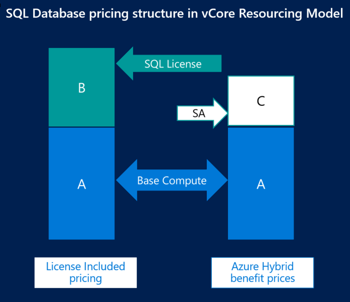

# Azure Hybrid Benefit - Azure SQL Database & SQL Managed Instance
[!INCLUDE[appliesto-sqldb-sqlmi](includes/appliesto-sqldb-sqlmi.md)]

[Azure Hybrid Benefit](https://azure.microsoft.com/pricing/hybrid-benefit/) allows you to exchange your existing licenses for discounted rates on Azure SQL Database and Azure SQL Managed Instance. You can save up to 30 percent or more on SQL Database and SQL Managed Instance by using your Software Assurance-enabled SQL Server licenses on Azure. The [Azure Hybrid Benefit](https://azure.microsoft.com/pricing/hybrid-benefit/) page has a calculator to help determine savings.  

For Azure SQL Database, Azure Hybrid Benefit is only available when using the provisioned compute tier of the [vCore-based purchasing model](database/service-tiers-vcore.md). Azure Hybrid Benefit doesn't apply to DTU-based purchasing models or the serverless compute tier.

> [!NOTE]
> Changing to Azure Hybrid Benefit does not require any downtime.

## Choose a license model

With Azure Hybrid Benefit, you pay only for the underlying Azure infrastructure by using your existing SQL Server license for the SQL Server database engine itself (Base Compute pricing). If you do not use Azure Hybrid Benefit, you pay for both the underlying infrastructure and the SQL Server license (License-Included pricing).

## Enable Azure Hybrid Benefit 

### Azure SQL Database

You can choose or change your licensing model for Azure SQL Database using the Azure portal or the API of your choice.

You can only apply the Azure Hybrid licensing model when you choose a vCore-based purchasing model and the provisioned compute tier for your Azure SQL Database. Azure Hybrid Benefit isn't available for service tiers under the DTU-based purchasing model or for the serverless compute tier.

#### [Portal](#tab/azure-portal)

To set or update the license type using the Azure portal:

- For new databases, during creation, select **Configure database** on the **Basics** tab and select the option to **Save money**.
- For existing databases, select **Compute + storage** in the **Settings** menu and select the option to **Save money**.

If you don't see the **Save money** option in the Azure portal, verify that you selected a service tier using the vCore-based purchasing model and the provisioned compute tier.
#### [PowerShell](#tab/azure-powershell)

To set or update the license type using PowerShell:

- [New-AzSqlDatabase](/powershell/module/az.sql/new-azsqldatabase)
- [Set-AzSqlDatabase](/powershell/module/az.sql/set-azsqldatabase)

#### [Azure CLI](#tab/azure-cli)

To set or update the license type using the Azure CLI:

- [az sql db create](/cli/azure/sql/db#az_sql_db_create)

#### [REST API](#tab/rest)

To set or update the license type using the REST API:

- [Databases - Create Or Update](/rest/api/sql/databases/createorupdate)
- [Databases - Update](/rest/api/sql/databases/update)

---

### Azure SQL Managed Instance

You can choose or change your licensing model for Azure SQL Managed Instance using the Azure portal or the API of your choice.
#### [Portal](#tab/azure-portal)

To set or update the license type using the Azure portal:

- For new managed instances, during creation, select **Configure Managed Instance** on the **Basics** tab and select the option for **Azure Hybrid Benefit**.
- For existing managed instances, select **Compute + storage** in the **Settings** menu and select the option for **Azure Hybrid Benefit**.

#### [PowerShell](#tab/azure-powershell)

To set or update the license type using PowerShell:

- [New-AzSqlInstance](/powershell/module/az.sql/new-azsqlinstance)
- [Set-AzSqlInstance](/powershell/module/az.sql/set-azsqlinstance)

#### [Azure CLI](#tab/azure-cli)

To set or update the license type using the Azure CLI:

- [az sql mi create](/cli/azure/sql/mi#az_sql_mi_create)
- [az sql mi update](/cli/azure/sql/mi#az_sql_mi_update)

#### [REST API](#tab/rest)

To set or update the license type using the REST API:

- [Managed Instances - Create Or Update](/rest/api/sql/managedinstances/createorupdate)
- [Managed Instances - Update](/rest/api/sql/managedinstances/update)

---
## Frequently Asked Questions

### Are there dual-use rights with Azure Hybrid Benefit for SQL Server?

You have 180 days of dual use rights of the license to ensure migrations are running seamlessly. After that 180-day period, you can only use the SQL Server license on Azure. You no longer have dual use rights on-premises and on Azure.

### How does Azure Hybrid Benefit for SQL Server differ from license mobility?

We offer license mobility benefits to SQL Server customers with Software Assurance. License mobility allows reassignment of their licenses to a partner's shared servers. You can use this benefit on Azure IaaS and AWS EC2.

Azure Hybrid Benefit for SQL Server differs from license mobility in two key areas:

- It provides economic benefits for moving highly virtualized workloads to Azure. SQL Server Enterprise Edition customers can get four cores in Azure in the General Purpose SKU for every core they own on-premises for highly virtualized applications. License mobility doesn't allow any special cost benefits for moving virtualized workloads to the cloud.
- It provides for a PaaS destination on Azure (SQL Managed Instance) that's highly compatible with SQL Server.

### What are the specific rights of the Azure Hybrid Benefit for SQL Server?

SQL Database and SQL Managed Instance customers have the following rights associated with Azure Hybrid Benefit for SQL Server:

|License footprint|What does Azure Hybrid Benefit for SQL Server get you?|
|---|---|
|SQL Server Enterprise Edition core customers with SA|<li>Can pay base rate on Hyperscale, General Purpose, or Business Critical SKU</li> <li>One core on-premises = Four vCores in Hyperscale SKU</li> <li>One core on-premises = Four vCores in General Purpose SKU</li> <li>One core on-premises = One vCore in Business Critical SKU</li>|
|SQL Server Standard Edition core customers with SA|<li>Can pay base rate on Hyperscale, General Purpose, or Business Critical SKU</li> <li>One core on-premises = One vCore in Hyperscale SKU</li> <li>One core on-premises = One vCore in General Purpose SKU</li> <li>Four cores on-premises = One vCore in Business Critical SKU</li>|
|||

## Next steps

- For help with choosing an Azure SQL deployment option, see [Service comparison](azure-sql-iaas-vs-paas-what-is-overview.md).
- For a comparison of SQL Database and SQL Managed Instance features, see [Features of SQL Database and SQL Managed Instance](database/features-comparison.md).