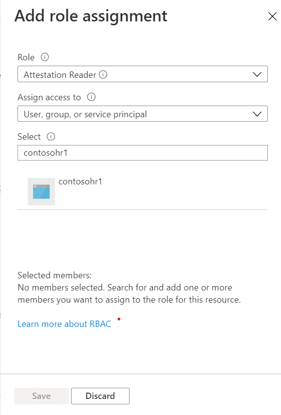

# Configure Azure Attestation for your Azure SQL logical server

[!INCLUDE[appliesto-sqldb](../includes/appliesto-sqldb.md)]

> [!NOTE]
> Always Encrypted with secure enclaves for Azure SQL Database is currently in **public preview**.

[Microsoft Azure Attestation](../../attestation/overview.md) is a solution for attesting Trusted Execution Environments (TEEs), including Intel Software Guard Extensions (Intel SGX) enclaves. 

To use Azure Attestation for attesting Intel SGX enclaves used for [Always Encrypted with secure enclaves](https://docs.microsoft.com/sql/relational-databases/security/encryption/always-encrypted-enclaves) in Azure SQL Database, you need to:

1. Create an [attestation provider](../../attestation/basic-concepts.md#attestation-provider) and configure it with the recommended attestation policy.

2. Grant your Azure SQL logical server access to your attestation provider.

## Requirements

The Azure SQL logical server and the attestation provider must belong to the same Azure Active Directory tenant. Cross-tenant interactions aren't supported. 

The Azure SQL logical server must have an Azure AD identity assigned to it. The administrator of the attestation provider will use the identity to grant the server access to the attestation provider. For instructions on how to create a server with an identity or assign an identity to an existing server using PowerShell and Azure CLI, see [Assign an Azure AD identity to your server](transparent-data-encryption-byok-configure.md#assign-an-azure-active-directory-azure-ad-identity-to-your-server).

## Create and configure an attestation provider

An [attestation provider](../../attestation/basic-concepts.md#attestation-provider) is a resource in Azure Attestation that evaluates [attestation requests](../../attestation/basic-concepts.md#attestation-request) against [attestation policies](../../attestation/basic-concepts.md#attestation-request) and issues [attestation tokens](../../attestation/basic-concepts.md#attestation-token). 

Attestation policies are specified using the [claim rule grammar](../../attestation/claim-rule-grammar.md).

Microsoft recommends the following policy for attesting Intel SGX enclaves used for Always Encrypted in Azure SQL Database:

```output
version= 1.0;
authorizationrules 
{
       [ type=="x-ms-sgx-is-debuggable", value==false ]
        && [ type=="x-ms-sgx-product-id", value==4639 ]
        && [ type=="x-ms-sgx-svn", value>= 0 ]
        && [ type=="x-ms-sgx-mrsigner", value=="e31c9e505f37a58de09335075fc8591254313eb20bb1a27e5443cc450b6e33e5"] 
    => permit();
};
```

The above policy verifies:
- The enclave inside Azure SQL Database doesn't support debugging (which would reduce the level of protection the enclave provides).
- The product ID of the library inside the enclave is the product ID assigned to Always Encrypted with secure enclaves (4639).
- The version ID (svn) of the library is greater than 0.
- The library in the enclave has been signed using the Microsoft signing key (the value of the x-ms-sgx-mrsigner claim is the hash of the signing key).

For instructions for how to create an attestation provider and configure with an attestation policy using:

- [Quickstart: Set up Azure Attestation with Azure PowerShell](../../attestation/quickstart-powershell.md)
- [Quickstart: Create an Azure Attestation provider with an ARM template](../../attestation/quickstart-template.md)

## Determine the attestation URL for your attestation policy

As an administrator of the attestation policy, determine the attestation URL referencing the policy and share it with administrators or users of database client applications in your organization. Client application admins or users will need to configure their apps with the attestation URL, so that they can run statements that use secure enclaves.

### Use PowerShell to determine the attestation URL

Use the following script to determine your attestation URL:

```powershell
$attestationProvider = Get-AzAttestation -Name $attestationProviderName -ResourceGroupName $attestationResourceGroupName 
$attestationUrl = $attestationProvider.AttestUri + “/attest/SgxEnclave?api-version=2018-09-01-preview”
Write-Host "Your attestation URL is: " $attestationUrl 
```

### Use Azure portal to determine the attestation URL

1. In the Overview pane for your attestation provider, copy the value of the Attest URI property to clipboard. An Attest URI should look like this: `https://MyAttestationProvider.us.attest.azure.net`.

2. Paste the Attest URI property values in a text editor. Append the following to the Attest URI: `/attest/SgxEnclave?api-version=2018-09-01-preview`. 

The resulting attestation URL should look like this: `https://MyAttestationProvider.us.attest.azure.net/attest/SgxEnclave?api-version=2018-09-01-preview`

## Grant your Azure SQL logical server access to your attestation provider

During the attestation workflow, the Azure SQL logical server containing your database calls the attestation provider to submit an attestation request. For the Azure SQL logical server to be able to submit attestation requests, the server must have a permission for the `Microsoft.Attestation/attestationProviders/attestation/read` action on the attestation provider. The recommended way to grant the permission is for the administrator of the attestation provider to assign the Azure AD identity of the server to the Attestation Reader role for the attestation provider, or its containing resource group.

### Use Azure portal to assign permission

To assign the identity of an Azure SQL server to the Attestation Reader role for an attestation provider, follow the general instructions in [Add or remove Azure role assignments using the Azure portal](https://docs.microsoft.com/azure/role-based-access-control/role-assignments-portal). When you are in the **Add role assignment** pane:

- In the **Role** drop-down Select the **Attestation Reader** role.
- In the **Select** field, enter the name of your Azure SQL server to search for it.

See the below screenshot for an example.



> [!NOTE]
> For a server to show up in the **Add role assignment** pane, the server must have an Azure AD identity assigned - see [Requirements](#requirements).

### Use PowerShell to assign permission

1. Find your Azure SQL logical server.

```powershell
$serverResourceGroupName = "<server resource group name>"
$serverName = "<server name>" 
$server = Get-AzSqlServer -ServerName $serverName -ResourceGroupName
```
 
2. Assign the server to the Attestation Reader role for the resource group containing your attestation provider.

```powershell
$attestationResourceGroupName = "<attestation provider resource group name>"
New-AzRoleAssignment -ObjectId $server.Identity.PrincipalId -RoleDefinitionName "Attestation Reader" -ResourceGroupName $attestationResourceGroupName
```

For more information, see [Add or remove Azure role assignments using Azure PowerShell](https://docs.microsoft.com/azure/role-based-access-control/role-assignments-powershell#add-a-role-assignment).

## Next Steps

- [Manage keys for Always Encrypted with secure enclaves](https://docs.microsoft.com/sql/relational-databases/security/encryption/always-encrypted-enclaves-manage-keys)

## See also

- [Tutorial: Getting started with Always Encrypted with secure enclaves in SQL Server](always-encrypted-enclaves-getting-started.md)