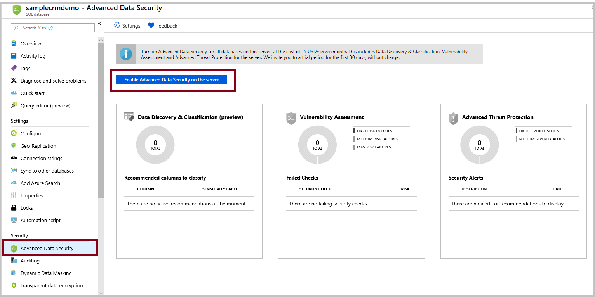
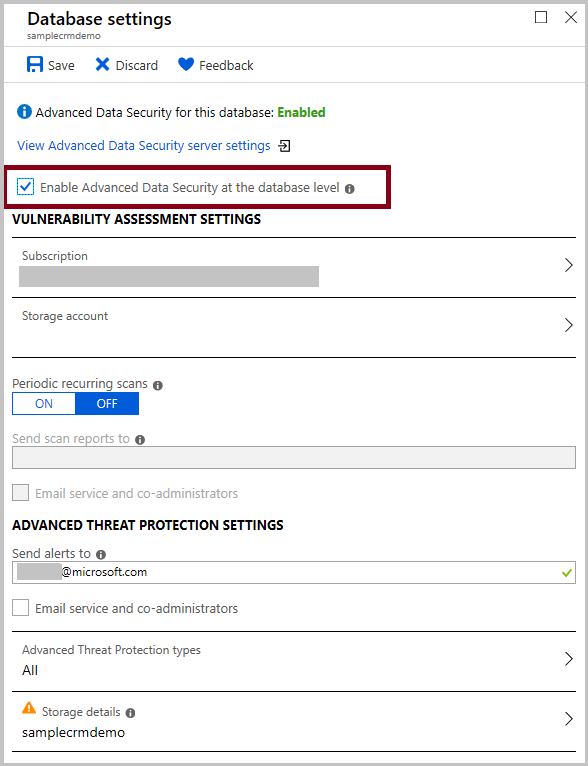
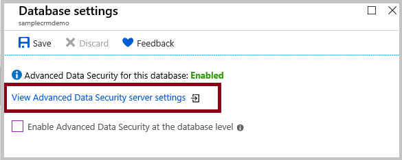

# Azure Defender for SQL
[!INCLUDE[appliesto-sqldb-sqlmi-asa](../includes/appliesto-sqldb-sqlmi-asa.md)]

Azure Defender for SQL is a unified package for advanced SQL security capabilities. Azure Defender is available for Azure SQL Database, Azure SQL Managed Instance, and Azure Synapse Analytics. It includes functionality for discovering and classifying sensitive data, surfacing and mitigating potential database vulnerabilities, and detecting anomalous activities that could indicate a threat to your database. It provides a single go-to location for enabling and managing these capabilities.

## Overview

Azure Defender provides a set of advanced SQL security capabilities, including SQL Vulnerability Assessment and Advanced Threat Protection.
- [Vulnerability Assessment](sql-vulnerability-assessment.md) is an easy-to-configure service that can discover, track, and help you remediate potential database vulnerabilities. It provides visibility into your security state, and it includes actionable steps to resolve security issues and enhance your database fortifications.
- [Advanced Threat Protection](threat-detection-overview.md) detects anomalous activities indicating unusual and potentially harmful attempts to access or exploit your database. It continuously monitors your database for suspicious activities, and it provides immediate security alerts on potential vulnerabilities, Azure SQL injection attacks, and anomalous database access patterns. Advanced Threat Protection alerts provide details of the suspicious activity and recommend action on how to investigate and mitigate the threat.

Enable Azure Defender for SQL once to enable all these included features. With one click, you can enable Azure Defender for all databases on your [server](logical-servers.md) in Azure or in your SQL Managed Instance. Enabling or managing Azure Defender settings requires belonging to the [SQL security manager](https://docs.microsoft.com/azure/role-based-access-control/built-in-roles#sql-security-manager) role, or one of the database or server admin roles.

Azure Defender pricing aligns with Azure Security Center standard tier, where each protected server or managed instance is counted as one node. Newly protected resources qualify for a free trial of Security Center standard tier. For more information, see the [Azure Security Center pricing page](https://azure.microsoft.com/pricing/details/security-center/).

## Getting started with Azure Defender

The following steps get you started with Azure Defender.

## 1. Enable Azure Defender

Enable Azure Defender by navigating to **Azure Defender for SQL** under the **Security** heading for your server or managed instance.

> [!NOTE]
> A storage account is automatically created and configured to store your **Vulnerability Assessment** scan results. If you've already enabled Azure Defender for another server in the same resource group and region, then the existing storage account is used.

> [!NOTE]
> The cost of Azure Defender is aligned with Azure Security Center standard tier pricing per node, where a node is the entire server or managed instance. You are thus paying only once for protecting all databases on the server or managed instance with Azure Defender. You can try Azure Defender out initially with a free trial.

## 2. Start classifying data, tracking vulnerabilities, and investigating threat alerts

Click the **Data Discovery & Classification** card to see recommended sensitive columns to classify and to classify your data with persistent sensitivity labels. Click the **Vulnerability Assessment** card to view and manage vulnerability scans and reports, and to track your security stature. If security alerts have been received, click the **Advanced Threat Protection** card to view details of the alerts and to see a consolidated report on all alerts in your Azure subscription via the Azure Security Center security alerts page.

## 3. Manage Azure Defender settings

To view and manage Azure Defender settings, navigate to **Azure Defender for SQL** under the **Security** heading for your server or managed instance. On this page, you can enable or disable Azure Defender, and modify vulnerability assessment and Advanced Threat Protection settings for your entire server or managed instance.

## 4. Manage Azure Defender settings for a database

To override Azure Defender settings for a particular database, check the **Enable Azure Defender for SQL at the database level** checkbox. Use this option only if you have a particular requirement to receive separate Advanced Threat Protection alerts or vulnerability assessment results for the individual database, in place of or in addition to the alerts and results received for all databases on the server or managed instance.

Once the checkbox is selected, you can then configure the relevant settings for this database.

Azure Defender for SQL settings for your server or managed instance can also be reached from the Azure Defender database pane. Click **Settings** in the main Azure Defender pane, and then click **View Azure Defender for SQL server settings**.

## Next steps

- Learn more about [vulnerability Assessment](sql-vulnerability-assessment.md)
- Learn more about [Advanced Threat Protection](threat-detection-configure.md)
- Learn more about [Azure Security Center](https://docs.microsoft.com/azure/security-center/security-center-intro)
