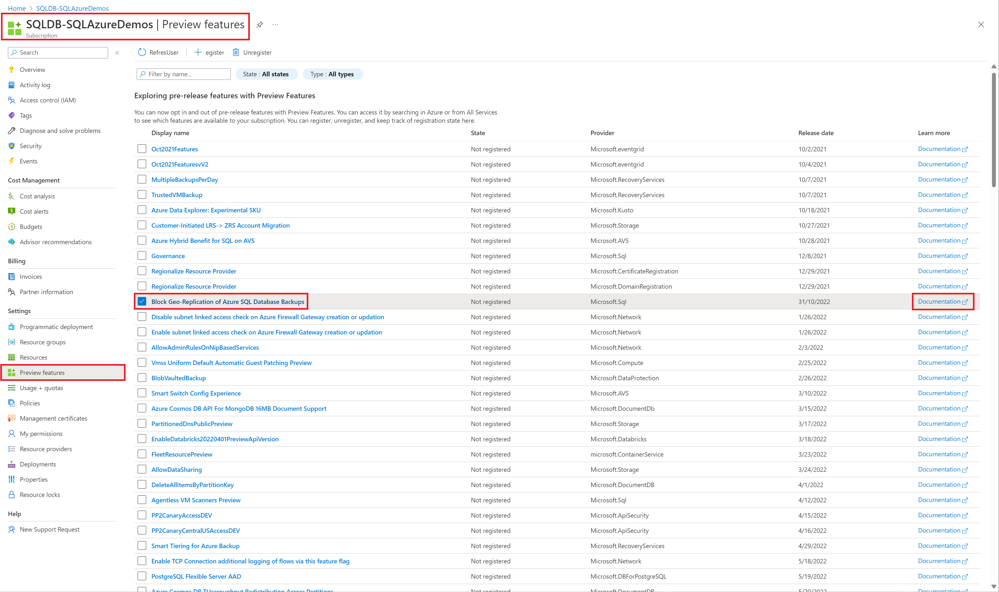

# What is Block Geo-replication of Azure SQL Database Backups feature?
[!INCLUDE[appliesto-sqldb](../includes/appliesto-sqldb.md)]

This feature allows Azure administrators to prevent Azure SQL Databases using geo-redundant storage options (RA-GRS, RA-GZRS) as preferred backup storage redundancy via T-SQL, Azure Portal, PowerShell, Azure CLI and API. This is enforced at the subscription level to block geo-replication of Azure SQL database backups.

## Overview

This feature prevents geo replication of Azure SQL Database backups by blocking all create, update database workflows that use read-access geo-redundant storage (RA-GRS) as the [backup storage redundancy](/azure-sql/database/automated-backups-overview.md#backup-storage-redundancy) option. Azure SQL Database uses read-access geo-redundant storage (RA-GRS) as default backup storage redundancy when you create a new database, which automatically replicates the database backups to [paired region](/azure/availability-zones/cross-region-replication-azure). This feature blocks all the create and update database workflows that set backup storage redundancy to geo-redundant backup storage options like RA-GRS, RA-GZRS via T-SQL, Azure Portal, PowerShell, Azure CLI and API. To create or update database successfully, users will have to manually select the backup storage redundancy based on data residency requirements.

You can register your subscription to this feature via Azure portal, [PowerShell](/powershell/module/az.resources/register-azproviderfeature), or [Azure CLI](/cli/azure/feature#az-feature-register).

## Permissions

In order to register or remove this feature, the Azure user must be a member of the Owner or Contributor role of the subscription.

## Examples

The following section describes how you can register or unregister a preview feature with Microsoft.Sql resource provider in Azure portal: 

### Register Block Geo-replication of Azure SQL Database Backups

1. Go to your subscription on Azure portal.
2. Select the **Preview Features** tab. 
3. Select **Azure SQL Database Block Geo-Redundant Backup Storage**.
4. After you select **Azure SQL Database Block Geo-Redundant Backup Storage**, a new window will open, select **Register**, to register this block with Microsoft.Sql resource provider.

### Removing Block Geo-replication of Azure SQL Database Backups
To remove the block on geo-redundant backup storage from your subscription, unregister the previously registered Azure SQL Database Block Geo-Redundant Backup Storage feature.

## Next steps

- [An overview of Azure SQL Database Backup storage redundancy](/azure-sql/database/automated-backups-overview.md#backup-storage-redundancy)