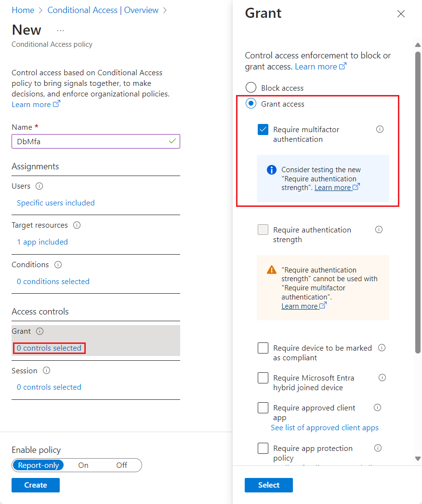

# Conditional access

[!INCLUDE[appliesto-sqldb-sqlmi-asa](../includes/appliesto-sqldb-sqlmi-asa.md)]

[Azure SQL Database](sql-database-paas-overview.md), [Azure SQL Managed Instance](../managed-instance/sql-managed-instance-paas-overview.md), and [Azure Synapse Analytics](/azure/synapse-analytics/sql-data-warehouse/sql-data-warehouse-overview-what-is) support Microsoft Conditional Access.

The following steps show how to configure Azure SQL Database, Azure SQL Managed Instance, or Azure Synapse Analytics to enforce a Conditional Access policy.  

## Prerequisites

- You must configure Azure SQL Database, Azure SQL Managed Instance, or dedicated SQL pool in Azure Synapse to support Microsoft Entra authentication. For specific steps, see [Configure and manage Microsoft Entra authentication with SQL Database or Azure Synapse](authentication-aad-configure.md).  
- When multifactor authentication is enabled, you must connect with a supported tool, such as the latest SQL Server Management Studio (SSMS). For more information, see [Using Microsoft Entra multifactor authentication](./authentication-mfa-ssms-overview.md).

## Configure conditional access

> [!NOTE]
> The below example uses Azure SQL Database, but you should select the appropriate product that you want to configure conditional access.

1. Sign in to the Azure portal, select **Microsoft Entra ID**, and then select **Conditional Access**. For more information, see [Microsoft Entra Conditional Access technical reference](/azure/active-directory/conditional-access/concept-conditional-access-conditions).  
   

2. In the **Conditional Access-Policies** blade, click **New policy**, provide a name, and then click **Configure rules**.  
3. Under **Assignments**, select **Users and groups**, check **Select users and groups**, and then select the user or group for Conditional Access. Click **Select**, and then click **Done** to accept your selection.  
     

4. Select **Cloud apps**, click **Select apps**. You see all apps available for Conditional Access. Select **Azure SQL Database**, at the bottom click **Select**, and then click **Done**.  
     
   If you can't find **Azure SQL Database** listed in the following third screenshot, complete the following steps:
   - Connect to your database in Azure SQL Database by using SSMS with a Microsoft Entra admin account.  
   - Execute `CREATE USER [user@yourtenant.com] FROM EXTERNAL PROVIDER`.  
   - Sign into Microsoft Entra ID and verify that Azure SQL Database, Azure SQL Managed Instance, or Azure Synapse are listed in the applications in your Microsoft Entra instance.  

5. Select **Access controls**, select **Grant**, and then check the policy you want to apply. For this example, we select **Require multifactor authentication**.  
     

## Summary

The selected application (Azure SQL Database) using Microsoft Entra ID P1 or P2, now enforces the selected Conditional Access policy, **Required multifactor authentication.**

## Related content

For a tutorial, see [Secure your database in SQL Database](secure-database-tutorial.md).
