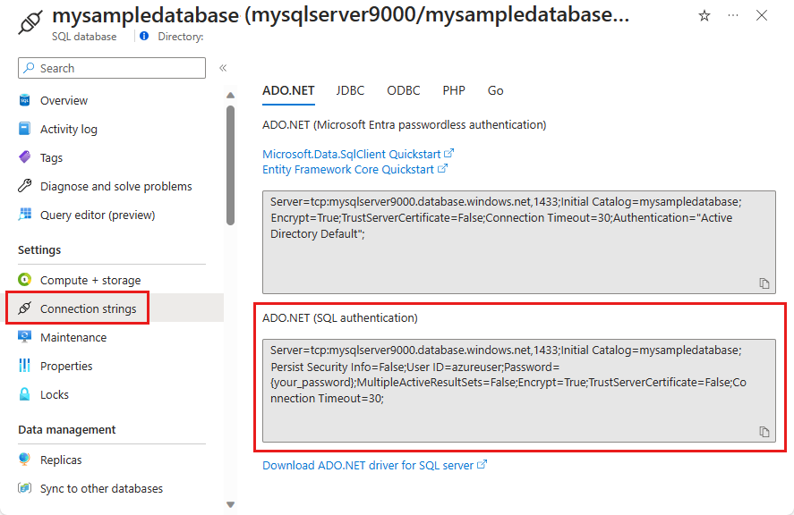

# Quickstart: Use .NET Core (C#) to query Azure SQL Database

In this quickstart, you'll use [.NET Core](https://www.microsoft.com/net/) and C# code to connect to Azure SQL Database. You'll then run a Transact-SQL statement to query data.

> [!TIP]
> The following Microsoft Learn module helps you learn for free how to [Develop and configure an ASP.NET application that queries an Azure SQL Database](https://docs.microsoft.com/learn/modules/develop-app-that-queries-azure-sql/)

## Prerequisites

For this tutorial, you need:

- An Azure SQL database. You can use one of these quickstarts to create and then configure a database in Azure SQL Database:

  || SQL Database | SQL Managed instance |
  |:--- |:--- |:---|
  | Create| [Portal](quickstart-create-single-database.md) | [Portal](../managed-instance/quickstart-create-instance.md) |
  || [CLI](scripts/create-and-configure-database-cli.md) | [CLI](https://medium.com/azure-sqldb-managed-instance/working-with-sql-managed-instance-using-azure-cli-611795fe0b44) |
  || [PowerShell](scripts/create-and-configure-database-powershell.md) | [PowerShell](../managed-instance/scripts/create-configure-managed-instance-powershell.md) |
  | Configure | [Server-level IP firewall rule](quickstart-firewall-create-server-level-portal.md)| [Connectivity from a VM](../managed-instance/connect-vm-instance-configure.md)|
  |||[Connectivity from on-site](../managed-instance/point-to-site-p2s-configure.md)
  |Load data|Adventure Works loaded per quickstart|[Restore Wide World Importers](../managed-instance/quickstart-restore-sample-database.md)
  |||Restore or import Adventure Works from [BACPAC](database-import.md) file from [GitHub](https://github.com/Microsoft/sql-server-samples/tree/master/samples/databases/adventure-works)|
  |||

  > [!IMPORTANT]
  > The scripts in this article are written to use the Adventure Works database. With a managed instance, you must either import the Adventure Works database into an instance database or modify the scripts in this article to use the Wide World Importers database.

- [.NET Core for your operating system](https://www.microsoft.com/net/core) installed.

> [!NOTE]
> This quickstart uses the *mySampleDatabase* database. If you want to use a different database, you will need
> to change the database references and modify the `SELECT` query in the C# code.

## Get SQL server connection information

Get the connection information you need to connect to the Azure SQL Database. You'll need the fully qualified server name or host name, database name, and login information for the upcoming procedures.

1. Sign in to the [Azure portal](https://portal.azure.com/).

2. Navigate to the **SQL Databases**  or **SQL Managed Instances** page.

3. On the **Overview** page, review the fully qualified server name next to **Server name** for an Azure SQL Database or the fully qualified server name next to **Host** for an Azure SQL Managed Instance. To copy the server name or host name, hover over it and select the **Copy** icon.

## Get ADO.NET connection information (optional)

1. Navigate to the **mySampleDatabase** page and, under **Settings**, select **Connection strings**.

2. Review the complete **ADO.NET** connection string.

    

3. Copy the **ADO.NET** connection string if you intend to use it.
  
## Create a new .NET Core project

1. Open a command prompt and create a folder named **sqltest**. Navigate to this folder and run this command.

    ```cmd
    dotnet new console
    ```
    This command creates new app project files, including an initial C# code file (**Program.cs**), an XML configuration file (**sqltest.csproj**), and needed binaries.

2. In a text editor, open **sqltest.csproj** and paste the following XML between the `<Project>` tags. This XML adds `System.Data.SqlClient` as a dependency.

    ```xml
    <ItemGroup>
        <PackageReference Include="System.Data.SqlClient" Version="4.6.0" />
    </ItemGroup>
    ```

## Insert code to query SQL Database

1. In a text editor, open **Program.cs**.

2. Replace the contents with the following code and add the appropriate values for your server, database, username, and password.

> [!NOTE]
> To use an ADO.NET connection string, replace the 4 lines in the code
> setting the server, database, username, and password with the line below. In
> the string, set your username and password.
>
>    `builder.ConnectionString="<your_ado_net_connection_string>";`

```csharp
using System;
using System.Data.SqlClient;
using System.Text;

namespace sqltest
{
    class Program
    {
        static void Main(string[] args)
        {
            try 
            { 
                SqlConnectionStringBuilder builder = new SqlConnectionStringBuilder();

                builder.DataSource = "<your_server.database.windows.net>"; 
                builder.UserID = "<your_username>";            
                builder.Password = "<your_password>";     
                builder.InitialCatalog = "<your_database>";
         
                using (SqlConnection connection = new SqlConnection(builder.ConnectionString))
                {
                    Console.WriteLine("\nQuery data example:");
                    Console.WriteLine("=========================================\n");
                    
                    connection.Open();       
                    StringBuilder sb = new StringBuilder();
                    sb.Append("SELECT TOP 20 pc.Name as CategoryName, p.name as ProductName ");
                    sb.Append("FROM [SalesLT].[ProductCategory] pc ");
                    sb.Append("JOIN [SalesLT].[Product] p ");
                    sb.Append("ON pc.productcategoryid = p.productcategoryid;");
                    String sql = sb.ToString();

                    using (SqlCommand command = new SqlCommand(sql, connection))
                    {
                        using (SqlDataReader reader = command.ExecuteReader())
                        {
                            while (reader.Read())
                            {
                                Console.WriteLine("{0} {1}", reader.GetString(0), reader.GetString(1));
                            }
                        }
                    }                    
                }
            }
            catch (SqlException e)
            {
                Console.WriteLine(e.ToString());
            }
            Console.WriteLine("\nDone. Press enter.");
            Console.ReadLine(); 
        }
    }
}
```

## Run the code

1. At the prompt, run the following commands.

   ```cmd
   dotnet restore
   dotnet run
   ```

2. Verify that the top 20 rows are returned.

   ```text
   Query data example:
   =========================================

   Road Frames HL Road Frame - Black, 58
   Road Frames HL Road Frame - Red, 58
   Helmets Sport-100 Helmet, Red
   Helmets Sport-100 Helmet, Black
   Socks Mountain Bike Socks, M
   Socks Mountain Bike Socks, L
   Helmets Sport-100 Helmet, Blue
   Caps AWC Logo Cap
   Jerseys Long-Sleeve Logo Jersey, S
   Jerseys Long-Sleeve Logo Jersey, M
   Jerseys Long-Sleeve Logo Jersey, L
   Jerseys Long-Sleeve Logo Jersey, XL
   Road Frames HL Road Frame - Red, 62
   Road Frames HL Road Frame - Red, 44
   Road Frames HL Road Frame - Red, 48
   Road Frames HL Road Frame - Red, 52
   Road Frames HL Road Frame - Red, 56
   Road Frames LL Road Frame - Black, 58
   Road Frames LL Road Frame - Black, 60
   Road Frames LL Road Frame - Black, 62

   Done. Press enter.
   ```
3. Choose **Enter** to close the application window.

## Next steps

- [Getting started with .NET Core on Windows/Linux/macOS using the command line](/dotnet/core/tutorials/using-with-xplat-cli).
- Learn how to [connect and query an Azure SQL Database using the .NET Framework and Visual Studio](connect-query-dotnet-visual-studio.md).  
- Learn how to [Design your first Azure SQL Database using SSMS](tutorial-design-first-database.md) or [Design an Azure SQL Database and connect with C# and ADO.NET](tutorial-design-first-database-csharp.md).
- For more information about .NET, see [.NET documentation](https://docs.microsoft.com/dotnet/).
