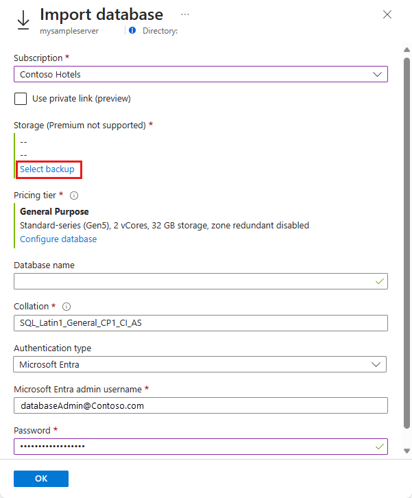
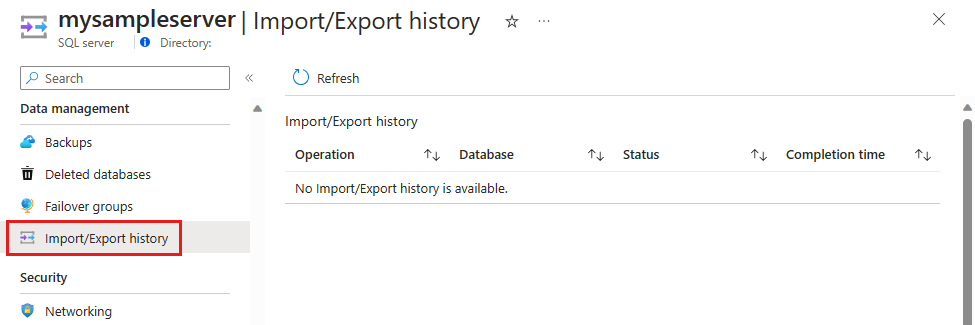

# Quickstart: Import a BACPAC file to a database in Azure SQL Database or Azure SQL Managed Instance
[!INCLUDE[appliesto-sqldb-sqlmi](../includes/appliesto-sqldb-sqlmi.md)]

You can import a SQL Server database into Azure SQL Database or SQL Managed Instance using a [BACPAC](/sql/relational-databases/data-tier-applications/data-tier-applications#bacpac) file. You can import the data from a BACPAC file stored in Azure Blob storage (standard storage only) or from local storage in an on-premises location. To maximize import speed by providing more and faster resources, scale your database to a higher service tier and compute size during the import process. You can then scale down after the import is successful.

> [!NOTE]
> The imported database's compatibility level is based on the source database's compatibility level.

> [!IMPORTANT]
> After importing your database, you can choose to operate the database at its current compatibility level (level 100 for the AdventureWorks2008R2 database) or at a higher level. For more information on the implications and options for operating a database at a specific compatibility level, see [ALTER DATABASE Compatibility Level](/sql/t-sql/statements/alter-database-transact-sql-compatibility-level). See also [ALTER DATABASE SCOPED CONFIGURATION](/sql/t-sql/statements/alter-database-scoped-configuration-transact-sql) for information about additional database-level settings related to compatibility levels.

## Using Azure portal

Watch this video to see how to import from a BACPAC file in the Azure portal or continue reading below:

> [!VIDEO https://channel9.msdn.com/Shows/Data-Exposed/Its-just-SQL-Restoring-a-database-to-Azure-SQL-DB-from-backup/player?WT.mc_id=dataexposed-c9-niner]

The [Azure portal](https://portal.azure.com) *only* supports creating a single database in Azure SQL Database and *only* from a BACPAC file stored in Azure Blob storage.

To migrate a database into an [Azure SQL Managed Instance](../managed-instance/sql-managed-instance-paas-overview.md) from a BACPAC file, use SQL Server Management Studio or SQLPackage, using the Azure portal or Azure PowerShell is not currently supported.

> [!NOTE]
> Machines processing import/export requests submitted through the Azure portal or PowerShell need to store the BACPAC file as well as temporary files generated by the Data-Tier Application Framework (DacFX). The disk space required varies significantly among databases with the same size and can require disk space up to 3 times the size of the database. Machines running the import/export request only have  450GB local disk space. As a result, some requests may fail with the error `There is not enough space on the disk`. In this case, the workaround is to run sqlpackage.exe on a machine with enough local disk space. We encourage using SqlPackage to import/export databases larger than 150GB to avoid this issue.

1. To import from a BACPAC file into a new single database using the Azure portal, open the appropriate server page and then, on the toolbar, select **Import database**.  

   

1. Select the storage account and the container for the BACPAC file and then select the BACPAC file from which to import.

1. Specify the new database size (usually the same as origin) and provide the destination SQL Server credentials. For a list of possible values for a new database in Azure SQL Database, see [Create Database](/sql/t-sql/statements/create-database-transact-sql?view=azuresqldb-current).

   

1. Click **OK**.

1. To monitor an import's progress, open the database's server page, and, under **Settings**, select **Import/Export history**. When successful, the import has a **Completed** status.

   

1. To verify the database is live on the server, select **SQL databases** and verify the new database is **Online**.

## Using SqlPackage

To import a SQL Server database using the [SqlPackage](/sql/tools/sqlpackage) command-line utility, see [import parameters and properties](/sql/tools/sqlpackage#import-parameters-and-properties). [SQL Server Management Studio](/sql/ssms/download-sql-server-management-studio-ssms) and [SQL Server Data Tools for Visual Studio](/sql/ssdt/download-sql-server-data-tools-ssdt) include SqlPackage. You can also download the latest [SqlPackage](https://www.microsoft.com/download/details.aspx?id=53876) from the Microsoft download center. 

For scale and performance, we recommend using SqlPackage in most production environments rather than using the Azure portal. For a SQL Server Customer Advisory Team blog about migrating using `BACPAC` files, see [migrating from SQL Server to Azure SQL Database using BACPAC Files](/archive/blogs/sqlcat/migrating-from-sql-server-to-azure-sql-database-using-bacpac-files).

The DTU based provisioning model supports select database max size values for each tier. When importing a database [use one of these supported values](/sql/t-sql/statements/create-database-transact-sql). 

The following SqlPackage command imports the **AdventureWorks2008R2** database from local storage to a logical SQL server named **mynewserver20170403**. It creates a new database called **myMigratedDatabase** with a **Premium** service tier and a **P6** Service Objective. Change these values as appropriate for your environment.

```cmd
sqlpackage.exe /a:import /tcs:"Data Source=<serverName>.database.windows.net;Initial Catalog=<migratedDatabase>;User Id=<userId>;Password=<password>" /sf:AdventureWorks2008R2.bacpac /p:DatabaseEdition=Premium /p:DatabaseServiceObjective=P6
```

> [!IMPORTANT]
> To connect to Azure SQL Database from behind a corporate firewall, the firewall must have port 1433 open. To connect to SQL Managed Instance, you must have a [point-to-site connection](../managed-instance/point-to-site-p2s-configure.md) or an express route connection.

This example shows how to import a database using SqlPackage with Active Directory Universal Authentication.

```cmd
sqlpackage.exe /a:Import /sf:testExport.bacpac /tdn:NewDacFX /tsn:apptestserver.database.windows.net /ua:True /tid:"apptest.onmicrosoft.com"
```

## Using PowerShell

> [!NOTE]
> [A SQL Managed Instance](../managed-instance/sql-managed-instance-paas-overview.md) does not currently support migrating a database into an instance database from a BACPAC file using Azure PowerShell. To import into a SQL Managed Instance, use SQL Server Management Studio or SQLPackage.

> [!NOTE]
> The machines processing import/export requests submitted through portal or Powershell need to store the bacpac file as well as temporary files generated by Data-Tier Application Framework (DacFX). The disk space required varies significantly among DBs with same size and can take up to 3 times of the database size. Machines running the import/export request only have  450GB local disk space. As result, some requests may fail with “There is not enough space on the disk” error. In this case, the workaround is to run sqlpackage.exe on a machine with enough local disk space. When importing/exporting databases larger than 150GB, use SqlPackage to avoid this issue.

# [PowerShell](#tab/azure-powershell)

> [!IMPORTANT]
> The PowerShell Azure Resource Manager (RM) module is still supported, but all future development is for the Az.Sql module. The AzureRM module will continue to receive bug fixes until at least December 2020.  The arguments for the commands in the Az module and in the AzureRm modules are substantially identical. For more about their compatibility, see [Introducing the new Azure PowerShell Az module](/powershell/azure/new-azureps-module-az).

Use the [New-AzSqlDatabaseImport](/powershell/module/az.sql/new-azsqldatabaseimport) cmdlet to submit an import database request to Azure. Depending on database size, the import may take some time to complete. The DTU based provisioning model supports select database max size values for each tier. When importing a database [use one of these supported values](/sql/t-sql/statements/create-database-transact-sql). 

```powershell
$importRequest = New-AzSqlDatabaseImport -ResourceGroupName "<resourceGroupName>" `
    -ServerName "<serverName>" -DatabaseName "<databaseName>" `
    -DatabaseMaxSizeBytes "<databaseSizeInBytes>" -StorageKeyType "StorageAccessKey" `
    -StorageKey $(Get-AzStorageAccountKey `
        -ResourceGroupName "<resourceGroupName>" -StorageAccountName "<storageAccountName>").Value[0] `
        -StorageUri "https://myStorageAccount.blob.core.windows.net/importsample/sample.bacpac" `
        -Edition "Standard" -ServiceObjectiveName "P6" `
        -AdministratorLogin "<userId>" `
        -AdministratorLoginPassword $(ConvertTo-SecureString -String "<password>" -AsPlainText -Force)
```

You can use the [Get-AzSqlDatabaseImportExportStatus](/powershell/module/az.sql/get-azsqldatabaseimportexportstatus) cmdlet to check the import's progress. Running the cmdlet immediately after the request usually returns `Status: InProgress`. The import is complete when you see `Status: Succeeded`.

```powershell
$importStatus = Get-AzSqlDatabaseImportExportStatus -OperationStatusLink $importRequest.OperationStatusLink

[Console]::Write("Importing")
while ($importStatus.Status -eq "InProgress") {
    $importStatus = Get-AzSqlDatabaseImportExportStatus -OperationStatusLink $importRequest.OperationStatusLink
    [Console]::Write(".")
    Start-Sleep -s 10
}

[Console]::WriteLine("")
$importStatus
```

# [Azure CLI](#tab/azure-cli)

Use the [az-sql-db-import](/cli/azure/sql/db#az-sql-db-import) command to submit an import database request to Azure. Depending on database size, the import may take some time to complete. The DTU based provisioning model supports select database max size values for each tier. When importing a database [use one of these supported values](/sql/t-sql/statements/create-database-transact-sql). 

```azurecli
# get the storage account key
az storage account keys list --resource-group "<resourceGroup>" --account-name "<storageAccount>"

az sql db import --resource-group "<resourceGroup>" --server "<server>" --name "<database>" `
    --storage-key-type "StorageAccessKey" --storage-key "<storageAccountKey>" `
    --storage-uri "https://myStorageAccount.blob.core.windows.net/importsample/sample.bacpac" `
    -u "<userId>" -p "<password>"
```

* * *

> [!TIP]
> For another script example, see [Import a database from a BACPAC file](scripts/import-from-bacpac-powershell.md).

## Cancel the import request

Use the procedure in the blog [How to cancel Azure SQL Database Import or Export operation](https://techcommunity.microsoft.com/t5/azure-database-support-blog/how-to-cancel-azure-sql-database-import-or-export-operation/ba-p/1935001) to cancel an ongoing import or export operation on Azure SQL Database. 

## Limitations

- Importing to a database in elastic pool isn't supported. You can import data into a single database and then move the database to an elastic pool.
- Import Export Service does not work when Allow access to Azure services is set to OFF. However you can work around the problem by manually running sqlpackage.exe from an Azure VM or performing the export directly in your code by using the DACFx API.
- Import does not support specifying a backup storage redundancy while creating a new database and creates with the default geo-redundant backup storage redundancy. To workaround, first create an empty database with desired backup storage redundancy using Azure portal or PowerShell and then import the BACPAC into this empty database. 

> [!NOTE]
> Azure SQL Database Configurable Backup Storage Redundancy is currently available in public preview in Southeast Asia Azure region only.

## Import using wizards

You can also use these wizards.

- [Import Data-tier Application Wizard in SQL Server Management Studio](/sql/relational-databases/data-tier-applications/import-a-bacpac-file-to-create-a-new-user-database#using-the-import-data-tier-application-wizard).
- [SQL Server Import and Export Wizard](/sql/integration-services/import-export-data/start-the-sql-server-import-and-export-wizard).

## Next steps

- To learn how to connect to and query a database in Azure SQL Database, see [Quickstart: Azure SQL Database: Use SQL Server Management Studio to connect to and query data](connect-query-ssms.md).
- For a SQL Server Customer Advisory Team blog about migrating using BACPAC files, see [Migrating from SQL Server to Azure SQL Database using BACPAC Files](https://techcommunity.microsoft.com/t5/DataCAT/Migrating-from-SQL-Server-to-Azure-SQL-Database-using-Bacpac/ba-p/305407).
- For a discussion of the entire SQL Server database migration process, including performance recommendations, see [SQL Server database migration to Azure SQL Database](migrate-to-database-from-sql-server.md).
- To learn how to manage and share storage keys and shared access signatures securely, see [Azure Storage Security Guide](../../storage/blobs/security-recommendations.md).
