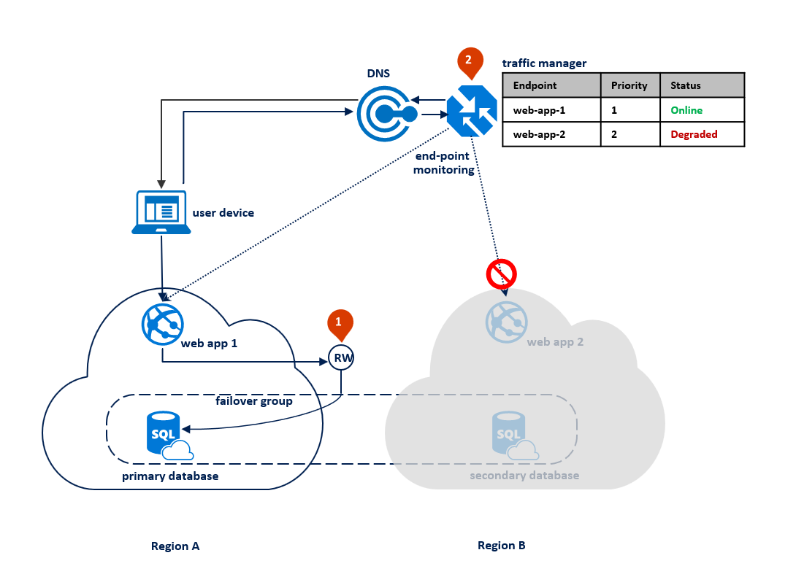
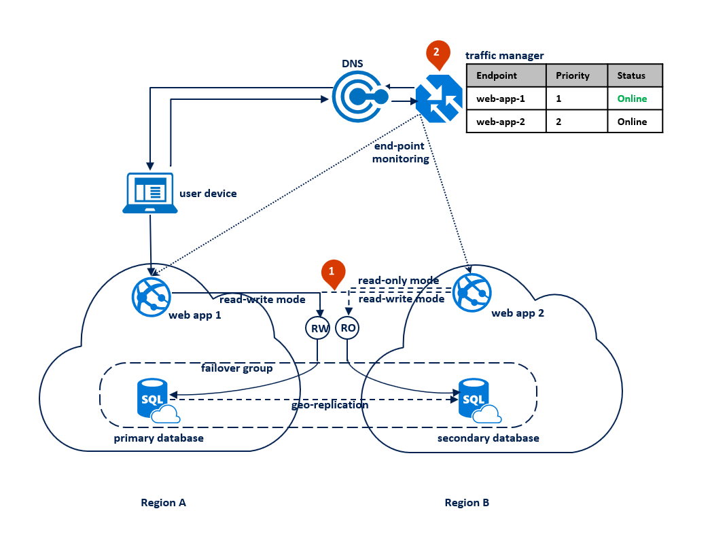
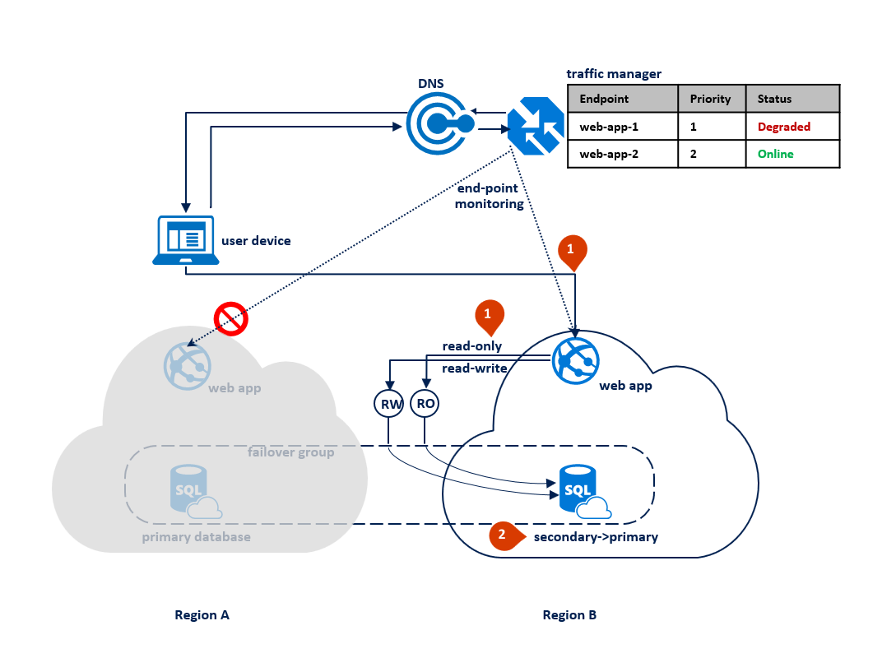
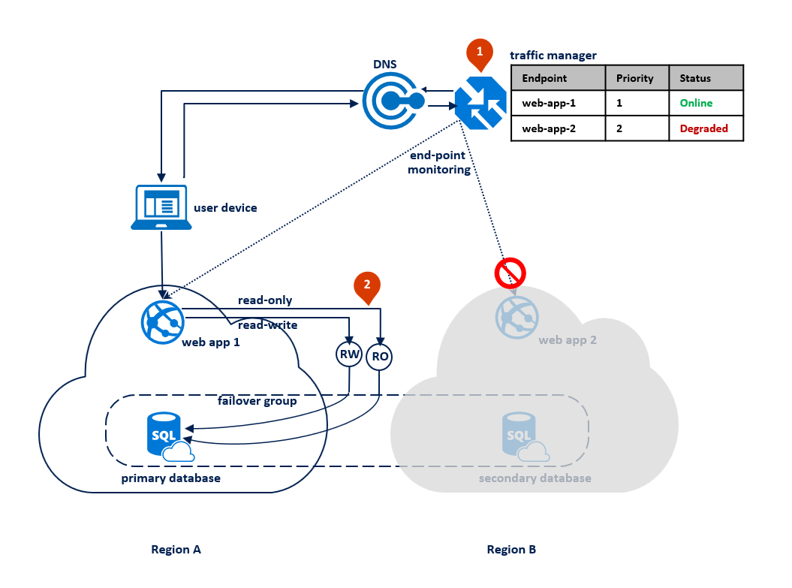
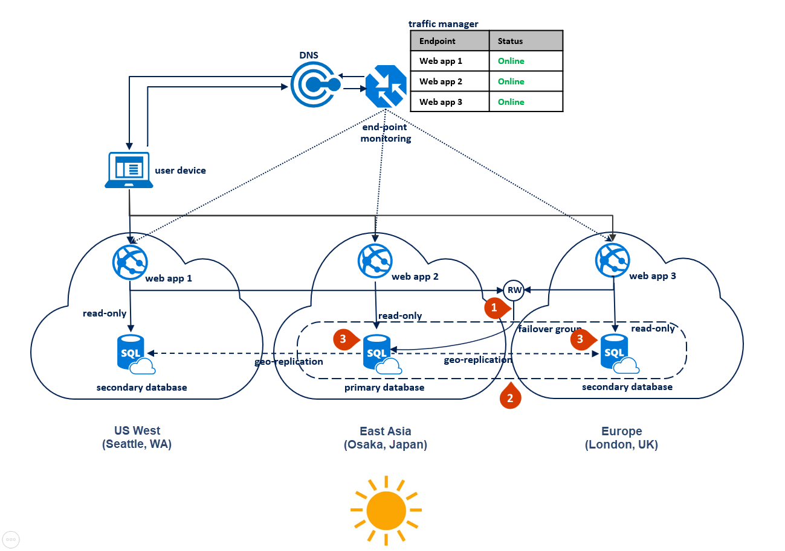
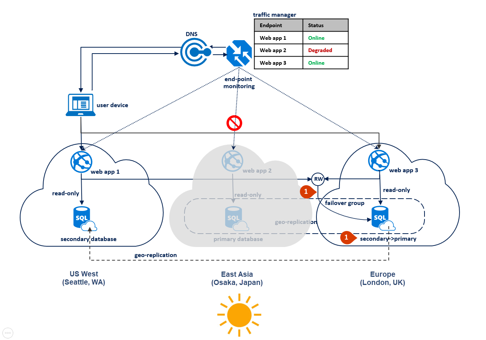

# Designing globally available services using Azure SQL Database
[!INCLUDE[appliesto-sqldb](../includes/appliesto-sqldb.md)]

When building and deploying cloud services with Azure SQL Database, you use [active geo-replication](active-geo-replication-overview.md) or [auto-failover groups](auto-failover-group-sql-db.md) to provide resilience to regional outages and catastrophic failures. The same feature allows you to create globally distributed applications optimized for local access to the data. This article discusses common application patterns, including the benefits and trade-offs of each option.

> [!NOTE]
> If you are using Premium or Business Critical databases and elastic pools, you can make them resilient to regional outages by converting them to zone redundant deployment configuration. See [Zone-redundant databases](high-availability-sla.md).  

## Scenario 1: Using two Azure regions for business continuity with minimal downtime

In this scenario, the applications have the following characteristics:

* Application is active in one Azure region
* All database sessions require read and write access (RW) to data
* Web tier and data tier must be collocated to reduce latency and traffic cost
* Fundamentally, downtime is a higher business risk for these applications than data loss

In this case, the application deployment topology is optimized for handling regional disasters when all application components need to fail over together. The diagram below shows this topology. For geographic redundancy, the application’s resources are deployed to Region A and B. However, the resources in Region B are not utilized until Region A fails. A failover group is configured between the two regions to manage database connectivity, replication and failover. The web service in both regions is configured to access the database via the read-write listener **&lt;failover-group-name&gt;.database.windows.net** (1). Azure Traffic Manager is set up to use [priority routing method](/azure/traffic-manager/traffic-manager-configure-priority-routing-method) (2).  

> [!NOTE]
> [Azure Traffic Manager](/azure/traffic-manager/traffic-manager-overview) is used throughout this article for illustration purposes only. You can use any load-balancing solution that supports priority routing method.

The following diagram shows this configuration before an outage:

After an outage in the primary region, SQL Database detects that the primary database is not accessible and triggers failover to the secondary region based on the parameters of the automatic failover policy (1). Depending on your application SLA, you can configure a grace period that controls the time between the detection of the outage and the failover itself. It is possible that Azure Traffic Manager initiates the endpoint failover before the failover group triggers the failover of the database. In that case the web application cannot immediately reconnect to the database. But the reconnections will automatically succeed as soon as the database failover completes. When the failed region is restored and back online, the old primary automatically reconnects as a new secondary. The diagram below illustrates the configuration after failover.

> [!NOTE]
> All transactions committed after the failover are lost during the reconnection. After the failover is completed, the application in region B is able to reconnect and restart processing the user requests. Both the  web application and the primary database are now in region B and remain co-located.

If an outage happens in region B, the replication process between the primary and the secondary database gets suspended but the link between the two remains intact (1). Traffic Manager detects that connectivity to Region B is broken and marks the endpoint web app 2 as Degraded (2). The application's performance is not impacted in this case, but the database becomes exposed and therefore at higher risk of data loss in case region A fails in succession.

> [!NOTE]
> For disaster recovery, we recommend the configuration with application deployment limited to two regions. This is because most of the Azure geographies have only two regions. This configuration does not protect your application from a simultaneous catastrophic failure of both regions. In an unlikely event of such a failure, you can recover your databases in a third region using [geo-restore operation](disaster-recovery-guidance.md#recover-using-geo-restore).
>

 Once the outage is mitigated, the secondary database automatically resynchronizes with the primary. During synchronization, performance of the primary can be impacted. The specific impact depends on the amount of data the new primary acquired since the failover. 

> [!NOTE]
> After the outage is mitigated, Traffic  Manager will start routing the connections to the application in Region A as a higher priority end-point. If you intend to keep the primary in Region B for a while, you should change the priority table in the Trafic Manager profile accordingly. 
>
 
 The following diagram illustrates an outage in the secondary region:

The key **advantages** of this design pattern are:

* The same web application is deployed to both regions without any region-specific configuration and doesn’t require additional logic to manage failover.
* Application performance is not impacted by failover as the web application and the database are always co-located.

The main **tradeoff** is that the application resources in Region B are underutilized most of the time.

## Scenario 2: Azure regions for business continuity with maximum data preservation

This option is best suited for applications with the following characteristics:

* Any data loss is high business risk. The database failover can only be used as a last resort if the outage is caused by a catastrophic failure.
* The application supports read-only and read-write modes of operations and can operate in "read-only mode" for a period of time.

In this pattern, the application switches to read-only mode when the read-write connections start getting time-out errors. The web application is deployed to both regions and includes a connection to the read-write listener endpoint and different connection to the read-only listener endpoint (1). The Traffic Manager profile should use [priority routing](/azure/traffic-manager/traffic-manager-configure-priority-routing-method). [End point monitoring](/azure/traffic-manager/traffic-manager-monitoring) should be enabled for the application endpoint in each region (2).

The following diagram illustrates this configuration before an outage:

When Traffic Manager detects a connectivity failure to region A, it automatically switches user traffic to the application instance in region B. With this pattern, it is important that you set the grace period with data loss to a sufficiently high value, for example 24 hours. It ensures that data loss is prevented if the outage is mitigated within that time. When the web application in region B is activated the read-write operations start failing. At that point, it should switch to the read-only mode (1). In this mode the requests are automatically routed to the secondary database. If the outage is caused by a catastrophic failure, most likely it cannot be mitigated within the grace period. When it expires the failover group triggers the failover. After that the read-write listener becomes available and the connections to it stop failing (2). The following diagram illustrates the two stages of the recovery process.

> [!NOTE]
> If the outage in the primary region is mitigated within the grace period, Traffic Manager detects the restoration of connectivity in the primary region and switches user traffic back to the application instance in region A. That application instance resumes and operates in read-write mode using the primary database in region A as illustrated by the previous diagram.

If an outage happens in region B, Traffic Manager detects the failure of the end point web-app-2 in region B and marks it degraded (1). In the meantime, the failover group switches the read-only listener to region A (2). This outage does not impact the end-user experience but the primary database is exposed during the outage. The following diagram illustrates a failure in the secondary region:

Once the outage is mitigated, the secondary database is immediately synchronized with the primary and the read-only listener is switched back to the secondary database in region B. During synchronization performance of the primary could be slightly impacted depending on the amount of data that needs to be synchronized.

This design pattern has several **advantages**:

* It avoids data loss during the temporary outages.
* Downtime depends only on how quickly Traffic Manager detects the connectivity failure, which is configurable.

The **tradeoff** is that the application must be able to operate in read-only mode.

## Scenario 3: Relocate an application to different geographies to follow demand

In this scenario, the application has the following characteristics:

* The end users access the application from different geographies.
* The application includes read-only workloads that do not depend on full synchronization with the latest updates.
* Write access to data should be supported in the same geography for majority of the users.
* Read latency is critical for the end-user experience.

In order to meet these requirements, you need to guarantee that the user device **always** connects to the application deployed in the same geography for read-only operations, such as browsing data, analytics, etc. In contrast, online transactional processing (OLTP) operations are processed in the same geography **most of the time**. For example, during daytime, OLTP operations are processed in the same geography, but they could be processed in a different geography during off hours. If the end-user activity mostly happens during typical working hours, you can guarantee optimal performance for most users most of the time. The following diagram shows this topology.

The application’s resources should be deployed in each geography where you have substantial usage demand. For example, if your application is actively used in the United States, East Asia and Europe, the application should be deployed to all of these geographies (e.g., US West, Japan and UK). The primary database should be dynamically switched from one geography to the next at the end of typical working hours. This method is called “follow the sun”. The OLTP workload always connects to the database via the read-write listener **&lt;failover-group-name&gt;.database.windows.net** (1). The read-only workload connects to the local database directly using the databases server endpoint **&lt;server-name&gt;.database.windows.net** (2). Traffic Manager is configured with the [performance routing method](/azure/traffic-manager/traffic-manager-configure-performance-routing-method). It ensures that the end-user’s device is connected to the web service in the closest region. Traffic Manager should be set up with end point monitoring enabled for each web service end point (3).

> [!NOTE]
> The failover group configuration defines which region is used for failover. Because the new primary is in a different geography, the failover results in longer latency for both OLTP and read-only workloads until the impacted region is back online.

At the end of the work day in US West, for example at 4 PM local time, the active databases should be switched to the next region, East Asia (Japan), where it is 8 AM. Then, at 4 PM in East Asia, the primary should switch to Europe (UK) where it is 8 AM. This task can be fully automated by using [Azure Logic Apps](/azure/logic-apps/logic-apps-overview). The task involves the following steps:

* Switch primary server in the failover group to East Asia using friendly failover (1).
* Remove the failover group between US West and East Asia.
* Create a new failover group with the same name but between East Asia and Europe (2).
* Add the primary in East Asia and secondary in Europe to this failover group (3).

The following diagram illustrates the new configuration after the planned failover:

If an outage happens in East Asia, for example, the automatic database failover is initiated by the failover group, which effectively results in moving the application to the next region ahead of schedule (1).  In that case, US West is the only remaining secondary region until East Asia is back online. The remaining two regions serve the customers in all three geographies by switching roles. Azure Logic Apps has to be adjusted accordingly. Because the remaining regions get additional user traffic from East Asia, the application's performance is impacted not only by additional latency but also by an increased number of end-user connections. Once the outage is mitigated, the secondary database there is immediately synchronized with the current primary. The following diagram illustrates an outage in East Asia:

> [!NOTE]
> You can reduce the time when the end user’s experience in East Asia is degraded by the long latency. To do that you should proactively deploy an application copy and create a secondary database(s) in a nearby region (e.g., the Azure Korea Central data center) as a replacement of the offline application instance in Japan. When the latter is back online you can decide whether to continue using Korea Central or to remove the copy of the application there and switch back to using Japan.

The key **benefits** of this design are:

* The read-only application workload accesses data in the closest region at all times.
* The read-write application workload accesses data in the closest region during the period of the highest activity in each geography.
* Because the application is deployed to multiple regions, it can survive a loss of one of the regions without any significant downtime.

But there are some **tradeoffs**:

* A regional outage results in the geography to be impacted by longer latency. Both read-write and read-only workloads are served by the application in a different geography.
* The read-only workloads must connect to a different end point in each region.

## Business continuity planning: Choose an application design for cloud disaster recovery

Your specific cloud disaster recovery strategy can combine or extend these design patterns to best meet the needs of your application.  As mentioned earlier, the strategy you choose is based on the SLA you want to offer to your customers and the application deployment topology. To help guide your decision, the following table compares the choices based on recovery point objective (RPO) and estimated recovery time (ERT).

| Pattern | RPO | ERT |
|:--- |:--- |:--- |
| Active-passive deployment for disaster recovery with co-located database access |Read-write access < 5 sec |Failure detection time + DNS TTL |
| Active-active deployment for application load balancing |Read-write access < 5 sec |Failure detection time + DNS TTL |
| Active-passive deployment for data preservation |Read-only access < 5 sec | Read-only access = 0 |
||Read-write access = zero | Read-write access = Failure detection time + grace period with data loss |

## Next steps

* For a business continuity overview and scenarios, see [Business continuity overview](business-continuity-high-availability-disaster-recover-hadr-overview.md)
* To learn about active geo-replication, see [Active geo-replication](active-geo-replication-overview.md).
* To learn about auto-failover groups, see [Auto-failover groups](auto-failover-group-sql-db.md).
* For information about active geo-replication with elastic pools, see [Elastic pool disaster recovery strategies](disaster-recovery-strategies-for-applications-with-elastic-pool.md).
