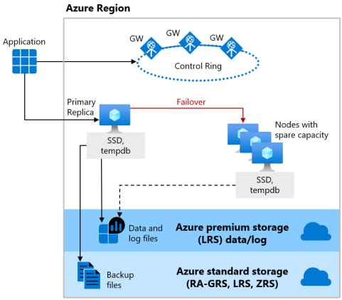
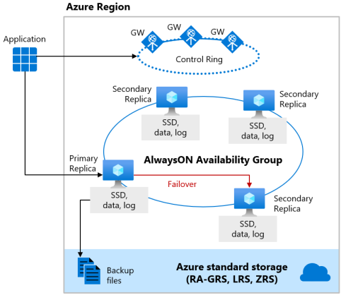
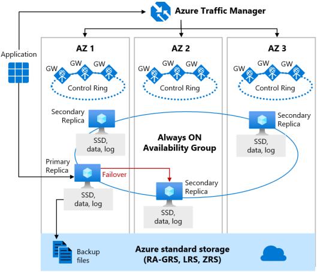

# High availability for Azure SQL Database and SQL Managed Instance
[!INCLUDE[appliesto-sqldb-sqlmi](../includes/appliesto-sqldb-sqlmi.md)]

The goal of the high availability architecture in Azure SQL Database and SQL Managed Instance is to guarantee that your database is up and running minimum of 99.99% of time (For more information regarding specific SLA for different tiers, Please refer [SLA for Azure SQL Database and SQL Managed Instance](https://azure.microsoft.com/support/legal/sla/sql-database/)), without worrying about the impact of maintenance operations and outages. Azure automatically handles critical servicing tasks, such as patching, backups, Windows and Azure SQL upgrades, as well as unplanned events such as underlying hardware, software, or network failures.  When the underlying database in Azure SQL Database is patched or fails over, the downtime is not noticeable if you [employ retry logic](develop-overview.md#resiliency) in your app. SQL Database and SQL Managed Instance can quickly recover even in the most critical circumstances ensuring that your data is always available.

The high availability solution is designed to ensure that committed data is never lost due to failures, that maintenance operations do not affect your workload, and that the database will not be a single point of failure in your software architecture. There are no maintenance windows or downtimes that should require you to stop the workload while the database is upgraded or maintained.

There are two high availability architectural models:

- **Standard availability model** that is based on a separation of compute and storage.  It relies on high availability and reliability of the remote storage tier. This architecture targets budget-oriented business applications that can tolerate some performance degradation during maintenance activities.
- **Premium availability model** that is based on a cluster of database engine processes. It relies on the fact that there is always a quorum of available database engine nodes. This architecture targets mission critical applications with high IO performance, high transaction rate and guarantees minimal performance impact to your workload during maintenance activities.

SQL Database and SQL Managed Instance both run on the latest stable version of the SQL Server database engine and Windows operating system, and most users would not notice that upgrades are performed continuously.

## Basic, Standard, and General Purpose service tier availability

The Basic, Standard, and General Purpose service tiers leverage the standard availability architecture for both serverless and provisioned compute. The following figure shows four different nodes with the separated compute and storage layers.

The standard availability model includes two layers:

- A stateless compute layer that runs the `sqlservr.exe` process and contains only transient and cached data, such as TempDB, model databases on the attached SSD, and plan cache, buffer pool, and columnstore pool in memory. This stateless node is operated by Azure Service Fabric that initializes `sqlservr.exe`, controls health of the node, and performs failover to another node if necessary.
- A stateful data layer with the database files (.mdf/.ldf) that are stored in Azure Blob storage. Azure blob storage has built-in data availability and redundancy feature. It guarantees that every record in the log file or page in the data file will be preserved even if `sqlservr.exe` process crashes.

Whenever the database engine or the operating system is upgraded, or a failure is detected, Azure Service Fabric will move the stateless `sqlservr.exe` process to another stateless compute node with sufficient free capacity. Data in Azure Blob storage is not affected by the move, and the data/log files are attached to the newly initialized `sqlservr.exe` process. This process guarantees 99.99% availability, but a heavy workload may experience some performance degradation during the transition since the new `sqlservr.exe` process starts with cold cache.

## Premium and Business Critical service tier availability

Premium and Business Critical service tiers leverage the Premium availability model, which integrates compute resources (`sqlservr.exe` process) and storage (locally attached SSD) on a single node. High availability is achieved by replicating both compute and storage to additional nodes creating a three to four-node cluster.

The underlying database files (.mdf/.ldf) are placed on the attached SSD storage to provide very low latency IO to your workload. High availability is implemented using a technology similar to SQL Server [Always On availability groups](https://docs.microsoft.com/sql/database-engine/availability-groups/windows/overview-of-always-on-availability-groups-sql-server). The cluster includes a single primary replica that is accessible for read-write customer workloads, and up to three secondary replicas (compute and storage) containing copies of data. The primary node constantly pushes changes to the secondary nodes in order and ensures that the data is synchronized to at least one secondary replica before committing each transaction. This process guarantees that if the primary node crashes for any reason, there is always a fully synchronized node to fail over to. The failover is initiated by the Azure Service Fabric. Once the secondary replica becomes the new primary node, another secondary replica is created to ensure the cluster has enough nodes (quorum set). Once failover is complete, Azure SQL connections are automatically redirected to the new primary node.

As an extra benefit, the premium availability model includes the ability to redirect read-only Azure SQL connections to one of the secondary replicas. This feature is called [Read Scale-Out](read-scale-out.md). It provides 100% additional compute capacity at no extra charge to off-load read-only operations, such as analytical workloads, from the primary replica.

## Hyperscale service tier availability

The Hyperscale service tier architecture is described in [Distributed functions architecture](https://docs.microsoft.com/azure/sql-database/sql-database-service-tier-hyperscale#distributed-functions-architecture) and is only currently available for SQL Database, not SQL Managed Instance.

The availability model in Hyperscale includes four layers:

- A stateless compute layer that runs the `sqlservr.exe` processes and contains only transient and cached data, such as non-covering RBPEX cache, TempDB, model database, etc. on the attached SSD, and plan cache, buffer pool, and columnstore pool in memory. This stateless layer includes the primary compute replica and optionally a number of secondary compute replicas that can serve as failover targets.
- A stateless storage layer formed by page servers. This layer is the distributed storage engine for the `sqlservr.exe` processes running on the compute replicas. Each page server contains only transient and cached data, such as covering RBPEX cache on the attached SSD, and data pages cached in memory. Each page server has a paired page server in an active-active configuration to provide load balancing, redundancy, and high availability.
- A stateful transaction log storage layer formed by the compute node running the Log service process, the transaction log landing zone, and transaction log long term storage. Landing zone and long term storage use Azure Storage, which provides availability and [redundancy](https://docs.microsoft.com/azure/storage/common/storage-redundancy) for transaction log, ensuring data durability for committed transactions.
- A stateful data storage layer with the database files (.mdf/.ndf) that are stored in Azure Storage and are updated by page servers. This layer uses data availability and [redundancy](https://docs.microsoft.com/azure/storage/common/storage-redundancy) features of Azure Storage. It guarantees that every page in a data file will be preserved even if processes in other layers of Hyperscale architecture crash, or if compute nodes fail.

Compute nodes in all Hyperscale layers run on Azure Service Fabric, which controls health of each node and performs failovers to available healthy nodes as necessary.

For more information on high availability in Hyperscale, see [Database High Availability in Hyperscale](https://docs.microsoft.com/azure/sql-database/sql-database-service-tier-hyperscale#database-high-availability-in-hyperscale).

## Zone redundant configuration

By default, the cluster of nodes for the premium availability model is created in the same datacenter. With the introduction of [Azure Availability Zones](../../availability-zones/az-overview.md), SQL Database and SQL Managed Instance  can place different replicas of the Business Critical database to different availability zones in the same region. To eliminate a single point of failure, the control ring is also duplicated across multiple zones as three gateway rings (GW). The routing to a specific gateway ring is controlled by [Azure Traffic Manager](../../traffic-manager/traffic-manager-overview.md) (ATM). Because the zone redundant configuration in the Premium or Business Critical service tiers does not create additional database redundancy, you can enable it at no extra cost. By selecting a zone redundant configuration, you can make your Premium or Business Critical databases resilient to a much larger set of failures, including catastrophic datacenter outages, without any changes to the application logic. You can also convert any existing Premium or Business Critical databases or pools to the zone redundant configuration.

Because the zone redundant databases have replicas in different datacenters with some distance between them, the increased network latency may increase the commit time and thus impact the performance of some OLTP workloads. You can always return to the single-zone configuration by disabling the zone redundancy setting. This process is an online operation similar to the regular service tier upgrade. At the end of the process, the database or pool is migrated from a zone redundant ring to a single zone ring or vice versa.

> [!IMPORTANT]
> Zone redundant databases and elastic pools are currently only supported in the Premium and Business Critical service tiers in select regions. When using the Business Critical tier, zone redundant configuration is only available when the Gen5 compute hardware is selected. For up to date information about the regions that support zone redundant databases, see [Services support by region](../../availability-zones/az-region.md).  
> This feature is not available in Managed instance.

The zone redundant version of the high availability architecture is illustrated by the following diagram:

## Accelerated Database Recovery (ADR)

[Accelerated Database Recovery (ADR)](../accelerated-database-recovery.md) is a new SQL Database engine feature that greatly improves database availability, especially in the presence of long running transactions. ADR is currently available for Azure SQL Database, Azure SQL Managed Instance, and Azure SQL Data Warehouse.

## Testing application fault resiliency

High availability is a fundamental part of the SQL Database and SQL Managed Instance platform that works transparently for your database application. However, we recognize that you may want to test how the automatic failover operations initiated during planned or unplanned events would impact the application before you deploy it to production. You can call a special API to restart a database or an elastic pool, which will in turn trigger a failover. In the case of a zone redundant database or elastic pool, the API call would result in redirecting client connections to the new primary in an Availability Zone different from the Availability Zone of the old primary. So in addition to testing how failover impacts existing database sessions, you can also verify if it changes the end-to-end performance due to changes in network latency. Because the restart operation is intrusive and a large number of them could stress the platform, only one failover call is allowed every 30 minutes for each database or elastic pool.

A failover can be initiated using REST API or PowerShell. For REST API, see [Database failover](https://docs.microsoft.com/rest/api/sql/databases(failover)/failover) and [Elastic pool failover](https://docs.microsoft.com/rest/api/sql/elasticpools(failover)/failover). For PowerShell, see [Invoke-AzSqlDatabaseFailover](https://docs.microsoft.com/powershell/module/az.sql/invoke-azsqldatabasefailover) and [Invoke-AzSqlElasticPoolFailover](https://docs.microsoft.com/powershell/module/az.sql/invoke-azsqlelasticpoolfailover). The REST API calls can also be made from Azure CLI using [az rest](https://docs.microsoft.com/cli/azure/reference-index?view=azure-cli-latest#az-rest) command.

> [!IMPORTANT]
> The Failover command is currently not available in the Hyperscale service tier and for Managed Instance.

## Conclusion

Azure SQL Database and Azure SQL Managed Instance feature a built-in high availability solution, that is deeply integrated with the Azure platform. It is dependent on Service Fabric for failure detection and recovery, on Azure Blob storage for data protection, and on Availability Zones for higher fault tolerance. In addition, SQL Database and SQL Managed Instance leverage the Always On availability group technology from the SQL Server instance for replication and failover. The combination of these technologies enables applications to fully realize the benefits of a mixed storage model and support the most demanding SLAs.

## Next steps

- Learn about [Azure Availability Zones](../../availability-zones/az-overview.md)
- Learn about [Service Fabric](../../service-fabric/service-fabric-overview.md)
- Learn about [Azure Traffic Manager](../../traffic-manager/traffic-manager-overview.md)
- For more options for high availability and disaster recovery, see [Business Continuity](business-continuity-high-availability-disaster-recover-hadr-overview.md)
