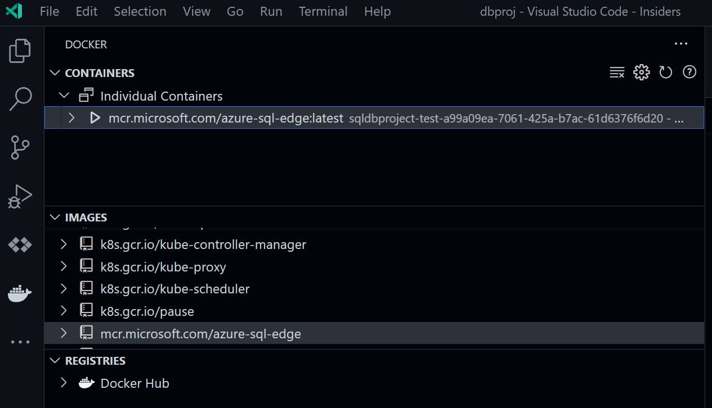

# Introducing the Azure SQL Database emulator

As part of the application development process, the ability to validate database and query design together with client application code in the simplest and frictionless mode is critical to speed up the overall workflow.

## What is the Azure SQL Database emulator?

Azure SQL Database emulator is a local containerized database for development and testing. The combination of a container image which provides a high-fidelity emulator for Azure SQL Database with a Visual Studio Code dedicated extension, lets developers pull from the Microsoft Container Registry and run it on their own workstation to enable faster local and offline development workflows.

This Azure SQL Database emulator image can also be easily used as part of local or hosted CI/CD pipelines, to provide support for unit and integration testing without the need for hitting public cloud service every time.

Within Visual Studio Code, developers can list/start/stop existing instances using the Docker extension, configure details like local ports or persistent volumes and manage all other aspects.

This local development experience is supported on Windows, macOS and Linux, and is available on x64 and ARM64-based hw platforms.

Once validation and testing succeeded, developers can directly deploy their SQL Projects from within Visual Studio Code extension to public Azure, and leverage additional capabilities like Serverless.

## Limitations

Current implementation of Azure SQL Database emulator is derived from an Azure SQL Edge base image, as it offers a cross-hw platform compatibility and smaller image size. This means that, compared to Azure SQL Database public service, some specific features may not be avaliable. For example, Azure SQL Database emulator does not support the following features that are supported across multiple Azure SQL Database service tiers:

* Spatial data types
* Memory-optimized tables in In-memory OLTP
* HierarchyID data type
* Full-text search
* Azure Active Directory Integration

and some others. While lack of compatibility with some of them can be impactful, the emulator is still a great tool for local development and testing and supports most of Azure SQL Database programmability surface.

In future releases, we plan to increase feature parity and provide higher-fidelity with Azure SQL Database public service.

Please refer to the [Azure SQL Edge documentation](https://docs.microsoft.com/azure/azure-sql-edge/features) for more specific details.

## Next steps

Learn more about the local development experience for Azure SQL Database:

- [What is the local development experience for Azure SQL Database?](local-dev-experience-overview.md)