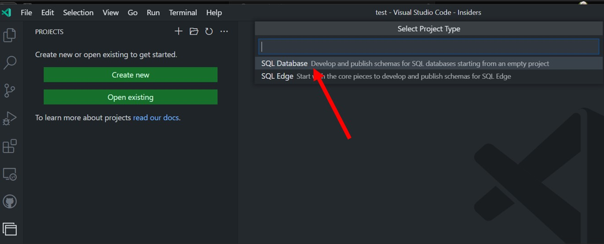
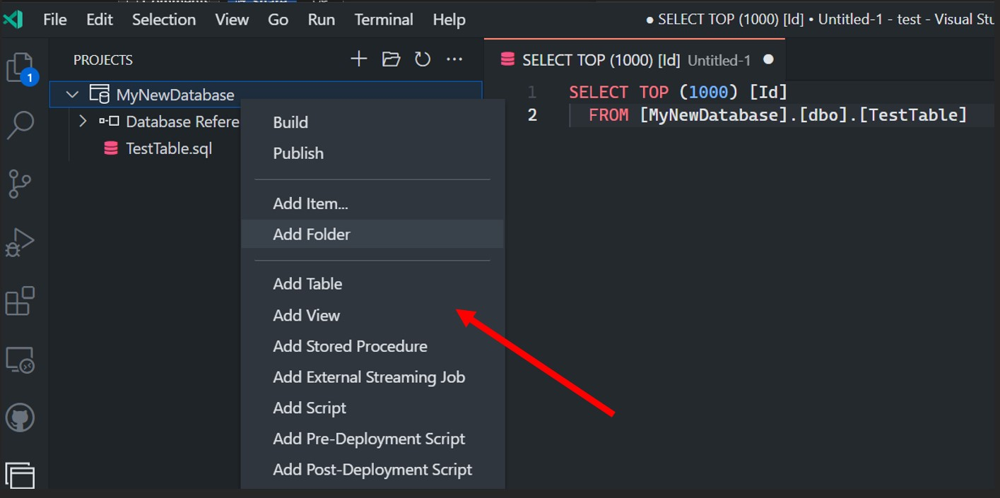
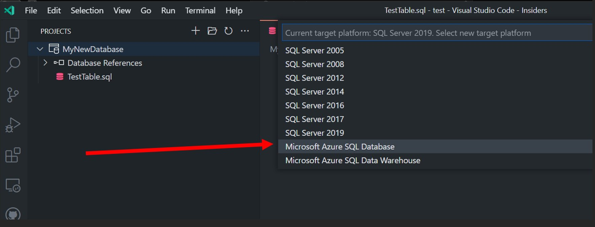
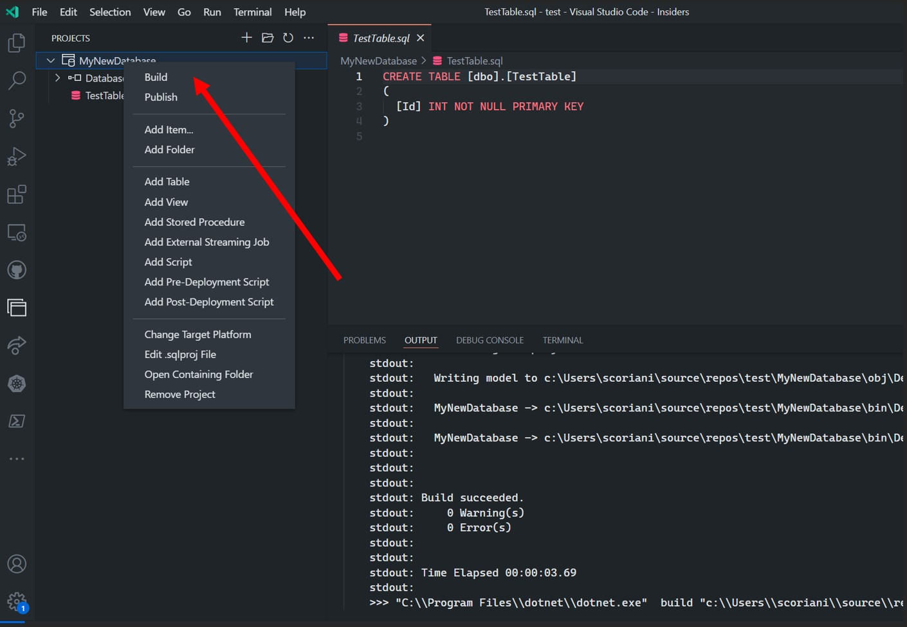
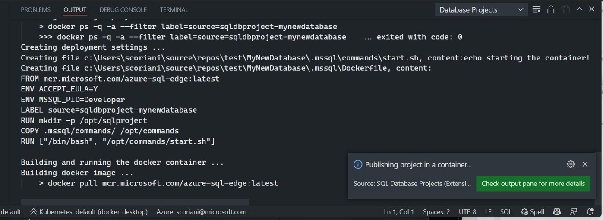
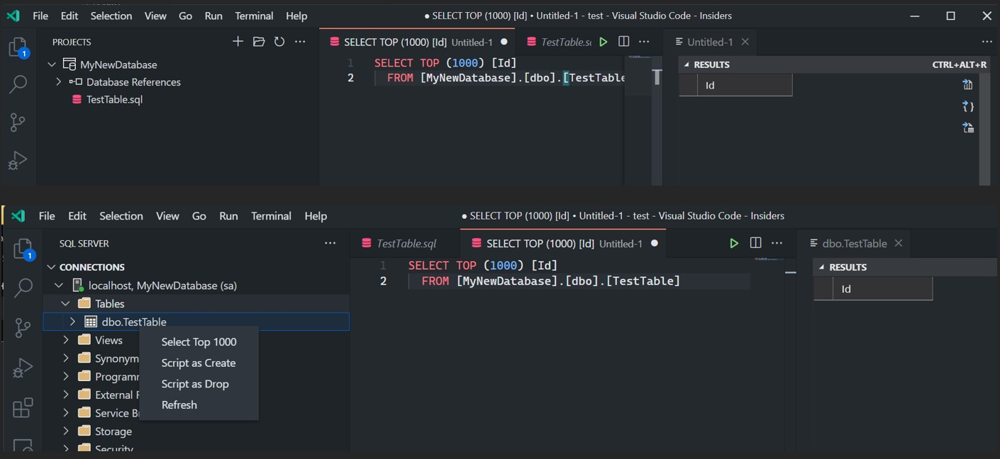

# Quickstart: Create a local development environment for Azure SQL Database

Azure SQL Database local development experience provides a way to design, edit, build/validate, publish and run database schemas in a local Azure SQL Database emulator.

Once database project gets to a more mature stage, developers can easily publish it to Azure SQL Database public service from the same environment, and manage the entire lifecycle of their databases (e.g. manage schema drifts and such).

In this quickstart we will show how to go through the entire process leveraging the Azure SQL Database local development experience.

## Prerequisites

Make sure you've followed the steps in the [Set up a local development environment for Azure SQL Database](local-dev-experience-set-up-dev-environment.md) guide.

## Getting Started with Database Projects

* Create a new database project by going to the Projects viewlet or by searching Projects: New in the command palette.
* Existing database projects can be opened by going to the Projects viewlet or by searching Projects: Open Existing in the command palette.
* Start from an existing database by using the Create Project from Database from the command palette or database context menu.
* Start from an OpenAPI/Swagger spec by using the Generate SQL Project from OpenAPI/Swagger spec command.

First step is providing a name for the new SQL Database project:
 

From here, you can start working on your project: creating or altering database objects like tables, views, stored procedures and scripts. such:
 

You can get edit and build time support for your SQL Database project objects and scripts by selecting Azure SQL Database as target platform for your project. 

This will let Visual Studio Code to highlight syntax issues or the usage of unsupported features for the selected platform:
 

Optionally, SQL Database project files can be put under source control together with your application projects:

You can build your project and validate that it will work against the selected platform:

Once database project is ready to get tested, you can publish it to a target:

You can select between an existing or a new server:

And you select between Azure SQL Database “lite” and a “full” images. With the former, you will get compatibility with most of Azure SQL DB capabilities and a lightweight image that will take less to download and instantiate. Selecting “full”, you will have access to advanced features like In-memory optimized tables, geo-spatial data types and more, but at the expense of more required resources:

You can create as many local instances as necessary, based on available resources, and manage their lifecycle through VS Code Docker Extension or CLI commands.

 
Once instances of your database projects are running, you can connect from VS Code mssql extension and test your scripts and queries, like any regular Azure SQL Database instance in the cloud:
 

 
For each iteration and modification, SQL project can be rebuilt and deployed to one of the containerized instances running on the local machine, until it’s ready.
 
 

Last step of database project lifecycle can be to publish the finished artifact to a new or existing Azure SQL Database instance in the cloud through the mssql extension:
 

## Next steps

Learn more about the local development experience for Azure SQL Database:

- [What is the local development experience for Azure SQL Database?](local-dev-experience-overview.md)