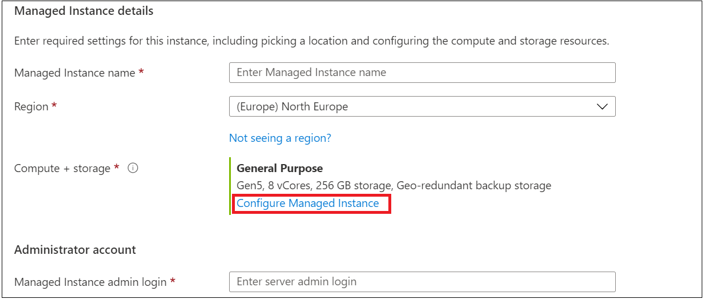
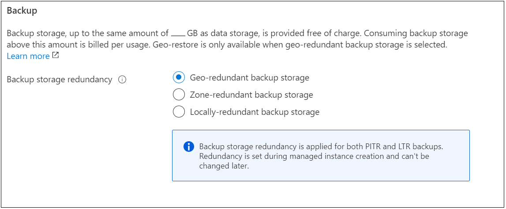

# Change automated backup settings for Azure SQL Managed Instance
[!INCLUDE[appliesto-sqlmi](../includes/appliesto-sqlmi.md)]

This article provides examples to modify short-term retention (STR) [automated backup settings](automated-backups-overview.md) for Azure SQL Managed Instance, such as the short-term retention policy and the backup storage redundancy option used for backups. 

> [!div class="op_single_selector"]
> * [Azure SQL Database](automated-backups-change-settings.md)
> * [Azure SQL Managed Instance](../managed-instance/automated-backups-change-settings.md)


## Change short-term retention policy

You can change the default PITR backup retention period and the differential backup frequency by using the Azure portal, PowerShell, or the REST API. The following examples illustrate how to change the PITR retention to 28 days and the differential backups to 24 hour interval.

> [!WARNING]
> If you reduce the current retention period, you lose the ability to restore to points in time older than the new retention period. Backups that are no longer needed to provide PITR within the new retention period are deleted. If you increase the current retention period, you do not immediately gain the ability to restore to older points in time within the new retention period. You gain that ability over time, as the system starts to retain backups for longer.

> [!NOTE]
> These APIs will affect only the PITR retention period. If you configured LTR for your database, it won't be affected. For information about how to change LTR retention periods, see [Long-term retention](../database/long-term-retention-overview.md).

### [Azure portal](#tab/azure-portal)

To change the PITR backup retention period or the differential backup frequency for active databases by using the Azure portal, go to the managed instance with the databases whose retention period you want to change. Select **Backups** in the left pane, then select the **Retention policies** tab. Select the database(s) for which you want to change the PITR backup retention. Then select **Configure retention** from the action bar.


### [Azure CLI](#tab/azure-cli)

Prepare your environment for the Azure CLI.

[!INCLUDE[azure-cli-prepare-your-environment-no-header](../includes/azure-cli-prepare-your-environment-no-header.md)]

Use the following example to change the PITR backup retention of a **single active** database in a SQL Managed Instance.

```azurecli
# Set new PITR backup retention period on an active individual database
# Valid backup retention must be between 1 and 35 days
az sql midb short-term-retention-policy set \
    --resource-group myresourcegroup \
    --managed-instance myinstance \
    --name mymanageddb \
    --retention-days 1 \
```

Use the following example to change the PITR backup retention for **all active** databases in a SQL Managed Instance.

```azurecli
# Set new PITR backup retention period for ALL active databases
# Valid backup retention must be between 1 and 35 days
az sql midb short-term-retention-policy set \
    --resource-group myresourcegroup \
    --managed-instance myinstance \
    --retention-days 1 \
```


### [PowerShell](#tab/powershell)

To change the PITR backup retention for an **single active** database in a SQL Managed Instance, use the following PowerShell example.

```powershell
# SET new PITR backup retention period on an active individual database
# Valid backup retention must be between 1 and 35 days
Set-AzSqlInstanceDatabaseBackupShortTermRetentionPolicy -ResourceGroupName resourceGroup -InstanceName testserver -DatabaseName testDatabase -RetentionDays 1
```

To change the PITR backup retention for **all active** databases in a SQL Managed Instance, use the following PowerShell example.

```powershell
# SET new PITR backup retention period for ALL active databases
# Valid backup retention must be between 1 and 35 days
Get-AzSqlInstanceDatabase -ResourceGroupName resourceGroup -InstanceName testserver | Set-AzSqlInstanceDatabaseBackupShortTermRetentionPolicy -RetentionDays 1
```

To change the PITR backup retention for an **single deleted** database in a SQL Managed Instance, use the following PowerShell example.
 
```powershell
# SET new PITR backup retention on an individual deleted database
# Valid backup retention must be between 0 (no retention) and 35 days. Valid retention rate can only be lower than the period of the retention period when database was active, or remaining backup days of a deleted database.
Get-AzSqlDeletedInstanceDatabaseBackup -ResourceGroupName resourceGroup -InstanceName testserver -DatabaseName testDatabase | Set-AzSqlInstanceDatabaseBackupShortTermRetentionPolicy -RetentionDays 0
```

To change the PITR backup retention for **all deleted** databases in a SQL Managed Instance, use the following PowerShell example.

```powershell
# SET new PITR backup retention for ALL deleted databases
# Valid backup retention must be between 0 (no retention) and 35 days. Valid retention rate can only be lower than the period of the retention period when database was active, or remaining backup days of a deleted database
Get-AzSqlDeletedInstanceDatabaseBackup -ResourceGroupName resourceGroup -InstanceName testserver | Set-AzSqlInstanceDatabaseBackupShortTermRetentionPolicy -RetentionDays 0
```

Zero (0) days retention would denote that backup is immediately deleted and no longer kept for a deleted database.
Once PITR backup retention has been reduced for a deleted database, it no longer can be increased.

### [Rest API](#tab/rest-api)

#### Sample request

```http
PUT https://management.azure.com/subscriptions/00000000-1111-2222-3333-444444444444/resourceGroups/resourceGroup/providers/Microsoft.Sql/servers/testserver/databases/testDatabase/backupShortTermRetentionPolicies/default?api-version=2017-10-01-preview
```

#### Request body

```json
{
  "properties":{
    "retentionDays":28
  }
}
```

#### Sample response

Status code: 200

```json
{
  "id": "/subscriptions/00000000-1111-2222-3333-444444444444/providers/Microsoft.Sql/resourceGroups/resourceGroup/servers/testserver/databases/testDatabase/backupShortTermRetentionPolicies/default",
  "name": "default",
  "type": "Microsoft.Sql/resourceGroups/servers/databases/backupShortTermRetentionPolicies",
  "properties": {
    "retentionDays": 28
  }
}
```

For more information, see [Backup Retention REST API](/rest/api/sql/backupshorttermretentionpolicies).


---


### Configure backup storage redundancy 


### [Azure portal](#tab/azure-portal)

In the Azure portal, during an instance creation, the default option for the backup storage redundancy is Geo-redundancy. The option to change it is located on the **Compute + storage** pane accessible from the **Configure Managed Instance** option on the **Basics** tab.



Find the option to select backup storage redundancy on the **Compute + storage** pane.



To change the Backup storage redundancy option for an existing instance, go to the **Compute + storage** pane, choose the new backup option and select **Apply**. For now, this change will be applied only for PITR backups, while LTR backups will retain the old storage redundancy type. The time it takes to perform the backup redundancy change depends on the size of the all the databases within a single managed instance. Changing the backup redundancy will take more time for instances that have large databases. It's possible to combine the backup storage redundancy change operation with the UpdateSLO operation. Use the **Notification** pane of the Azure portal to view the status of the change operation. 

:::image type="content" source="../database/media/automated-backups-overview/change-backup-storage-redundancy-managed-instance-notification.png" alt-text="Change backup storage redundancy notification":::

### [Azure CLI](#tab/azure-cli)

To change the backup storage redundancy after your SQL Managed Instance is created using the Azure CLI, specify the `-BackupStorageRedundancy` parameter when using the `az sql mi update` cmdlet.  View the [update mi backup storage redundancy](/cli/azure/sql/mi#az-sql-mi-update-examples) example. 

Possible values for `-BackupStorageRedundancy` are `Geo` for geo-redundant, `Zone` for zone-redundant, `Local` for locally-redundant, and `GeoZone` for geo-zone redundant backup storage. 

### [PowerShell](#tab/powershell)

To configure backup storage redundancy when you create your managed instance, specify the `-BackupStorageRedundancy` parameter when using the [New-AzSqlInstance](/powershell/module/az.sql/new-azsqlinstance) cmdlet. To change the backup storage redundancy for an existing managed instance, specify the `-BackupStorageRedundancy` parameter when using the `Set-AzSqlInstance` cmdlet. Review the [update an existing instance to be zone redundant](/powershell/module/az.sql/set-azsqlinstance#example-7-update-an-existing-instance-to-be-zone-redundant) example to learn more. 

Possible values for `-BackupStorageRedundancy` are `Geo` for geo-redundant, `Zone` for zone-redundant, `Local` for locally-redundant, and `GeoZone` for geo-zone redundant backup storage. 

### [Rest API](#tab/rest-api)

It's not currently possible to change the backup storage redundancy option using the Rest API. 

---


## Next steps

- Database backups are an essential part of any business continuity and disaster recovery strategy because they protect your data from accidental corruption or deletion. To learn about the other SQL Database business continuity solutions, see [Business continuity overview](../database/business-continuity-high-availability-disaster-recover-hadr-overview.md).
- For information about how to configure, manage, and restore from long-term retention of automated backups in Azure Blob storage by using the Azure portal, see [Manage long-term backup retention by using the Azure portal](long-term-backup-retention-configure.md).
- For information about how to configure, manage, and restore from long-term retention of automated backups in Azure Blob storage by using PowerShell, see [Manage long-term backup retention by using PowerShell](long-term-backup-retention-configure.md). 
- Get more information about how to [restore a database to a point in time by using the Azure portal](recovery-using-backups.md).
- To learn all about backup storage consumption on Azure SQL Managed Instance, see [Backup storage consumption on Managed Instance explained](https://aka.ms/mi-backup-explained).
- To learn how to fine-tune backup storage retention and costs for Azure SQL Managed Instance, see [Fine tuning backup storage costs on Managed Instance](https://aka.ms/mi-backup-tuning).
