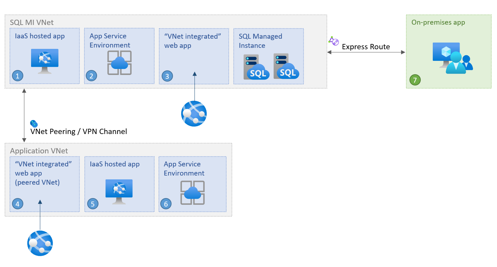
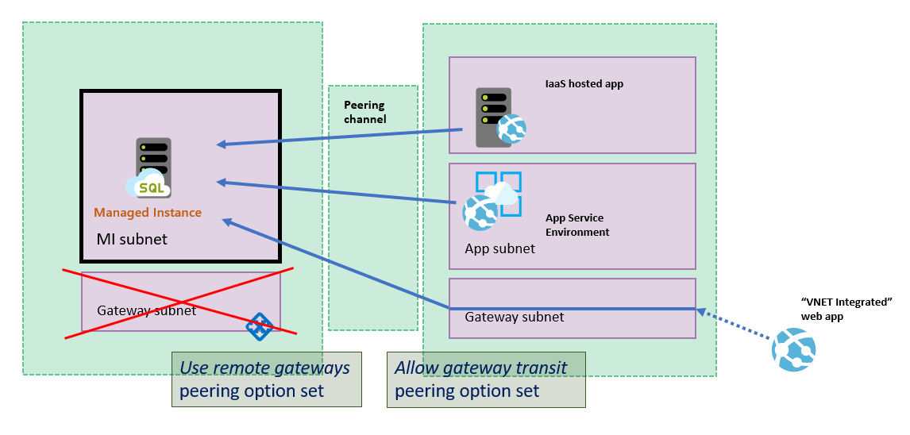

# Connect your application to Azure SQL Managed Instance
[!INCLUDE[appliesto-sqlmi](../includes/appliesto-sqlmi.md)]

Today you have multiple choices when deciding how and where you host your application.

You may choose to host application in the cloud by using Azure App Service or some of Azure's virtual network integrated options like Azure App Service Environment, Azure Virtual Machines, and virtual machine scale sets. You could also take hybrid cloud approach and keep your applications on-premises.

Whatever choice you make, you can connect it to Azure SQL Managed Instance. 

This article describes how to connect an application to Azure SQL Managed Instance in a number of different application scenarios from inside the virtual network. 

> [!IMPORTANT]
> You can also enable data access to your managed instance from outside a virtual network. You are able to access your managed instance from multi-tenant Azure services like Power BI, Azure App Service, or an on-premises network that are not connected to a VPN by using the public endpoint on a managed instance. See more on [Configure public endpoint in Azure SQL Managed Instance](./public-endpoint-configure.md). 




## Connect inside the same VNet

Connecting an application inside the same virtual network as SQL Managed Instance is the simplest scenario. Virtual machines inside the virtual network can connect to each other directly even if they are inside different subnets. That means that all you need to connect an application inside App Service Environment or a virtual machine is to set the connection string appropriately.  

## Connect inside a different VNet

Connecting an application when it resides within a different virtual network from SQL Managed Instance is a bit more complex because SQL Managed Instance has private IP addresses in its own virtual network. To connect, an application needs access to the virtual network where SQL Managed Instance is deployed. So you need to make a connection between the application and the SQL Managed Instance virtual network. The virtual networks don't have to be in the same subscription in order for this scenario to work.

There are two options for connecting virtual networks:

- [Azure VNet peering](../../virtual-network/virtual-network-peering-overview.md)
- VNet-to-VNet VPN gateway ([Azure portal](../../vpn-gateway/vpn-gateway-howto-vnet-vnet-resource-manager-portal.md), [PowerShell](../../vpn-gateway/vpn-gateway-vnet-vnet-rm-ps.md), [Azure CLI](../../vpn-gateway/vpn-gateway-howto-vnet-vnet-cli.md))

Peering is preferable because it uses the Microsoft backbone network, so from the connectivity perspective, there is no noticeable difference in latency between virtual machines in a peered virtual network and in the same virtual network. Virtual network peering is to supported between the networks in the same region. Global virtual network peering is also supported with the limitation described in the note below.  

> [!IMPORTANT]
> [On 9/22/2020 support for global virtual network peering for newly created virtual clusters was announced](https://azure.microsoft.com/updates/global-virtual-network-peering-support-for-azure-sql-managed-instance-now-available/). It means that global virtual network peering is supported for SQL managed instances created in empty subnets after the announcement date, as well for all the subsequent managed instances created in those subnets. For all the other SQL managed instances peering support is limited to the networks in the same region due to the [constraints of global virtual network peering](../../virtual-network/virtual-network-manage-peering.md#requirements-and-constraints). See also the relevant section of the [Azure Virtual Networks frequently asked questions](../../virtual-network/virtual-networks-faq.md#what-are-the-constraints-related-to-global-vnet-peering-and-load-balancers) article for more details. To be able to use global virtual network peering for SQL managed instances from virtual clusters created before the announcement date, consider configuring [maintenance window](../database/maintenance-window.md) on the instances, as it will move the instances into new virtual clusters that support global virtual network peering.

## Connect from on-premises 

You can also connect your on-premises application to SQL Managed Instance. SQL Managed Instance can only be accessed through a private IP address. In order to access it from on-premises, you need to make a site-to-site connection between the application and the SQL Managed Instance virtual network.

There are two options for how to connect on-premises to an Azure virtual network:

- Site-to-site VPN connection ([Azure portal](../../vpn-gateway/tutorial-site-to-site-portal.md), [PowerShell](../../vpn-gateway/vpn-gateway-create-site-to-site-rm-powershell.md), [Azure CLI](../../vpn-gateway/vpn-gateway-howto-site-to-site-resource-manager-cli.md))
- [Azure ExpressRoute](../../expressroute/expressroute-introduction.md) connection  

If you've established an on-premises to Azure connection successfully and you can't establish a connection to SQL Managed Instance, check if your firewall has an open outbound connection on SQL port 1433 as well as the 11000-11999 range of ports for redirection.

## Connect the developer box

It is also possible to connect your developer box to SQL Managed Instance. SQL Managed Instance can be accessed only through a private IP address, so in order to access it from your developer box, you first need to make a connection between your developer box and the SQL Managed Instance virtual network. To do so, configure a point-to-site connection to a virtual network using native Azure certificate authentication. For more information, see  [Configure a point-to-site connection to connect to Azure SQL Managed Instance from an on-premises computer](point-to-site-p2s-configure.md).

## Connect with VNet peering

Another scenario implemented by customers is where a VPN gateway is installed in a separate virtual network and subscription from the one hosting SQL Managed Instance. The two virtual networks are then peered. The following sample architecture diagram shows how this can be implemented.


Once you have the basic infrastructure set up, you need to modify some settings so that the VPN gateway can see the IP addresses in the virtual network that hosts SQL Managed Instance. To do so, make the following very specific changes under the **Peering settings**.

1. In the virtual network that hosts the VPN gateway, go to **Peerings**, go to the peered virtual network connection for SQL Managed Instance, and then click **Allow Gateway Transit**.
2. In the virtual network that hosts SQL Managed Instance, go to **Peerings**, go to the peered virtual network connection for the VPN gateway, and then click **Use remote gateways**.

## Connect Azure App Service 

You can also connect an application that's hosted by Azure App Service. SQL Managed Instance can be accessed only through a private IP address, so in order to access it from Azure App Service, you first need to make a connection between the application and the SQL Managed Instance virtual network. See [Integrate your app with an Azure virtual network](../../app-service/web-sites-integrate-with-vnet.md).  

For troubleshooting, see [Troubleshooting virtual networks and applications](../../app-service/web-sites-integrate-with-vnet.md#troubleshooting). If a connection cannot be established, try [syncing the networking configuration](azure-app-sync-network-configuration.md).

A special case of connecting Azure App Service to SQL Managed Instance is when you integrate Azure App Service to a network peered to a SQL Managed Instance virtual network. That case requires the following configuration to be set up:

- SQL Managed Instance virtual network must NOT have a gateway  
- SQL Managed Instance virtual network must have the `Use remote gateways` option set
- Peered virtual network must have the `Allow gateway transit` option set

This scenario is illustrated in the following diagram:



>[!NOTE]
>The virtual network integration feature does not integrate an app with a virtual network that has an ExpressRoute gateway. Even if the ExpressRoute gateway is configured in coexistence mode, virtual network integration does not work. If you need to access resources through an ExpressRoute connection, then you can use App Service Environment, which runs in your virtual network.

## Troubleshooting connectivity issues

For troubleshooting connectivity issues, review the following:

- If you are unable to connect to SQL Managed Instance from an Azure virtual machine within the same virtual network but a different subnet, check if you have a Network Security Group set on VM subnet that might be blocking access. Additionally, open outbound connection on SQL port 1433 as well as ports in the range 11000-11999, since those are needed for connecting via redirection inside the Azure boundary.
- Ensure that BGP Propagation is set to **Enabled** for the route table associated with the virtual network.
- If using P2S VPN, check the configuration in the Azure portal to see if you see **Ingress/Egress** numbers. Non-zero numbers indicate that Azure is routing traffic to/from on-premises.

   

- Check that the client machine (that is running the VPN client) has route entries for all the virtual networks that you need to access. The routes are stored in
`%AppData%\Roaming\Microsoft\Network\Connections\Cm\<GUID>\routes.txt`.

   

   As shown in this image, there are two entries for each virtual network involved and a third entry for the VPN endpoint that is configured in the portal.

   Another way to check the routes is via the following command. The output shows the routes to the various subnets:

   ```cmd
   C:\ >route print -4
   ===========================================================================
   Interface List
   14...54 ee 75 67 6b 39 ......Intel(R) Ethernet Connection (3) I218-LM
   57...........................rndatavnet
   18...94 65 9c 7d e5 ce ......Intel(R) Dual Band Wireless-AC 7265
   1...........................Software Loopback Interface 1
   Adapter===========================================================================

   IPv4 Route Table
   ===========================================================================
   Active Routes:
   Network Destination        Netmask          Gateway       Interface  Metric
          0.0.0.0          0.0.0.0       10.83.72.1     10.83.74.112     35
         10.0.0.0    255.255.255.0         On-link       172.26.34.2     43
         10.4.0.0    255.255.255.0         On-link       172.26.34.2     43
   ===========================================================================
   Persistent Routes:
   None
   ```

- If you're using virtual network peering, ensure that you have followed the instructions for setting [Allow Gateway Transit and Use Remote Gateways](#connect-from-on-premises).

- If you're using virtual network peering to connect an Azure App Service hosted application, and the SQL Managed Instance virtual network has a public IP address range, make sure that your hosted application settings allow your outbound traffic to be routed to public IP networks. Follow the instructions in [Regional virtual network integration](../../app-service/web-sites-integrate-with-vnet.md#regional-vnet-integration).

## Required versions of drivers and tools

The following minimal versions of the tools and drivers are recommended if you want to connect to SQL Managed Instance:

| Driver/tool | Version |
| --- | --- |
|.NET Framework | 4.6.1 (or .NET Core) |
|ODBC driver| v17 |
|PHP driver| 5.2.0 |
|JDBC driver| 6.4.0 |
|Node.js driver| 2.1.1 |
|OLEDB driver| 18.0.2.0 |
|SSMS| 18.0 or [higher](/sql/ssms/download-sql-server-management-studio-ssms) |
|[SMO](/sql/relational-databases/server-management-objects-smo/sql-server-management-objects-smo-programming-guide) | [150](https://www.nuget.org/packages/Microsoft.SqlServer.SqlManagementObjects) or higher |

## Next steps

- For information about SQL Managed Instance, see [What is SQL Managed Instance?](sql-managed-instance-paas-overview.md).
- For a tutorial showing you how to create a new managed instance, see [Create a managed instance](instance-create-quickstart.md).
