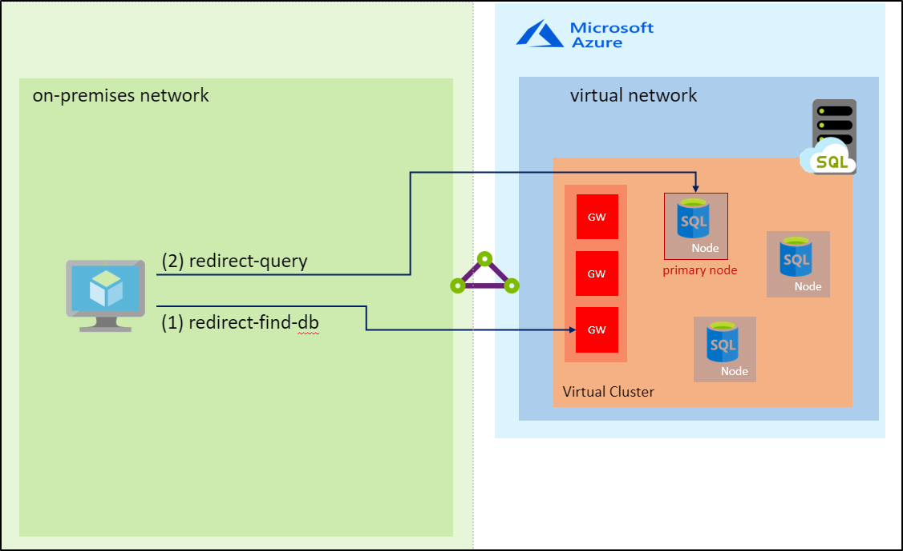
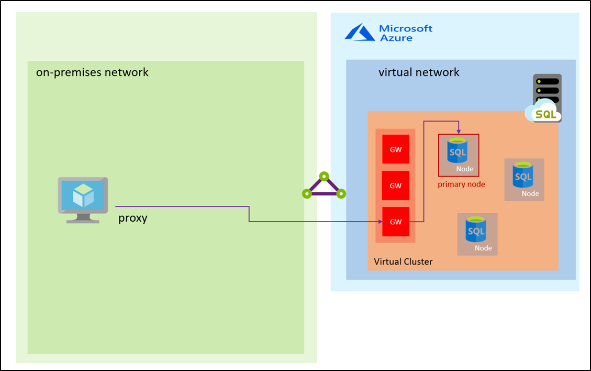

# Azure SQL Managed Instance connection types
[!INCLUDE[appliesto-sqlmi](../includes/appliesto-sqlmi.md)]

This article explains how clients connect to Azure SQL Managed Instance depending on the connection type. Script samples to change connection types are provided below, along with considerations related to changing the default connectivity settings.

## Connection types

Azure SQL Managed Instance's VNet-local endpoint supports the following two connection types:

- **Redirect (recommended):** Clients establish connections directly to the node hosting the database. To enable connectivity using redirect, you must open firewalls and Network Security Groups (NSG) to allow access on ports 1433, and 11000-11999. Packets go directly to the database, and hence there are latency and throughput performance improvements using redirect over proxy. Impact of planned maintenance events of gateway component is also minimized with redirect connection type compared to proxy since connections, once established, have no dependency on gateway. 
- **Proxy (default):** In this mode, all connections are using a proxy gateway component. To enable connectivity, only port 1433 for private networks and port 3342 for public connection need to be opened. Choosing this mode can result in higher latency and lower throughput, depending on nature of the workload. Also, planned maintenance events of gateway component break all live connections in proxy mode. We highly recommend the redirect connection policy over the proxy connection policy for the lowest latency, highest throughput, and minimized impact of planned maintenance.

Public endpoint and private endpoints to Azure SQL Managed Instance will always operate in proxy mode regardless of the connection type set.

## Redirect connection type

In the redirect connection type, after the TCP session is established to the SQL engine, the client session obtains the destination virtual IP of the virtual cluster node from the load balancer. Subsequent packets flow directly to the virtual cluster node, bypassing the gateway. The following diagram illustrates this traffic flow.



> [!IMPORTANT]
> The redirect connection type currently works only for the VNet-local endpoint. Regardless of the connection type setting, connections coming through the public endpoint would be through a proxy.

## Proxy connection type

In the proxy connection type, the TCP session is established using the gateway and all subsequent packets flow through it. The following diagram illustrates this traffic flow.



## Changing Connection Type

- **Using the Portal:**
To change the Connection Type using the Azure portal,open the Virtual Network page and use the **Connection type** setting to change the connection type and save the changes.

- **Script to change connection type settings using PowerShell:**

[!INCLUDE [updated-for-az](../includes/updated-for-az.md)]

The following PowerShell script shows how to change the connection type for a managed instance to `Redirect`.

```powershell
Install-Module -Name Az
Import-Module Az.Accounts
Import-Module Az.Sql

Connect-AzAccount
# Get your SubscriptionId from the Get-AzSubscription command
Get-AzSubscription
# Use your SubscriptionId in place of {subscription-id} below
Select-AzSubscription -SubscriptionId {subscription-id}
# Replace {rg-name} with the resource group for your managed instance, and replace {mi-name} with the name of your managed instance
$mi = Get-AzSqlInstance -ResourceGroupName {rg-name} -Name {mi-name}
$mi = $mi | Set-AzSqlInstance -ProxyOverride "Redirect" -force
```

## Next steps

- [Restore a database to SQL Managed Instance](restore-sample-database-quickstart.md)
- Learn how to [configure a public endpoint on SQL Managed Instance](public-endpoint-configure.md)
- Learn about [SQL Managed Instance connectivity architecture](connectivity-architecture-overview.md)
