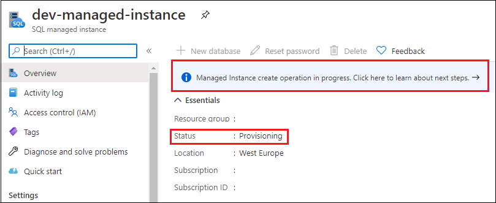
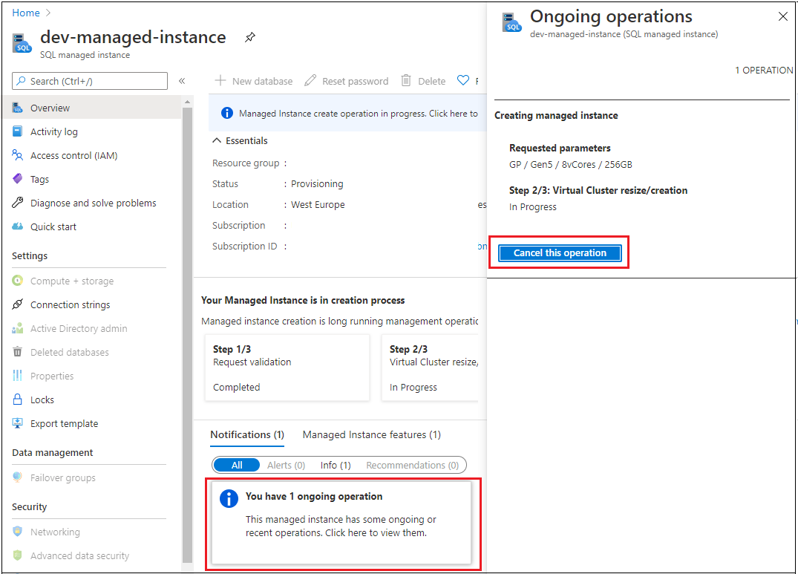

# Data virtualization with Azure SQL Managed Instance (Preview)
[!INCLUDE[appliesto-sqlmi](../includes/appliesto-sqlmi.md)]

Azure SQL Managed Instance enables you to execute T-SQL queries that read data from files stored in Azure Data Lake Storage Gen2 or Azure Blob Storage, and to combine it with locally stored relational data via joins. This way you can transparently access external data still allowing it to stay in its original location and format.

## Overview

There are two different ways of querying external files using this feature, optimized for different scenarios:

- OPENROWSET syntax – optimized for ad-hoc querying of files. Typically used to quickly explore the content and the structure of a new set of files.
- External tables – optimized for repetitive querying of files using identical syntax as if data were stored locally in the database. It equires few more preparation steps compared to the first option, but it allows more control over data access and it’s typically used in analytical workloads and for reporting.

## Managed instance operations API

Management operations APIs are specially designed to monitor operations. Monitoring managed instance operations can provide insights on operation parameters and operation steps, as well as [cancel specific operations](management-operations-cancel.md). Besides operation details and cancel command, this API can be used in automation scripts with multi-resource deployments - based on the progress step, you can kick off some dependent resource deployment.

These are the APIs: 

| Command | Description |
| --- | --- |
|[Managed Instance Operations - Get](/rest/api/sql/managedinstanceoperations/get)|Gets a management operation on a managed instance.|
|[Managed Instance Operations - Cancel](/rest/api/sql/managedinstanceoperations/cancel)|Cancels the asynchronous operation on the managed instance.|
|[Managed Instance Operations - List By Managed Instance](/rest/api/sql/managedinstanceoperations/listbymanagedinstance)|Gets a list of operations performed on the managed instance.|

> [!NOTE]
> Use API version 2020-02-02 to see the managed instance create operation in the list of operations. This is the default version used in the Azure portal and the latest PowerShell and Azure CLI packages.

## Monitor operations

# [Portal](#tab/azure-portal)

In the Azure portal, use the managed instance **Overview** page to monitor managed instance operations. 

For example, the **Create operation** is visible at the start of the creation process on the **Overview** page: 



Select **Ongoing operation** to open the **Ongoing operation** page and view **Create** or **Update** operations. You can also [Cancel](management-operations-cancel.md) operations from this page as well.  



> [!NOTE]
> Create operations submitted through Azure portal, PowerShell, Azure CLI or other tooling using REST API version 2020-02-02 [can be canceled](management-operations-cancel.md). REST API versions older than 2020-02-02 used to submit a create operation will start the instance deployment, but the deployment won't be listed in the Operations API and can't be cancelled.

# [PowerShell](#tab/azure-powershell)

The Get-AzSqlInstanceOperation cmdlet gets information about the operations on a managed instance. You can view all operations on a managed instance or view a specific operation by providing the operation name.

```powershell-interactive
$managedInstance = "yourInstanceName"
$resourceGroup = "yourResourceGroupName"

$managementOperations = Get-AzSqlInstanceOperation `
    -ManagedInstanceName $managedInstance  -ResourceGroupName $resourceGroup
```

For detailed commands explanation, see [Get-AzSqlInstanceOperation](/powershell/module/az.sql/get-azsqlinstanceoperation).

# [Azure CLI](#tab/azure-cli)

The az sql mi op list gets a list of operations performed on the managed instance. If you don't already have the Azure CLI installed, see [Install the Azure CLI](/cli/azure/install-azure-cli).

```azurecli-interactive
az sql mi op list -g yourResourceGroupName --mi yourInstanceName 
```

For detailed commands explanation, see [az sql mi op](/cli/azure/sql/mi/op).

---

## Next steps

- To learn how to create your first managed instance, see [Quickstart guide](instance-create-quickstart.md).
- For a features and comparison list, see [common SQL features](../database/features-comparison.md).
- For more information about VNet configuration, see [SQL Managed Instance VNet configuration](connectivity-architecture-overview.md).
- For a quickstart that creates a managed instance and restores a database from a backup file, see [Create a managed instance](instance-create-quickstart.md).
- For a tutorial about using Azure Database Migration Service for migration, see [SQL Managed Instance migration using Database Migration Service](../../dms/tutorial-sql-server-to-managed-instance.md).
