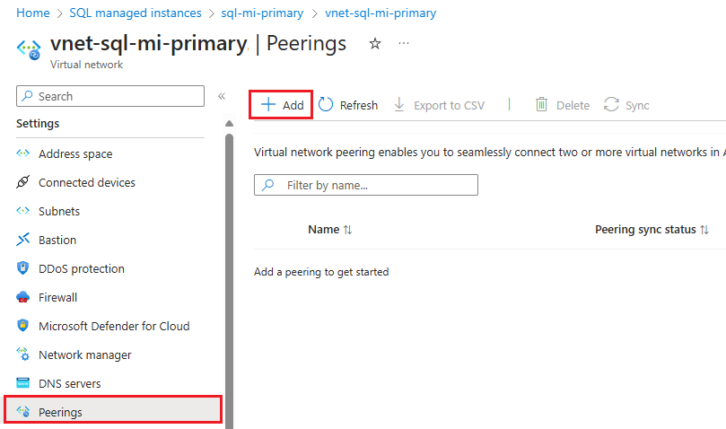
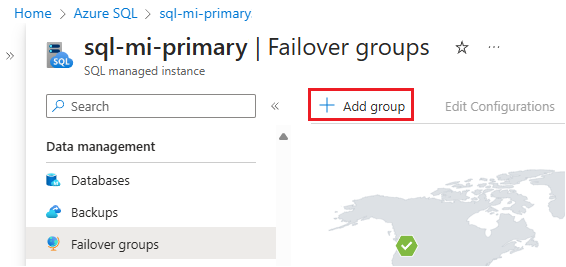
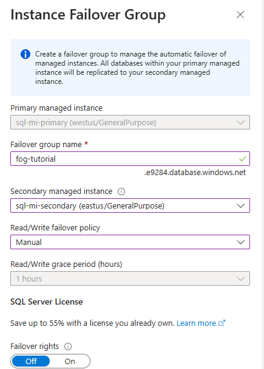
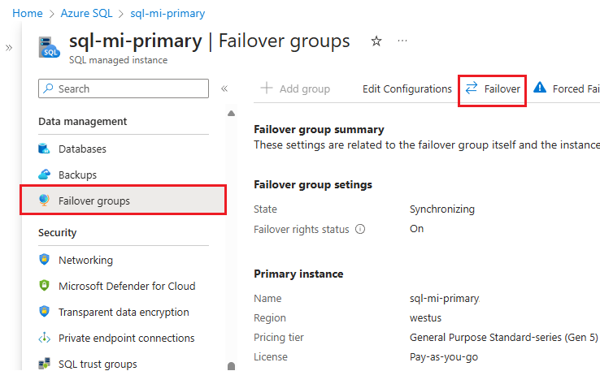
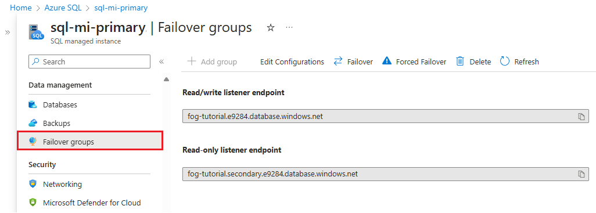

# Configure a failover group for Azure SQL Managed Instance
[!INCLUDE[appliesto-sqlmi](../includes/appliesto-sqlmi.md)]

> [!div class="op_single_selector"]
> * [Azure SQL Database](../database/failover-group-configure-sql-db.md?view=azuresql-db&preserve-view=true)
> * [Azure SQL Managed Instance](failover-group-configure-sql-mi.md?view=azuresql-mi&preserve-view=true)

This article teaches you how to configure a [failover group](failover-group-sql-mi.md) for Azure SQL Managed Instance using the Azure portal and Azure PowerShell. 

For an end-to-end PowerShell script to create both instances within a failover group, review [Add instance to a failover group](scripts/add-to-failover-group-powershell.md). 


## Prerequisites

Consider the following prerequisites:

- The secondary managed instance must be empty that is, contain no user databases.
- The two instances of SQL Managed Instance need to be the same service tier, and have the same storage size. While not required, it's strongly recommended that two instances have equal compute size, to make sure that secondary instance can sustainably process the changes being replicated from the primary instance, including the periods of peak activity.
- The IP address range for the virtual network of the primary instance must not overlap with the address range of the virtual network for the secondary managed instance, or any other virtual network peered with either the primary or secondary virtual network.
- When you create your secondary managed instance, you must specify the primary instance's DNS zone ID as the value of the `DnsZonePartner` parameter. If you don't specify a value for `DnsZonePartner`, the zone ID is generated as a random string when the first instance is created in each virtual network and the same ID is assigned to all other instances in the same subnet. Once assigned, the DNS zone can't be modified.
- Network Security Groups (NSG) rules on subnet hosting instance must have port 5022 (TCP) and the port range 11000-11999 (TCP) open inbound and outbound for connections from and to the subnet hosting the other managed instance. This applies to both subnets, hosting primary and secondary instance.
- The collation and time zone of the secondary managed instance must match that of the primary managed instance.
- Managed instances should be deployed in [paired regions](/azure/availability-zones/cross-region-replication-azure) for performance reasons. Managed instances residing in geo-paired regions benefit from a significantly higher geo-replication speed compared to unpaired regions.


### Address space range 

To check the address space of the primary instance, go to the virtual network resource for the primary instance and select **Address space** under **Settings**. Check the range under **Address range**: 

:::image type="content" source="media/failover-group-configure-sql-mi/verify-primary-address-range.png" alt-text="Screenshot of the address space for the primary virtual network in the Azure portal.":::

### Specify the primary instance's zone ID

When you create your secondary instance, you must specify the zone ID of the primary instance as the `DnsZonePartner`. 

#### [Portal](#tab/azure-portal)

If you're creating your secondary instance in the Azure portal, on the **Additional settings** tab, under **Geo-replication**, choose **Yes** to _Use as failover secondary_ and then select the primary instance from the drop-down: 

:::image type="content" source="media/failover-group-configure-sql-mi/secondary-mi-failover.png" alt-text="Screenshot of the Azure portal specifying the primary managed instance as a failover secondary on the additional settings page.":::

#### [PowerShell](#tab/azure-powershell)

If you're creating your secondary instance with Azure PowerShell, then be sure to provide the `DnsZonePartner` parameter with the zone ID of the primary instance. 

You can use the [Get-AzSqlInstance](/powershell/module/az.sql/get-azsqlinstance) command to parameterize the DNS zone ID of the primary instance, and then pass it to the `DnsZonePartner` parameter of the [New-AzSqlInstance](/powershell/module/az.sql/new-azsqlinstance) command: 

```powershell-interactive
# Get the DNS zone ID of the primary instance
$primaryManagedInstanceId = Get-AzSqlInstance -Name $primaryInstance -ResourceGroupName $resourceGroupName | Select-Object Id

# Create the secondary managed instance
New-AzSqlInstance -Name $secondaryInstance `
                  -ResourceGroupName $resourceGroupName `
                  -Location $drLocation `
                  -SubnetId $secondaryMiSubnetConfigId `
                  -AdministratorCredential $mycreds `
                  -StorageSizeInGB $maxStorage `
                  -VCore $vCores `
                  -Edition $edition `
                  -ComputeGeneration $computeGeneration `
                  -LicenseType $license `
                  -DnsZonePartner $primaryManagedInstanceId.Id
Write-host "Secondary SQL Managed Instance created successfully."
```

---


## Enabling connectivity between the instances

Connectivity between the virtual network subnets hosting primary and secondary instance must be established for uninterrupted geo-replication traffic flow.  There are multiple ways to establish connectivity between managed instances in different Azure regions, including:
 * [Global virtual network peering](/azure/virtual-network/virtual-network-peering-overview)
 * [Azure ExpressRoute](/azure/expressroute/expressroute-howto-circuit-portal-resource-manager)
 * VPN gateways

[Global virtual network peering](/azure/virtual-network/virtual-network-peering-overview) is **recommended** as the most performant and robust way to establish connectivity between instances in a failover group. Global virtual network peering provides a low-latency, high-bandwidth private connection between the peered virtual networks using the Microsoft backbone infrastructure. No public Internet, gateways, or additional encryption is required in the communication between the peered virtual networks. 

> [!IMPORTANT]
> Alternative ways of connecting instances that involve additional networking devices could complicate troubleshooting connectivity or replication speed issues, possibly requiring active involvement of network administrators, and potentially significantly prolonging resolution time. 

Regardless of the connectivity mechanism, there are requirements that must be fulfilled for geo-replication traffic to flow:

- Route table and network security groups assigned to managed instance subnets aren't shared across the two peered virtual networks.
- The Network Security Group (NSG) rules on the subnet hosting the **primary** instance allow:
  - **Inbound** traffic on port 5022 and port range 11000-11999 from the subnet hosting the secondary instance.
  - **Outbound** traffic on port 5022 and port range 11000-11999 to the subnet hosting the secondary instance.
- The Network Security Group (NSG) rules on the subnet hosting the **secondary** instance allow:
  - **Inbound** traffic on port 5022 and port range 11000-11999 from the subnet hosting the primary instance.
  - **Outbound** traffic on port 5022 and port range 11000-11999 to the subnet hosting the primary instance.
- IP address ranges of VNets hosting primary and secondary instance must not overlap.
- There's no indirect overlap of IP address ranges between the VNets hosting the primary and secondary instance, or other VNets they're peered with via local virtual network peering or other means.

Additionally, if you're using other mechanisms for providing connectivity between the instances than the recommended [global virtual network peering](/azure/virtual-network/virtual-network-peering-overview), you need to ensure the following:
- Any networking device used, like firewalls or network virtual appliances (NVAs), don't block traffic on the ports mentioned previously.
- Routing is properly configured, and asymmetric routing is avoided.
- If you deploy failover groups in a hub-and-spoke network topology cross-region, replication traffic should go directly between the two managed instance subnets rather than directed through the hub networks. It helps you avoid connectivity and replication speed issues.


# [Portal](#tab/azure-portal)

1. In the [Azure portal](https://portal.azure.com), go to the **Virtual network** resource for your primary managed instance. 
1. Select **Peerings** under *Settings* and then select + Add.



1. Enter or select values for the following settings:

   | Settings | Description |
    | -------- | ----------- |
    | **This virtual network** |  |
    | Peering link name | The name for the peering must be unique within the virtual network. |
    | Traffic to remote virtual network | Select **Allow (default)** to enable communication between the two virtual networks through the default `VirtualNetwork` flow. Enabling communication between virtual networks allows resources that are connected to either virtual network to communicate with each other with the same bandwidth and latency as if they were connected to the same virtual network. All communication between resources in the two virtual networks is over the Azure private network. |
    | Traffic forwarded from remote virtual network | Both **Allowed (default)** and **Block** option will work for this tutorial. For more information, see [Create a peering](/azure/virtual-network/virtual-network-manage-peering#create-a-peering)|
    | Virtual network gateway or Route Server | Select **None**. For more information about the other options available, see [Create a peering](/azure/virtual-network/virtual-network-manage-peering#create-a-peering). |
    | **Remote virtual network** |  |
    | Peering link name | The name of the same peering to be used in the virtual network hosting secondary instance. |
    | Virtual network deployment model | Select **Resource manager**. |
    | I know my resource ID | Leave this checkbox unchecked. |
    | Subscription | Select the Azure subscription of the virtual network hosting the secondary instance that you want to peer with. |
    | Virtual network | Select the virtual network hosting the secondary instance that you want to peer with. If the virtual network is listed, but grayed out, it may be because the address space for the virtual network overlaps with the address space for this virtual network. If virtual network address spaces overlap, they can't be peered.|
    | Traffic to remote virtual network | Select **Allow (default)** |
    | Traffic forwarded from remote virtual network | Both **Allowed (default)** and **Block** option will work for this tutorial. For more information, see [Create a peering](/azure/virtual-network/virtual-network-manage-peering#create-a-peering). |
    | Virtual network gateway or Route Server | Select **None**. For more information about the other options available, see [Create a peering](/azure/virtual-network/virtual-network-manage-peering#create-a-peering). |


1. Select **Add** to configure peering with the virtual network you selected. After a few seconds, select the **Refresh** button and the peering status will change from *Updating* to *Connected*.

   

# [PowerShell](#tab/azure-powershell)

Configure global virtual network peering between the virtual networks of the primary and secondary managed instances: 

:::code language="powershell" source="~/../azure_powershell_scripts/azure-sql/managed-instance/failover-groups/add-managed-instance-to-failover-group-az-ps.ps1" id="VNetPeering":::

This code snippet uses the following commands: 

| Command | Notes |
|---|---|
| 1. [Get-AzVirtualNetwork](/powershell/module/az.network/get-azvirtualnetwork) | Gets a virtual network in a resource group. |
| 2. [Add-AzVirtualNetworkPeering](/powershell/module/az.network/add-azvirtualnetworkpeering) | Adds a peering to a virtual network. | 
| 3. [Get-AzVirtualNetworkPeering](/powershell/module/az.network/get-azvirtualnetworkpeering) | Gets a peering for a virtual network. |


---

## Create the failover group

Create the failover group for your managed instances by using the Azure portal or PowerShell.

# [Portal](#tab/azure-portal)

Create the failover group for your SQL Managed Instances by using the Azure portal.

1. Select **Azure SQL** in the left-hand menu of the [Azure portal](https://portal.azure.com). If **Azure SQL** isn't in the list, select **All services**, then type Azure SQL in the search box. (Optional) Select the star next to **Azure SQL** to add it as a favorite item to the left-hand navigation.
1. Select the primary managed instance you want to add to the failover group.  
1. Under **Settings**, navigate to **Instance Failover Groups** and then choose to **Add group** to open the instance failover group creation page.

   

1. On the **Instance Failover Group** page, type the name of your failover group and then choose the secondary managed instance from the drop-down. Select **Create** to create your failover group.

   

1. Once failover group deployment is complete, you're taken back to the **Failover group** page.

# [PowerShell](#tab/azure-powershell)

Use [New-AzSqlDatabaseInstanceFailoverGroup](/powershell/module/az.sql/new-azsqldatabaseinstancefailovergroup) to create the failover group for your managed instances using PowerShell.

:::code language="powershell" source="~/../azure_powershell_scripts/azure-sql/managed-instance/failover-groups/add-managed-instance-to-failover-group-az-ps.ps1" id="CreateFailoverGroup":::


---


## Test failover

Test failover of your failover group using the Azure portal or PowerShell.

# [Portal](#tab/azure-portal)

Test failover of your failover group using the Azure portal.

1. Navigate to your _secondary_ managed instance within the [Azure portal](https://portal.azure.com) and select **Instance Failover Groups** under settings.
1. Note managed instances in the primary and in the secondary role. 
1. Select **Failover** and then select **Yes** on the warning about TDS sessions being disconnected.

   

1. Note managed instances in the primary and in the secondary role. If failover succeeded, the two instances should have switched roles.

   
   
> [!IMPORTANT]
> If roles didn't switch, check the connectivity between the instances and related NSG and firewall rules. Proceed with the next step only after roles switch.

1. Go to the new _secondary_ managed instance and select **Failover** once again to fail the primary instance back to the primary role.

# [PowerShell](#tab/azure-powershell)

Test planned failover by failing over to the secondary replica, and then failing back. 

 ### Verify the roles of each server

Use the [Get-AzSqlDatabaseInstanceFailoverGroup](/powershell/module/az.sql/get-azsqldatabaseinstancefailovergroup) command to confirm the roles of each server:

:::code language="powershell" source="~/../azure_powershell_scripts/azure-sql/managed-instance/failover-groups/add-managed-instance-to-failover-group-az-ps.ps1" id="CheckRole":::

### Fail over to the secondary server

Use the [Switch-AzSqlDatabaseFailoverGroup](/powershell/module/az.sql/switch-azsqldatabasefailovergroup) to fail over to the secondary server. 

:::code language="powershell" source="~/../azure_powershell_scripts/azure-sql/managed-instance/failover-groups/add-managed-instance-to-failover-group-az-ps.ps1" id="Failover":::

### Revert failover group back to the primary server

Use the [Switch-AzSqlDatabaseFailoverGroup](/powershell/module/az.sql/switch-azsqldatabasefailovergroup) command to fail back to the primary server.

:::code language="powershell" source="~/../azure_powershell_scripts/azure-sql/managed-instance/failover-groups/add-managed-instance-to-failover-group-az-ps.ps1" id="FailBack":::
### Verify the roles of each server

Use the [Get-AzSqlDatabaseFailoverGroup](/powershell/module/az.sql/get-azsqldatabasefailovergroup) command to confirm the roles of each server.

:::code language="powershell" source="~/../azure_powershell_scripts/azure-sql/database/failover-groups/add-single-db-to-failover-group-az-ps.ps1" id="CheckRole":::

### Fail over to the secondary server

Use the [Switch-AzSqlDatabaseFailoverGroup](/powershell/module/az.sql/switch-azsqldatabasefailovergroup) to fail over to the secondary server. 

:::code language="powershell" source="~/../azure_powershell_scripts/azure-sql/database/failover-groups/add-single-db-to-failover-group-az-ps.ps1" id="Failover":::

### Revert failover group back to the primary server

Use the [Switch-AzSqlDatabaseFailoverGroup](/powershell/module/az.sql/switch-azsqldatabasefailovergroup) command to fail back to the primary server.

:::code language="powershell" source="~/../azure_powershell_scripts/azure-sql/database/failover-groups/add-single-db-to-failover-group-az-ps.ps1" id="FailBack":::

---

## Locate listener endpoint

Once your failover group is configured, update the connection string for your application to the listener endpoint. It keeps your application connected to the failover group listener, rather than the primary database, elastic pool, or instance database. That way, you don't have to manually update the connection string every time your database entity fails over, and traffic is routed to whichever entity is currently primary.

The listener endpoint is in the form of `fog-name.database.windows.net`, and is visible in the Azure portal, when viewing the failover group:



## <a name="creating-a-failover-group-between-managed-instances-in-different-subscriptions"></a> Create group between instances in different subscriptions

You can create a failover group between SQL Managed Instances in two different subscriptions, as long as subscriptions are associated to the same [Microsoft Entra tenant](/azure/active-directory/fundamentals/active-directory-whatis#terminology). 

- When using PowerShell API, you can do it by specifying the `PartnerSubscriptionId` parameter for the secondary SQL Managed Instance. 
- When using REST API, each instance ID included in the `properties.managedInstancePairs` parameter can have its own Subscription ID.
- Azure portal doesn't support creation of failover groups across different subscriptions. 
  
> [!IMPORTANT]
> Azure portal does not support creation of failover groups across different subscriptions. For failover groups across different subscriptions and/or resource groups, failover can't be initiated manually via the Azure portal from the primary SQL managed instance. Initiate it from the geo-secondary instance instead.

## <a name="preventing-the-loss-of-critical-data"></a> Prevent loss of critical data

<!--
There is some overlap in the following content, be sure to update all that's necessary: 
/azure-sql/database/failover-group-configure-sql-db.md
/azure-sql/managed-instance/failover-configure-group-sql-mi.md
-->

Due to the high latency of wide area networks, geo-replication uses an asynchronous replication mechanism. Asynchronous replication makes the possibility of data loss unavoidable if the primary fails. To protect critical transactions from data loss, an application developer can call the [sp_wait_for_database_copy_sync](/sql/relational-databases/system-stored-procedures/sp-wait-for-database-copy-sync-transact-sql) stored procedure immediately after committing the transaction. Calling `sp_wait_for_database_copy_sync` blocks the calling thread until the last committed transaction has been transmitted and hardened in the transaction log of the secondary database. However, it doesn't wait for the transmitted transactions to be replayed (redone) on the secondary. `sp_wait_for_database_copy_sync` is scoped to a specific geo-replication link. Any user with the connection rights to the primary database can call this procedure.

> [!NOTE]
> `sp_wait_for_database_copy_sync` prevents data loss after geo-failover for specific transactions, but does not guarantee full synchronization for read access. The delay caused by a `sp_wait_for_database_copy_sync` procedure call can be significant and depends on the size of the not yet transmitted transaction log on the primary at the time of the call.

## Change the secondary region

Let's assume that instance A is the primary instance, instance B is the existing secondary instance, and instance C is the new secondary instance in the third region. To make the transition, follow these steps:

1. Create instance C with same size as A and in the same DNS zone.
2. Delete the failover group between instances A and B. At this point, attempts to sign in start to fail because the SQL aliases for the failover group listeners have been deleted and the gateway won't recognize the failover group name. The secondary databases are disconnected from the primaries and becomes read-write databases.
3. Create a failover group with the same name between instance A and C. Follow the instructions in [configure failover group guide](failover-group-configure-sql-mi.md). This is a size-of-data operation and completes when all databases from instance A are seeded and synchronized.
4. Delete instance B if not needed to avoid unnecessary charges.

> [!NOTE]
> After step 2 and until step 3 is completed the databases in instance A will remain unprotected from a catastrophic failure of instance A.

## Change the primary region 

Let's assume instance A is the primary instance, instance B is the existing secondary instance, and instance C is the new primary instance in the third region. To make the transition, follow these steps:

1. Create instance C with same size as B and in the same DNS zone.
2. Connect to instance B and manually failover to switch the primary instance to B. Instance A becomes the new secondary instance automatically.
3. Delete the failover group between instances A and B. At this point, sign in attempts using failover group endpoints start to fail. The secondary databases on A are disconnected from the primaries and become read-write databases.
4. Create a failover group with the same name between instance B and C. Follow the instructions in the [failover group guide](failover-group-configure-sql-mi.md). This is a size-of-data operation and completes when all databases from instance A are seeded and synchronized. At this point sign in attempts stop failing.
5. Manually fail over to switch the C instance to primary role. Instance B becomes the new secondary instance automatically.
6. Delete instance A if not needed to avoid unnecessary charges.

> [!CAUTION]
> After step 3 and until step 4 is completed the databases in instance A will remain unprotected from a catastrophic failure of instance A.

> [!IMPORTANT]
> When the failover group is deleted, the DNS records for the listener endpoints are also deleted. At that point, there's a non-zero probability of somebody else creating a failover group with the same name. Because failover group names must be globally unique, this will prevent you from using the same name again. To minimize this risk, don't use generic failover group names.

## Enable scenarios dependent on objects from the system databases

<!--
This section is duplicated in /managed-instance/failover-group-sql-mi.md. Please ensure changes are made to both documents. 
-->

System databases are **not** replicated to the secondary instance in a failover group. To enable scenarios that depend on objects from the system databases, make sure to create the same objects on the secondary instance and keep them synchronized with the primary instance. 

For example, if you plan to use the same logins on the secondary instance, make sure to create them with the identical SID. 

```SQL
-- Code to create login on the secondary instance
CREATE LOGIN foo WITH PASSWORD = '<enterStrongPasswordHere>', SID = <login_sid>;
``` 

To learn more, see [Replication of logins and agent jobs](https://techcommunity.microsoft.com/t5/modernization-best-practices-and/azure-sql-managed-instance-sync-agent-jobs-and-logins-in/ba-p/2860495). 

## Synchronize instance properties and retention policies instances

<!--
This section is duplicated in /managed-instance/failover-group-sql-mi.md. Please ensure changes are made to both documents. 
-->

Instances in a failover group remain separate Azure resources, and no changes made to the configuration of the primary instance will be automatically replicated to the secondary instance. Make sure to perform all relevant changes both on primary _and_ secondary instance. For example, if you change backup storage redundancy or long-term backup retention policy on primary instance, make sure to change it on secondary instance as well.

## Scaling instances

<!--
This section is duplicated in /managed-instance/failover-group-sql-mi.md.. Please ensure changes are made to both documents. 
-->

You can scale up or scale down the primary and secondary instance to a different compute size within the same service tier or to a different service tier. When scaling up within the same service tier, we recommend that you scale up the geo-secondary first, and then scale up the primary. When scaling down within the same service tier, reverse the order: scale down the primary first, and then scale down the secondary. When you scale instance to a different service tier, this recommendation is enforced.

The sequence is recommended specifically to avoid the problem where the geo-secondary at a lower SKU gets overloaded and must be reseeded during an upgrade or downgrade process.

## Permissions

Permissions for a failover group are managed via [Azure role-based access control (Azure RBAC)](/azure/role-based-access-control/overview). 

Azure RBAC write access is necessary to create and manage failover groups. The [SQL Managed Instance Contributor](/azure/role-based-access-control/built-in-roles#sql-managed-instance-contributor) role has all the necessary permissions to manage failover groups.

The following table lists specific permission scopes for Azure SQL Managed Instance: 

| **Action** | **Permission** | **Scope**|
| :---- | :---- | :---- | 
|**Create failover group**| Azure RBAC write access | Primary managed instance </br> Secondary managed instance|
| **Update failover group**| Azure RBAC write access | Failover group </br> All databases within the managed instance|
| **Fail over failover group** | Azure RBAC write access | Failover group on new primary managed instance |

## Limitations

Be aware of the following limitations:

- Failover groups can't be created between two instances in the same Azure region.
- Failover groups can't be renamed. You'll need to delete the group and re-create it with a different name.
- A failover group contains exactly two managed instances. Adding additional instances to the failover group is unsupported. 
- An instance can participate only in one failover group at any moment.
- A failover group can't be created between two instances belonging to different Azure tenants.
- A failover group between two instances belonging to different Azure subscriptions can't be created using Azure portal or Azure CLI. Use Azure PowerShell or REST API instead to create such a failover group. Once created, cross-subscription failover group is regularly visible in Azure portal and all subsequent operations including failovers can be initiated from Azure portal or Azure CLI. 
- Database rename isn't supported for databases in failover group. You'll need to temporarily delete failover group to be able to rename a database.
- System databases aren't replicated to the secondary instance in a failover group. Therefore, scenarios that depend on objects from the system databases such as Server Logins and Agent jobs, require objects to be manually created on the secondary instances and also manually kept in sync after any changes made on primary instance. The only exception is Service master Key (SMK) for SQL Managed Instance that is replicated automatically to secondary instance during creation of failover group. Any subsequent changes of SMK on the primary instance however won't be replicated to secondary instance. To learn more, see how to [Enable scenarios dependent on objects from the system databases](#enable-scenarios-dependent-on-objects-from-the-system-databases).
- Failover groups can't be created between instances if any of them are in an instance pool.

## <a id="programmatically-managing-failover-groups"></a> Programmatically manage failover groups

Failover groups can also be managed programmatically using Azure PowerShell, Azure CLI, and REST API. The following tables describe the set of commands available. Failover groups include a set of Azure Resource Manager APIs for management, including the [Azure SQL Database REST API](/rest/api/sql/) and [Azure PowerShell cmdlets](/powershell/azure/). These APIs require the use of resource groups and support Azure role-based access control (Azure RBAC). For more information on how to implement access roles, see [Azure role-based access control (Azure RBAC)](/azure/role-based-access-control/overview).

# [PowerShell](#tab/azure-powershell-manage)

| Cmdlet | Description |
| --- | --- |
| [New-AzSqlDatabaseInstanceFailoverGroup](/powershell/module/az.sql/new-azsqldatabaseinstancefailovergroup) |This command creates a failover group and registers it on both primary and secondary instances|
| [Set-AzSqlDatabaseInstanceFailoverGroup](/powershell/module/az.sql/set-azsqldatabaseinstancefailovergroup) |Modifies configuration of a failover group|
| [Get-AzSqlDatabaseInstanceFailoverGroup](/powershell/module/az.sql/get-azsqldatabaseinstancefailovergroup) |Retrieves a failover group's configuration|
| [Switch-AzSqlDatabaseInstanceFailoverGroup](/powershell/module/az.sql/switch-azsqldatabaseinstancefailovergroup) |Triggers failover of a failover group to the secondary instance|
| [Remove-AzSqlDatabaseInstanceFailoverGroup](/powershell/module/az.sql/remove-azsqldatabaseinstancefailovergroup) | Removes a failover group|

# [Azure CLI](#tab/azure-cli-manage)

| Command | Description |
| --- | --- |
| [az sql instance-failover-group create](/cli/azure/sql/instance-failover-group#az-sql-instance-failover-group-create) |This command creates a failover group and registers it on both primary and secondary servers|
| [az sql instance-failover-group delete](/cli/azure/sql/instance-failover-group#az-sql-instance-failover-group-delete) | Removes a failover group from the server |
| [az sql instance-failover-group show](/cli/azure/sql/instance-failover-group#az-sql-instance-failover-group-show) | Retrieves a failover group configuration |
| [az sql instance-failover-group update](/cli/azure/sql/instance-failover-group#az-sql-instance-failover-group-update) |Modifies a failover group's configuration  and/or adds one or more databases to a failover group|
| [az sql instance-failover-group set-primary](/cli/azure/sql/instance-failover-group#az-sql-instance-failover-group-set-primary) | Triggers failover of a failover group to the secondary server |

# [REST API](#tab/rest-api-manage)

| API | Description |
| --- | --- |
| [Create or Update Failover Group](/rest/api/sql/instance-failover-groups/create-or-update) | Creates or updates a failover group's configuration |
| [Delete Failover Group](/rest/api/sql/instance-failover-groups/delete) | Removes a failover group from the instance |
| [Failover (Planned)](/rest/api/sql/instance-failover-groups/failover) | Triggers failover from the current primary instance to this instance with full data synchronization. |
| [Force Failover Allow Data Loss](/rest/api/sql/instance-failover-groups/force-failover-allow-data-loss) | Triggers failover from the current primary instance to the secondary instance without synchronizing data. This operation may result in data loss. |
| [Get Failover Group](/rest/api/sql/instance-failover-groups/get) | retrieves a failover group's configuration. |
| [List Failover Groups - List By Location](/rest/api/sql/instance-failover-groups/list-by-location) | Lists the failover groups in a location. |

---


## Next steps

For steps configuring a failover group, see the [Add a managed instance to a failover group](failover-group-configure-sql-mi.md) guide. 

For an overview of the feature, see [Failover groups](failover-group-sql-mi.md). To learn how to save on licensing costs, see [Configure standby replica](failover-group-standby-replica-how-to-configure.md). 
