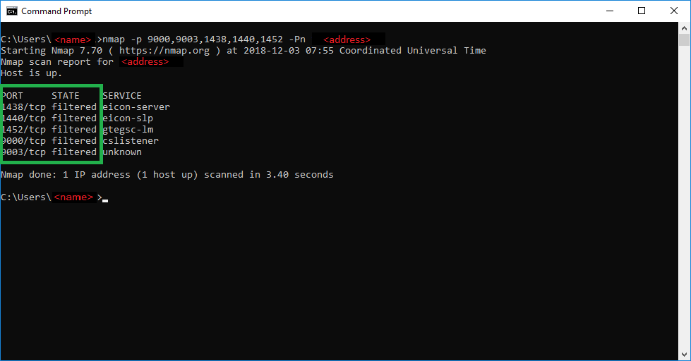

# Verify the Azure SQL Managed Instance built-in firewall

The Azure SQL Managed Instance [mandatory inbound security rules](connectivity-architecture-overview.md#mandatory-inbound-security-rules) require management ports 9000, 9003, 1438, 1440, 1452 to be open from **Any source** on the Network Security Group (NSG) that protects the SQL Managed Instance. Although these ports are open at the NSG level, they are protected at the network level by the built-in firewall.

## Verify firewall

To verify these ports, use any security scanner tool to test these ports. The following screenshot shows how to use one of these tools.

## Next steps

For more information about SQL Managed Instances and connectivity, see [Azure SQL Database Managed Instance Connectivity Architecture](connectivity-architecture-overview.md).