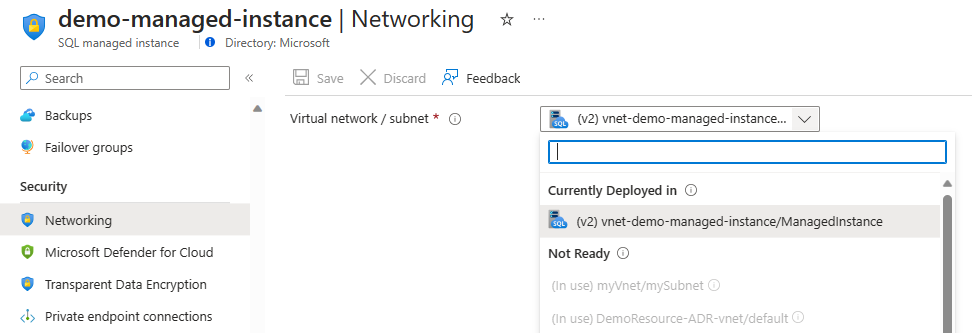
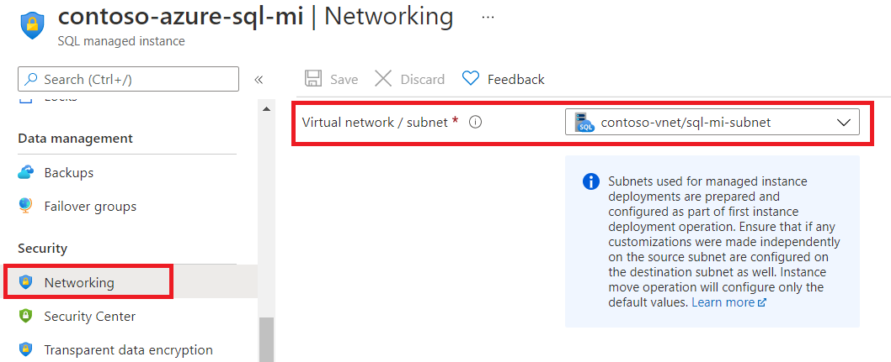
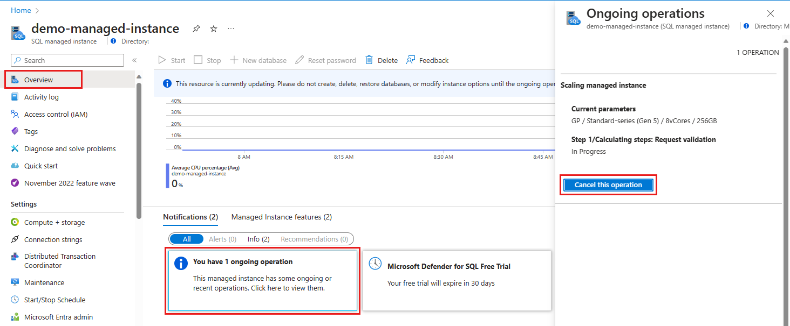

# Move Azure SQL Managed Instance across subnets
[!INCLUDE[appliesto-sqlmi](../includes/appliesto-sqlmi.md)]

Azure SQL Managed Instance must be deployed inside a dedicated subnet within an Azure [virtual network](../../virtual-network/virtual-networks-overview.md). The number of managed instances that can be deployed within the subnet depends on the size of the subnet (subnet range).

This article teaches you to move your managed instance from one subnet to another, similar to scaling vCores or changing the instance service tier. SQL Managed Instance is available during the move, except during a short downtime caused by a failover at the end of the update - typically lasing up to 10 seconds, even if long-running transactions are interrupted. 

Moving the instance to another subnet triggers the following virtual cluster operations:
- The destination subnet builds out or resizes the virtual cluster.
- The virtual cluster is removed or defragmented in the source subnet. 

Before moving your instance to another subnet, consider familiarizing yourself with the following concepts: 
- [Determine required subnet size and range for Azure SQL Managed Instance](vnet-subnet-determine-size.md).
- Choose between moving the instance to a [new subnet](virtual-network-subnet-create-arm-template.md) or [using an existing subnet](vnet-existing-add-subnet.md).
- Use [management operations](management-operations-overview.md) to automatically deploy new managed instances, update instance properties, or delete instances. It's possible to [monitor](management-operations-monitor.md) these management operations. 


## Requirements and limitations 

To deploy a managed instance, or move it to another subnet, the destination subnet must have certain [network requirements](connectivity-architecture-overview.md#service-aided-subnet-configuration).

### Subnet readiness 

Before you move your managed instance, confirm the subnet is **Ready for Managed Instance**. 

In the **Virtual network** UI of the Azure portal, virtual networks that meet the prerequisites for a managed instance are categorized as **Ready for Managed Instance**. Virtual networks that have subnets with managed instances already deployed to them display an icon before the virtual network name. Empty subnets that are ready for a managed instance do not have an icon. 

Subnets that are marked as **Other** are empty and can be used for a managed instance, but may be automatically adjusted as part of the instance deployment process. These adjustments apply to both creating new instance and moving existing instance operations.  

Subnets marked as **Invalid** cannot be used for new or existing managed instances, either because they're already in use (instances used for instance deployments cannot contain other resources), or the subnet has a different DNS zone (a cross-subnet instance move limitation). 

> [!div class="mx-imgBorder"]
> 


Depending on the subnet state and designation, the following adjustments may be made to the destination subnet: 

- **Ready for Managed Instance (contains existing SQL Managed Instance)**: No adjustments are made. These subnets already contain managed instances, and making any change to the subnet could impact existing instances. 
- **Ready for Managed Instance (empty)**: The workflow validates all the required rules in the network security group and adds any rules that are necessary but missing. Depending on the instance configuration (public endpoint, connection type for private endpoint), extra rules may be deployed.
- **Other**: The subnet is prepared and all relevant rules are created according to the [network requirements](connectivity-architecture-overview.md#service-aided-subnet-configuration).


((((the following is the previous text for comparison - should delete if above is an adequate rewrite)))) 

Depending on the configuration of the subnet and resources deployed inside it, subnets are divided into the three groups:
- Ready for Managed Instance - these subnets fullfil all network requirements. There are two subtypes of ready subnets:
  - With SQL Managed Instance inside - these subnets have SQL Managed Instance icon in front.
  - Empty subnet - without icon in front.
- Other - These subnets are empty and can be used, but as a part of instance deployment process they will be adjusted. This adjustment applies for both scenarios, new instance creation or moving the existing instance.
- Invalid - These subnets don't fullfil the requirements. Prefixes that explain which requirement is missing are added in front of the subnet name:
  - In use - subnet has some other resource deployed. Instances used for instance deployments cannot contain other resources.
  - DNS - subnet has different DNS zone (cross-subnet instance move limitation).


### Destination subnet limitations 

Consider the following limitations when choosing a destination subnet for an existing instance: 

- The destination subnet must be in the same virtual network as the source subnet. 
- The DNS zone of the destination subnet must match the DNS zone of the source subnet as changing the DNS zone of a managed instance is not currently supported. 
- Instances running on Gen4 hardware must be upgraded to a newer hardware generation before moving to another subnet since Gen4 is deprecated. 


## Operation steps

The following table details the operation steps that occur during the instance move operation: 

|Step name  |Step description  |
|----|---------|
|Request validation |Validates the submitted parameters. If a misconfiguration is detected, the operation fails with an error. |
|Virtual cluster resizing / creation |Depending on the state of the destination subnet, the virtual cluster is either created or resized.  |
|New instance startup |The SQL process starts on the deployed virtual cluster in the destination subnet. |
|Seeding database files / attaching database files |Depending on the service tier, either the database is seeded or the database files are attached. |
|Preparing failover and failover |After data has been seeded or database files reattached, the system prepares for failover. When everything is ready, the system performs a failover **with a short downtime**, usually less than 10 seconds.  |
|Old SQL instance cleanup |Removes the old SQL process from the source virtual cluster.  |
|Virtual cluster deletion |The final step deletes the virtual cluster synchronously from the source subnet, if it's the last instance within the subnet. |

A detailed explanation of the operation steps can be found in the [overview of Azure SQL Managed Instance management operations](management-operations-overview.md#management-operations-steps)

## Move the instance

A cross-subnet instance move is part of the instance update operation. Existing instance update API, Azure PowerShell, and Azure CLI commands have been enhanced with a subnet ID property. 

In the Azure portal, use the subnet field on the **Networking** blade to move the instance to the destination subnet. When using Azure PowerShell or the Azure CLI, provide a different subnet ID in the update command to move the instance from an existing subnet to the destination subnet. 

For a full reference of instance management commands, see [Management API reference for Azure SQL Managed Instance](api-references-create-manage-instance.md). 

# [Portal](#tab/azure-portal)

The option to choose the instance subnet is located on the **Networking** blade of the Azure portal. The instance move operation starts when you select a subnet and save your changes. 

The first step of the move operation is to prepare the destination subnet for deployment, which may take several minutes. Once the subnet is ready, the instance move management operation starts and becomes visible in the Azure portal. 


> [!div class="mx-imgBorder"]
> 


Monitor instance move operations from the **Overview** blade of the Azure portal. Select the notification to open an additional blade containing information about the current step, the total steps, and a button to cancel the operation. 

> [!div class="mx-imgBorder"]
> 


# [PowerShell](#tab/azure-powershell)

Use the Azure PowerShell command [Set-AzSqlInstance](/powershell/module/az.sql/set-azsqlinstance) to move an instance after you create your subnet in the same virtual network as your destination subnet.  If you want to use an existing subnet, provide that subnet name in the PowerShell command.

The example PowerShell commands in this section prepare the destination subnet for instance deployment and move the managed instance. 


Use the following PowerShell command to specify your parameters: 

```powershell-interactive
### PART 1 - DEFINE PARAMETERS
#Generating basic parameters
$currentSubscriptionID = 'subscription-id'
$sqlMIResourceGroupName = 'resource-group-name-of-sql-mi'
$sqlMIName = 'sql-mi-name'
$sqlMIResourceVnetName = 'vnet-name-of-sql-mi'
$destinationSubnetName = 'name-of-the-destination-subnet-for-sql-mi'
```

Skip this command if your subnet already has instances deployed to it. If you are using a new subnet, use the following PowerShell command to prepare your subnet: 

```powershell-interactive
### PART 2 - PREPARE DESTINATION SUBNET
#Loading the url of script used for preparing the subnet for SQL MI deployment
$scriptUrlBase = 'https://raw.githubusercontent.com/Microsoft/sql-server-samples/master/samples/manage/azure-sql-db-managed-instance/delegate-subnet'
#Generating destination subnet parameters
$parameters = @{
    subscriptionId = $currentSubscriptionID
    resourceGroupName = $sqlMIResourceGroupName
    virtualNetworkName = $sqlMIResourceVnetName
    subnetName = $destinationSubnetName
}
#Initiating subnet prepartion script
Invoke-Command -ScriptBlock ([Scriptblock]::Create((iwr ($scriptUrlBase+'/delegateSubnet.ps1?t='+ [DateTime]::Now.Ticks)).Content)) -ArgumentList $parameters
```

> [!Note]
> To learn more about the script that prepares the subnet, see [Configure an existing virtual network for Azure SQL Managed Instance](vnet-existing-add-subnet.md). 

The following PowerShell command moves the instance to the source subnet: 

```powershell-interactive
### PART 3 - MOVE INSTANCE TO THE NEW SUBNET
Set-AzSqlInstance -Name $sqlMIName -ResourceGroupName $sqlMIResourceGroupName `
-SubnetId "/subscriptions/$currentSubscriptionID/resourceGroups/$sqlMIResourceGroupName/providers/Microsoft.Network/virtualNetworks/$sqlMIResourceVnetName/subnets/$destinationSubnetName"
```

The following PowerShell command moves the instance, and also provides a way to monitor progress: 

```powershell-interactive
###PART 3 EXTENDED - MOVE INSTANCE AND MONITOR PROGRESS
# Extend the Set-AzSqlInstance command with -AsJob -Force parameters to be able to monitor the progress or proceed with script execution as moving the instance to another subnet is long running operation 
Set-AzSqlInstance -Name $sqlMIName -ResourceGroupName $sqlMIResourceGroupName `
-SubnetId "/subscriptions/$currentSubscriptionID/resourceGroups/$sqlMIResourceGroupName/providers/Microsoft.Network/virtualNetworks/$sqlMIResourceVnetName/subnets/$destinationSubnetName" -AsJob -Force
$operationProgress = Get-AzSqlInstanceOperation -ManagedInstanceName $sqlMIName -ResourceGroupName $sqlMIResourceGroupName
#checking the operation step status
Write-Host "Checking the ongoing step" -ForegroundColor Yellow
$operationProgress.OperationSteps.StepsList
```


# [Azure CLI](#tab/azure-cli)

Use the Azure CLI [az sql mi update](/cli/azure/sql/mi#az_sql_mi_update) command to move your instance to another subnet. 

Provide the destination by either specifying the subnet ID as the `--subnet` property, or by specifying the virtual network name as the `--vnet-name` property, and subnet name as the `--subnet` property. 

The following example moves the managed instance to another subnet by specifying the subnet ID: 


```azurecli-interactive
az sql mi update -g myResourceGroup -n mySqlManagedInstance --subnet /subscriptions/xxxxxxx-xxxx-xxxx-xxxx-xxxxxxxxxxxx/resourceGroups/myResourceGroup/providers/Microsoft.Network/virtualNetworks/myVirtualNetworkName/subnets/destinationSubnetName
```

The following example moves the managed instance to another subnet by specifying the virtual network name and subnet name:

```azurecli-interactive
az sql mi update -g myResourceGroup -n mySqlManagedInstance --vnet-name myVirtualNetworkName --subnet destinationSubnetName
```

Use the following command to monitor the progress of the management operation: 

```azurecli-interactive
az sql mi op list -g myResourceGroup --mi mySqlManagedInstance
```
---

## Next steps

- To learn how to create your first managed instance, see [Quickstart guide](instance-create-quickstart.md).
- For a features and comparison list, see [common SQL features](../database/features-comparison.md).
- For more information about VNet configuration, see [SQL Managed Instance VNet configuration](connectivity-architecture-overview.md).
- For a quickstart that creates a managed instance and restores a database from a backup file, see [Create a managed instance](instance-create-quickstart.md).
- For a tutorial about using Azure Database Migration Service for migration, see [SQL Managed Instance migration using Database Migration Service](../../dms/tutorial-sql-server-to-managed-instance.md).
