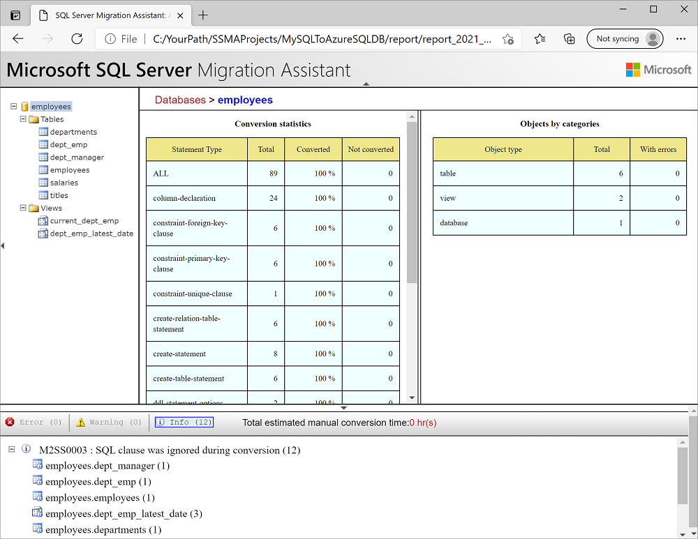
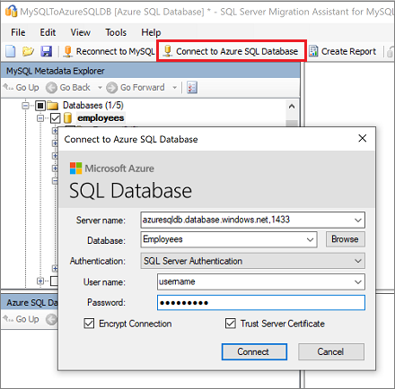
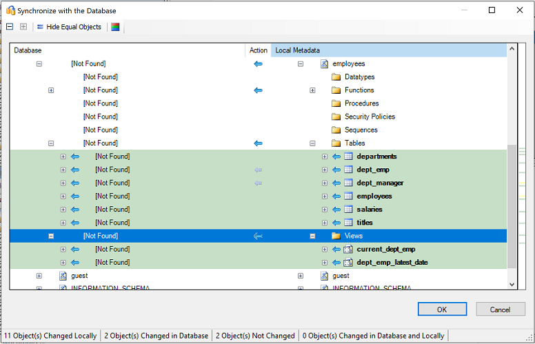
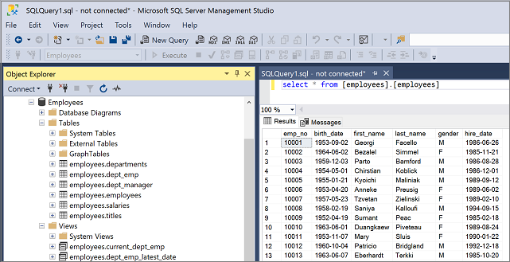

# Migration guide:  MySQL to Azure SQL Database
[!INCLUDE[appliesto-sqldb-sqlmi](../../includes/appliesto-sqldb.md)]

This guide teaches you to migrate your MySQL database to Azure SQL Database. 

For other migration guides, see [Database Migration](https://docs.microsoft.com/data-migration/). 

## Prerequisites

To migrate your MySQL database to Azure SQL Database, you need:

- to verify your source environment is supported. Currently, MySQL 5.6 and 5.7 is supported. 
- [SQL Server Migration Assistant for MySQL](https://www.microsoft.com/download/confirmation.aspx?id=54257)

## Pre-migration 

After you have met the prerequisites, you are ready to discover the topology of your environment and assess the feasibility of your migration.

### Assess 

By using [SQL Server Migration Assistant for MySQL](https://www.microsoft.com/download/confirmation.aspx?id=54257), you can review database objects and data, and assess databases for migration.

To create an assessment, perform the following steps.

1. Open SQL Server Migration Assistant for MySQL. 
1. Select **File** from the menu and then choose **New Project**. Provide the project name, a location to save your project.
1. Choose **Azure SQL Database** as the migration target. 

   

1. Choose **Connect to MySQL** and provide connection details to connect your MySQL server. 

   

1. Right-click the MySQL schema in **MySQL Metadata Explorer** and choose **Create report**. Alternatively, you can select **Create report** from the top-line navigation bar. 

   

1. Review the HTML report for conversion statistics, as well as errors and warnings. Analyze it to understand conversion issues and resolutions. 

   

   This report can also be accessed from the SSMA projects folder as selected in the first screen. From the example above locate the report.xml file from:
 
   `drive:\Users\<username>\Documents\SSMAProjects\MySQLMigration\report\report_2016_11_12T02_47_55\`
 
   and open it in Excel to get an inventory of MySQL objects and the effort required to perform schema conversions.

### Validate data types

Before you perform schema conversion validate the default datatype mappings or change them based on requirements. You could do so either by navigating to the "Tools" menu and choosing "Project Settings" or you can change type mapping for each table by selecting the table in the "MySQL Metadata Explorer".
 
   

### Convert schema 

To convert the schema, follow these steps: 

1. (Optional) To convert dynamic or ad-hoc queries, right-click the node and choose **Add statement**. 
1. Choose **Connect to Azure SQL Database** from the top-line navigation bar and provide connection details. You can choose to connect to an existing database or provide a new name, in which case a database will be created on the target server.

   
 
1. Right-click the schema and choose **Convert schema**. 

   

1. After the schema is finished converting, compare and review the structure of the schema to identify potential problems. 

   

## Migrate 

After you have completed assessing your databases and addressing any discrepancies, the next step is to execute the migration process. Migration involves two steps – publishing the schema and migrating the data. SSMA for MySQL is the correct tool to use for this process.

To publish the schema and migrate the data, follow these steps: 

1. Right-click the database from the **Azure SQL Database Metadata Explorer** and choose **Synchronize with Database**. This action publishes the MySQL schema to Azure SQL Database.

   

   

1. Right-click the MySQL schema from the **MySQL Metadata Explorer** and choose **Migrate Data**. Alternatively, you can select **Migrate Data** from the top-line navigation. 

1. Provide connection details for MySQL and Azure SQL Database at the dialog box. 
1. After migration completes, view the **Data Migration** report: 

   

1.  Validate the migration by reviewing the data and schema on Azure SQL Database by using SQL Server Management Studio (SSMS).

    

> [!NOTE] 
> If you are interested in participating in a Private preview of a one-time migration for MySQL to Azure SQL Database using the Azure Database Migration Service, submit a nomination [here](https://aka.ms/dms-preview).

## Post-migration 

After you have successfully completed the **Migration** stage, you need to go through a series of post-migration tasks to ensure that everything is functioning as smoothly and efficiently as possible.

### Remediate applications

After the data is migrated to the target environment, all the applications that formerly consumed the source need to start consuming the target. Accomplishing this will in some cases require changes to the applications.

### Perform tests

The test approach for database migration consists of performing the following activities:

1. **Develop validation tests**. To test database migration, you need to use SQL queries. You must create the validation queries to run against both the source and the target databases. Your validation queries should cover the scope you have defined.

2. **Set up test environment**. The test environment should contain a copy of the source database and the target database. Be sure to isolate the test environment.

3. **Run validation tests**. Run the validation tests against the source and the target, and then analyze the results.

4. **Run performance tests**. Run performance test against the source and the target, and then analyze and compare the results.

> [!NOTE]
> For assistance with developing and running post-migration validation tests, consider the Data Quality Solution available from the partner [QuerySurge](http://www.querysurge.com/company/partners/microsoft).

### Optimize

The post-migration phase is crucial for reconciling any data accuracy issues and verifying completeness, as well as addressing performance issues with the workload.

For additional detail about these issues and specific steps to mitigate them, see the [Post-migration Validation and Optimization Guide](https://docs.microsoft.com/sql/relational-databases/post-migration-validation-and-optimization-guide).

## Migration assets

For additional assistance with completing this migration scenario, please see the following resources, which were developed in support of a real-world migration project engagement.

| Title/link     | Description    |
| ---------------------------------------------- | ---------------------------------------------------- |
| [Data Workload Assessment Model and Tool](https://github.com/Microsoft/DataMigrationTeam/tree/master/Data%20Workload%20Assessment%20Model%20and%20Tool) | This tool provides suggested “best fit” target platforms, cloud readiness, and application/database remediation level for a given workload. It offers simple, one-click calculation and report generation that greatly helps to accelerate large estate assessments by providing and automated and uniform target platform decision process. |

These resources were developed as part of the Data Migration Jumpstart Program (DM Jumpstart), which is sponsored by the Azure Data Group engineering team. The core charter DM Jumpstart is to unblock and accelerate complex modernization and compete data platform migration opportunities to Microsoft’s Azure Data platform. If you think your organization would be interested in participating in the DM Jumpstart program, please contact your account team and ask that they submit a nomination.

## Next steps 

- Be sure to check out the [Azure Total Cost of Ownership (TCO) Calculator](https://aka.ms/azure-tco) to help estimate the cost savings you can realize by migrating your workloads to Azure.

- For a matrix of the Microsoft and third-party services and tools that are available to assist you with various database and data migration scenarios as well as specialty tasks, see the article [Service and tools for data migration](https://docs.microsoft.com/azure/dms/dms-tools-matrix).

- For other migration guides, see [Database Migration](https://datamigration.microsoft.com/). 

For videos, see: 
- [How to Use the Database Migration Guide](https://azure.microsoft.com/resources/videos/how-to-use-the-azure-database-migration-guide/)
- [Overview of the migration journey and the tools/services recommended for performing assessment and migration](https://azure.microsoft.com/resources/videos/overview-of-migration-and-recommended-tools-services/)
