# Migration guide: Oracle to Azure SQL Database
[!INCLUDE[appliesto-sqldb-sqlmi](../../includes/appliesto-sqldb.md)]

This guide teaches you to migrate your Oracle schemas to Azure SQL Database using SQL Server Migration Assistant for Oracle.

For other migration guides, see [Database Migration](https://datamigration.microsoft.com/). 

## Prerequisites

To migrate your Oracle schema to SQL Database you need: 

- To verify your source environment is supported. 
- To download [SQL Server Migration Assistant (SSMA) for Oracle](https://www.microsoft.com/en-us/download/details.aspx?id=54258). 
- A target [Azure SQL Database](../../database/single-database-create-quickstart.md). 
- The [necessary permissions for SSMA for Oracle](/sql/ssma/oracle/connecting-to-oracle-database-oracletosql) and [provider](/sql/ssma/oracle/connect-to-oracle-oracletosql).
 

## Pre-migration

After you have met the prerequisites, you are ready to discover the topology of your environment and assess the feasibility of your migration. This part of the process involves conducting an inventory of the databases that you need to migrate, assessing those databases for potential migration issues or blockers, and then resolving any items you might have uncovered.

### Assess 

Use the SQL Server Migration Assistant (SSMA) for Oracle to review database objects and data, assess databases for migration, migrate database objects to Azure SQL Database, and then finally migrate data to the database. 

To create an assessment, follow these steps: 

1. Open [SQL Server Migration Assistant for Oracle](https://www.microsoft.com/en-us/download/details.aspx?id=54258). 
1. Select **File** and then choose **New Project**. 
1. Provide a project name, a location to save your project, and then select Azure SQL Database as the migration target from the drop-down. Select **OK**.

   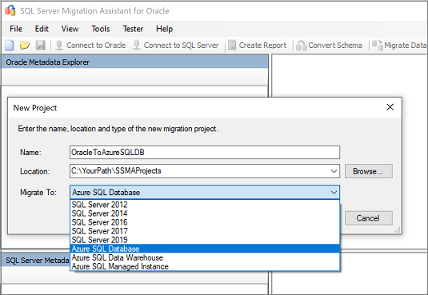

1. Select **Connect to Oracle**. Enter in values for Oracle connection details on the **Connect to Oracle** dialog box.

   

   Select the Oracle schema(s) you want to migrate: 

   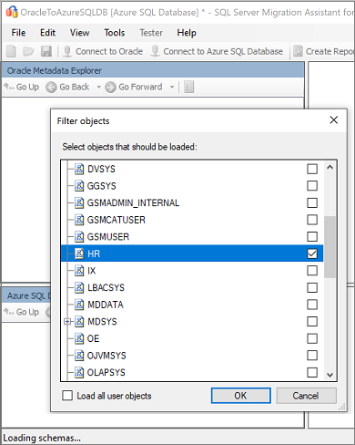

1. Right-click the Oracle schema you want to migrate in the **Oracle Metadata Explorer**, and then choose **Create report**. This will generate an HTML report. Alternatively, you can choose **Create report** from the navigation bar after selecting the database.

   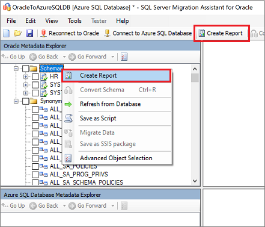

1. Review the HTML report to understand conversion statistics and any errors or warnings. You can also open the report in Excel to get an inventory of Oracle objects and the effort required to perform schema conversions. The default location for the report is in the report folder within SSMAProjects.

   For example: `drive:\<username>\Documents\SSMAProjects\MyOracleMigration\report\report_2020_11_12T02_47_55\`

   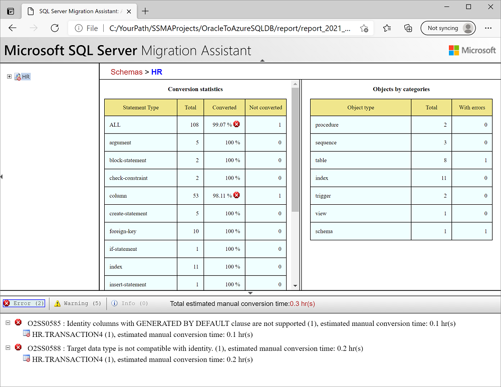 

### Validate data types

Validate the default data type mappings and change them based on requirements if necessary. To do so, follow these steps:

1. Select **Tools** from the menu. 
1. Select **Project Settings**. 
1. Select the **Type mappings** tab. 

   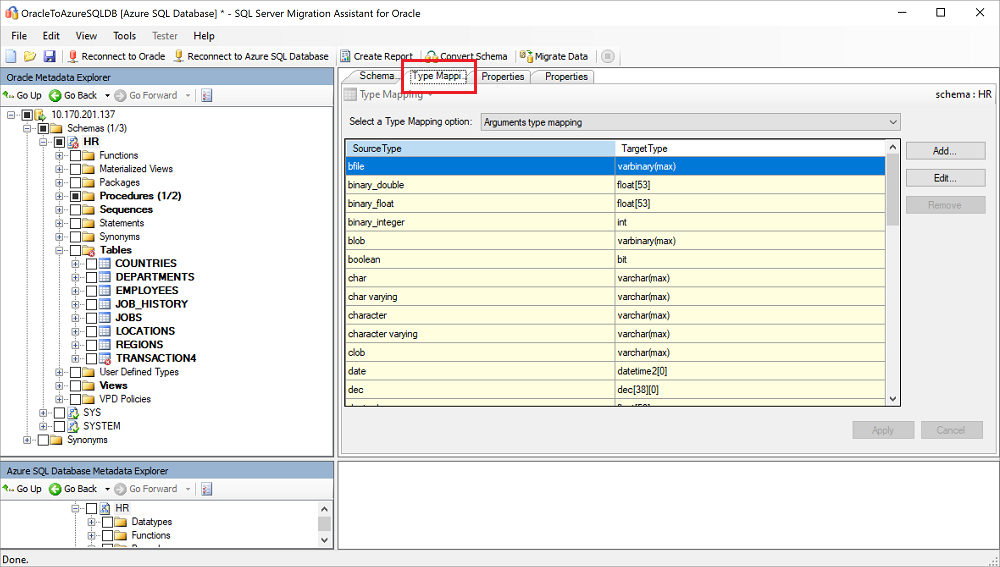

1. You can change the type mapping for each table by selecting the table in the **Oracle Metadata Explorer**.

### Convert schema

To convert the schema, follow these steps: 

1. (Optional) Add dynamic or ad-hoc queries to statements. Right-click the node, and then choose **Add statements**.
1. Select **Connect to Azure SQL Database**. 
    1. Enter connection details to connect your database in Azure SQL Database.
    1. Choose your target SQL Database from the drop-down.
    1. Select **Connect**.

    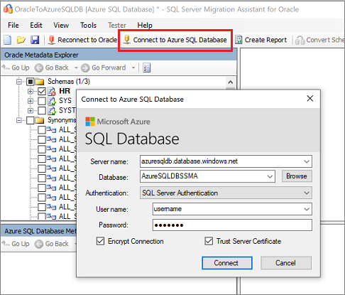

1. Right-click the Oracle schema in the **Oracle Meatadata Explorer** and then choose **Convert Schema**. Alternatively, you can choose **Convert Schema** from the top navigation bar after selecting your schema.

   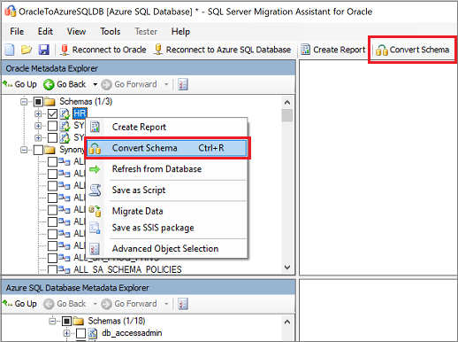

1. After the conversion completes, compare and review the converted objects to the original objects to identify potential problems and address them based on the recommendations.

   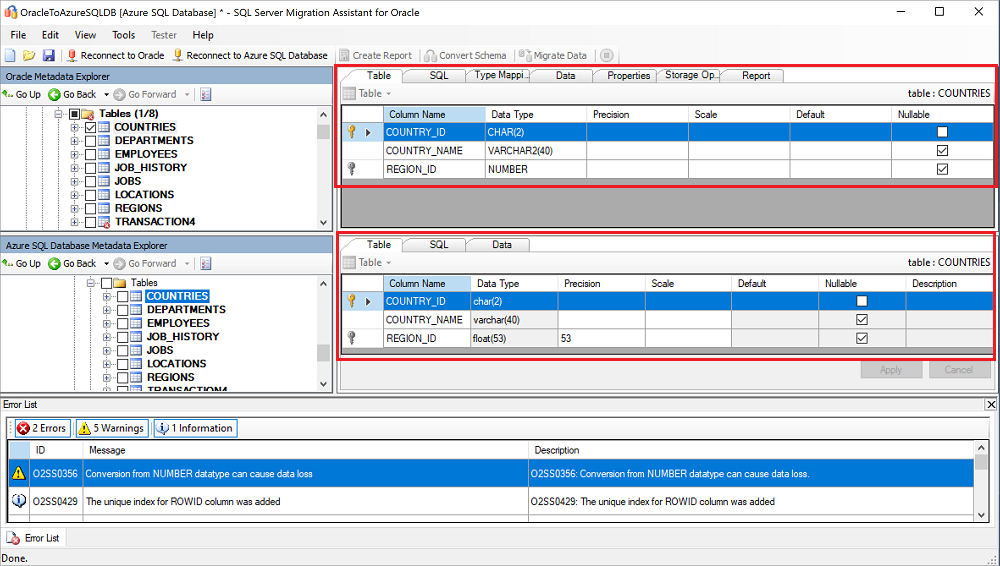

   Compare the converted Transact-SQL text to the original stored procedures and review the recommendations. 

   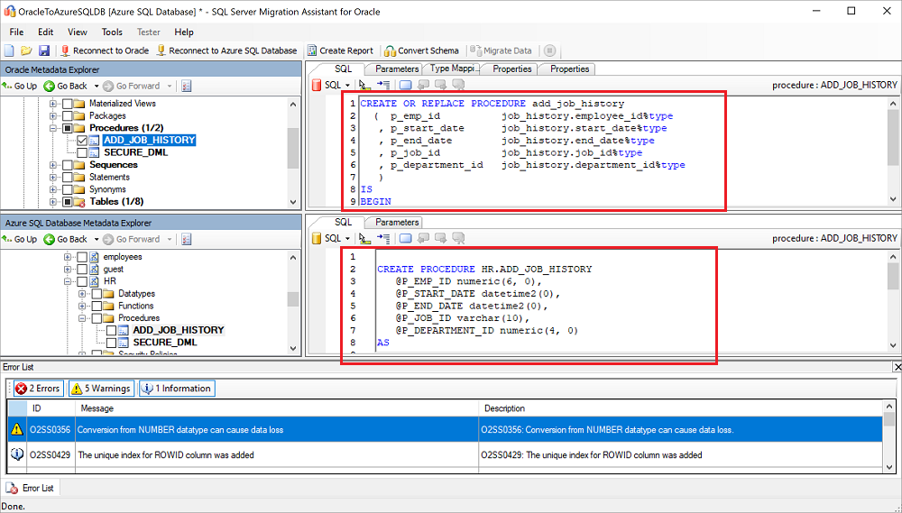

1. Save the project locally for an offline schema remediation exercise. Select **Save Project** from the **File** menu.

## Migrate

After you have completed assessing your databases and addressing any discrepancies, the next step is to execute the migration process. Migration involves two steps – publishing the schema and migrating the data. 

To publish your schema and migrate your data, follow these steps:

1. Publish the schema: Right-click the database from the **Databases** node in the **Azure SQL Database Metadata Explorer** and choose **Synchronize with Database**.

   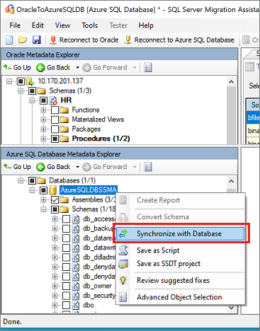

   Review the mapping between your source project and your target:

   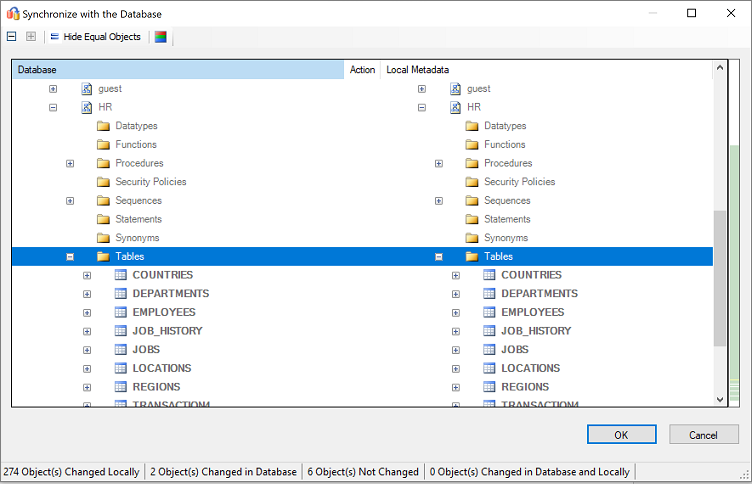

1. Migrate the data: Right-click the schema from the **Oracle Metadata Explorer** and choose **Migrate Data**. Alternatively, you can choose **Migrate Data** from the top line navigation bar after selecting the schema. 

   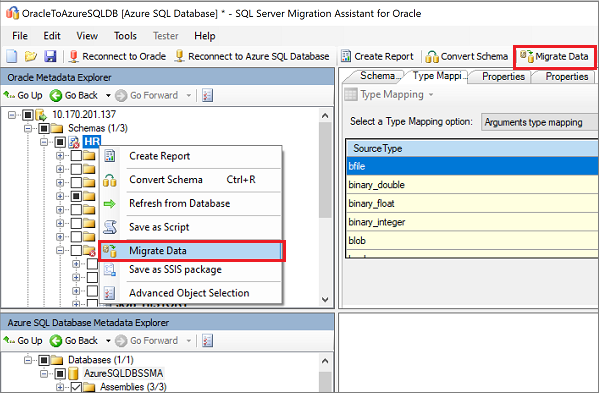

1. Provide connection details for both Oracle and Azure SQL Database.
1. View the **Data Migration report**.

   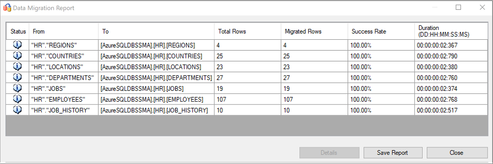

1. Connect to your Azure SQL Database by using [SQL Server Management Studio](/sql/ssms/download-sql-server-management-studio-ssms) and validate the migration by reviewing the data and schema.

   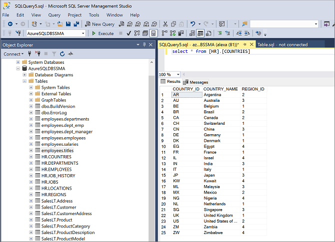

Alternatively, you can also use SQL Server Integration Services (SSIS) to perform the migration. To learn more, see: 

- [SQL Server Migration Assistant: How to assess and migrate data from non-Microsoft data platforms to SQL Server](https://blogs.msdn.microsoft.com/datamigration/2016/11/16/sql-server-migration-assistant-how-to-assess-and-migrate-databases-from-non-microsoft-data-platforms-to-sql-server/)
- [Getting Started with SQL Server Integration Services](https://docs.microsoft.com/sql/integration-services/sql-server-integration-services)
- [SQL Server Integration Services: SSIS for Azure and Hybrid Data Movement](https://download.microsoft.com/download/D/2/0/D20E1C5F-72EA-4505-9F26-FEF9550EFD44/SSIS%20Hybrid%20and%20Azure.docx)

## Post-migration 

After you have successfully completed the **Migration** stage, you need to go through a series of post-migration tasks to ensure that everything is functioning as smoothly and efficiently as possible.

### Remediate applications

After the data is migrated to the target environment, all the applications that formerly consumed the source need to start consuming the target. Accomplishing this will in some cases require changes to the applications.

The [Data Access Migration Toolkit](https://marketplace.visualstudio.com/items?itemName=ms-databasemigration.data-access-migration-toolkit) is an extension for Visual Studio Code that allows you to analyze your Java source code and detect data access API calls and queries, providing you with a single-pane view of what needs to be addressed to support the new database back end. To learn more, see the [Migrate our Java application from Oracle](https://techcommunity.microsoft.com/t5/microsoft-data-migration/migrate-your-java-applications-from-oracle-to-sql-server-with/ba-p/368727) blog. 

### Perform tests

The test approach for database migration consists of performing the following activities:

1.  **Develop validation tests**. To test database migration, you need to use SQL queries. You must create the validation queries to run against both the source and the target databases. Your validation queries should cover the scope you have defined.

2.  **Set up test environment**. The test environment should contain a copy of the source database and the target database. Be sure to isolate the test environment.

3.  **Run validation tests**. Run the validation tests against the source and the target, and then analyze the results.

4.  **Run performance tests**. Run performance test against the source and the target, and then analyze and compare the results.

### Optimize

The post-migration phase is crucial for reconciling any data accuracy issues and verifying completeness, as well as addressing performance issues with the workload.

> [!NOTE]
> For additional detail about these issues and specific steps to mitigate them, see the [Post-migration Validation and Optimization Guide](/sql/relational-databases/post-migration-validation-and-optimization-guide).

## Migration assets 

For additional assistance with completing this migration scenario, please see the following resources, which were developed in support of a real-world migration project engagement.

| **Title/link**                                                                                                                                          | **Description**                                                                                                                                                                                                                                                                                                                                                                                       |
| ------------------------------------------------------------------------------------------------------------------------------------------------------- | ----------------------------------------------------------------------------------------------------------------------------------------------------------------------------------------------------------------------------------------------------------------------------------------------------------------------------------------------------------------------------------------------------- |
| [Data Workload Assessment Model and Tool](https://github.com/Microsoft/DataMigrationTeam/tree/master/Data%20Workload%20Assessment%20Model%20and%20Tool) | This tool provides suggested “best fit” target platforms, cloud readiness, and application/database remediation level for a given workload. It offers simple, one-click calculation and report generation that greatly helps to accelerate large estate assessments by providing and automated and uniform target platform decision process.                                                          |
| [Oracle Inventory Script Artifacts](https://github.com/Microsoft/DataMigrationTeam/tree/master/Oracle%20Inventory%20Script%20Artifacts)                 | This asset includes a PL/SQL query that hits Oracle system tables and provides a count of objects by schema type, object type, and status. It also provides a rough estimate of ‘Raw Data’ in each schema and the sizing of tables in each schema, with results stored in a CSV format.                                                                                                               |
| [Automate SSMA Oracle Assessment Collection & Consolidation](https://github.com/microsoft/DataMigrationTeam/tree/master/IP%20and%20Scripts/Automate%20SSMA%20Oracle%20Assessment%20Collection%20%26%20Consolidation)                                             | This set of resource uses a .csv file as entry (sources.csv in the project folders) to produce the xml files that are needed to run SSMA assessment in console mode. The source.csv is provided by the customer based on an inventory of existing Oracle instances. The output files are AssessmentReportGeneration_source_1.xml, ServersConnectionFile.xml, and VariableValueFile.xml.|
| [SSMA for Oracle Common Errors and how to fix them](https://aka.ms/dmj-wp-ssma-oracle-errors)                                                           | With Oracle, you can assign a non-scalar condition in the WHERE clause. However, SQL Server doesn’t support this type of condition. As a result, SQL Server Migration Assistant (SSMA) for Oracle doesn’t convert queries with a non-scalar condition in the WHERE clause, instead generating an error O2SS0001. This white paper provides more details on the issue and ways to resolve it.          |
| [Oracle to SQL Server Migration Handbook](https://github.com/microsoft/DataMigrationTeam/blob/master/Whitepapers/Oracle%20to%20SQL%20Server%20Migration%20Handbook.pdf)                | This document focuses on the tasks associated with migrating an Oracle schema to the latest version of SQL Server base. If the migration requires changes to features/functionality, then the possible impact of each change on the applications that use the database must be considered carefully.                                                     |

These resources were developed as part of the Data SQL Ninja Program, which is sponsored by the Azure Data Group engineering team. The core charter of the Data SQL Ninja program is to unblock and accelerate complex modernization and compete data platform migration opportunities to Microsoft's Azure Data platform. If you think your organization would be interested in participating in the Data SQL Ninja program, please contact your account team and ask them to submit a nomination.

## Next steps

- For a matrix of the Microsoft and third-party services and tools that are available to assist you with various database and data migration scenarios as well as specialty tasks, see the article [Service and tools for data migration](https://docs.microsoft.com/azure/dms/dms-tools-matrix).

- To learn more about Azure SQL Database, see: 
  - [An overview of Azure SQL Database](../../database/sql-database-paas-overview.md)
  - [Azure Total Cost of Ownership (TCO) Calculator](https://azure.microsoft.com/en-us/pricing/tco/calculator/)

- To learn more about the framework and adoption cycle for Cloud migrations, see
   -  [Cloud Adoption Framework for Azure](/azure/cloud-adoption-framework/migrate/azure-best-practices/contoso-migration-scale)
   -  [Best practices for costing and sizing workloads migrate to Azure](/azure/cloud-adoption-framework/migrate/azure-best-practices/migrate-best-practices-costs) 

- For video content, see: 
    - [Overview of the migration journey and the tools/services recommended for performing assessment and migration](https://azure.microsoft.com/resources/videos/overview-of-migration-and-recommended-tools-services/)

