# Migration guide: Oracle to SQL Server on Azure Virtual Machines
[!INCLUDE[appliesto-sqldb-sqlmi](../../includes/appliesto-sqldb.md)]

This guide teaches you to migrate your Oracle schemas to SQL Server on Azure Virtual Machines by using SQL Server Migration Assistant for Oracle. 

For other scenarios, see the [Database Migration Guide](https://datamigration.microsoft.com/).

## Prerequisites 

To migrate your Oracle schema to SQL Server on Azure Virtual Machines, you need:

- A supported source environment.
- [SQL Server Migration Assistant (SSMA) for Oracle](https://www.microsoft.com/en-us/download/details.aspx?id=54258).
- A target [SQL Server VM](../../virtual-machines/windows/sql-vm-create-portal-quickstart.md).
- The [necessary permissions for SSMA for Oracle](/sql/ssma/oracle/connecting-to-oracle-database-oracletosql) and the [provider](/sql/ssma/oracle/connect-to-oracle-oracletosql).

## Pre-migration

To prepare to migrate to the cloud, verify that your source environment is supported and that you've addressed any prerequisites. This will help to ensure an efficient and successful migration.

This part of the process involves conducting an inventory of the databases that you need to migrate, assessing those databases for potential migration problems or blockers, and then resolving any problems that you uncover. 

### Discover

Use [MAP Toolkit](https://go.microsoft.com/fwlink/?LinkID=316883) to identify existing data sources and details about the features your business is using to get a better understanding of the migration and plan for it. This process involves scanning the network to identify your organization's Oracle instances and the versions and features you're using.

To use MAP Toolkit to do an inventory scan, follow these steps: 

1. Open [MAP Toolkit](https://go.microsoft.com/fwlink/?LinkID=316883).
1. Select **Create/Select database**:

   

1. Select **Create an inventory database**, enter a name for the new inventory database you're creating, provide a brief description, and then select **OK**: 

   :::image type="content" source="media/oracle-to-sql-on-azure-vm-guide/create-inventory-database.png" alt-text="Screenshot that shows the interface for creating an inventory database.":::

1. Select **Collect inventory data** to open the **Inventory and Assessment Wizard**:

   :::image type="content" source="media/oracle-to-sql-on-azure-vm-guide/collect-inventory-data.png" alt-text="Screenshot that shows the Collect inventory data link.":::

1. In the **Inventory and Assessment Wizard**, select **Oracle**, and then select **Next**:

   

1. Select the computer search option that best suits your business needs and environment, and then select **Next**: 

   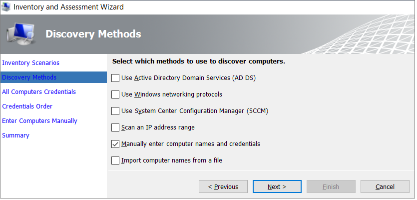

1. Either enter credentials or create new credentials for the systems that you want to explore, and then select **Next**:

    

1. Set the order of the credentials, and then select **Next**: 

     

1. Enter the credentials for each computer you want to discover. You can use unique credentials for every computer/machine, or you can use the All Computers credential list.  

   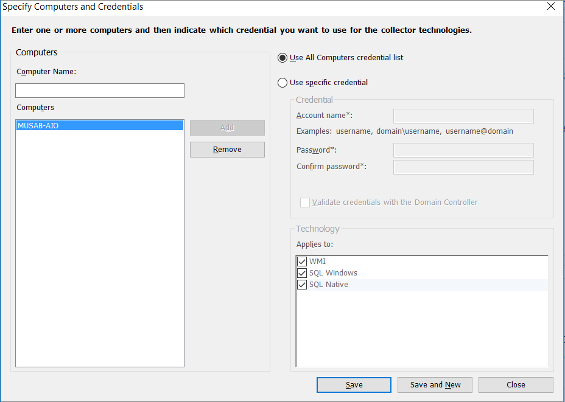

1. Verify your selections, and then select **Finish**:

   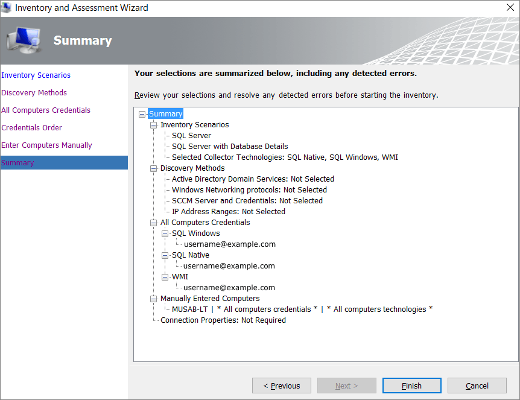

1. After the scan finishes, view the **Data Collection** summary. The scan might take a few minutes, depending on the number of databases. Select **Close** when you're done: 

   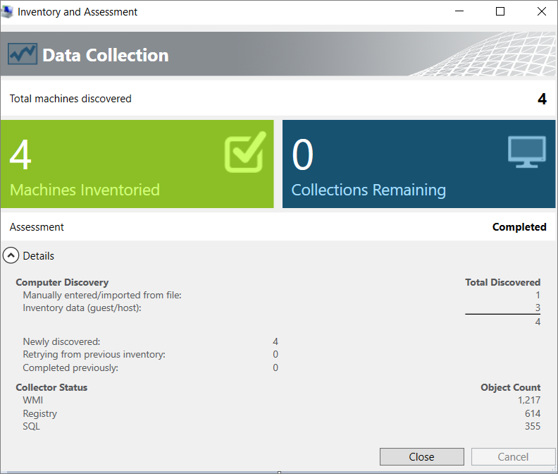

1. Select **Options** to generate a report about the Oracle assessment and database details. Select both options, one at a time, to generate the report.

### Assess

After you identify the data sources, use the [SQL Server Migration Assistant (SSMA) for Oracle](https://www.microsoft.com/en-us/download/details.aspx?id=54258) to assess the Oracle instances migrating to the SQL Server VM. The assistant will help you understand the gaps between the source and destination databases. You can review database objects and data, assess databases for migration, migrate database objects to SQL Server, and then migrate data to SQL Server.

To create an assessment, follow these steps: 

1. Open the [SQL Server Migration Assistant (SSMA) for Oracle](https://www.microsoft.com/en-us/download/details.aspx?id=54258). 
1. On the **File**, select **New Project**. 
1. Provide a project name and a location for your project, and then select a SQL Server migration target from the list. Select **OK**: 

   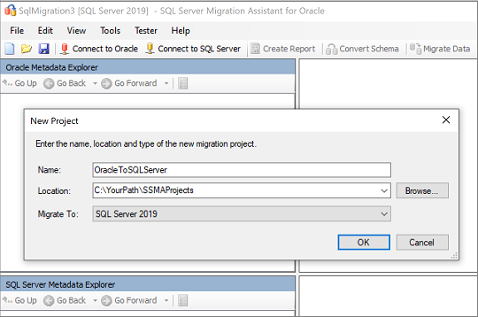

1. Select **Connect to Oracle**. Enter values for the Oracle connection in the **Connect to Oracle** dialog box:

   

   Select the Oracle schemas that you want to migrate: 

   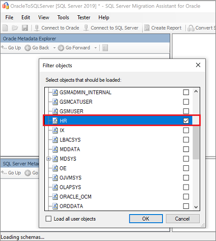

1. In **Oracle Metadata Explorer**, right-click the Oracle schema that you want to migrate, and then select **Create Report**. Doing so will generate an HTML report with conversion statistics and errors/warnings, if there are any. Alternatively, you can select the database and then select **Create report** in the top menu.

   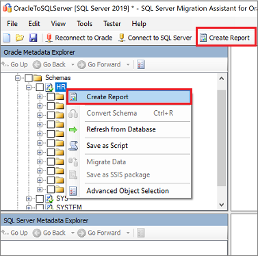

1. Review the HTML report for conversion statistics, errors, and warnings. Analyze it to understand conversion problems and resolutions.

   You can also access this report from the SSMA projects folder that you selected earlier in this procedure. For the preceding example, the report.xml file would be here: 

   `drive:\<user name>\Documents\SSMAProjects\MyOracleMigration\report\report_2016_11_12T02_47_55\`

    Open the report in Excel to get an inventory of Oracle objects and an assessment of the effort required to perform schema conversions.

   

### Validate data types

Validate the default data type mappings and change them based on requirements, if necessary. To do so, follow these steps: 

1. On the **Tools** menu, select **Project Settings**. 
1. Select the **Type Mappings** tab. 

   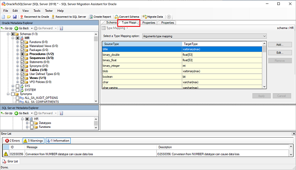

1. You can change the type mapping for each table by selecting the table in **Oracle Metadata Explorer**. 

### Convert the schema

To convert the schema, follow these steps: 

1. (Optional) To convert dynamic or ad-hoc queries, right-click the node and select **Add statement**.
1. Select **Connect to SQL Server** in the top menu and provide connection details for your SQL Server on Azure VM. You can connect to an existing database or provide a new name. If you provide a new name, a database will be created on the target server.

   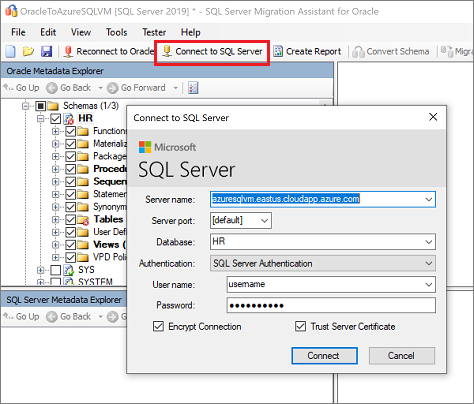

1. Right-click the Oracle schema in **Oracle Metadata Explorer** and select **Convert Schema**:

   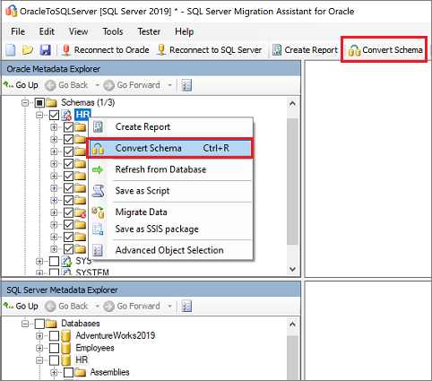

1. After the schema conversion is complete, compare the schemas and review the structure to identify potential problems:

   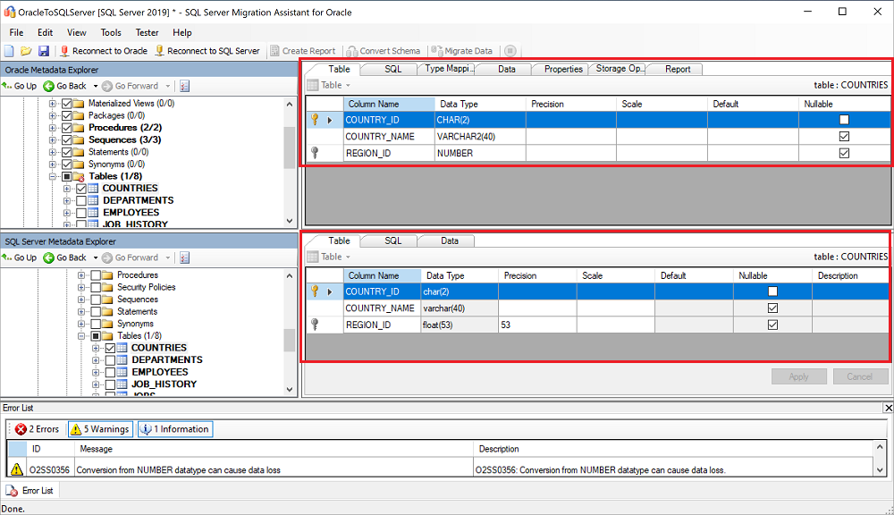

   Compare the converted Transact-SQL text to the original stored procedures and review the recommendations: 

   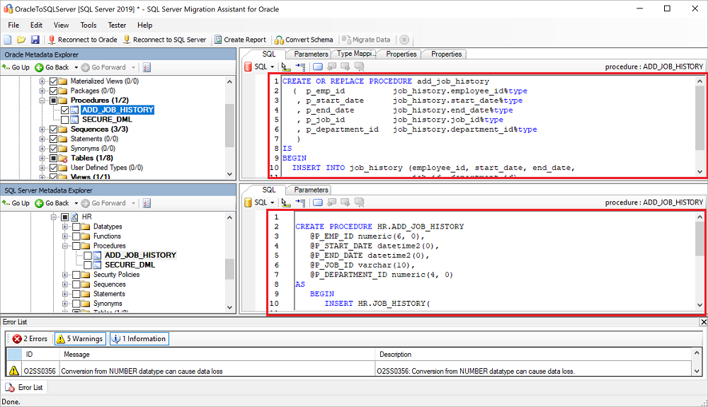

   You can save the project locally for an offline schema remediation exercise. To do so, select **Save Project** in the **File** menu. Saving the project locally lets you evaluate the source and target schemas offline and perform remediation before you publish the schema to SQL Server.

## Migrate

After you have the necessary prerequisites in place and have completed the tasks associated with the pre-migration stage, you're ready to perform the schema and data migration. Migration involves two steps: publishing the schema and migrating the data. 

To publish the schema and migrate the data, follow these steps: 

1. Right-click the database in **SQL Server Metadata Explorer** and select **Synchronize with Database**. Doing so publishes the Oracle schema to SQL Server on Azure Virtual Machines. 

   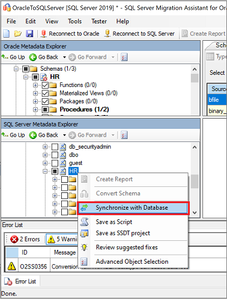

   Review the synchronization status: 

   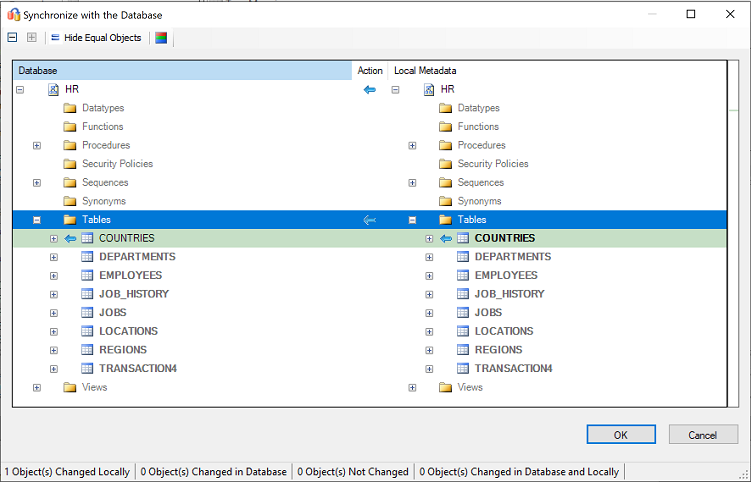

1. Right-click the Oracle schema in **Oracle Metadata Explorer** and select **Migrate Data**. Alternatively, you can select **Migrate Data** in the top menu.

   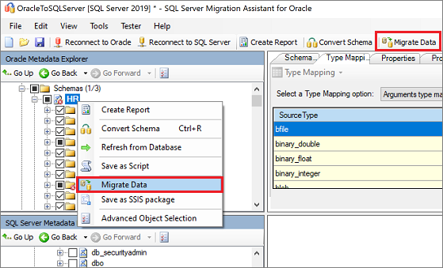

1. Provide connection details for Oracle and SQL Server on Azure Virtual Macines in the dialog box.
1. After the migration completes, view the **Data Migration Report**:

    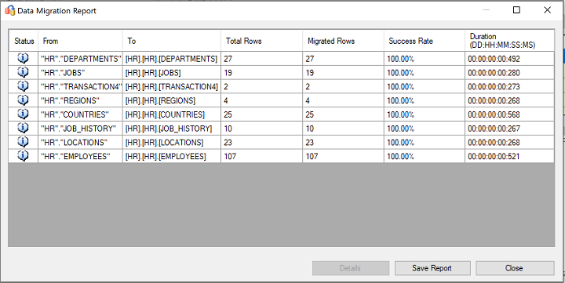

1. Connect to your SQL Server on Azure VM by using [SQL Server Management Studio](/sql/ssms/download-sql-server-management-studio-ssms). Review the data and schema in your SQL Server instance:

   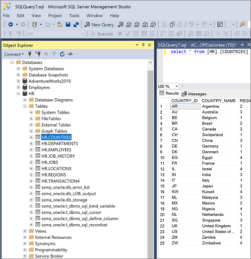

Instead of using SSMA, you could also use SQL Server Integration Services (SSIS) to migrate the data. To learn more, see: 
- The article [SQL Server Integration Services](https://docs.microsoft.com//sql/integration-services/sql-server-integration-services).
- The white paper [SSIS for Azure and Hybrid Data Movement](https://download.microsoft.com/download/D/2/0/D20E1C5F-72EA-4505-9F26-FEF9550EFD44/SSIS%20Hybrid%20and%20Azure.docx).

## Post-migration 

After you complete the migration stage, you need to complete a series of post-migration tasks to ensure that everything is functioning as smoothly and efficiently as possible.

### Remediate applications

After the data is migrated to the target environment, all the applications that previously consumed the source need to start consuming the target. Making those changes might require changes to the applications.

[Data Access Migration Toolkit](https://marketplace.visualstudio.com/items?itemName=ms-databasemigration.data-access-migration-toolkit) is an extension for Visual Studio Code that allows you to analyze your Java source code and detect data access API calls and queries, providing you with a single-pane view of what needs to be addressed to support the new database back end. To learn more, see the [Migrate our Java application from Oracle](https://techcommunity.microsoft.com/t5/microsoft-data-migration/migrate-your-java-applications-from-oracle-to-sql-server-with/ba-p/368727) blog. 

### Perform tests

The test approach for database migration consists of performing the following activities:

1. **Develop validation tests**. To test database migration, you need to use SQL queries. You must create the validation queries to run against both the source and the target databases. Your validation queries should cover the scope you have defined.

2. **Set up test environment**. The test environment should contain a copy of the source database and the target database. Be sure to isolate the test environment.

3. **Run validation tests**. Run the validation tests against the source and the target, and then analyze the results.

4. **Run performance tests**. Run performance test against the source and the target, and then analyze and compare the results.

### Optimize

The post-migration phase is crucial for reconciling any data accuracy issues and verifying completeness, as well as addressing performance issues with the workload.

> [!Note]
> For additional detail about these issues and specific steps to mitigate them, see the [Post-migration Validation and Optimization Guide](/sql/relational-databases/post-migration-validation-and-optimization-guide).

## Migration assets 

For additional assistance with completing this migration scenario, please see the following resources, which were developed in support of a real-world migration project engagement.

| **Title/link**                                                                                                                                          | **Description**                                                                                                                                                                                                                                                                                                   |
| ------------------------------------------------------------------------------------------------------------------------------------------------------- | ----------------------------------------------------------------------------------------------------------------------------------------------------------------------------------------------------------------------------------------------------------------------------------------------------------------------------------------------------------------------------------------------------- |
| [Data Workload Assessment Model and Tool](https://github.com/Microsoft/DataMigrationTeam/tree/master/Data%20Workload%20Assessment%20Model%20and%20Tool) | This tool provides suggested “best fit” target platforms, cloud readiness, and application/database remediation level for a given workload. It offers simple, one-click calculation and report generation that greatly helps to accelerate large estate assessments by providing and automated and uniform target platform decision process.                                                          |
| [Oracle Inventory Script Artifacts](https://github.com/Microsoft/DataMigrationTeam/tree/master/Oracle%20Inventory%20Script%20Artifacts)                 | This asset includes a PL/SQL query that hits Oracle system tables and provides a count of objects by schema type, object type, and status. It also provides a rough estimate of ‘Raw Data’ in each schema and the sizing of tables in each schema, with results stored in a CSV format.                                                                                                               |
| [Automate SSMA Oracle Assessment Collection & Consolidation](https://github.com/microsoft/DataMigrationTeam/tree/master/IP%20and%20Scripts/Automate%20SSMA%20Oracle%20Assessment%20Collection%20%26%20Consolidation)                                             | This set of resource uses a .csv file as entry (sources.csv in the project folders) to produce the xml files that are needed to run SSMA assessment in console mode. The source.csv is provided by the customer based on an inventory of existing Oracle instances. The output files are AssessmentReportGeneration_source_1.xml, ServersConnectionFile.xml, and VariableValueFile.xml.|
| [SSMA for Oracle Common Errors and how to fix them](https://aka.ms/dmj-wp-ssma-oracle-errors)                                                           | With Oracle, you can assign a non-scalar condition in the WHERE clause. However, SQL Server doesn’t support this type of condition. As a result, SQL Server Migration Assistant (SSMA) for Oracle doesn’t convert queries with a non-scalar condition in the WHERE clause, instead generating an error O2SS0001. This white paper provides more details on the issue and ways to resolve it.          |
| [Oracle to SQL Server Migration Handbook](https://github.com/microsoft/DataMigrationTeam/blob/master/Whitepapers/Oracle%20to%20SQL%20Server%20Migration%20Handbook.pdf)                | This document focuses on the tasks associated with migrating an Oracle schema to the latest version of SQL Server. If the migration requires changes to features/functionality, then the possible impact of each change on the applications that use the database must be considered carefully.                                                     |

These resources were developed as part of the Data SQL Ninja Program, which is sponsored by the Azure Data Group engineering team. The core charter of the Data SQL Ninja program is to unblock and accelerate complex modernization and compete data platform migration opportunities to Microsoft's Azure Data platform. If you think your organization would be interested in participating in the Data SQL Ninja program, please contact your account team and ask them to submit a nomination.

## Next steps

- To check the availability of services applicable to SQL Server see the [Azure Global infrastructure center](https://azure.microsoft.com/global-infrastructure/services/?regions=all&amp;products=synapse-analytics,virtual-machines,sql-database)

- For a matrix of the Microsoft and third-party services and tools that are available to assist you with various database and data migration scenarios as well as specialty tasks, see the article [Service and tools for data migration.](../../../dms/dms-tools-matrix.md)

- To learn more about Azure SQL see:
   - [Deployment options](../../azure-sql-iaas-vs-paas-what-is-overview.md)
   - [SQL Server on Azure VMs](../../virtual-machines/windows/sql-server-on-azure-vm-iaas-what-is-overview.md)
   - [Azure total Cost of Ownership Calculator](https://azure.microsoft.com/pricing/tco/calculator/) 

- To learn more about the framework and adoption cycle for Cloud migrations, see
   -  [Cloud Adoption Framework for Azure](/azure/cloud-adoption-framework/migrate/azure-best-practices/contoso-migration-scale)
   -  [Best practices for costing and sizing workloads migrate to Azure](/azure/cloud-adoption-framework/migrate/azure-best-practices/migrate-best-practices-costs) 

- For information about licensing, see
   - [Bring your own license with the Azure Hybrid Benefit](../../virtual-machines/windows/licensing-model-azure-hybrid-benefit-ahb-change.md)
   - [Get free extended support for SQL Server 2008 and SQL Server 2008 R2](../../virtual-machines/windows/sql-server-2008-extend-end-of-support.md)

- To assess the Application access layer, see [Data Access Migration Toolkit (Preview)](https://marketplace.visualstudio.com/items?itemName=ms-databasemigration.data-access-migration-toolkit)
- For details on how to perform Data Access Layer A/B testing see [Database Experimentation Assistant](/sql/dea/database-experimentation-assistant-overview).

