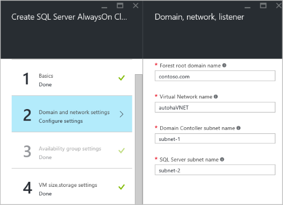
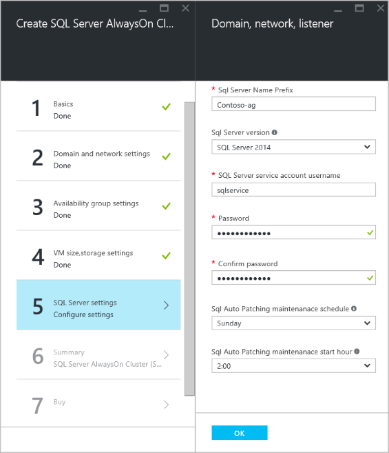

# Azure Marketplace template: Always On availability group for SQL Server on Azure VMs (deprecated)

[!INCLUDE[appliesto-sqlvm](../../includes/appliesto-sqlvm.md)]

  >[!WARNING]
  > The Always On availability group Azure Marketplace template has been deprecated and may fail when deployed from the Azure portal. Use [quickstart templates](availability-group-quickstart-template-configure.md) or the [Azure CLI] to deploy the availability group to your SQL Server on Azure VM instead. 

## Template has been deprecated

Use [quickstart templates](availability-group-quickstart-template-configure.md) or the [Azure CLI] to deploy the availability group to your SQL Server on Azure VM instead. 

This article is being retired but provided as an informational for customers who might still be looking for the information about the Azure Marketplace template. 

Before the portal was deprecated, in this tutorial, you would use the Azure portal to:

* Choose the Always On template from the portal.
* Review the template settings and update a few configuration settings for your environment.
* Monitor Azure as it creates the entire environment.
* Connect to a domain controller and then to a server that runs SQL Server.

[!INCLUDE [availability-group-template](../../../../includes/virtual-machines-windows-portal-sql-alwayson-ag-template.md)]

### Provision the cluster from the gallery

Azure provides a gallery image for the entire solution. To locate the template:

1. Sign in to the Azure portal by using your account.
2. In the Azure portal, select **Create a resource** to open the **New** pane.
3. On the **New** pane, search for **AlwaysOn**.
  Azure Marketplace shows search results that include the SQL Server cluster. This feature is in preview.
4. In the search results, locate and click **SQL Server AlwaysOn Cluster (preview)**. Follow the instructions to create the solution.

The following sections explain the input for the solution. 

#### Basics

Select **Basics** and configure the following settings:

* **Administrator user name** is a user account that has domain administrator permissions and is a member of the SQL Server sysadmin fixed server role on both instances of SQL Server. For this tutorial, use **DomainAdmin**.
* **Password** is the password for the domain administrator account. Use a complex password. Confirm the password.
* **Subscription** is the subscription that Azure bills to run all deployed resources for the availability group. If your account has multiple subscriptions, you can specify a different subscription.
* **Resource group** is the name for the group to which all Azure resources that are created by this template belong. For this tutorial, use **SQL-HA-RG**. For more information, see [Azure Resource Manager overview](../../../azure-resource-manager/management/overview.md#resource-groups).
* **Location** is the Azure region where the tutorial creates the resources. Choose an Azure region.

The following screenshot is a completed **Basics** blade:

Select **OK**.

#### Domain and network settings

This Azure gallery template creates a domain and domain controllers. It also creates a network and two subnets. The template can't create servers in an existing domain or virtual network. The next step configures the domain and network settings.

On the **Domain and network settings** blade, review the preset values for the domain and network settings:

* **Forest root domain name** is the domain name for the Active Directory domain that hosts the cluster. For the tutorial, use **contoso.com**.
* **Virtual Network name** is the network name for the Azure virtual network. For the tutorial, use **autohaVNET**.
* **Domain Controller subnet name** is the name of a portion of the virtual network that hosts the domain controller. Use **subnet-1**. This subnet uses address prefix **10.0.0.0/24**.
* **SQL Server subnet name** is the name of a portion of the virtual network that hosts the servers that run SQL Server and the file share witness. Use **subnet-2**. This subnet uses address prefix **10.0.1.0/26**.

To learn more about virtual networks in Azure, see [Virtual network overview](../../../virtual-network/virtual-networks-overview.md).  

The **Domain and network settings** should look like the following screenshot:

If necessary, you can change these values. For this tutorial, use the preset values.

Review the settings, and then select **OK**.

#### Availability group settings

On **Availability group settings**, review the preset values for the availability group and the listener.

* **Availability group name** is the clustered resource name for the availability group. For this tutorial, use **Contoso-ag**.
* **Availability group listener name** is used by the cluster and the internal load balancer. Clients that connect to SQL Server can use this name to connect to the appropriate replica of the database. For this tutorial, use **Contoso-listener**.
* **Availability group listener port** specifies the TCP port of the SQL Server listener. For this tutorial, use the default port, **1433**.

If necessary, you can change these values. For this tutorial, use the preset values.  

Select **OK**.

#### Virtual machine size, storage settings

On **VM size, storage settings**, choose a SQL Server virtual machine size, and review the other settings.

* **SQL Server virtual machine size** is the size for both virtual machines that run SQL Server. Choose an appropriate virtual machine size for your workload. 
   * If you are building this environment for the tutorial, use **DS2**.
   * For production workloads, choose a virtual machine size that can support the workload.
   * Many production workloads require **DS4** or larger. The template builds two virtual machines of this size and installs SQL Server on each one.
   * For more information, see [Sizes for virtual machines](../../../virtual-machines/windows/sizes.md).

   > [!NOTE]
   > Azure installs the Enterprise Edition of SQL Server. The cost depends on the edition and the virtual machine size. For detailed information about current costs, see [virtual machines pricing](https://azure.microsoft.com/pricing/details/virtual-machines/#Sql).
   >

* **Domain controller virtual machine size** is the virtual machine size for the domain controllers. For this tutorial use **D2**.
* **File Share Witness virtual machine size** is the virtual machine size for the file share witness. For this tutorial, use **A1**.
* **SQL Storage account** is the name of the storage account that holds the SQL Server data and operating system disks. For this tutorial, use **alwaysonsql01**.
* **DC Storage account** is the name of the storage account for the domain controllers. For this tutorial, use **alwaysondc01**.
* **SQL Server data disk size** in TB is the size of the SQL Server data disk in TB. Specify a number from 1 through 4. For this tutorial, use **1**.
* **Storage optimization** sets specific storage configuration settings for the SQL Server virtual machines based on the workload type. All SQL Server virtual machines in this scenario use premium storage with Azure disk host cache set to read-only. In addition, you can optimize SQL Server settings for the workload by choosing one of these three settings:

  * **General workload** sets no specific configuration settings.
  * **Transactional processing** sets trace flag 1117 and 1118.
  * **Data warehousing** sets trace flag 1117 and 610.

For this tutorial, use **General workload**.

Review the settings, and then select **OK**.

##### A note about storage

Additional optimizations depend on the size of the SQL Server data disks. For each terabyte of data disk, Azure adds an additional 1 TB premium storage. When a server requires 2 TB or more, the template creates a storage pool on each SQL Server virtual machine. A storage pool is a form of storage virtualization where multiple discs are configured to provide higher capacity, resiliency, and performance.  The template then creates a storage space on the storage pool and presents a single data disk to the operating system. The template designates this disk as the data disk for SQL Server. The template tunes the storage pool for SQL Server by using the following settings:

* Stripe size is the interleave setting for the virtual disk. Transactional workloads use 64 KB. Data warehousing workloads use 256 KB.
* Resiliency is simple (no resiliency).

   > [!NOTE]
   > Azure premium storage is locally redundant and keeps three copies of the data within a single region, so additional resiliency at the storage pool is not required.
   >

* Column count equals the number of disks in the storage pool.

For additional information about storage space and storage pools, see:

* [Storage Spaces Overview](https://technet.microsoft.com/library/hh831739.aspx)
* [Windows Server Backup and Storage Pools](https://technet.microsoft.com/library/dn390929.aspx)

For more information about SQL Server configuration best practices, see
[Performance best practices for SQL Server in Azure virtual machines](performance-guidelines-best-practices.md).

#### SQL Server settings

On **SQL Server settings**, review and modify the SQL Server virtual machine name prefix, SQL Server version, SQL Server service account and password, and the SQL auto-patching maintenance schedule.

* **SQL Server Name Prefix** is used to create a name for each SQL Server virtual machine. For this tutorial, use **sqlserver**. The template names the SQL Server virtual machines *sqlserver-0* and *sqlserver-1*.
* **SQL Server version** is the version of SQL Server. For this tutorial use **SQL Server 2014**. You can also choose **SQL Server 2012** or **SQL Server 2016**.
* **SQL Server service account user name** is the domain account name for the SQL Server service. For this tutorial, use **sqlservice**.
* **Password** is the password for the SQL Server service account. Use a complex password. Confirm the password.
* **SQL Auto Patching maintenance schedule** identifies the day of the week that Azure automatically patches the SQL Servers. For this tutorial, type **Sunday**.
* **SQL Auto Patching maintenance start hour** is the time of day for the Azure region when automatic patching begins.

> [!NOTE]
> The patching window for each virtual machine is staggered by one hour. Only one virtual machine is patched at a time to prevent disruption of services.
>

Review the settings, and then select **OK**.

#### Summary

On the summary page, Azure validates the settings. You can also download the template. Review the summary. Select **OK**.

#### Buy

This final blade contains **terms of use**, and **privacy policy**. Review this information. When you are ready for Azure to start to create the virtual machines and all the other required resources for the availability group, select **Create**.

The Azure portal creates the resource group and all the resources.

### Monitor deployment

Monitor the deployment progress from the Azure portal. An icon that represents the deployment is automatically pinned to the Azure portal dashboard.

### Connect to SQL Server

The new instances of SQL Server are running on virtual machines that have internet-connected IP addresses. You can connect directly to each SQL Server virtual machine with remote desktop (RDP).

To use RDP to connect to a SQL Server VM, follow these steps:

1. From the Azure portal dashboard, verify that the deployment has succeeded.
2. Select **Resources**.
3. In the **Resources** blade, select **sqlserver-0**, which is the computer name of one of the virtual machines that's running SQL Server.
4. On the blade for **sqlserver-0**, select **Connect**. Your browser asks if you want to open or save the remote connection object. Select **Open**.
5. **Remote desktop connection** might warn you that the publisher of this remote connection can’t be identified. Select **Connect**.
6. Windows security prompts you to enter your credentials to connect to the IP address of the primary domain controller. Select **Use another account**. For **User name**, type **contoso\DomainAdmin**. You configured this account when you set the administrator user name in the template. Use the complex password that you chose when you configured the template.
7. **Remote desktop** might warn you that the remote computer could not be authenticated due to problems with its security certificate. It shows you the security certificate name. If you followed the tutorial, the name is **sqlserver-0.contoso.com**. Select **Yes**.

You are now connected with RDP to the SQL Server virtual machine. You can open SQL Server Management Studio, connect to the default instance of SQL Server, and verify that the availability group is configured.
