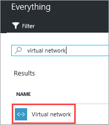
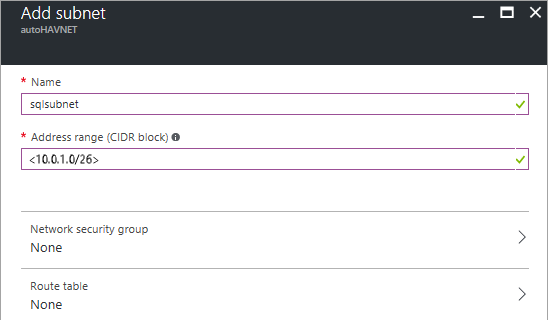
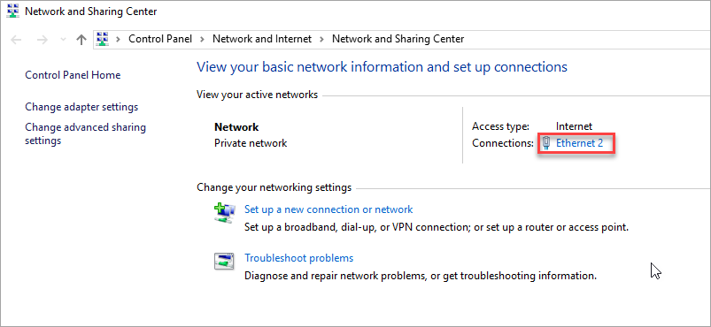
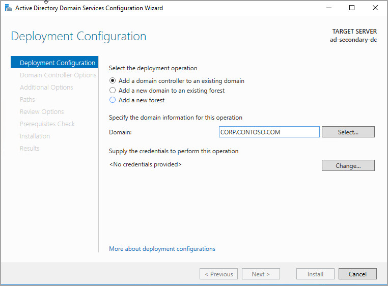
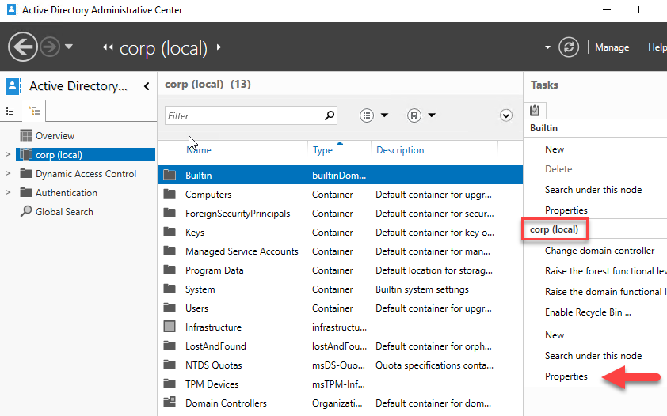
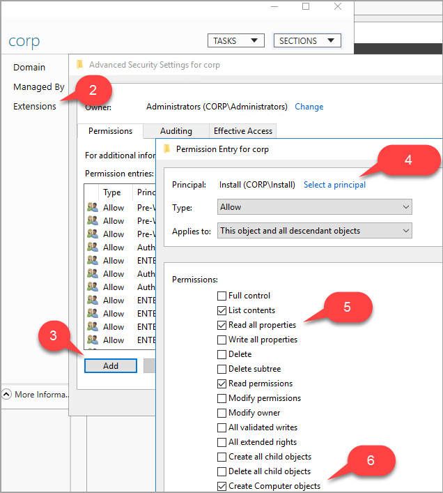

# Tutorial: Prerequisites for creating availability groups on SQL Server on Azure Virtual Machines

[!INCLUDE[appliesto-sqlvm](../../includes/appliesto-sqlvm.md)]

This tutorial shows how to complete the prerequisites for creating a [SQL Server Always On availability group on Azure Virtual Machines (VMs)](availability-group-manually-configure-tutorial.md). When you've completed the prerequisites, you'll have a domain controller, two SQL Server VMs, and a witness server in a single resource group.

While this article manually configures the availability group environment, it is also possible to do so using the [Azure portal](availability-group-azure-portal-configure.md), [PowerShell or the Azure CLI](availability-group-az-commandline-configure.md), or [Azure Quickstart templates](availability-group-quickstart-template-configure.md) as well. 

**Time estimate**: It might take a couple of hours to complete the prerequisites. Much of this time is spent creating virtual machines.

The following diagram illustrates what you build in the tutorial.


## Review availability group documentation

This tutorial assumes that you have a basic understanding of SQL Server Always On availability groups. If you're not familiar with this technology, see [Overview of Always On availability groups (SQL Server)](/sql/database-engine/availability-groups/windows/overview-of-always-on-availability-groups-sql-server).


## Create an Azure account

You need an Azure account. You can [open a free Azure account](https://signup.azure.com/signup?offer=ms-azr-0044p&appId=102&ref=azureplat-generic) or [activate Visual Studio subscriber benefits](/visualstudio/subscriptions/subscriber-benefits).

## Create a resource group

1. Sign in to the [Azure portal](https://portal.azure.com).
2. Select **+** to create a new object in the portal.

   

3. Type **resource group** in the **Marketplace** search window.

   

4. Select **Resource group**.
5. Select **Create**.
6. Under **Resource group name**, type a name for the resource group. For example, type **sql-ha-rg**.
7. If you have multiple Azure subscriptions, verify that the subscription is the Azure subscription that you want to create the availability group in.
8. Select a location. The location is the Azure region where you want to create the availability group. This article builds all resources in one Azure location.
9. Verify that **Pin to dashboard** is checked. This optional setting places a shortcut for the resource group on the Azure portal dashboard.

   

10. Select **Create** to create the resource group.

Azure creates the resource group and pins a shortcut to the resource group in the portal.

## Create the network and subnets

The next step is to create the networks and subnets in the Azure resource group.

The solution uses one virtual network with two subnets. The [Virtual network overview](../../../virtual-network/virtual-networks-overview.md) provides more information about networks in Azure.

To create the virtual network in the Azure portal:

1. In your resource group, select **+ Add**. 

   
2. Search for **virtual network**.

     
3. Select **Virtual network**.
4. On the **Virtual network**, select the **Resource Manager** deployment model, and then select **Create**.

    The following table shows the settings for the virtual network:

   | **Field** | Value |
   | --- | --- |
   | **Name** |autoHAVNET |
   | **Address space** |10.0.0.0/24 |
   | **Subnet name** |Admin |
   | **Subnet address range** |10.0.0.0/29 |
   | **Subscription** |Specify the subscription that you intend to use. **Subscription** is blank if you only have one subscription. |
   | **Resource group** |Choose **Use existing** and pick the name of the resource group. |
   | **Location** |Specify the Azure location. |

   Your address space and subnet address range might be different from the table. Depending on your subscription, the portal suggests an available address space and corresponding subnet address range. If no sufficient address space is available, use a different subscription.

   The example uses the subnet name **Admin**. This subnet is for the domain controllers.

5. Select **Create**.

   

Azure returns you to the portal dashboard and notifies you when the new network is created.

### Create a second subnet

The new virtual network has one subnet, named **Admin**. The domain controllers use this subnet. The SQL Server VMs use a second subnet named **SQL**. To configure this subnet:

1. On your dashboard, select the resource group that you created, **SQL-HA-RG**. Locate the network in the resource group under **Resources**.

    If **SQL-HA-RG** isn't visible, find it by selecting **Resource Groups** and filtering by the resource group name.

2. Select **autoHAVNET** on the list of resources. 
3. On the **autoHAVNET** virtual network, under **Settings** select **Subnets**.

    Note the subnet that you already created.

   

5. To create a second subnet, select **+ Subnet**.
6. On **Add subnet**, configure the subnet by typing **sqlsubnet** under **Name**. Azure automatically specifies a valid **Address range**. Verify that this address range has at least 10 addresses in it. In a production environment, you might require more addresses.
7. Select **OK**.

    

The following table summarizes the network configuration settings:

| **Field** | Value |
| --- | --- |
| **Name** |**autoHAVNET** |
| **Address space** |This value depends on the available address spaces in your subscription. A typical value is 10.0.0.0/16. |
| **Subnet name** |**admin** |
| **Subnet address range** |This value depends on the available address ranges in your subscription. A typical value is 10.0.0.0/24. |
| **Subnet name** |**sqlsubnet** |
| **Subnet address range** |This value depends on the available address ranges in your subscription. A typical value is 10.0.1.0/24. |
| **Subscription** |Specify the subscription that you intend to use. |
| **Resource Group** |**SQL-HA-RG** |
| **Location** |Specify the same location that you chose for the resource group. |

## Create availability sets

Before you create virtual machines, you need to create availability sets. Availability sets reduce the downtime for planned or unplanned maintenance events. An Azure availability set is a logical group of resources that Azure places on physical fault domains and update domains. A fault domain ensures that the members of the availability set have separate power and network resources. An update domain ensures that members of the availability set aren't brought down for maintenance at the same time. For more information, see [Manage the availability of virtual machines](../../../virtual-machines/availability.md?toc=%2fazure%2fvirtual-machines%2fwindows%2ftoc.json).

You need two availability sets. One is for the domain controllers. The second is for the SQL Server VMs.

To create an availability set, go to the resource group and select **Add**. Filter the results by typing **availability set**. Select **Availability Set** in the results, and then select **Create**.

Configure two availability sets according to the parameters in the following table:

| **Field** | Domain controller availability set | SQL Server availability set |
| --- | --- | --- |
| **Name** |adavailabilityset |sqlavailabilityset |
| **Resource group** |SQL-HA-RG |SQL-HA-RG |
| **Fault domains** |3 |3 |
| **Update domains** |5 |3 |

After you create the availability sets, return to the resource group in the Azure portal.

## Create domain controllers

After you've created the network, subnets, and availability sets, you're ready to create the virtual machines for the domain controllers.

### Create virtual machines for the domain controllers

To create and configure the domain controllers, return to the **SQL-HA-RG** resource group.

1. Select **Add**. 
2. Type **Windows Server 2016 Datacenter**.
3. Select **Windows Server 2016 Datacenter**. In **Windows Server 2016 Datacenter**, verify that the deployment model is **Resource Manager**, and then select **Create**. 

Repeat the preceding steps to create two virtual machines. Name the two virtual machines:

* ad-primary-dc
* ad-secondary-dc

  > [!NOTE]
  > The **ad-secondary-dc** virtual machine is optional, to provide high availability for Active Directory Domain Services.
  >

The following table shows the settings for these two machines:

| **Field** | Value |
| --- | --- |
| **Name** |First domain controller: *ad-primary-dc*.</br>Second domain controller *ad-secondary-dc*. |
| **VM disk type** |SSD |
| **User name** |DomainAdmin |
| **Password** |Contoso!0000 |
| **Subscription** |*Your subscription* |
| **Resource group** |SQL-HA-RG |
| **Location** |*Your location* |
| **Size** |DS1_V2 |
| **Storage** | **Use managed disks** - **Yes** |
| **Virtual network** |autoHAVNET |
| **Subnet** |admin |
| **Public IP address** |*Same name as the VM* |
| **Network security group** |*Same name as the VM* |
| **Availability set** |adavailabilityset </br>**Fault domains**:2 </br>**Update domains**:2|
| **Diagnostics** |Enabled |
| **Diagnostics storage account** |*Automatically created* |

   >[!IMPORTANT]
   >You can only place a VM in an availability set when you create it. You can't change the availability set after a VM is created. See [Manage the availability of virtual machines](../../../virtual-machines/availability.md).

Azure creates the virtual machines.

After the virtual machines are created, configure the domain controller.

### Configure the domain controller

In the following steps, configure the **ad-primary-dc** machine as a domain controller for corp.contoso.com.

1. In the portal, open the **SQL-HA-RG** resource group and select the **ad-primary-dc** machine. On **ad-primary-dc**, select **Connect** to open an RDP file for remote desktop access.

    

2. Sign in with your configured administrator account (**\DomainAdmin**) and password (**Contoso!0000**).
3. By default, the **Server Manager** dashboard should be displayed.
4. Select the **Add roles and features** link on the dashboard.

    

5. Select **Next** until you get to the **Server Roles** section.
6. Select the **Active Directory Domain Services** and **DNS Server** roles. When you're prompted, add any additional features that are required by these roles.

   > [!NOTE]
   > Windows warns you that there is no static IP address. If you're testing the configuration, select **Continue**. For production scenarios, set the IP address to static in the Azure portal, or [use PowerShell to set the static IP address of the domain controller machine](/previous-versions/azure/virtual-network/virtual-networks-reserved-private-ip).
   >

    

7. Select **Next** until you reach the **Confirmation** section. Select the **Restart the destination server automatically if required** check box.
8. Select **Install**.
9. After the features finish installing, return to the **Server Manager** dashboard.
10. Select the new **AD DS** option on the left-hand pane.
11. Select the **More** link on the yellow warning bar.

    
    
12. In the **Action** column of the **All Server Task Details** dialog, select **Promote this server to a domain controller**.
13. In the **Active Directory Domain Services Configuration Wizard**, use the following values:

    | **Page** | Setting |
    | --- | --- |
    | **Deployment Configuration** |**Add a new forest**<br/> **Root domain name** = corp.contoso.com |
    | **Domain Controller Options** |**DSRM Password** = Contoso!0000<br/>**Confirm Password** = Contoso!0000 |

14. Select **Next** to go through the other pages in the wizard. On the **Prerequisites Check** page, verify that you see the following message: **All prerequisite checks passed successfully**. You can review any applicable warning messages, but it's possible to continue with the installation.
15. Select **Install**. The **ad-primary-dc** virtual machine automatically reboots.

### Note the IP address of the primary domain controller

Use the primary domain controller for DNS. Note the primary domain controller IP address.

One way to get the primary domain controller IP address is through the Azure portal.

1. On the Azure portal, open the resource group.

2. Select the primary domain controller.

3. On the primary domain controller, select **Network interfaces**.


Note the private IP address for this server.

### Configure the virtual network DNS

After you create the first domain controller and enable DNS on the first server, configure the virtual network to use this server for DNS.

1. In the Azure portal, select on the virtual network.

2. Under **Settings**, select **DNS Server**.

3. Select **Custom**, and type the private IP address of the primary domain controller.

4. Select **Save**.

### Configure the second domain controller

After the primary domain controller reboots, you can configure the second domain controller. This optional step is for high availability. Follow these steps to configure the second domain controller:

1. In the portal, open the **SQL-HA-RG** resource group and select the **ad-secondary-dc** machine. On **ad-secondary-dc**, select **Connect** to open an RDP file for remote desktop access.
2. Sign in to the VM by using your configured administrator account (**BUILTIN\DomainAdmin**) and password (**Contoso!0000**).
3. Change the preferred DNS server address to the address of the domain controller.
4. In **Network and Sharing Center**, select the network interface.

   

5. Select **Properties**.
6. Select **Internet Protocol Version 4 (TCP/IPv4)** and then select **Properties**.
7. Select **Use the following DNS server addresses** and then specify the address of the primary domain controller in **Preferred DNS server**.
8. Select **OK**, and then **Close** to commit the changes. You are now able to join the VM to **corp.contoso.com**.

   >[!IMPORTANT]
   >If you lose the connection to your remote desktop after changing the DNS setting, go to the Azure portal and restart the virtual machine.

9. From the remote desktop to the secondary domain controller, open **Server Manager Dashboard**.
10. Select the **Add roles and features** link on the dashboard.

    
11. Select **Next** until you get to the **Server Roles** section.
12. Select the **Active Directory Domain Services** and **DNS Server** roles. When you're prompted, add any additional features that are required by these roles.
13. After the features finish installing, return to the **Server Manager** dashboard.
14. Select the new **AD DS** option on the left-hand pane.
15. Select the **More** link on the yellow warning bar.
16. In the **Action** column of the **All Server Task Details** dialog, select **Promote this server to a domain controller**.
17. Under **Deployment Configuration**, select **Add a domain controller to an existing domain**.

    

18. Click **Select**.
19. Connect by using the administrator account (**CORP.CONTOSO.COM\domainadmin**) and password (**Contoso!0000**).
20. In **Select a domain from the forest**, choose your domain and then select **OK**.
21. In **Domain Controller Options**, use the default values and set a DSRM password.

    >[!NOTE]
    >The **DNS Options** page might warn you that a delegation for this DNS server can't be created. You can ignore this warning in non-production environments.
    >

22. Select **Next** until the dialog reaches the **Prerequisites** check. Then select **Install**.

After the server finishes the configuration changes, restart the server.

### Add the private IP address to the second domain controller to the VPN DNS Server

In the Azure portal, under virtual network, change the DNS Server to include the IP address of the secondary domain controller. This setting allows the DNS service redundancy.

### <a name="DomainAccounts"></a> Configure the domain accounts

In the next steps, you configure the Active Directory accounts. The following table shows the accounts:

| |Installation account<br/> |sqlserver-0 <br/>SQL Server and SQL Agent Service account |sqlserver-1<br/>SQL Server and SQL Agent Service account
| --- | --- | --- | ---
|**First Name** |Install |SQLSvc1 | SQLSvc2
|**User SamAccountName** |Install |SQLSvc1 | SQLSvc2

Use the following steps to create each account.

1. Sign in to the **ad-primary-dc** machine.
2. In **Server Manager**, select **Tools**, and then select **Active Directory Administrative Center**.   
3. Select **corp (local)** from the left pane.
4. On the right **Tasks** pane, select **New**, and then select **User**.

   

   >[!TIP]
   >Set a complex password for each account.<br/> For non-production environments, set the user account to never expire.
   >

5. Select **OK** to create the user.
6. Repeat the preceding steps for each of the three accounts.

### Grant the required permissions to the installation account

1. In the **Active Directory Administrative Center**, select **corp (local)** in the left pane. Then in the right-hand **Tasks** pane, select **Properties**.

    

2. Select **Extensions**, and then select the **Advanced** button on the **Security** tab.
3. In the **Advanced Security Settings for corp** dialog, select **Add**.
4. Click **Select a principal**, search for **CORP\Install**, and then select **OK**.
5. Select the **Read all properties** check box.

6. Select the **Create Computer objects** check box.

     

7. Select **OK**, and then select **OK** again. Close the **corp** properties window.

Now that you've finished configuring Active Directory and the user objects, create two SQL Server VMs and a witness server VM. Then join all three to the domain.

## Create SQL Server VMs

Create three additional virtual machines. The solution requires two virtual machines with SQL Server instances. A third virtual machine will function as a witness. Windows Server 2016 can use a [cloud witness](/windows-server/failover-clustering/deploy-cloud-witness). However for consistency with previous operating systems, this article uses a virtual machine for a witness.  

Before you proceed consider the following design decisions.

* **Storage - Azure Managed Disks**

   For the virtual machine storage, use Azure Managed Disks. Microsoft recommends Managed Disks for SQL Server virtual machines. Managed Disks handles storage behind the scenes. In addition, when virtual machines with Managed Disks are in the same availability set, Azure distributes the storage resources to provide appropriate redundancy. For additional information, see [Azure Managed Disks Overview](../../../virtual-machines/managed-disks-overview.md). For specifics about managed disks in an availability set, see [Use Managed Disks for VMs in an availability set](../../../virtual-machines/availability.md#use-managed-disks-for-vms-in-an-availability-set).

* **Network - Private IP addresses in production**

   For the virtual machines, this tutorial uses public IP addresses. A public IP address enables remote connection directly to the virtual machine over the internet and makes configuration steps easier. In production environments, Microsoft recommends only private IP addresses in order to reduce the vulnerability footprint of the SQL Server instance VM resource.

* **Network - Recommend a single NIC per server** 

Use a single NIC per server (cluster node) and a single subnet. Azure networking has physical redundancy, which makes additional NICs and subnets unnecessary on an Azure virtual machine guest cluster. The cluster validation report will warn you that the nodes are reachable only on a single network. You can ignore this warning on Azure virtual machine guest failover clusters.

### Create and configure the SQL Server VMs

Next, create three VMs - two SQL Server VMs and one VM for an additional cluster node. To create each of the VMs, go back to the **SQL-HA-RG** resource group, and then select **Add**. Search for the appropriate gallery item, select **Virtual Machine**, and then select **From Gallery**. Use the information in the following table to help you create the VMs:


| Page | VM1 | VM2 | VM3 |
| --- | --- | --- | --- |
| Select the appropriate gallery item |**Windows Server 2016 Datacenter** |**SQL Server 2016 SP1 Enterprise on Windows Server 2016** |**SQL Server 2016 SP1 Enterprise on Windows Server 2016** |
| Virtual machine configuration **Basics** |**Name** = cluster-fsw<br/>**User Name** = DomainAdmin<br/>**Password** = Contoso!0000<br/>**Subscription** = Your subscription<br/>**Resource group** = SQL-HA-RG<br/>**Location** = Your Azure location |**Name** = sqlserver-0<br/>**User Name** = DomainAdmin<br/>**Password** = Contoso!0000<br/>**Subscription** = Your subscription<br/>**Resource group** = SQL-HA-RG<br/>**Location** = Your Azure location |**Name** = sqlserver-1<br/>**User Name** = DomainAdmin<br/>**Password** = Contoso!0000<br/>**Subscription** = Your subscription<br/>**Resource group** = SQL-HA-RG<br/>**Location** = Your Azure location |
| Virtual machine configuration **Size** |**SIZE** = DS1\_V2 (1 vCPU, 3.5 GB) |**SIZE** = DS2\_V2 (2 vCPUs, 7 GB)</br>The size must support SSD storage (Premium disk support. )) |**SIZE** = DS2\_V2 (2 vCPUs, 7 GB) |
| Virtual machine configuration **Settings** |**Storage**: Use managed disks.<br/>**Virtual network** = autoHAVNET<br/>**Subnet** = sqlsubnet(10.1.1.0/24)<br/>**Public IP address** automatically generated.<br/>**Network security group** = None<br/>**Monitoring Diagnostics** = Enabled<br/>**Diagnostics storage account** = Use an automatically generated storage account<br/>**Availability set** = sqlAvailabilitySet<br/> |**Storage**: Use managed disks.<br/>**Virtual network** = autoHAVNET<br/>**Subnet** = sqlsubnet(10.1.1.0/24)<br/>**Public IP address** automatically generated.<br/>**Network security group** = None<br/>**Monitoring Diagnostics** = Enabled<br/>**Diagnostics storage account** = Use an automatically generated storage account<br/>**Availability set** = sqlAvailabilitySet<br/> |**Storage**: Use managed disks.<br/>**Virtual network** = autoHAVNET<br/>**Subnet** = sqlsubnet(10.1.1.0/24)<br/>**Public IP address** automatically generated.<br/>**Network security group** = None<br/>**Monitoring Diagnostics** = Enabled<br/>**Diagnostics storage account** = Use an automatically generated storage account<br/>**Availability set** = sqlAvailabilitySet<br/> |
| Virtual machine configuration **SQL Server settings** |Not applicable |**SQL connectivity** = Private (within Virtual Network)<br/>**Port** = 1433<br/>**SQL Authentication** = Disable<br/>**Storage configuration** = General<br/>**Automated patching** = Sunday at 2:00<br/>**Automated backup** = Disabled</br>**Azure Key Vault integration** = Disabled |**SQL connectivity** = Private (within Virtual Network)<br/>**Port** = 1433<br/>**SQL Authentication** = Disable<br/>**Storage configuration** = General<br/>**Automated patching** = Sunday at 2:00<br/>**Automated backup** = Disabled</br>**Azure Key Vault integration** = Disabled |

<br/>

> [!NOTE]
> The machine sizes suggested here are meant for testing availability groups in Azure Virtual Machines. For the best performance on production workloads, see the recommendations for SQL Server machine sizes and configuration in [Performance best practices for SQL Server in Azure Virtual Machines](performance-guidelines-best-practices.md?toc=%2fazure%2fvirtual-machines%2fwindows%2ftoc.json).
>

After the three VMs are fully provisioned, you need to join them to the **corp.contoso.com** domain and grant CORP\Install administrative rights to the machines.

### <a name="joinDomain"></a>Join the servers to the domain

You're now able to join the VMs to **corp.contoso.com**. Do the following steps for both the SQL Server VMs and the file share witness server:

1. Remotely connect to the virtual machine with **BUILTIN\DomainAdmin**.
2. In **Server Manager**, select **Local Server**.
3. Select the **WORKGROUP** link.
4. In the **Computer Name** section, select **Change**.
5. Select the **Domain** check box and type **corp.contoso.com** in the text box. Select **OK**.
6. In the **Windows Security** popup dialog, specify the credentials for the default domain administrator account (**CORP\DomainAdmin**) and the password (**Contoso!0000**).
7. When you see the "Welcome to the corp.contoso.com domain" message, select **OK**.
8. Select **Close**, and then select **Restart Now** in the popup dialog.

## Add accounts

Add the installation account as an administrator on each VM, grant permission to the installation account and local accounts within SQL Server, and update the SQL Server service account. 

### Add the Corp\Install user as an administrator on each cluster VM

After each virtual machine restarts as a member of the domain, add **CORP\Install** as a member of the local administrators group.

1. Wait until the VM is restarted, then launch the RDP file again from the primary domain controller to sign in to **sqlserver-0** by using the **CORP\DomainAdmin** account.

   >[!TIP]
   >Make sure that you sign in with the domain administrator account. In the previous steps, you were using the BUILT IN administrator account. Now that the server is in the domain, use the domain account. In your RDP session, specify *DOMAIN*\\*username*.
   >

2. In **Server Manager**, select **Tools**, and then select **Computer Management**.
3. In the **Computer Management** window, expand **Local Users and Groups**, and then select **Groups**.
4. Double-click the **Administrators** group.
5. In the **Administrators Properties** dialog, select the **Add** button.
6. Enter the user **CORP\Install**, and then select **OK**.
7. Select **OK** to close the **Administrator Properties** dialog.
8. Repeat the previous steps on **sqlserver-1** and **cluster-fsw**.


### Create a sign-in on each SQL Server VM for the installation account

Use the installation account (CORP\install) to configure the availability group. This account needs to be a member of the **sysadmin** fixed server role on each SQL Server VM. The following steps create a sign-in for the installation account:

1. Connect to the server through the Remote Desktop Protocol (RDP) by using the *\<MachineName\>\DomainAdmin* account.

1. Open SQL Server Management Studio and connect to the local instance of SQL Server.

1. In **Object Explorer**, select **Security**.

1. Right-click **Logins**. Select **New Login**.

1. In **Login - New**, select **Search**.

1. Select **Locations**.

1. Enter the domain administrator network credentials.

1. Use the installation account (CORP\install).

1. Set the sign-in to be a member of the **sysadmin** fixed server role.

1. Select **OK**.

Repeat the preceding steps on the other SQL Server VM.

### Configure system account permissions

To create an account for the system account and grant appropriate permissions, complete the following steps on each SQL Server instance:

1. Create an account for `[NT AUTHORITY\SYSTEM]` on each SQL Server instance. The following script creates this account:

   ```sql
   USE [master]
   GO
   CREATE LOGIN [NT AUTHORITY\SYSTEM] FROM WINDOWS WITH DEFAULT_DATABASE=[master]
   GO 
   ```

1. Grant the following permissions to `[NT AUTHORITY\SYSTEM]` on each SQL Server instance:

   - `ALTER ANY AVAILABILITY GROUP`
   - `CONNECT SQL`
   - `VIEW SERVER STATE`

   The following script grants these permissions:

   ```sql
   GRANT ALTER ANY AVAILABILITY GROUP TO [NT AUTHORITY\SYSTEM]
   GO
   GRANT CONNECT SQL TO [NT AUTHORITY\SYSTEM]
   GO
   GRANT VIEW SERVER STATE TO [NT AUTHORITY\SYSTEM]
   GO 
   ```

### <a name="setServiceAccount"></a>Set the SQL Server service accounts

On each SQL Server VM, set the SQL Server service account. Use the accounts that you created when you configured the domain accounts.

1. Open **SQL Server Configuration Manager**.
2. Right-click the SQL Server service, and then select **Properties**.
3. Set the account and password.
4. Repeat these steps on the other SQL Server VM.  

For SQL Server availability groups, each SQL Server VM needs to run as a domain account.

## Add Failover Clustering features to both SQL Server VMs

To add Failover Clustering features, do the following steps on both SQL Server VMs:

1. Connect to the SQL Server virtual machine through the Remote Desktop Protocol (RDP) by using the *CORP\install* account. Open **Server Manager Dashboard**.
2. Select the **Add roles and features** link on the dashboard.

    

3. Select **Next** until you get to the **Server Features** section.
4. In **Features**, select **Failover Clustering**.
5. Add any additional required features.
6. Select **Install** to add the features.

Repeat the steps on the other SQL Server VM.

  >[!NOTE]
  > This step, along with actually joining the SQL Server VMs to the failover cluster, can now be automated with [Azure SQL VM CLI](./availability-group-az-commandline-configure.md) and [Azure Quickstart Templates](availability-group-quickstart-template-configure.md).
  >

### Tuning Failover Cluster Network Thresholds

When running Windows Failover Cluster nodes in Azure Vms with SQL Server availability groups, change the cluster setting to a more relaxed monitoring state.  This will make the cluster much more stable and reliable.  For details on this, see [IaaS with SQL Server - Tuning Failover Cluster Network Thresholds](/windows-server/troubleshoot/iaas-sql-failover-cluster).


## <a name="endpoint-firewall"></a> Configure the firewall on each SQL Server VM

The solution requires the following TCP ports to be open in the firewall:

- **SQL Server VM**: Port 1433 for a default instance of SQL Server.
- **Azure load balancer probe:** Any available port. Examples frequently use 59999.
- **Database mirroring endpoint:** Any available port. Examples frequently use 5022.

The firewall ports need to be open on both SQL Server VMs.

The method of opening the ports depends on the firewall solution that you use. The next section explains how to open the ports in Windows Firewall. Open the required ports on each of your SQL Server VMs.

### Open a TCP port in the firewall

1. On the first SQL Server **Start** screen, launch **Windows Firewall with Advanced Security**.
2. On the left pane, select **Inbound Rules**. On the right pane, select **New Rule**.
3. For **Rule Type**, choose **Port**.
4. For the port, specify **TCP** and type the appropriate port numbers. See the following example:

   

5. Select **Next**.
6. On the **Action** page, keep **Allow the connection** selected, and then select **Next**.
7. On the **Profile** page, accept the default settings, and then select **Next**.
8. On the **Name** page, specify a rule name (such as **Azure LB Probe**) in the **Name** text box, and then select **Finish**.

Repeat these steps on the second SQL Server VM.


## Next steps

* [Create a SQL Server Always On availability group on Azure Virtual Machines](availability-group-manually-configure-tutorial.md)
