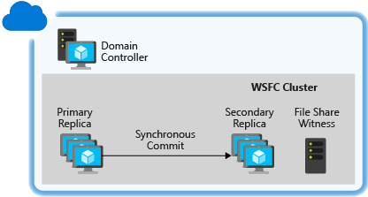
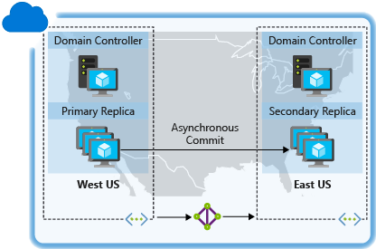
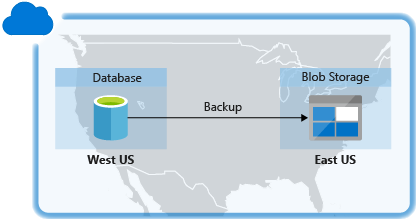
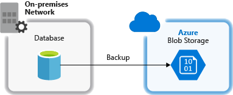
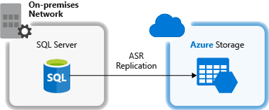
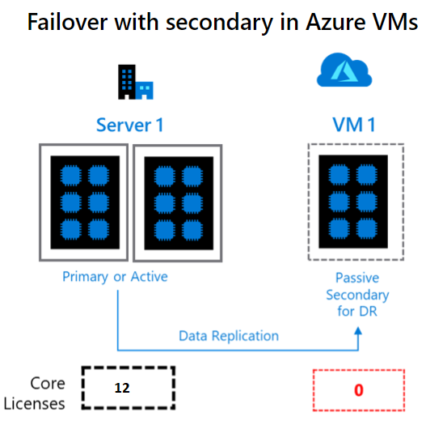
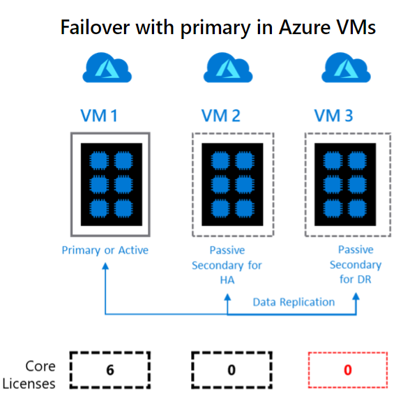
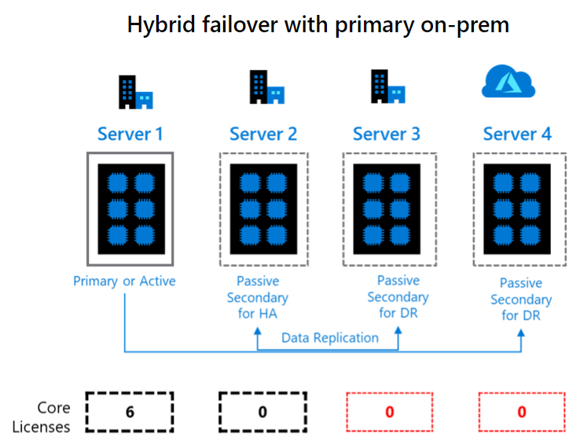

# Business continuity and HADR for SQL Server on Azure Virtual Machines
[!INCLUDE[appliesto-sqlvm](../../includes/appliesto-sqlvm.md)]

Business continuity means continuing your business in the event of a disaster, planning for recovery, and ensuring that your data is highly available. SQL Server on Azure Virtual Machines can help lower the cost of a high-availability and disaster recovery (HADR) database solution. 

Most SQL Server HADR solutions are supported on virtual machines (VMs), as both Azure-only and hybrid solutions. In an Azure-only solution, the entire HADR system runs in Azure. In a hybrid configuration, part of the solution runs in Azure and the other part runs on-premises in your organization. The flexibility of the Azure environment enables you to move partially or completely to Azure to satisfy the budget and HADR requirements of your SQL Server database systems.

This article compares and contrasts the business continuity solutions available for SQL Server on Azure VMs. 

## Overview

It's up to you to ensure that your database system has the HADR capabilities that the service-level agreement (SLA) requires. The fact that Azure provides high-availability mechanisms, such as service healing for cloud services and failure recovery detection for virtual machines, does not itself guarantee that you can meet the SLA. Although these mechanisms help protect the high availability of the virtual machine, they don't protect the availability of SQL Server running inside the VM. 

It's possible for the SQL Server instance to fail while the VM is online and healthy. Even the high-availability mechanisms provided by Azure allow for downtime of the VMs due to events like recovery from software or hardware failures and operating system upgrades.

Geo-redundant storage (GRS) in Azure is implemented with a feature called geo-replication. GRS might not be an adequate disaster recovery solution for your databases. Because geo-replication sends data asynchronously, recent updates can be lost in a disaster. More information about geo-replication limitations is covered in the [Geo-replication support](#geo-replication-support) section.

## Deployment architectures
Azure supports these SQL Server technologies for business continuity:

* [Always On availability groups](/sql/database-engine/availability-groups/windows/always-on-availability-groups-sql-server)
* [Always On failover cluster instances (FCIs)](/sql/sql-server/failover-clusters/windows/always-on-failover-cluster-instances-sql-server)
* [Log shipping](/sql/database-engine/log-shipping/about-log-shipping-sql-server)
* [SQL Server backup and restore with Azure Blob storage](/sql/relational-databases/backup-restore/sql-server-backup-and-restore-with-microsoft-azure-blob-storage-service)
* [Database mirroring](/sql/database-engine/database-mirroring/database-mirroring-sql-server) - Deprecated in SQL Server 2016

You can combine the technologies to implement a SQL Server solution that has both high-availability and disaster recovery capabilities. Depending on the technology that you use, a hybrid deployment might require a VPN tunnel with the Azure virtual network. The following sections show you some example deployment architectures.

## Azure only: High-availability solutions

You can have a high-availability solution for SQL Server at a database level with Always On availability groups. You can also create a high-availability solution at an instance level with Always On failover cluster instances. For additional protection, you can create redundancy at both levels by creating availability groups on failover cluster instances. 

| Technology | Example architectures |
| --- | --- |
| **Availability groups** |Availability replicas running in Azure VMs in the same region provide high availability. You need to configure a domain controller VM, because Windows failover clustering requires an Active Directory domain.<br/><br/> For higher redundancy and availability, the Azure VMs can be deployed in different [availability zones](../../../availability-zones/az-overview.md) as documented in the [availability group overview](availability-group-overview.md). If the SQL Server VMs in an availability group are deployed in availability zones, then use [Azure Standard Load Balancer](../../../load-balancer/load-balancer-overview.md) for the listener, as documented in the [Azure SQL VM CLI](./availability-group-az-commandline-configure.md) and [Azure Quickstart templates](availability-group-quickstart-template-configure.md) articles.<br/> <br/>For more information, see [Configure availability groups in Azure (GUI)](./availability-group-quickstart-template-configure.md). |
| **Failover cluster instances** |Failover cluster instances are supported on SQL Server VMs. Because the FCI feature requires shared storage, five solutions will work with SQL Server on Azure VMs: <br/><br/> - Using [Azure shared disks](failover-cluster-instance-azure-shared-disks-manually-configure.md) for Windows Server 2019. Shared managed disks are an Azure product that allow attaching a managed disk to multiple virtual machines simultaneously. VMs in the cluster can read or write to your attached disk based on the reservation chosen by the clustered application through SCSI Persistent Reservations (SCSI PR). SCSI PR is an industry-standard storage solution that's used by applications running on a storage area network (SAN) on-premises. Enabling SCSI PR on a managed disk allows you to migrate these applications to Azure as is. <br/><br/>- Using [Storage Spaces Direct \(S2D\)](failover-cluster-instance-storage-spaces-direct-manually-configure.md) to provide a software-based virtual SAN for Windows Server 2016 and later.<br/><br/>- Using a [Premium file share](failover-cluster-instance-premium-file-share-manually-configure.md) for Windows Server 2012 and later. Premium file shares are SSD backed, have consistently low latency, and are fully supported for use with FCI.<br/><br/>- Using storage supported by a partner solution for clustering. For a specific example that uses SIOS DataKeeper, see the blog entry [Failover clustering and SIOS DataKeeper](https://azure.microsoft.com/blog/high-availability-for-a-file-share-using-wsfc-ilb-and-3rd-party-software-sios-datakeeper/).<br/><br/>- Using shared block storage for a remote iSCSI target via Azure ExpressRoute. For example, NetApp Private Storage (NPS) exposes an iSCSI target via ExpressRoute with Equinix to Azure VMs.<br/><br/>For shared storage and data replication solutions from Microsoft partners, contact the vendor for any issues related to accessing data on failover.<br/><br/>||

## Azure only: Disaster recovery solutions
You can have a disaster recovery solution for your SQL Server databases in Azure by using availability groups, database mirroring, or backup and restore with storage blobs.

| Technology | Example architectures |
| --- | --- |
| **Availability groups** |Availability replicas running across multiple datacenters in Azure VMs for disaster recovery. This cross-region solution helps protect against a complete site outage. <br/> <br/>Within a region, all replicas should be within the same cloud service and the same virtual network. Because each region will have a separate virtual network, these solutions require network-to-network connectivity. For more information, see [Configure a network-to-network connection by using the Azure portal](../../../vpn-gateway/vpn-gateway-howto-vnet-vnet-resource-manager-portal.md). For detailed instructions, see [Configure a SQL Server Always On availability group across different Azure regions](availability-group-manually-configure-multiple-regions.md).|
| **Database mirroring** |Principal and mirror and servers running in different datacenters for disaster recovery. You must deploy them by using server certificates. SQL Server database mirroring is not supported for SQL Server 2008 or SQL Server 2008 R2 on an Azure VM. <br/> |
| **Backup and restore with Azure Blob storage** |Production databases backed up directly to Blob storage in a different datacenter for disaster recovery.<br/><br/>For more information, see [Backup and restore for SQL Server on Azure VMs](../../../azure-sql/virtual-machines/windows/backup-restore.md). |
| **Replicate and fail over SQL Server to Azure with Azure Site Recovery** |Production SQL Server instance in one Azure datacenter replicated directly to Azure Storage in a different Azure datacenter for disaster recovery.<br/><br/>For more information, see [Protect SQL Server using SQL Server disaster recovery and Azure Site Recovery](../../../site-recovery/site-recovery-sql.md). |


## Hybrid IT: Disaster recovery solutions
You can have a disaster recovery solution for your SQL Server databases in a hybrid IT environment by using availability groups, database mirroring, log shipping, and backup and restore with Azure Blob storage.

| Technology | Example Architectures |
| --- | --- |
| **Availability groups** |Some availability replicas running in Azure VMs and other replicas running on-premises for cross-site disaster recovery. The production site can be either on-premises or in an Azure datacenter.<br/><br/>Because all availability replicas must be in the same failover cluster, the cluster must span both networks (a multi-subnet failover cluster). This configuration requires a VPN connection between Azure and the on-premises network.<br/><br/>For successful disaster recovery of your databases, you should also install a replica domain controller at the disaster recovery site.|
| **Database mirroring** |One partner running in an Azure VM and the other running on-premises for cross-site disaster recovery by using server certificates. Partners don't need to be in the same Active Directory domain, and no VPN connection is required.<br/><br/>Another database mirroring scenario involves one partner running in an Azure VM and the other running on-premises in the same Active Directory domain for cross-site disaster recovery. A [VPN connection between the Azure virtual network and the on-premises network](../../../vpn-gateway/vpn-gateway-howto-site-to-site-resource-manager-portal.md) is required.<br/><br/>For successful disaster recovery of your databases, you should also install a replica domain controller at the disaster recovery site. SQL Server database mirroring is not supported for SQL Server 2008 or SQL Server 2008 R2 on an Azure VM. |
| **Log shipping** |One server running in an Azure VM and the other running on-premises for cross-site disaster recovery. Log shipping depends on Windows file sharing, so a VPN connection between the Azure virtual network and the on-premises network is required.<br/><br/>For successful disaster recovery of your databases, you should also install a replica domain controller at the disaster recovery site. |
| **Backup and restore with Azure Blob storage** |On-premises production databases backed up directly to Azure Blob storage for disaster recovery.<br/><br/>For more information, see [Backup and restore for SQL Server on Azure Virtual Machines](../../../azure-sql/virtual-machines/windows/backup-restore.md). |
| **Replicate and fail over SQL Server to Azure with Azure Site Recovery** |On-premises production SQL Server instance replicated directly to Azure Storage for disaster recovery.<br/><br/>For more information, see [Protect SQL Server using SQL Server disaster recovery and Azure Site Recovery](../../../site-recovery/site-recovery-sql.md). |


## Free DR replica in Azure

If you have [Software Assurance](https://www.microsoft.com/licensing/licensing-programs/software-assurance-default?rtc=1&activetab=software-assurance-default-pivot:primaryr3), you can implement hybrid disaster recovery (DR) plans with SQL Server without incurring additional licensing costs for the passive disaster recovery instance.

For example, you can have an active primary on-premises, and a free passive secondary for DR in Azure: 



In the preceding image, the setup uses SQL Server running on an Azure virtual machine that uses 12 cores as a disaster recovery replica for an on-premises SQL Server deployment that uses 12 cores. In the past, you would need to license 12 cores of SQL Server for the on-premises deployment and the Azure Virtual Machines deployment. The new benefit offers passive replica benefits for running on an Azure virtual machine. Now you would need to license only 12 cores of SQL Server running on-premises, as long as the disaster recovery criteria for the passive replica on Azure Virtual Machines are met.

You can also have two free passive secondaries when all three replicas are hosted in Azure: 



Or you can configure a hybrid failover environment, with a licensed primary on-premises, one free passive for HA, and two free passives for DR: 




For more information, see the [product licensing terms](https://www.microsoft.com/licensing/product-licensing/products). 

To enable this benefit, go to your [SQL Server virtual machine resource](manage-sql-vm-portal.md#access-the-sql-virtual-machines-resource). Select **Configure** under **Settings**, and then choose the **Disaster Recovery** option under **SQL Server License**. Select the check box to confirm that this SQL Server VM will be used as a passive replica, and then select **Apply** to save your settings. 


## Important considerations for SQL Server HADR in Azure
Azure VMs, storage, and networking have different operational characteristics than an on-premises, non-virtualized IT infrastructure. A successful implementation of an HADR SQL Server solution in Azure requires that you understand these differences and design your solution to accommodate them.

### High-availability nodes in an availability set
Availability sets in Azure enable you to place the high-availability nodes into separate fault domains and update domains. The Azure platform assigns an update domain and a fault domain to each virtual machine in your availability set. This configuration within a datacenter ensures that during either a planned or unplanned maintenance event, at least one virtual machine is available and meets the Azure SLA of 99.95 percent. 

To configure a high-availability setup, place all participating SQL Server virtual machines in the same availability set to avoid application or data loss during a maintenance event. Only nodes in the same cloud service can participate in the same availability set. For more information, see [Manage the availability of virtual machines](../../../virtual-machines/manage-availability.md?toc=%2fazure%2fvirtual-machines%2fwindows%2ftoc.json).

### High-availability nodes in an availability zone
Availability zones are unique physical locations within an Azure region. Each zone consists of one or more datacenters equipped with independent power, cooling, and networking. The physical separation of availability zones within a region helps protect applications and data from datacenter failures by ensuring that at least one virtual machine is available and meets the Azure SLA of 99.99 percent. 

To configure high availability, place participating SQL Server virtual machines spread across availability zones in the region. There will be additional charges for network-to-network transfers between availability zones. For more information, see [Availability zones](../../../availability-zones/az-overview.md). 


### Failover cluster behavior in Azure networking
The non-RFC-compliant DHCP service in Azure can cause the creation of certain failover cluster configurations to fail. This failure happens because the cluster network name is assigned a duplicate IP address, such as the same IP address as one of the cluster nodes. This is an issue when you use availability groups, which depend on the Windows failover cluster feature.

Consider the scenario when a two-node cluster is created and brought online:

1. The cluster comes online, and then NODE1 requests a dynamically assigned IP address for the cluster network name.
2. The DHCP service doesn't give any IP address other than NODE1's own IP address, because the DHCP service recognizes that the request comes from NODE1 itself.
3. Windows detects that a duplicate address is assigned both to NODE1 and to the failover cluster's network name, and the default cluster group fails to come online.
4. The default cluster group moves to NODE2. NODE2 treats NODE1's IP address as the cluster IP address and brings the default cluster group online.
5. When NODE2 tries to establish connectivity with NODE1, packets directed at NODE1 never leave NODE2 because it resolves NODE1's IP address to itself. NODE2 can't establish connectivity with NODE1, and then loses quorum and shuts down the cluster.
6. NODE1 can send packets to NODE2, but NODE2 can't reply. NODE1 loses quorum and shuts down the cluster.

You can avoid this scenario by assigning an unused static IP address to the cluster network name in order to bring the cluster network name online. For example, you can use a link-local IP address like 169.254.1.1. To simplify this process, see [Configuring Windows failover cluster in Azure for availability groups](https://social.technet.microsoft.com/wiki/contents/articles/14776.configuring-windows-failover-cluster-in-windows-azure-for-alwayson-availability-groups.aspx).

For more information, see [Configure availability groups in Azure (GUI)](./availability-group-quickstart-template-configure.md).

### Support for availability group listeners
Availability group listeners are supported on Azure VMs running Windows Server 2012 and later. This support is made possible by the use of load-balanced endpoints enabled on the Azure VMs that are availability group nodes. You must follow special configuration steps for the listeners to work for both client applications running in Azure and those running on-premises.

There are two main options for setting up your listener: external (public) or internal. The external (public) listener uses an internet-facing load balancer and is associated with a public virtual IP that's accessible over the internet. An internal listener uses an internal load balancer and supports only clients within the same virtual network. For either load balancer type, you must enable Direct Server Return. 

If the availability group spans multiple Azure subnets (such as a deployment that crosses Azure regions), the client connection string must include `MultisubnetFailover=True`. This results in parallel connection attempts to the replicas in the different subnets. For instructions on setting up a listener, see [Configure an ILB listener for availability groups in Azure](availability-group-listener-powershell-configure.md).


You can still connect to each availability replica separately by connecting directly to the service instance. Also, because availability groups are backward compatible with database mirroring clients, you can connect to the availability replicas like database mirroring partners as long as the replicas are configured similarly to database mirroring:

* There's one primary replica and one secondary replica.
* The secondary replica is configured as non-readable (**Readable Secondary** option set to **No**).

Here's an example client connection string that corresponds to this database mirroring-like configuration using ADO.NET or SQL Server Native Client:

```console
Data Source=ReplicaServer1;Failover Partner=ReplicaServer2;Initial Catalog=AvailabilityDatabase;
```

For more information on client connectivity, see:

* [Using Connection String Keywords with SQL Server Native Client](/sql/relational-databases/native-client/applications/using-connection-string-keywords-with-sql-server-native-client)
* [Connect Clients to a Database Mirroring Session (SQL Server)](/sql/database-engine/database-mirroring/connect-clients-to-a-database-mirroring-session-sql-server)
* [Connecting to Availability Group Listener in Hybrid IT](/archive/blogs/sqlalwayson/connecting-to-availability-group-listener-in-hybrid-it)
* [Availability Group Listeners, Client Connectivity, and Application Failover (SQL Server)](/sql/database-engine/availability-groups/windows/listeners-client-connectivity-application-failover)
* [Using Database-Mirroring Connection Strings with Availability Groups](/sql/database-engine/availability-groups/windows/listeners-client-connectivity-application-failover)

### Network latency in hybrid IT
Deploy your HADR solution with the assumption that there might be periods of high network latency between your on-premises network and Azure. When you're deploying replicas to Azure, use asynchronous commit instead of synchronous commit for the synchronization mode. When you're deploying database mirroring servers both on-premises and in Azure, use the high-performance mode instead of the high-safety mode.

### Geo-replication support
Geo-replication in Azure disks does not support the data file and log file of the same database to be stored on separate disks. GRS replicates changes on each disk independently and asynchronously. This mechanism guarantees the write order within a single disk on the geo-replicated copy, but not across geo-replicated copies of multiple disks. If you configure a database to store its data file and its log file on separate disks, the recovered disks after a disaster might contain a more up-to-date copy of the data file than the log file, which breaks the write-ahead log in SQL Server and the ACID properties (atomicity, consistency, isolation, and durability) of transactions. 

If you don't have the option to disable geo-replication on the storage account, keep all data and log files for a database on the same disk. If you must use more than one disk due to the size of the database, deploy one of the disaster recovery solutions listed earlier to ensure data redundancy.

## Next steps

Decide if an [availability group](availability-group-overview.md) or a [failover cluster instance](failover-cluster-instance-overview.md) is the best business continuity solution for your business. Then review the [best practices](hadr-cluster-best-practices.md) for configuring your environment for high availability and disaster recovery.