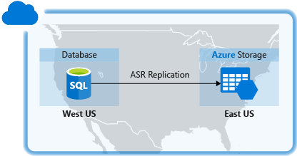
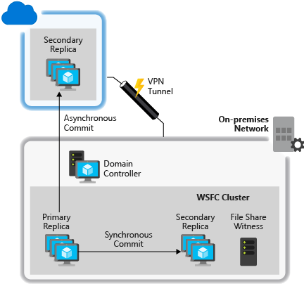
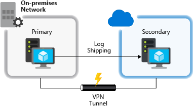
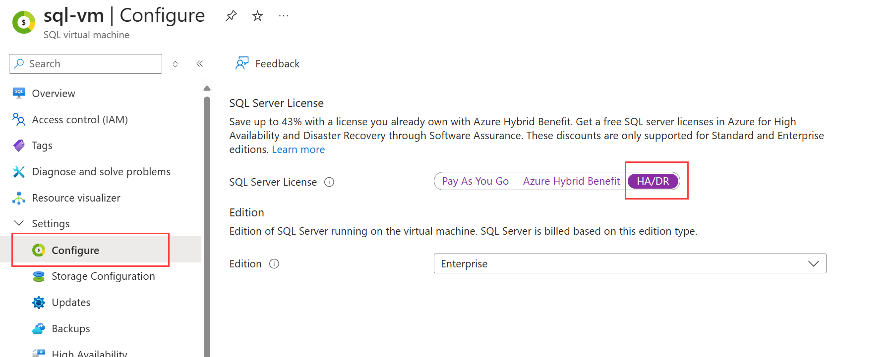

# Business continuity & HADR for SQL Server on Azure Virtual Machines
[!INCLUDE[appliesto-sqlvm](../../includes/appliesto-sqlvm.md)]

Business continuity means continuing your business in the event of a disaster, planning for recovery, and ensuring your data is highly available. SQL Server on Azure Virtual Machines can help lower the cost of a high-availability and disaster recovery (HADR) database solution. Most SQL Server HADR solutions are supported on virtual machines (VMs), both as Azure-only and as hybrid solutions. In an Azure-only solution, the entire HADR system runs in Azure. In a hybrid configuration, part of the solution runs in Azure and the other part runs on-premises in your organization. The flexibility of the Azure environment enables you to move partially or completely to Azure to satisfy the budget and HADR requirements of your SQL Server database systems.

This topic compares and contrasts different business continuity solutions available for SQL Server on Azure VMs. 

## Overview

It is up to you to ensure that your database system possesses the HADR capabilities that the service-level agreement (SLA) requires. The fact that Azure provides high-availability mechanisms, such as service healing for cloud services and failure recovery detection for virtual machines, does not itself guarantee you can meet the desired SLA. While these mechanisms protect the high availability of the virtual machine, they do not protect the availability of SQL Server running inside the VM. It is possible for the SQL Server instance to fail while the VM is online and healthy. Moreover, even the high-availability mechanisms provided by Azure allow for downtime of the VMs due to events such as recovery from software or hardware failures and operating system upgrades.

In addition, geo-redundant storage (GRS) in Azure, which is implemented with a feature called geo-replication, may not be an adequate disaster recovery solution for your databases. Because geo-replication sends data asynchronously, recent updates can be lost in the event of disaster. More information regarding geo-replication limitations are covered in the [Geo-replication not supported for data and log files on separate disks](#geo-replication-support) section.

## Deployment architectures
SQL Server business continuity technologies that are supported in Azure include:

* [Always On availability groups](/sql/database-engine/availability-groups/windows/always-on-availability-groups-sql-server)
* [Always On failover cluster instances](/sql/sql-server/failover-clusters/windows/always-on-failover-cluster-instances-sql-server)
* [Log Shipping](/sql/database-engine/log-shipping/about-log-shipping-sql-server)
* [SQL Server Backup and Restore with Azure Blob Storage Service](/sql/relational-databases/backup-restore/sql-server-backup-and-restore-with-microsoft-azure-blob-storage-service)
* [Database Mirroring](/sql/database-engine/database-mirroring/database-mirroring-sql-server) - Deprecated in SQL Server 2016

It is possible to combine the technologies together to implement a SQL Server solution that has both high-availability and disaster recovery capabilities. Depending on the technology you use, a hybrid deployment may require a VPN tunnel with the Azure virtual network. The sections below show you some of the example deployment architectures.

## Azure-only: High-availability solutions

You can have a high-availability solution for SQL Server at a database level with Always On Availability Groups - called availability groups. You can also create a high-availability solution at an instance level with Always On Failover Cluster Instances - failover cluster instances. For additional redundancy, you can create redundancy at both levels by creating availability groups on failover cluster instances. 

| Technology | Example architectures |
| --- | --- |
| **Availability groups** |Availability replicas running in Azure VMs in the same region provide high availability.  You need to configure a domain controller VM, because Windows failover clustering requires an Active Directory domain.   For higher redundancy and availability the Azure VMs can be deployed in different [availability zones](../../../availability-zones/az-overview.md) as documented in the [availability group overview](availability-group-overview.md). If the SQL Server VMs in an availability group are deployed in availability zones, then use [standard load balancer](../../../load-balancer/load-balancer-standard-overview.md) for listener as documented in these articles - [Azure SQL VM CLI](availability-group-az-cli-configure.md) & [Azure Quickstart templates](availability-group-quickstart-template-configure.md).   For more information, see [Configure Availability Groups in Azure (GUI)](availability-group-azure-marketplace-template-configure.md). |
| **Failover cluster instances** |Failover cluster instances (FCI) are supported on SQL Server VMs. Since the FCI feature requires shared storage, there are 5 solutions that will work with SQL Server on Azure VMs:    1. Using [Azure Shared Disks](failover-cluster-instance-azure-shared-disks-manually-configure.md) for Windows Server 2019. Shared Managed Disks are an Azure product that allows attaching a managed disk to multiple virtual machines simultaneously. VMs in the cluster can read or write to your attached disk based on the reservation chosen by the clustered application using SCSI Persistent Reservations. SCSI PR is an industry standard leveraged by applications running on Storage Area Network (SAN) on-premises. Enabling SCSI PR on a managed disk allows you to migrate these applications to Azure as-is   2. Using [Storage Spaces Direct \(S2D\)](failover-cluster-instance-storage-spaces-direct-manually-configure.md) to provide a software-based virtual SAN for Windows Server 2016 and later.  3. Using [Premium File Share](failover-cluster-instance-premium-file-share-manually-configure.md) for Windows Server 2012 and later. Premium file shares are SSD-backed consistently-low-latency file shares that are fully supported for use with FCI.  4. Using storage supported by a third-party clustering solution. For a specific example that uses SIOS DataKeeper, see the blog [Failover clustering and SIOS DataKeeper](https://azure.microsoft.com/blog/high-availability-for-a-file-share-using-wsfc-ilb-and-3rd-party-software-sios-datakeeper/).  5. Using remote iSCSI Target shared block storage via ExpressRoute. For example, NetApp Private Storage (NPS) exposes an iSCSI target via ExpressRoute with Equinix to Azure VMs.  For third-party shared storage and data replication solutions, you should contact the vendor for any issues related to accessing data on failover.  ||

## Azure-only: Disaster recovery solutions
You can have a disaster recovery solution for your SQL Server databases in Azure using availability groups, database mirroring, or backup and restore with storage blobs.

| Technology | Example architectures |
| --- | --- |
| **Availability groups** |Availability replicas running across multiple datacenters in Azure VMs for disaster recovery. This cross-region solution protects against complete site outage.    Within a region, all replicas should be within the same cloud service and the same VNet. Because each region will have a separate VNet, these solutions require VNet to VNet connectivity. For more information, see [Configure a VNet-to-VNet connection using the Azure portal](../../../vpn-gateway/vpn-gateway-howto-vnet-vnet-resource-manager-portal.md). For detailed instructions, see [Configure a SQL Server Availability Group on Azure Virtual Machines in Different Regions](availability-group-manually-configure-multiple-regions.md).|
| **Database mirroring** |Principal and mirror and servers running in different datacenters for disaster recovery. You must deploy using server certificates. SQL Server database mirroring is not supported for SQL Server 2008 nor SQL Server 2008 R2 on an Azure VM.   |
| **Backup and restore with Azure Blob storage** |Production databases backed up directly to blob storage in a different datacenter for disaster recovery.  For more information, see [Backup and Restore for SQL Server on Azure Virtual Machines](../../../azure-sql/virtual-machines/windows/backup-restore.md). |
| **Replicate and failover SQL Server to Azure with Azure Site Recovery** |Production SQL Server of one Azure datacenter  replicated directly to Azure Storage of different Azure datacenter for disaster recovery.  For more information, see [Protect SQL Server using SQL Server disaster recovery and Azure Site Recovery](../../../site-recovery/site-recovery-sql.md). |

## Hybrid IT: Disaster recovery solutions
You can have a disaster recovery solution for your SQL Server databases in a hybrid-IT environment using availability groups, database mirroring, log shipping, and backup and restore with Azure blog storage.

| Technology | Example Architectures |
| --- | --- |
| **Availability groups** |Some availability replicas running in Azure VMs and other replicas running on-premises for cross-site disaster recovery. The production site can be either on-premises or in an Azure datacenter.  Because all availability replicas must be in the same failover cluster, the cluster must span both networks (a multi-subnet failover cluster). This configuration requires a VPN connection between Azure and the on-premises network.  For successful disaster recovery of your databases, you should also install a replica domain controller at the disaster recovery site.  It is possible to use the Add Replica Wizard in SSMS to add an Azure replica to an existing Always On Availability Group. For more information, see Tutorial: Extend your Always On Availability Group to Azure. |
| **Database mirroring** |One partner running in an Azure VM and the other running on-premises for cross-site disaster recovery using server certificates. Partners do not need to be in the same Active Directory domain, and no VPN connection is required.  Another database mirroring scenario involves one partner running in an Azure VM and the other running on-premises in the same Active Directory domain for cross-site disaster recovery. A [VPN connection between the Azure virtual network and the on-premises network](../../../vpn-gateway/vpn-gateway-howto-site-to-site-resource-manager-portal.md) is required.  For successful disaster recovery of your databases, you should also install a replica domain controller at the disaster recovery site. SQL Server database mirroring is not supported for SQL Server 2008 nor SQL Server 2008 R2 on an Azure VM. |
| **Log shipping** |One server running in an Azure VM and the other running on-premises for cross-site disaster recovery. Log shipping depends on Windows file sharing, so a VPN connection between the Azure virtual network and the on-premises network is required.  For successful disaster recovery of your databases, you should also install a replica domain controller at the disaster recovery site. |
| **Backup and restore with Azure Blob storage** |On-premises production databases backed up directly to Azure blob storage for disaster recovery.  For more information, see [Backup and Restore for SQL Server on Azure Virtual Machines](../../../azure-sql/virtual-machines/windows/backup-restore.md). |
| **Replicate and fail over SQL Server to Azure with Azure Site Recovery** |On-premises production SQL Server replicated directly to Azure Storage for disaster recovery.  For more information, see [Protect SQL Server using SQL Server disaster recovery and Azure Site Recovery](../../../site-recovery/site-recovery-sql.md). |

## Free DR replica in Azure

If you have [Software Assurance](https://www.microsoft.com/licensing/licensing-programs/software-assurance-default?rtc=1&activetab=software-assurance-default-pivot:primaryr3), you can implement hybrid disaster recovery (DR) plans with SQL Server without incurring additional licensing costs for the passive DR instance.

In the image below, the setup uses SQL Server running on an Azure virtual machine utilizing 12 cores as a disaster recovery replica for an on-premises SQL Server deployment using 12 cores. In the past, you would need to license 12 cores of SQL Server for the on-premises and the Azure Virtual Machines deployment. The new benefit offers passive replica benefits running on an Azure virtual machine. Now you would need to only license 12 cores of SQL Server running on-premises as long as the disaster recovery criteria for the passive replica on Azure Virtual Machines is met.

For more information, see the [Product Licensing Terms](https://www.microsoft.com/licensing/product-licensing/products). 

To enable this benefit, navigate to your [SQL Server virtual machine resource](manage-sql-vm-portal.md#access-the-sql-virtual-machines-resource), select **Configure** under settings, and then choose the **Disaster Recovery** option under **SQL Server License**. Select the checkbox to confirm that this SQL Server VM will be used as a passive replica, and then select **Apply** to save your settings. 

## Important considerations for SQL Server HADR in Azure
Azure VMs, storage, and networking have different operational characteristics than an on-premises, non-virtualized IT infrastructure. A successful implementation of a HADR SQL Server solution in Azure requires that you understand these differences and design your solution to accommodate them.

### High-availability nodes in an availability set
Availability sets in Azure enable you to place the high-availability nodes into separate Fault Domains (FDs) and Update Domains (UDs). Each virtual machine in your availability set is assigned an update domain and a fault domain by the underlying Azure platform. This configuration within a datacenter ensures that during either a planned or unplanned maintenance event, at least one virtual machine is available and meets the 99.95% Azure SLA. To configure a high-availability setup, place all participating SQL virtual machines in the same availability set to avoid application or data loss during a maintenance event. Only nodes in the same cloud service can participate in the same availability set. For more information, see [Manage the availability of virtual machines](../../../virtual-machines/windows/manage-availability.md?toc=%2fazure%2fvirtual-machines%2fwindows%2ftoc.json).

### High-availability nodes in an availability zone
Availability Zones are unique physical locations within an Azure region. Each zone is made up of one or more datacenters equipped with independent power, cooling, and networking. The physical separation of Availability Zones within a region protects applications and data from datacenter failures by ensuring at least one virtual machine is available and meets 99.99% Azure SLA. To configure high availability, place participating SQL virtual machines spread across available Availability Zones in the region. There will be additional inter-Availability Zone VM-to-VM data transfer charges. For more information, see [Availability zones](/azure/availability-zones/az-overview). 

### Failover cluster behavior in Azure networking
The non-RFC-compliant DHCP service in Azure can cause the creation of certain failover cluster configurations to fail, due to the cluster network name being assigned a duplicate IP address, such as the same IP address as one of the cluster nodes. This is an issue when you implement Availability Groups, which depend on the Windows failover cluster feature.

Consider the scenario when a two-node cluster is created and brought online:

1. The cluster comes online, then NODE1 requests a dynamically assigned IP address for the cluster network name.
2. No IP address other than NODE1’s own IP address is given by the DHCP service, since the DHCP service recognizes that the request comes from NODE1 itself.
3. Windows detects that a duplicate address is assigned both to NODE1 and to the failover cluster network name, and the default cluster group fails to come online.
4. The default cluster group moves to NODE2, which treats NODE1’s IP address as the cluster IP address and brings the default cluster group online.
5. When NODE2 attempts to establish connectivity with NODE1, packets directed at NODE1 never leave NODE2 because it resolves NODE1’s IP address to itself. NODE2 cannot establish connectivity with NODE1, then loses quorum and shuts down the cluster.
6. In the meantime, NODE1 can send packets to NODE2, but NODE2 cannot reply. NODE1 loses quorum and shuts down the cluster.

This scenario can be avoided by assigning an unused static IP address, such as a link-local IP address like 169.254.1.1, to the cluster network name in order to bring the cluster network name online. To simplify this process, see [Configuring Windows failover cluster in Azure for availability groups](https://social.technet.microsoft.com/wiki/contents/articles/14776.configuring-windows-failover-cluster-in-windows-azure-for-alwayson-availability-groups.aspx).

For more information, see [Configure availability groups in Azure (GUI)](availability-group-azure-marketplace-template-configure.md).

### Availability group listener support
Availability group listeners are supported on Azure VMs running Windows Server 2012, Windows Server 2012 R2, and Windows Server 2016. This support is made possible by the use of load-balanced endpoints enabled on the Azure VMs that are availability group nodes. You must follow special configuration steps for the listeners to work for both client applications that are running in Azure as well as those running on-premises.

There are two main options for setting up your listener: external (public) or internal. The external (public) listener uses an internet facing load balancer and is associated with a public Virtual IP (VIP) that is accessible over the internet. An internal listener uses an internal load balancer and only supports clients within the same Virtual Network. For either load balancer type, you must enable Direct Server Return. 

If the availability group spans multiple Azure subnets (such as a deployment that crosses Azure regions), the client connection string must include `MultisubnetFailover=True`. This results in parallel connection attempts to the replicas in the different subnets. For instructions on setting up a listener, see[Configure an ILB listener for availability groups in Azure](availability-group-listener-powershell-configure.md).

You can still connect to each availability replica separately by connecting directly to the service instance. Also, since availability groups are backward compatible with database mirroring clients, you can connect to the availability replicas like database mirroring partners as long as the replicas are configured similar to database mirroring:

* One primary replica and one secondary replica
* The secondary replica is configured as non-readable (**Readable Secondary** option set to **No**)

An example client connection string that corresponds to this database mirroring-like configuration using ADO.NET or SQL Server Native Client is below:

    Data Source=ReplicaServer1;Failover Partner=ReplicaServer2;Initial Catalog=AvailabilityDatabase;

For more information on client connectivity, see:

* [Using Connection String Keywords with SQL Server Native Client](https://msdn.microsoft.com/library/ms130822.aspx)
* [Connect Clients to a Database Mirroring Session (SQL Server)](https://technet.microsoft.com/library/ms175484.aspx)
* [Connecting to Availability Group Listener in Hybrid IT](https://blogs.msdn.com/b/sqlalwayson/archive/2013/02/14/connecting-to-availability-group-listener-in-hybrid-it.aspx)
* [Availability Group Listeners, Client Connectivity, and Application Failover (SQL Server)](https://technet.microsoft.com/library/hh213417.aspx)
* [Using Database-Mirroring Connection Strings with Availability Groups](https://technet.microsoft.com/library/hh213417.aspx)

### Network latency in hybrid IT
You should deploy your HADR solution with the assumption that there may be periods of time with high network latency between your on-premises network and Azure. When deploying replicas to Azure, you should use asynchronous commit instead of synchronous commit for the synchronization mode. When deploying database mirroring servers both on-premises and in Azure, use the high-performance mode instead of the high-safety mode.

### Geo-replication support
Geo-replication in Azure disks does not support the data file and log file of the same database to be stored on separate disks. GRS replicates changes on each disk independently and asynchronously. This mechanism guarantees the write order within a single disk on the geo-replicated copy, but not across geo-replicated copies of multiple disks. If you configure a database to store its data file and its log file on separate disks, the recovered disks after a disaster may contain a more up-to-date copy of the data file than the log file, which breaks the write-ahead log in SQL Server and the ACID properties of transactions. If you do not have the option to disable geo-replication on the storage account, you should keep all data and log files for a given database on the same disk. If you must use more than one disk due to the size of the database, you need to deploy one of the disaster recovery solutions listed above to ensure data redundancy.

## Next steps

Decide if an [availability group](availability-group-overview.md) or a [failover cluster instance](failover-cluster-instance-overview.md) is the best business continuity solution for your business, and then review the [best practices](hadr-cluster-best-practices.md) for configuring your environment for high availability and disaster recovery. 

