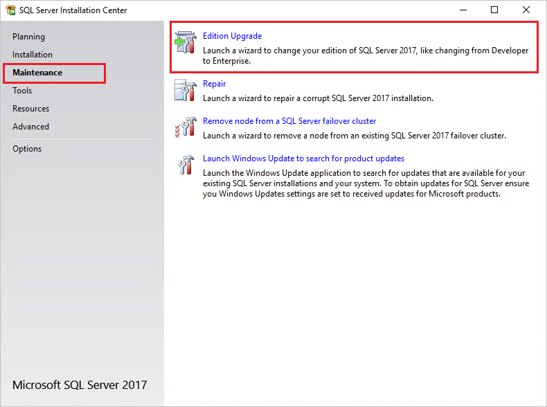
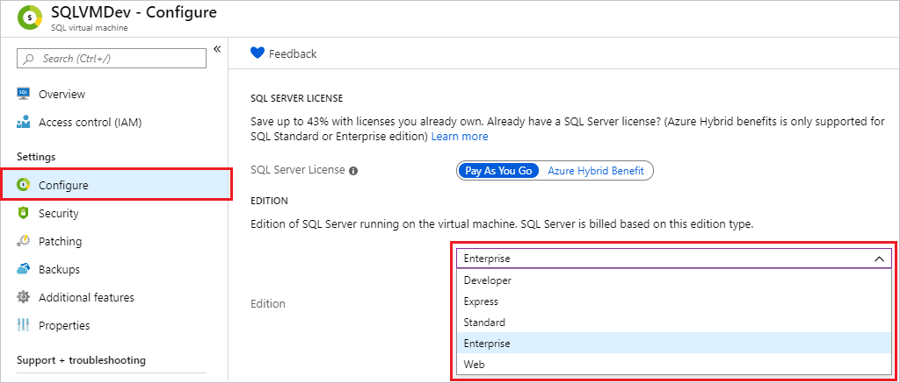

# In-place change of SQL Server edition on Azure VM

This article describes how to change the edition of SQL Server on a Windows virtual machine in Azure. 

The edition of SQL Server is determined by the product key, and is specified during the installation process using the installation media. The edition dictates what [features](/sql/sql-server/editions-and-components-of-sql-server-2017) are available in the SQL Server product. You can change the SQL Server edition with the installation media and either downgrade to reduce cost or upgrade to enable more features.

Once the edition of SQL Server has been changed internally to the SQL Server VM, you must then update the edition property of SQL Server in the Azure portal for billing purposes. 

## Prerequisites

To do an in-place change of the edition of SQL Server, you need the following: 

- An [Azure subscription](https://azure.microsoft.com/free/).
- A [SQL Server VM on Windows](https://docs.microsoft.com/azure/virtual-machines/windows/sql/virtual-machines-windows-portal-sql-server-provision) registered with the [SQL VM resource provider](sql-vm-resource-provider-register.md).
- Setup media with the **desired edition** of SQL Server. Customers who have [Software Assurance](https://www.microsoft.com/licensing/licensing-programs/software-assurance-default) can obtain their installation media from the [Volume Licensing Center](https://www.microsoft.com/Licensing/servicecenter/default.aspx). Customers who don't have Software Assurance can use the setup media from an Azure Marketplace SQL Server VM image that has their desired edition (typically located in `C:\SQLServerFull`). 

## Upgrade an edition

> [!WARNING]
> Upgrading the edition of SQL Server will restart the service for SQL Server, along with any associated services, such as Analysis Services and R Services. 

To upgrade the edition of SQL Server, obtain the SQL Server setup media for the desired edition of SQL Server, and then do the following:

1. Open Setup.exe from the SQL Server installation media. 
1. Go to **Maintenance** and choose the **Edition Upgrade** option. 

   

1. Select **Next** until you reach the **Ready to upgrade edition** page, and then select **Upgrade**. The setup window might stop responding for a few minutes while the change is taking effect. A **Complete** page will confirm that your edition upgrade is finished. 

After the SQL Server edition is upgraded, modify the edition property of the SQL Server virtual machine in the Azure portal. This will update the metadata and billing associated with this VM.

## Downgrade an edition

To downgrade the edition of SQL Server, you need to completely uninstall SQL Server, and reinstall it again with the desired edition setup media. 

> [!WARNING]
> Uninstalling SQL Server might incur additional downtime. 

You can downgrade the edition of SQL Server by following these steps:

1. Back up all databases, including the system databases. 
1. Move system databases (master, model, and msdb) to a new location. 
1. Completely uninstall SQL Server and all associated services. 
1. Restart the virtual machine. 
1. Install SQL Server by using the media with the desired edition of SQL Server.
1. Install the latest service packs and cumulative updates.  
1. Replace the new system databases that were created during installation with the system databases that you previously moved to a different location. 

After the SQL Server edition is downgraded, modify the edition property of the SQL Server virtual machine in the Azure portal. This will update the metadata and billing associated with this VM.

## Change edition in portal 

Once you've changed the edition of SQL Server using the installation media, and you've registered your SQL Server VM with the [SQL VM resource provider](sql-vm-resource-provider-register.md), you can then use the Azure portal to modify the Edition property of the SQL Server VM for billing purposes. To do so, follow these steps: 

1. Sign in to the [Azure portal](https://portal.azure.com). 
1. Go to your SQL Server virtual machine resource. 
1. Under **Settings**, select **Configure**. Then select your desired edition of SQL Server from the drop-down list under **Edition**. 

   

1. Review the warning that says you must change the SQL Server edition first, and that the edition property must match the SQL Server edition. 
1. Select **Apply** to apply your edition metadata changes. 

## Remarks

- The edition property for the SQL Server VM must match the edition of the SQL Server instance installed for all SQL Server virtual machines, including both pay-as-you-go and bring-your-own-license types of licenses.
- If you drop your SQL Server VM resource, you will go back to the hard-coded edition setting of the image.
- The ability to change the edition is a feature of the SQL VM resource provider. Deploying an Azure Marketplace image through the Azure portal automatically registers a SQL Server VM with the resource provider. However, customers who are self-installing SQL Server will need to manually [register their SQL Server VM](sql-vm-resource-provider-register.md).
- Adding a SQL Server VM to an availability set requires re-creating the VM. Any VMs added to an availability set will go back to the default edition, and the edition will need to be modified again.

## Next steps

For more information, see the following articles: 

* [Overview of SQL Server on a Windows VM](sql-server-on-azure-vm-iaas-what-is-overview.md)
* [FAQ for SQL Server on a Windows VM](frequently-asked-questions-faq.md)
* [Pricing guidance for SQL Server on a Windows VM](pricing-guidance.md)
* [Release notes for SQL Server on a Windows VM](doc-changes-updates-release-notes.md)

