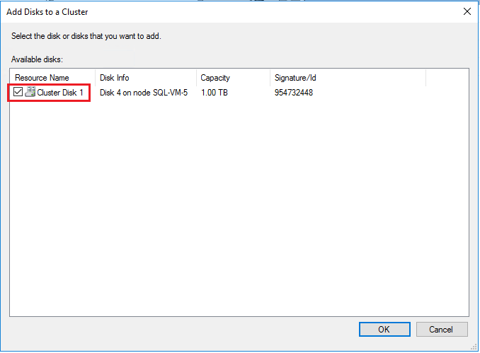
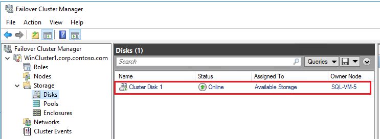
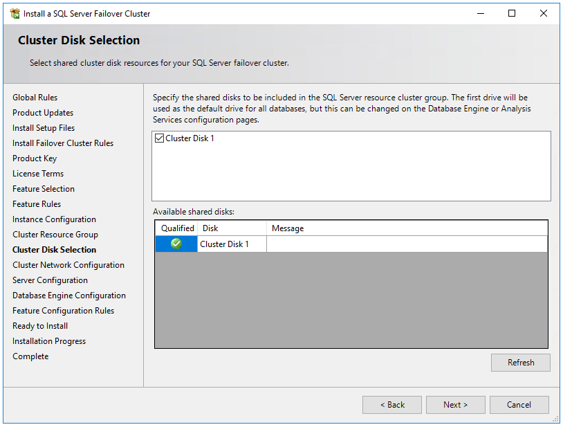

# Create an FCI with Azure shared disks (SQL Server on Azure VMs)
[!INCLUDE[appliesto-sqlvm](../../includes/appliesto-sqlvm.md)]

This article explains how to create a failover cluster instance (FCI) by using Azure shared disks with SQL Server on Azure Virtual Machines (VMs). 

To learn more, see an overview of [FCI with SQL Server on Azure VMs](failover-cluster-instance-overview.md) and [cluster best practices](hadr-cluster-best-practices.md). 

> [!NOTE]
> It's now possible to lift and shift your failover cluster instance solution to SQL Server on Azure VMs using Azure Migrate. See [Migrate failover cluster instance](../../migration-guides/virtual-machines/sql-server-failover-cluster-instance-to-sql-on-azure-vm.md) to learn more. 

## Prerequisites 

Before you complete the instructions in this article, you should already have:

- An Azure subscription. Get started for [free](https://azure.microsoft.com/free/). 
- [Two or more prepared Windows Azure virtual machines](failover-cluster-instance-prepare-vm.md). [Availability sets](../../../virtual-machines/windows/tutorial-availability-sets.md) and [proximity placement groups](../../../virtual-machines/co-location.md#proximity-placement-groups) (PPGs) supported for Premium SSD and [availability zones](../../../virtual-machines/windows/create-portal-availability-zone.md#confirm-zone-for-managed-disk-and-ip-address) are supported for Ultra Disks. 
- An account that has permissions to create objects on both Azure virtual machines and in Active Directory.
- The latest version of [PowerShell](/powershell/azure/install-az-ps). 

## Add Azure shared disk
[Deploy a managed Premium SSD disk with the shared disk feature enabled](/azure/virtual-machines/disks-shared-enable?tabs=azure-portal#deploy-a-premium-ssd-as-a-shared-disk). Set `maxShares` to **align with the number of cluster nodes** to make the disk shareable across all FCI nodes. 

## Attach shared disk to VMs
Once you've deployed a shared disk with maxShares>1, you can mount the disk to one or more of your VMs.

Follow these steps to attach the shared disk on all the VMs that will be part of FCI. 

1. Select the VM in Azure portal for which you want to attach the shared disk.
2. From the menu on the left, select **Disks**.
3. Select **Attach existing disks** to attach the shared disk to the VM. 
4. Select the shared disk under **Disk name** drop down. 
5. Select **Save**.

After a few moments, the shared data disk is attached to the VM and appears in the list of Data disks for that VM.

## Initialize shared disk
Once the shared disk is attached on all the VMs, follow the steps to initialize the disk from **all** of the VMs that will be part of FCI. . 
 
1. Connect to one of the VM.
2. Select the Windows **Start** menu inside the running VM and enter **diskmgmt.msc** in the search box. The **Disk Management** console opens.
3. Disk Management recognizes that you have a new, uninitialized disk and the **Initialize Disk** window appears.
4. Verify the new disk is selected and then select **OK** to initialize it.
5. The new disk appears as **unallocated**. Right-click anywhere on the disk and select **New simple volume**. The **New Simple Volume Wizard** window opens.
6. Proceed through the wizard, keeping all of the defaults, and when you're done select **Finish**.
7. Close **Disk Management**.
8. A pop-up window appears notifying you that you need to format the new disk before you can use it. Select **Format disk**.
9. In the **Format new disk** window, check the settings, and then select **Start**.
10. A warning appears notifying you that formatting the disks erases all of the data. Select **OK**.
11. When the formatting is complete, select **OK**.
12. Repeat the steps from other VMs that will be part of FCI. 

## Create Windows Failover Cluster - Multi subnet scenario
Follow [these steps](/azure/azure-sql/virtual-machines/windows/availability-group-manually-configure-tutorial-multi-subnet#add-failover-cluster-feature) to create Windows Failover Cluster in multi subnet scenario. 

## Create Windows Failover Cluster - Single subnet scenario
Follow [these steps](/azure/azure-sql/virtual-machines/windows/availability-group-manually-configure-tutorial-single-subnet#create-the-cluster) to create Windows Failover Cluster in single subnet scenario. 

## Configure quorum

Since the disk witness is the most resilient quorum option, and the FCI solution uses Azure shared disks, it's recommended to configure a disk witness as the quorum solution. 

If you have an even number of votes in the cluster, configure the [quorum solution](hadr-cluster-quorum-configure-how-to.md) that best suits your business needs. For more information, see [Quorum with SQL Server VMs](hadr-windows-server-failover-cluster-overview.md#quorum). 

## Validate cluster
Validate the cluster in the UI or by using PowerShell.

To validate the cluster by using the UI, do the following on one of the virtual machines:

1. Under **Server Manager**, select **Tools**, and then select **Failover Cluster Manager**.
2. Under **Failover Cluster Manager**, select **Action**, and then select **Validate Configuration**.
3. Select **Next**.
4. Under **Select Servers or a Cluster**, enter the names of both virtual machines.
5. Under **Testing options**, select **Run only tests I select**. 
6. Select **Next**.
7. Under **Test Selection**, select all tests *except* **Storage**

## Test cluster failover

Test the failover of your cluster. In **Failover Cluster Manager**, right-click your cluster, select **More Actions** > **Move Core Cluster Resource** > **Select node**, and then select the other node of the cluster. Move the core cluster resource to every node of the cluster, and then move it back to the primary node. Ensure you can successfully move the cluster to each node before installing SQL Server.

:::image type="content" source="media/failover-cluster-instance-premium-file-share-manually-configure/test-cluster-failover.png" alt-text="Test cluster failover by moving the core resource to the other nodes":::

## Add shared disks to Windows Failover Cluster

Follow the steps to add the Azure Shared Disks that were attached to the VM to Windows Failover Cluster
1. In the **Server Manager** dashboard, select **Tools**, and then select **Failover Cluster Manager**.
2. Expand the cluster that has been created.
3. Select **Storage** and select **Disks**. 
4. Right click **Disks** and select **Add Disk**
    
5. In **Add Disks to a Cluster** window ensure the Azure shared disks are selected. Select **Ok**.
    
6. Once the shared disk is added you should be able to see it in Failover Cluster Manager.
    


## Create SQL Server FCI

After you've configured the failover cluster and all cluster components, including storage, you can create the SQL Server FCI.

1. Connect to the first virtual machine by using Remote Desktop Protocol (RDP).

2. In **Failover Cluster Manager**, make sure that all core cluster resources are on the first virtual machine. If necessary, move the disks to that virtual machine.

3. Locate the installation media. If the virtual machine uses one of the Azure Marketplace images, the media is located at `C:\SQLServer_<version number>_Full`. 

4. Select **Setup**.

5. In **SQL Server Installation Center**, select **Installation**.

6. Select **New SQL Server failover cluster installation**. Follow the instructions in the wizard to install the SQL Server FCI.

7. In **Cluster Disk Selection**, ensure to select all the shared disks that were attached to the VM. 
    

8. In **Cluster Network Configuration**,if all the SQL Server VMs that will be part of FCI are in multiple subnet, enter the first node's secondary IP that was dedicated for SQL Server FCI.
    

9. In **Cluster Network Configuration**, if all the SQL Server VMs are in single subnet, enter the IP address that will be [added to Azure Load Balancer](/azure/azure-sql/virtual-machines/windows/failover-cluster-instance-vnn-azure-load-balancer-configure)

10. In **Database Engine Configuration** ensure the database directories are on Azure shared disk. 

11. After you complete the instructions in the wizard, Setup will install a SQL Server FCI on the first node.

12. After Setup installs the FCI on the first node, connect to the second node by using RDP.

13. Open the **SQL Server Installation Center**, and then select **Installation**.

14. Select **Add node to a SQL Server failover cluster**. Follow the instructions in the wizard to install SQL Server and add the node to the FCI.

15. For multi subnet scenario, in **Cluster Network Configuration**, enter the second node's secondary IP that was dedicated for SQL Server FCI.
    

    After selecting **Next** in **Cluster Network Configuration**, setup will show following information to confirm multi subnet configuration. Select **Yes**

    

16. After you complete the instructions in the wizard, setup will add the second node to SQL Server FCI.

17. Repeat these steps on any other nodes that you want to add to the SQL Server failover cluster instance. 


   >[!NOTE]
   >If you used an Azure Marketplace gallery image that contains SQL Server, SQL Server tools were included with the image. If you didn't use one of those images, install the SQL Server tools separately. For more information, see [Download SQL Server Management Studio (SSMS)](/sql/ssms/download-sql-server-management-studio-ssms).
   >

## Register with the SQL VM RP

To manage your SQL Server VM from the portal, register it with the SQL IaaS Agent extension (RP) in [lightweight management mode](sql-agent-extension-manually-register-single-vm.md#lightweight-mode), currently the only mode supported with FCI and SQL Server on Azure VMs. 

Register a SQL Server VM in lightweight mode with PowerShell:  

```powershell-interactive
# Get the existing compute VM
$vm = Get-AzVM -Name <vm_name> -ResourceGroupName <resource_group_name>

# Register SQL VM with 'Lightweight' SQL IaaS agent
New-AzSqlVM -Name $vm.Name -ResourceGroupName $vm.ResourceGroupName -Location $vm.Location `
   -LicenseType PAYG -SqlManagementType LightWeight  
```

## Configure connectivity for single subnet scenario

You can configure a virtual network name, or a distributed network name for a failover cluster instance. [Review the differences between the two](hadr-windows-server-failover-cluster-overview.md#virtual-network-name-vnn) and then deploy either a [distributed network name](failover-cluster-instance-distributed-network-name-dnn-configure.md) or a [virtual network name](failover-cluster-instance-vnn-azure-load-balancer-configure.md) for your failover cluster instance.  

## Limitations

- Only registering with the SQL IaaS Agent extension in [lightweight management mode](sql-server-iaas-agent-extension-automate-management.md#management-modes) is supported.

## Next steps

If you haven't already done so, configure connectivity to your single subnet FCI with a [virtual network name and an Azure load balancer](failover-cluster-instance-vnn-azure-load-balancer-configure.md) or [distributed network name (DNN)](failover-cluster-instance-distributed-network-name-dnn-configure.md). 

If Azure shared disks are not the appropriate FCI storage solution for you, consider creating your FCI using [premium file shares](failover-cluster-instance-premium-file-share-manually-configure.md) or [Storage Spaces Direct](failover-cluster-instance-storage-spaces-direct-manually-configure.md) instead. 

To learn more, see an overview of [FCI with SQL Server on Azure VMs](failover-cluster-instance-overview.md) and [cluster configuration best practices](hadr-cluster-best-practices.md).


To learn more, see:

- [Windows Server Failover Cluster with SQL Server on Azure VMs](hadr-windows-server-failover-cluster-overview.md)
- [Failover cluster instances with SQL Server on Azure VMs](failover-cluster-instance-overview.md)
- [Failover cluster instance overview](/sql/sql-server/failover-clusters/windows/always-on-failover-cluster-instances-sql-server)
- [HADR settings for SQL Server on Azure VMs](hadr-cluster-best-practices.md)
