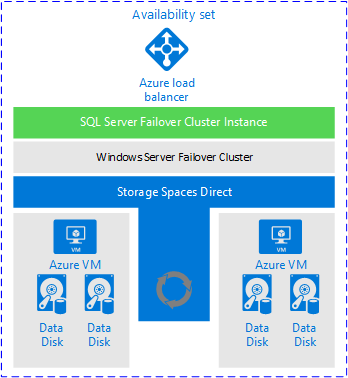
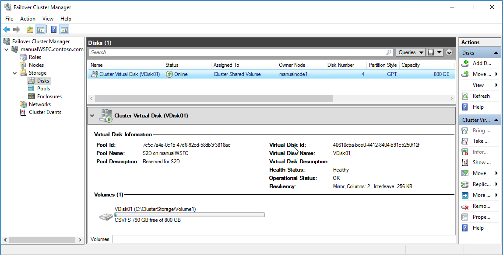
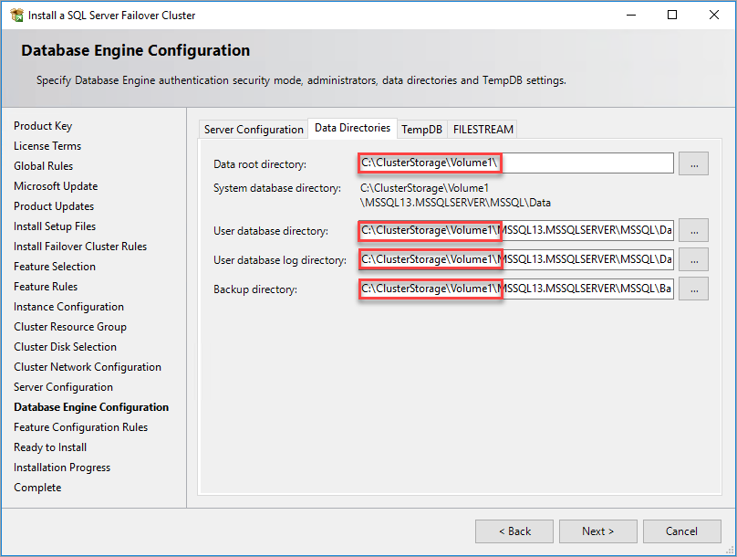

# Create an FCI with Storage Spaces Direct (SQL Server on Azure VMs)
[!INCLUDE[appliesto-sqlvm](../../includes/appliesto-sqlvm.md)]

This article explains how to create a failover cluster instance (FCI) by using [Storage Spaces Direct](/windows-server/storage/storage-spaces/storage-spaces-direct-overview) with SQL Server on Azure Virtual Machines (VMs). Storage Spaces Direct acts as a software-based virtual storage area network (VSAN) that synchronizes the storage (data disks) between the nodes (Azure VMs) in a Windows cluster. 

To learn more, see an overview of [FCI with SQL Server on Azure VMs](failover-cluster-instance-overview.md) and [cluster best practices](hadr-cluster-best-practices.md). 


## Overview 

[Storage Spaces Direct (S2D)](/windows-server/storage/storage-spaces/storage-spaces-direct-overview) supports two types of architectures: converged and hyperconverged. A hyperconverged infrastructure places the storage on the same servers that host the clustered application, so that storage is on each SQL Server FCI node. 

The following diagram shows the complete solution, which uses hyperconverged Storage Spaces Direct with SQL Server on Azure VMs: 



The preceding diagram shows the following resources in the same resource group:

- Two virtual machines in a Windows Server failover cluster. When a virtual machine is in a failover cluster, it's also called a *cluster node* or *node*.
- Each virtual machine has two or more data disks.
- Storage Spaces Direct synchronizes the data on the data disks and presents the synchronized storage as a storage pool.
- The storage pool presents a Cluster Shared Volume (CSV) to the failover cluster.
- The SQL Server FCI cluster role uses the CSV for the data drives.
- An Azure load balancer to hold the IP address for the SQL Server FCI.
- An Azure availability set holds all the resources.

   > [!NOTE]
   > You can create this entire solution in Azure from a template. An example of a template is available on the GitHub [Azure quickstart templates](https://github.com/MSBrett/azure-quickstart-templates/tree/master/sql-server-2016-fci-existing-vnet-and-ad) page. This example isn't designed or tested for any specific workload. You can run the template to create a SQL Server FCI with Storage Spaces Direct storage connected to your domain. You can evaluate the template and modify it for your purposes.


## Prerequisites

Before you complete the instructions in this article, you should already have:

- An Azure subscription. Get started for [free](https://azure.microsoft.com/free/). 
- [Two or more prepared Windows Azure virtual machines](failover-cluster-instance-prepare-vm.md) in an [availability set](../../../virtual-machines/windows/tutorial-availability-sets.md#create-an-availability-set).
- An account that has permissions to create objects on both Azure virtual machines and in Active Directory.
- The latest version of [PowerShell](/powershell/azure/install-az-ps?view=azps-4.2.0). 


## Add the Windows cluster feature

1. Connect to the first virtual machine by using Remote Desktop Protocol (RDP) with a domain account that's a member of the local administrators and that has permission to create objects in Active Directory. Use this account for the rest of the configuration.

1. [Add failover clustering to each virtual machine](availability-group-manually-configure-prerequisites-tutorial.md#add-failover-clustering-features-to-both-sql-server-vms).

   To install failover clustering from the UI, do the following on both virtual machines:

   1. In **Server Manager**, select **Manage**, and then select **Add Roles and Features**.
   1. In the **Add Roles and Features Wizard**, select **Next** until you get to **Select Features**.
   1. In **Select Features**, select **Failover Clustering**. Include all required features and the management tools. 
   1. Select **Add Features**.
   1. Select **Next**, and then select **Finish** to install the features.

   To install failover clustering by using PowerShell, run the following script from an administrator PowerShell session on one of the virtual machines:

   ```powershell
   $nodes = ("<node1>","<node2>")
   Invoke-Command  $nodes {Install-WindowsFeature Failover-Clustering -IncludeAllSubFeature -IncludeManagementTools}
   ```

For more information about the next steps, see the instructions in the "Step 3: Configure Storage Spaces Direct" section of [Hyperconverged solution using Storage Spaces Direct in Windows Server 2016](https://technet.microsoft.com/windows-server-docs/storage/storage-spaces/hyper-converged-solution-using-storage-spaces-direct#step-3-configure-storage-spaces-direct).


## Validate the cluster

Validate the cluster in the UI or by using PowerShell.

To validate the cluster by using the UI, do the following on one of the virtual machines:

1. Under **Server Manager**, select **Tools**, and then select **Failover Cluster Manager**.
1. Under **Failover Cluster Manager**, select **Action**, and then select **Validate Configuration**.
1. Select **Next**.
1. Under **Select Servers or a Cluster**, enter the names of both virtual machines.
1. Under **Testing options**, select **Run only tests I select**. 
1. Select **Next**.
1. Under **Test Selection**, select all tests except for **Storage**, as shown here:

   

1. Select **Next**.
1. Under **Confirmation**, select **Next**.

    The Validate a Configuration wizard runs the validation tests.

To validate the cluster by using PowerShell, run the following script from an administrator PowerShell session on one of the virtual machines:

   ```powershell
   Test-Cluster –Node ("<node1>","<node2>") –Include "Storage Spaces Direct", "Inventory", "Network", "System Configuration"
   ```

After you validate the cluster, create the failover cluster.


## Create the failover cluster

To create the failover cluster, you need:

- The names of the virtual machines that will become the cluster nodes.
- A name for the failover cluster.
- An IP address for the failover cluster. You can use an IP address that's not used on the same Azure virtual network and subnet as the cluster nodes.


# [Windows Server 2012 - 2016](#tab/windows2012)

The following PowerShell script creates a failover cluster for Windows Server 2012 through Windows Server 2016. Update the script with the names of the nodes (the virtual machine names) and an available IP address from the Azure virtual network.

```powershell
New-Cluster -Name <FailoverCluster-Name> -Node ("<node1>","<node2>") –StaticAddress <n.n.n.n> -NoStorage
```   

# [Windows Server 2019](#tab/windows2019)

The following PowerShell script creates a failover cluster for Windows Server 2019.  Update the script with the names of the nodes (the virtual machine names) and an available IP address from the Azure virtual network.

```powershell
New-Cluster -Name <FailoverCluster-Name> -Node ("<node1>","<node2>") –StaticAddress <n.n.n.n> -NoStorage -ManagementPointNetworkType Singleton 
```

For more information, see [Failover cluster: Cluster Network Object](https://blogs.windows.com/windowsexperience/2018/08/14/announcing-windows-server-2019-insider-preview-build-17733/#W0YAxO8BfwBRbkzG.97).

---


## Configure a quorum solution

Configure the quorum solution that best suits your business needs. You can configure a [Disk Witness](/windows-server/failover-clustering/manage-cluster-quorum#configure-the-cluster-quorum), a [Cloud Witness](/windows-server/failover-clustering/deploy-cloud-witness), or a [File Share Witness](/windows-server/failover-clustering/manage-cluster-quorum#configure-the-cluster-quorum). For more information, see [Quorum with SQL Server VMs](hadr-cluster-best-practices.md#quorum). 

## Add storage

The disks for Storage Spaces Direct need to be empty. They can't contain partitions or other data. To clean the disks, follow the instructions in [Deploy Storage Spaces Direct](https://docs.microsoft.com/windows-server/storage/storage-spaces/deploy-storage-spaces-direct?redirectedfrom=MSDN#step-31-clean-drives).

1. [Enable Storage Spaces Direct](https://technet.microsoft.com/windows-server-docs/storage/storage-spaces/hyper-converged-solution-using-storage-spaces-direct#step-35-enable-storage-spaces-direct).

   The following PowerShell script enables Storage Spaces Direct:  

   ```powershell
   Enable-ClusterS2D
   ```

   In **Failover Cluster Manager**, you can now see the storage pool.

1. [Create a volume](https://technet.microsoft.com/windows-server-docs/storage/storage-spaces/hyper-converged-solution-using-storage-spaces-direct#step-36-create-volumes).

   Storage Spaces Direct automatically creates a storage pool when you enable it. You're now ready to create a volume. The PowerShell cmdlet `New-Volume` automates the volume creation process. This process includes formatting, adding the volume to the cluster, and creating a CSV. This example creates an 800-gigabyte (GB) CSV:

   ```powershell
   New-Volume -StoragePoolFriendlyName S2D* -FriendlyName VDisk01 -FileSystem CSVFS_REFS -Size 800GB
   ```   

   After you've run the preceding command, an 800-GB volume is mounted as a cluster resource. The volume is at `C:\ClusterStorage\Volume1\`.

   This screenshot shows a CSV with Storage Spaces Direct:

   


## Test the cluster failover

Test the failover of your cluster. In **Failover Cluster Manager**, right-click your cluster, select **More Actions** > **Move Core Cluster Resource** > **Select node**, and then select the other node of the cluster. Move the core cluster resource to every node of the cluster, and then move it back to the primary node. If you can successfully move the cluster to each node, you're ready to install SQL Server.  

:::image type="content" source="media/manually-configure-failover-cluster-instance-premium-file-share/test-cluster-failover.png" alt-text="Test cluster failover by moving the core resource to the other nodes":::

## Create the SQL Server FCI

After you've configured the failover cluster and all cluster components, including storage, you can create the SQL Server FCI.

1. Connect to the first virtual machine by using RDP.

1. In **Failover Cluster Manager**, make sure all core cluster resources are on the first virtual machine. If necessary, move all resources to that virtual machine.

1. Locate the installation media. If the virtual machine uses one of the Azure Marketplace images, the media is located at `C:\SQLServer_<version number>_Full`. Select **Setup**.

1. In **SQL Server Installation Center**, select **Installation**.

1. Select **New SQL Server failover cluster installation**. Follow the instructions in the wizard to install the SQL Server FCI.

   The FCI data directories need to be on clustered storage. With Storage Spaces Direct, it's not a shared disk but a mount point to a volume on each server. Storage Spaces Direct synchronizes the volume between both nodes. The volume is presented to the cluster as a CSV. Use the CSV mount point for the data directories.

   

1. After you complete the instructions in the wizard, Setup installs a SQL Server FCI on the first node.

1. After Setup installs the FCI on the first node, connect to the second node by using RDP.

1. Open the **SQL Server Installation Center**. Select **Installation**.

1. Select **Add node to a SQL Server failover cluster**. Follow the instructions in the wizard to install SQL Server and add the server to the FCI.

   >[!NOTE]
   >If you used an Azure Marketplace gallery image that contains SQL Server, SQL Server tools were included with the image. If you didn't use one of those images, install the SQL Server tools separately. For more information, see [Download SQL Server Management Studio (SSMS)](https://msdn.microsoft.com/library/mt238290.aspx).
   >


## Register with the SQL VM resource provider

To manage your SQL Server VM from the portal, register it with the SQL VM resource provider in [lightweight management mode](sql-vm-resource-provider-register.md#lightweight-management-mode), currently the only mode that's supported with FCI and SQL Server on Azure VMs. 


Register a SQL Server VM in lightweight mode with PowerShell:  

```powershell-interactive
# Get the existing compute VM
$vm = Get-AzVM -Name <vm_name> -ResourceGroupName <resource_group_name>
         
# Register SQL VM with 'Lightweight' SQL IaaS agent
New-AzSqlVM -Name $vm.Name -ResourceGroupName $vm.ResourceGroupName -Location $vm.Location `
   -LicenseType PAYG -SqlManagementType LightWeight  
```

## Configure connectivity 

To route traffic appropriately to the current primary node, configure the connectivity option that's suitable for your environment. You can create an [Azure load balancer](hadr-azure-load-balancer-configure.md) or, if you're using SQL Server 2019 and Windows Server 2019, you can preview the [distributed network name](hadr-distributed-network-name-dnn-configure.md) feature instead. 

## Limitations

- Azure virtual machines support Microsoft Distributed Transaction Coordinator (MSDTC) on Windows Server 2019 with storage on CSVs and a [standard load balancer](../../../load-balancer/load-balancer-standard-overview.md).
- Disks that have been attached as NTFS-formatted disks can be used with Storage Spaces Direct only if the disk eligibility option is cleared when storage is being added to the cluster. 
- Only registering with the SQL VM resource provider in [lightweight management mode](sql-vm-resource-provider-register.md#management-modes) is supported.

## Next steps

If you haven't already done so, configure connectivity to your FCI with a [virtual network name and an Azure load balancer](hadr-azure-load-balancer-configure.md) or [distributed network name (DNN)](hadr-distributed-network-name-dnn-configure.md). 

If Storage Spaces Direct isn't the appropriate FCI storage solution for you, consider creating your FCI by using [Azure Shared Disks](failover-cluster-instance-azure-shared-disks-manually-configure.md) or [Premium File Shares](failover-cluster-instance-premium-file-share-manually-configure.md) instead. 

To learn more, see an overview of [FCI with SQL Server on Azure VMs](failover-cluster-instance-overview.md) and [cluster configuration best practices](hadr-cluster-best-practices.md). 

For additional information, see: 
- [Windows cluster technologies](/windows-server/failover-clustering/failover-clustering-overview)   
- [SQL Server failover cluster instances](/sql/sql-server/failover-clusters/windows/always-on-failover-cluster-instances-sql-server)
