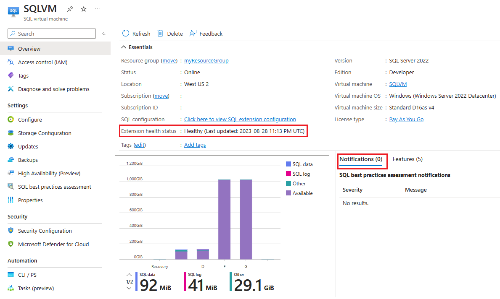

# Manage SQL Server VMs in Azure by using the Azure portal
[!INCLUDE[appliesto-sqlvm](../../includes/appliesto-sqlvm.md)]

In the [Azure portal](https://portal.azure.com), the [**SQL virtual machines**](https://portal.azure.com/#blade/HubsExtension/BrowseResource/resourceType/Microsoft.SqlVirtualMachine%2FSqlVirtualMachines) resource is an independent management service to manage SQL Server on Azure VMs. You can use it to view all of your SQL Server VMs simultaneously and modify settings dedicated to SQL Server: 

## Remarks

- We recommend that you use the [**SQL virtual machines**](https://portal.azure.com/#blade/HubsExtension/BrowseResource/resourceType/Microsoft.SqlVirtualMachine%2FSqlVirtualMachines) resource to view and manage your SQL Server VMs in Azure. But currently, the **SQL virtual machines** resource does not support the management of [end-of-support](sql-server-2008-extend-end-of-support.md) SQL Server VMs. To manage settings for your end-of-support SQL Server VMs, use the deprecated [SQL Server configuration tab](#access-the-sql-server-configuration-tab) instead. 
- The **SQL virtual machines** resource is available only to SQL Server VMs that have [registered with the SQL VM resource provider](sql-agent-extension-manually-register-single-vm.md). 

## Access the SQL virtual machines resource
To access the **SQL virtual machines** resource, do the following:

1. Open the [Azure portal](https://portal.azure.com). 
1. Select **All Services**. 
1. Enter **SQL virtual machines** in the search box.
1. (Optional): Select the star next to **SQL virtual machines** to add this option to your **Favorites** menu. 
1. Select **SQL virtual machines**. 

   

1. The portal lists all SQL Server VMs available within the subscription. Select the one that you want to manage to open the **SQL virtual machines** resource. Use the search box if your SQL Server VM isn't appearing. 

   

   Selecting your SQL Server VM opens the **SQL virtual machines** resource: 

   

> [!TIP]
> The **SQL virtual machines** resource is for dedicated SQL Server settings. Select the name of the VM in the **Virtual machine** box to open settings that are specific to the VM, but not exclusive to SQL Server. 

## Access the SQL Server configuration tab
The **SQL Server configuration** tab has been deprecated. At this time, it's the only method to manage [end-of-support](sql-server-2008-extend-end-of-support.md) SQL Server VMs, and SQL Server VMs that have not been [registered with the SQL VM resource provider](sql-agent-extension-manually-register-single-vm.md).

To access the deprecated **SQL Server configuration** tab, go to the **Virtual machines** resource. Use the following steps:

1. Open the [Azure portal](https://portal.azure.com). 
1. Select **All Services**. 
1. Enter **virtual machines** in the search box.
1. (Optional): Select the star next to **Virtual machines** to add this option to your **Favorites** menu. 
1. Select **Virtual machines**. 

   

1. The portal lists all virtual machines in the subscription. Select the one that you want to manage to open the **Virtual machines** resource. Use the search box if your SQL Server VM isn't appearing. 
1. Select **SQL Server configuration** in the **Settings** pane to manage your SQL Server VM. 

   

## Next steps

For more information, see the following articles: 

* [Overview of SQL Server on a Windows VM](sql-server-on-azure-vm-iaas-what-is-overview.md)
* [FAQ for SQL Server on a Windows VM](frequently-asked-questions-faq.md)
* [Pricing guidance for SQL Server on a Windows VM](pricing-guidance.md)
* [Release notes for SQL Server on a Windows VM](doc-changes-updates-release-notes.md)

