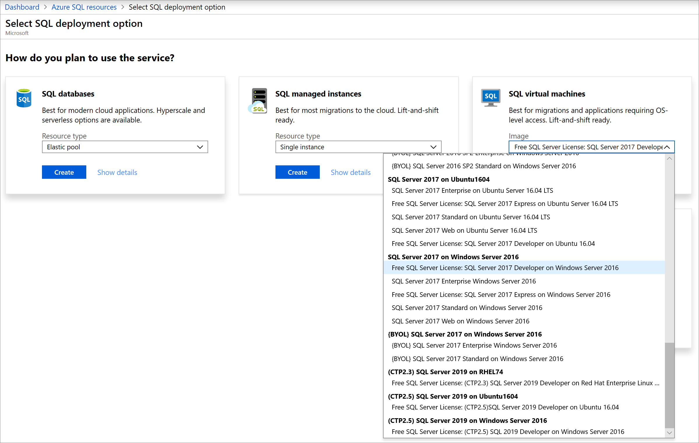
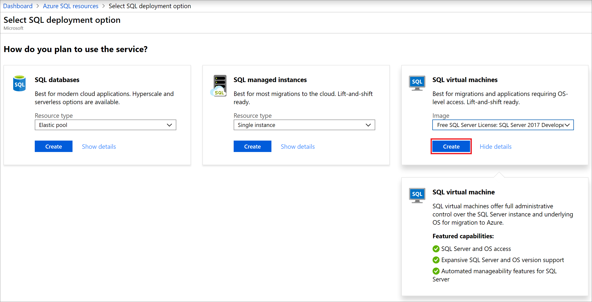
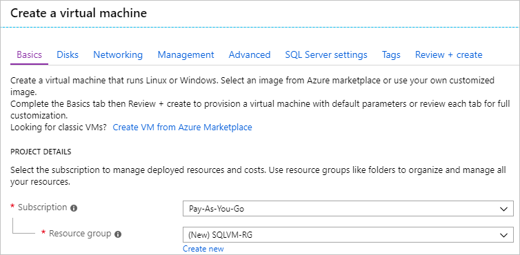
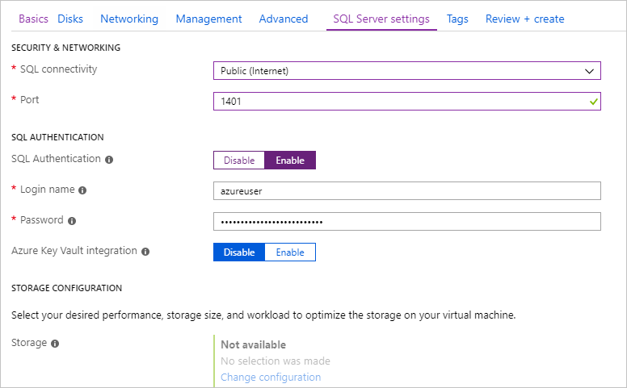
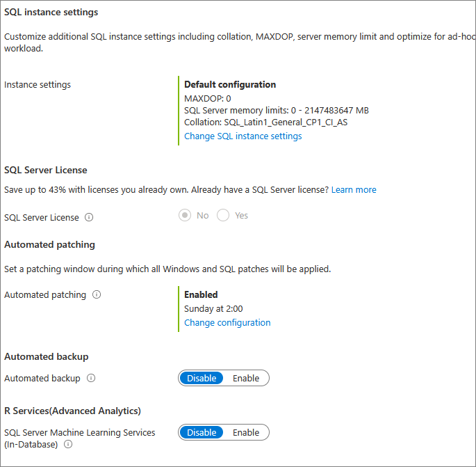
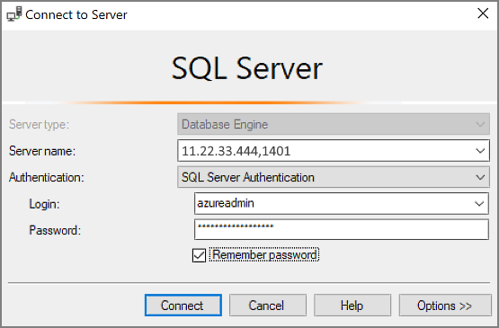

# Quickstart: Create a SQL Server 2017 Windows virtual machine in the Azure portal

> [!div class="op_single_selector"]
> * [Windows](sql-vm-create-portal-quickstart.md)
> * [Linux](../linux/provision-virtual-machine.md)

This quickstart steps through creating a SQL Server virtual machine in the Azure portal.

  > [!TIP]
  > - This quickstart provides a path for quickly provisioning and connecting to a SQL VM. For more information about other SQL VM provisioning choices, see the [Provisioning guide for Windows SQL Server VMs in the Azure portal](create-sql-vm-portal.md).
  > - If you have questions about SQL Server virtual machines, see the [Frequently Asked Questions](frequently-asked-questions-faq.md).

##  Get an Azure subscription

If you don't have an Azure subscription, create a [free account](https://azure.microsoft.com/free/?WT.mc_id=A261C142F) before you begin.

##  Select a SQL Server VM image

1. Sign in to the [Azure portal](https://portal.azure.com) using your account.

1. Select **Azure SQL** in the left-hand menu of the Azure portal. If **Azure SQL** is not in the list, select **All services**, then type *Azure SQL* in the search box.
1. Select **+Add** to open the **Select SQL deployment option** page. You can view additional information by selecting **Show details** on the **SQL virtual machines** tile.
1. Select the **Free SQL Server License: SQL Server 2017 Developer on Windows Server 2016** image from the dropdown.

   

1. Select **Create**.

   

##  Provide basic details

On the **Basics** tab, provide the following information:

1. In the **Project Details** section, select your Azure subscription and then select **Create new** to create a new resource group. Type _SQLVM-RG_ for the name.

   

1. Under **Instance details**:
    1. Type _SQLVM_ for the **Virtual machine name**. 
    1. Choose a location for your **Region**. 
    1. For the purpose of this quickstart, leave **Availability options** set to _No infrastructure redundancy required_. To find out more information about availability options, see [Availability](../../../virtual-machines/windows/availability.md). 
    1. In the **Image** list, select _Free SQL Server License: SQL Server 2017 Developer on Windows Server 2016_. 
    1. Choose to **Change size** for the **Size** of the virtual machine and select the **A2 Basic** offering. Be sure to clean up your resources once you're done with them to prevent any unexpected charges. 

   

1. Under **Administrator account**, provide a username, such as _azureuser_ and a password. The password must be at least 12 characters long and meet the [defined complexity requirements](../../../virtual-machines/windows/faq.md#what-are-the-password-requirements-when-creating-a-vm).

   

1. Under **Inbound port rules**, choose **Allow selected ports** and then select **RDP (3389)** from the drop-down. 

   

## SQL Server settings

On the **SQL Server settings** tab, configure the following options:

1. Under **Security & Networking**, select _Public (Internet_) for **SQL Connectivity** and change the port to `1401` to avoid using a well-known port number in the public scenario. 
1. Under **SQL Authentication**, select **Enable**. The SQL Login is set to the same user name and password that you configured for the VM. Use the default setting for [**Azure Key Vault integration**](azure-key-vault-integration-configure.md). **Storage configuration** is not available for the basic SQL Server VM image but you can find more information about available options for other images at [storage configuration](storage-configuration.md#new-vms).  

   

1. Change any other settings if needed, and then select **Review + create**. 

   

## Create the SQL Server VM

On the **Review + create** tab, review the summary, and select  **Create** to create SQL Server, resource group, and resources specified for this VM.

You can monitor the deployment from the Azure portal. The **Notifications** button at the top of the screen shows basic status of the deployment. Deployment can take several minutes. 

## Connect to SQL Server

1. In the portal, find the **Public IP address** of your SQL Server VM in the **Overview** section of your virtual machine's properties.

1. On a different computer connected to the Internet, open [SQL Server Management Studio (SSMS)](/sql/ssms/download-sql-server-management-studio-ssms).

1. In the **Connect to Server** or **Connect to Database Engine** dialog box, edit the **Server name** value. Enter your VM's public IP address. Then add a comma, and add the custom port, **1401**, that we specified when you configured the new VM. For example, `11.22.33.444,1401`.

1. In the **Authentication** box, select **SQL Server Authentication**.

1. In the **Login** box, type the name of a valid SQL login.

1. In the **Password** box, type the password of the login.

1. Select **Connect**.

    

##  Log in to the VM remotely

Use the following steps to connect to the SQL Server virtual machine with Remote Desktop:

[!INCLUDE [Connect to SQL Server VM with remote desktop](../../../../includes/virtual-machines-sql-server-remote-desktop-connect.md)]

After you connect to the SQL Server virtual machine, you can launch SQL Server Management Studio and connect with Windows Authentication using your local administrator credentials. If you enabled SQL Server Authentication, you can also connect with SQL Authentication using the SQL login and password you configured during provisioning.

Access to the machine enables you to directly change machine and SQL Server settings based on your requirements. For example, you could configure the firewall settings or change SQL Server configuration settings.

## Clean up resources

If you do not need your SQL VM to run continually, you can avoid unnecessary charges by stopping it when not in use. You can also permanently delete all resources associated with the virtual machine by deleting its associated resource group in the portal. This permanently deletes the virtual machine as well, so use this command with care. For more information, see [Manage Azure resources through portal](../../../azure-resource-manager/management/manage-resource-groups-portal.md).

## Next steps

In this quickstart, you created a SQL Server 2017 virtual machine in the Azure portal. To learn more about how to migrate your data to the new SQL Server, see the following article.

> [!div class="nextstepaction"]
> [Migrate a database to a SQL VM](migrate-to-vm-from-sql-server.md)
