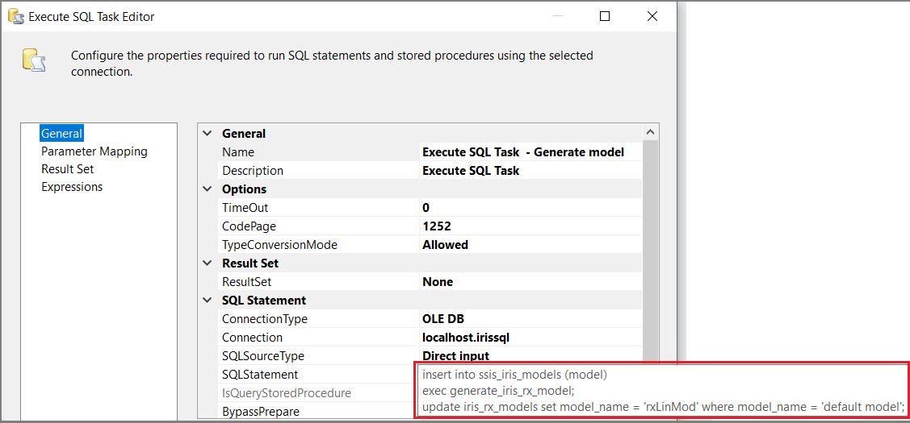
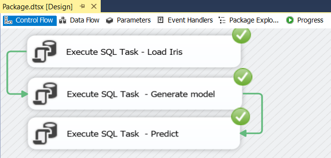

# Create SSIS and SSRS workflows with R on SQL Server
[!INCLUDE[appliesto-ss-xxxx-xxxx-xxx-md-winonly](../../includes/appliesto-ss-xxxx-xxxx-xxx-md-winonly.md)]

This article explains how to combine relational data, data science functions from the Microsoft R libaries, and BI features such as Integration Services and Reporting Services available in SQL Server. Learn which capabilities of [!INCLUDE[ssISnoversion](../../includes/ssisnoversion-md.md)] lend themselves to a data science solutions. This article also reminds you that code and data on SQL Server, such as the embedded R code in stored procedures, is easily consumed in visualizations provided in [!INCLUDE[ssRSnoversion](../../includes/ssrsnoversion-md.md)].

## Bring compute power to the data

A key design goal of integrating R and Python with SQL Server has been to bring analytics close to the data. This provides multiple advantages:

+ Data security. Bringing R closer to the source of data avoids wasteful or insecure data movement.
+ Speed. Databases are optimized for set-based operations. Recent innovations in databases such as in-memory tables make summaries and aggregations lightning, and are a perfect complement to data science.
+ Ease of deployment and integration. [!INCLUDE[ssNoVersion](../../includes/ssnoversion-md.md)] is the central point of operations for many other data management tasks and applications. By using data that resides in the database or reporting warehouse, you ensure that the data used by machine learning solutions is  consistent and up-to-date. 
+ Efficiency across cloud and on-premises. Rather than process data in R, you can rely on enterprise data pipelines including [!INCLUDE[ssISnoversion](../../includes/ssisnoversion-md.md)] and Azure Data Factory. Reporting of results or analyses is easy via Power BI or [!INCLUDE[ssRSnoversion](../../includes/ssrsnoversion-md.md)].

By using the right combination of SQL and R for different data processing and analytical tasks, both data scientists and developers can be more productive.

<a name="bkmk_ssis"></a> 

## Use SQL Server Integration Services (SSIS) for data transformation and automation

Data science workflows are highly iterative and involve much transformation of data, including scaling, aggregations, computation of probabilities, and renaming and merging of attributes. Data scientists are accustomed to doing many of these tasks in R, Python, or another language; however, executing such workflows on enterprise data requires seamless integration with ETL tools and processes.

Because [!INCLUDE[rsql_productname](../../includes/rsql-productname-md.md)] enables you to run complex operations in R via Transact-SQL and stored procedures, you can integrate R-specific tasks with existing ETL processes without minimal re-development work. Rather than perform a chain of memory-intensive tasks in R, data preparation can be optimized using the most efficient tools, including [!INCLUDE[ssISnoversion](../../includes/ssisnoversion-md.md)] and [!INCLUDE[tsql](../../includes/tsql-md.md)]. 

Here are some ideas for how you can automate your data processing and modeling pipelines using [!INCLUDE[ssISnoversion](../../includes/ssisnoversion-md.md)]:

+ Use [!INCLUDE[ssISnoversion](../../includes/ssisnoversion-md.md)] tasks to create necessary data features in the SQL database
+ Use conditional branching to switch compute context for R jobs
+ Run R jobs that generate their own data in the database, and share that data with applications
+ When using [!INCLUDE[ssNoVersion](../../includes/ssnoversion-md.md)], load R script saved in a text variable and run it in SQL Server

## SSIS example

The following example originates from a now-retired MSDN blog post authored by Jimmy Wong at this URL: `https://blogs.msdn.microsoft.com/ssis/2016/01/11/operationalize-your-machine-learning-project-using-sql-server-2016-ssis-and-r-services/`.

This example shows you how to automate tasks using SSIS. You should be familiar with Management Studio, SSIS, SSIS Designer, and T-SQL. Steps in the SSIS package include three [Execute T-SQL tasks](https://docs.microsoft.com/sql/integration-services/control-flow/execute-t-sql-statement-task) that insert training data into a table, model the data, and score the data to get prediction output.

+ Call R using the [Execute T-SQL task](https://docs.microsoft.com/sql/integration-services/control-flow/execute-t-sql-statement-task) to generate data and save it into [!INCLUDE[ssNoVersion](../../includes/ssnoversion-md.md)].
+ Use  a stored procedure to train an R model and store it in the database.
+ Perform scoring on the model using the [Script T-SQL task](https://docs.microsoft.com/ql/integration-services/control-flow/script-task) and the [Execute T-SQL task](https://docs.microsoft.com/sql/integration-services/control-flow/execute-t-sql-statement-task).

### Create tables

Run the following script in SQL Server Management Studio to create a few tables: one to store the data and another to store a model. The role of the ssis_iris table is to act as training data in an operationalization scenario. 

```T-SQL
Use irissql
GO

Create table ssis_iris (
	id int not null identity primary key
	, "Sepal.Length" float not null, "Sepal.Width" float not null
	, "Petal.Length" float not null, "Petal.Width" float not null
	, "Species" varchar(100) null
);
GO

Create table ssis_iris_models (
	model_name varchar(30) not null default('default model') primary key,
	model varbinary(max) not null
);
GO
```

### Create a stored procedure that loads training data

This script creates a stored procedure that loads Iris into a data frame using the built-in R data set.

```T-SQL
Create procedure load_iris
as
begin
	execute sp_execute_external_script
		@language = N'R'
		, @script = N'iris_df <- iris;'
		, @input_data_1 = N''
		, @output_data_1_name = N'iris_df'
	with result sets (("Sepal.Length" float not null, "Sepal.Width" float not null, "Petal.Length" float not null, "Petal.Width" float not null, "Species" varchar(100)));
end;
```

### Define an Execute SQL task that refreshes the model

In SSIS Designer, create an [Execute SQL task](https://docs.microsoft.com/sql/integration-services/control-flow/execute-sql-task).


The script for SQLStatement is as follows. The script removes existing data and then reloads new data using the **load_iris** stored procedure you created in the previous step.

```T-SQL
truncate table ssis_iris;
insert into ssis_iris("Sepal.Length", "Sepal.Width", "Petal.Length", "Petal.Width", "Species")
exec dbo.load_iris;
```

### Create a stored procedure that generates a model

This stored procedure is code that creates a linear model using [rxLinMod](https://docs.microsoft.com/machine-learning-server/r-reference/revoscaler/rxlinmod). RevoScaleR and revoscalepy libraries are loaded automatically in R and Python sessions on SQL Server.

```T-SQL
Create procedure generate_iris_rx_model
as
begin
	execute sp_execute_external_script
		@language = N'R'
		, @script = N'
		  irisLinMod <- rxLinMod(Sepal.Length ~ Sepal.Width + Petal.Length + Petal.Width + Species, data = ssis_iris);
		  trained_model <- data.frame(payload = as.raw(serialize(irisLinMod, connection=NULL)));'
		, @input_data_1 = N'select "Sepal.Length", "Sepal.Width", "Petal.Length", "Petal.Width", "Species" from ssis_iris'
		, @input_data_1_name = N'ssis_iris'
		, @output_data_1_name = N'trained_model'
	with result sets ((model varbinary(max)));
end;
GO
```

### Define an Execute SQL task that runs the model-generation stored procedure

In this step, [Execute SQL task](https://docs.microsoft.com/sql/integration-services/control-flow/execute-sql-task) executes the **generate_iris_rx_model** stored procedure, creating the model and inserting it into the ssis_iris_models table.



```T-SQL
insert into ssis_iris_models (model)
exec generate_iris_rx_model;
update ssis_iris_models set model_name = 'rxLinMod' where model_name = 'default model';
```

After this task completes, you can query the ssis_iris_models to see that it contains one binary model.

### Predict (score) outcomes using the "trained" model

In this simplistic example, the assumption is that ssis_iris_model is a trained model. Since the purpose of a trained model is to generate predictions, we are now ready to run a prediction using it. 

To do this, put the R script in the SQL query to trigger the [rxPredict](https://docs.microsoft.com//machine-learning-server/r-reference/revoscaler/rxpredict) built-in R function on ssis_iris_model. A stored procedure in SQL Server called **predict_species_length** accomplishes this task.

```T-SQL
Create procedure predict_species_length (@model varchar(100))
as
begin
	declare @rx_model varbinary(max) = (select model from ssis_iris_models where model_name = @model);
	-- Predict based on the specified model:
	exec sp_execute_external_script
		@language = N'R'
		, @script = N'
irismodel <-unserialize(rx_model);
irispred <- rxPredict(irismodel, ssis_iris[,2:6]);
OutputDataSet <- cbind(ssis_iris[1], irispred$Sepal.Length_Pred, ssis_iris[2]);
colnames(OutputDataSet) <- c("id", "Sepal.Length.Actual", "Sepal.Length.Expected");
#OutputDataSet <- subset(OutputDataSet, Species.Length.Actual != Species.Expected);
'
	, @input_data_1 = N'
	select id, "Sepal.Length", "Sepal.Width", "Petal.Length", "Petal.Width", "Species" from ssis_iris
	'
	, @input_data_1_name = N'ssis_iris'
	, @params = N'@rx_model varbinary(max)'
	, @rx_model = @rx_model
	with result sets ( ("id" int, "Species.Length.Actual" float, "Species.Length.Expected" float)
		);
end;
```

### Define an Execute SQL task that predicts outcomes

Using [Execute SQL task](https://docs.microsoft.com/sql/integration-services/control-flow/execute-sql-task), execute the **predict_species_length** stored procedure to generate predicted petal length.


```T-SQL
exec predict_species_length 'rxLinMod';
```

### Run the solution

In SSIS Designer, press F5 to execute the package. You should see an outcome similar to the following screenshot.



<a name="bkmk_ssrs"></a> 

##  Use Reporting Services for visualization

Although R can create charts and interesting visualizations, it is not well-integrated with external data sources, meaning that each chart or graph has to be individually produced. Sharing also can be difficult.

By using [!INCLUDE[rsql_productname](../../includes/rsql-productname-md.md)], you can run complex operations in R via [!INCLUDE[tsql](../../includes/tsql-md.md)] stored procedures, which can easily be consumed by a variety of enterprise reporting tools, including [!INCLUDE[ssRSnoversion](../../includes/ssrsnoversion-md.md)] and Power BI.

### SSRS example

[R Graphics Device for Microsoft Reporting Services (SSRS)](https://rgraphicsdevice.codeplex.com/)

This CodePlex project provides the code to help you create a custom report item that renders the graphics output of R as an image that can be used in [!INCLUDE[ssRSnoversion](../../includes/ssrsnoversion-md.md)] reports.  By using the custom report item, you can:

+ Publish charts and plots created using the R Graphics Device to [!INCLUDE[ssRSnoversion](../../includes/ssrsnoversion-md.md)] dashboards

+ Pass [!INCLUDE[ssRSnoversion](../../includes/ssrsnoversion-md.md)] parameters to R plots

> [!NOTE]
> For this sample, the code that supports the R Graphics Device for Reporting Services must be installed on the Reporting Services server, as well as in Visual Studio. Manual compilation and configuration is also required.

## Next steps

The SSIS and SSRS examples in this article illustrate alternative methods for using embedded R in stored procedures in production scenarios. One of the main takeaways is that you can make R or Python script available to any application or tool if it can accept output from a stored procedure. For more information, see [Operationalize R code using stored procedures in SQL Server Machine Learning Services](operationalizing-your-r-code.md).