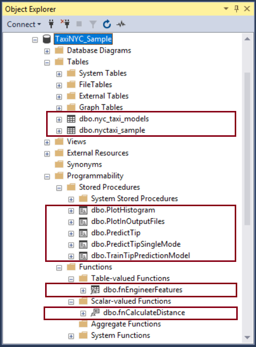

# Lesson 2: Import data to SQL Server using PowerShell

This article is part of a tutorial for SQL developers on how to use R in SQL Server.

In this step, you'll run one of the downloaded scripts, to create the database objects required for the walkthrough. The script also creates most of the stored procedures you'll use, and uploads the sample data to a table in the database you specified.

## Run the scripts to create SQL objects

Among the downloaded files, you should see a PowerShell script that you can run to prepare the environment for the walkthrough. Actions performed by the script include:

- Installing the SQL Native Client and SQL command-line utilities, if not already installed. These utilities are required for bulk-loading the data to the database using **bcp**.

- Creating a database and a table on the [!INCLUDE[ssNoVersion](../../includes/ssnoversion-md.md)] instance, and bulk-inserting data into the table.

- Creating multiple SQL functions and stored procedures.

### Run the script

1.  Open a PowerShell command prompt as administrator and run the following command.
  
    ```ps
    .\RunSQL_SQL_Walkthrough.ps1
    ```
  
    You will be prompted to input the following information:
  
    - The name or address of a [!INCLUDE[ssCurrent](../../includes/sscurrent-md.md)] instance where [!INCLUDE[rsql_productname](../../includes/rsql-productname-md.md)] has been installed
  
    - The user name and password for an account on the instance. The account must have permissions to create databases, create tables and stored procedures, and upload data to tables. If you do not provide the user name and password, your Windows identity is used to sign in to SQL Server.
  
    - The path and file name of the sample data file that you just downloaded. For example:
  
        `C:\tempRSQL\nyctaxi1pct.csv`
  
2.  As part of this step, all the [!INCLUDE[tsql](../../includes/tsql-md.md)] scripts are also modified to replace placeholders with the database name and user name that you provide as script inputs.
  
    Take a minute to review the stored procedures and functions created by the script.
  
    |**SQL script file name**|**Function**|
    |-|-|
    |create-db-tb-upload-data.sql|Creates a database and two tables:<br /><br />nyctaxi_sample: Contains the main NYC Taxi dataset. A clustered columnstore index is added to the table to improve storage and query performance. The 1% sample of the NYC Taxi dataset will be inserted into this table.<br /><br />nyc_taxi_models: Used to persist the trained advanced analytics model.|
    |fnCalculateDistance.sql|Creates a scalar-valued function that calculates the direct distance between pickup and dropoff locations|
    |fnEngineerFeatures.sql|Creates a table-valued function that creates new data features for model training|
    |PersistModel.sql|Creates a stored procedure that can be called to save a model. The stored procedure takes a model that has been serialized in a varbinary data type, and writes it to the specified table.|
    |PredictTipBatchMode.sql|Creates a stored procedure that calls the trained model to create predictions using the model. The stored procedure accepts a query as its input parameter and returns a column of numeric values containing the scores for the input rows.|
    |PredictTipSingleMode.sql|Creates a stored procedure that calls the trained model to create predictions using the model. This stored procedure accepts a new observation as input, with individual feature values passed as in-line parameters, and returns a value that predicts the outcome for the new observation.|
  
    You'll create some additional stored procedures in the latter part of this walkthrough:
  
    |**SQL script file name**|**Function**|
    |------|------|
    |PlotHistogram.sql|Creates a stored procedure for data exploration. This stored procedure calls an R function to plot the histogram of a variable and then returns the plot as a binary object.|
    |PlotInOutputFiles.sql|Creates a stored procedure for data exploration. This stored procedure creates a graphic using an R function and then saves the output as a local PDF file.|
    |TrainTipPredictionModel.sql|Creates a stored procedure that trains a logistic regression model by calling an R package. The model predicts the value of the  tipped column, and is trained using a randomly selected 70% of the data. The output of the stored procedure is the trained model, which is saved in the table nyc_taxi_models.|
  
3.  Log in to the [!INCLUDE[ssNoVersion](../../includes/ssnoversion-md.md)] instance using [!INCLUDE[ssManStudioFull](../../includes/ssmanstudiofull-md.md)] and the login you specified, to verify that you can see the database, tables, functions, and stored procedures that were created.
  
    
  
    > [!NOTE]
    > If the database objects already exist, they cannot be created again.
    >   
    > If the table already exists, the data will be appended, not overwritten. Therefore, be sure to drop any existing objects before running the script.

## Next lesson

[Lesson 3: Explore and visualize the data](../tutorials/sqldev-explore-and-visualize-the-data.md)

## Previous lesson

[Lesson 1: Download the sample data](../tutorials/sqldev-download-the-sample-data.md)
