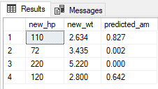

# Quickstart: Predict from model using R in SQL Server
[!INCLUDE[appliesto-ss-xxxx-xxxx-xxx-md-winonly](../../includes/appliesto-ss-xxxx-xxxx-xxx-md-winonly.md)]

In this quickstart, use the model you created in the previous quickstart to score predictions against fresh data. To perform _scoring_ using new data, get one of the trained models from the table, and then call a new set of data on which to base predictions. Scoring is a term sometimes used in data science to mean generating predictions, probabilities, or other values based on new data fed into a trained model.

## Prerequisites

This quickstart is an extension of [Create a predictive model](rtsql-create-a-predictive-model-r.md).

## Create the table of new data

First, create a table with new data. 

```sql
CREATE TABLE dbo.NewMTCars(
	hp INT NOT NULL
	, wt DECIMAL(10,3) NOT NULL
	, am INT NULL
)
GO

INSERT INTO dbo.NewMTCars(hp, wt)
VALUES (110, 2.634)

INSERT INTO dbo.NewMTCars(hp, wt)
VALUES (72, 3.435)

INSERT INTO dbo.NewMTCars(hp, wt)
VALUES (220, 5.220)

INSERT INTO dbo.NewMTCars(hp, wt)
VALUES (120, 2.800)
GO
```

## Predict manual transmission

By now, your `dbo.GLM_models` table might contain multiple R models, all built using different parameters or algorithms, or trained on different subsets of data.

To get predictions based on one specific model, you must write a SQL script that does the following:

1. Gets the model you want
2. Gets the new input data
3. Calls an R prediction function that is compatible with that model

In this example, we will use the model named `default model`.

```sql
DECLARE @glmmodel varbinary(max) = 
    (SELECT model FROM dbo.GLM_models WHERE model_name = 'default model');

EXEC sp_execute_external_script
    @language = N'R'
    , @script = N'
            current_model <- unserialize(as.raw(glmmodel));
            new <- data.frame(NewMTCars);
            predicted.am <- predict(current_model, new, type = "response");
            str(predicted.am);
            OutputDataSet <- cbind(new, predicted.am);
            '
    , @input_data_1 = N'SELECT hp, wt FROM dbo.NewMTCars'
    , @input_data_1_name = N'NewMTCars'
    , @params = N'@glmmodel varbinary(max)'
    , @glmmodel = @glmmodel
WITH RESULT SETS ((new_hp INT, new_wt DECIMAL(10,3), predicted_am DECIMAL(10,3)));
```

The script above performs the following steps:

+ Use a SELECT statement to get a single model from the table, and pass it as an input parameter.

+ After retrieving the model from the table, call the `unserialize` function on the model.

+ Apply the `predict` function with appropriate arguments to the model, and provide the new input data.

+ In the example, the `str` function is added during the testing phase, to check the schema of data being returned from R. You can remove the statement later.

+ The column names used in the R script are not necessarily passed to the stored procedure output. Here we've used the WITH RESULTS clause to define some new column names.

**Results**



It is also possible to use the [PREDICT in Transact-SQL](https://docs.microsoft.com/sql/t-sql/queries/predict-transact-sql) to generate a predicted value or score based on a stored model.

## Next steps

Integration of R with SQL Server makes it easier to deploy R solutions at scale, leveraging the best features of R and relational databases, for high-performance data handling and rapid R analytics. 

Continue learning about solutions using R with SQL Server through end-to-end scenarios created by the Microsoft Data Science and R Services development teams.

> [!div class="nextstepaction"]
> [SQL Server R tutorials](sql-server-r-tutorials.md)
