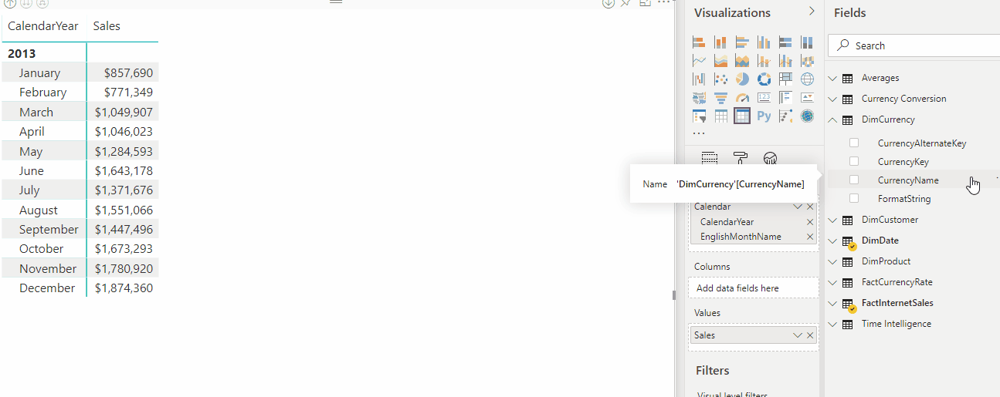
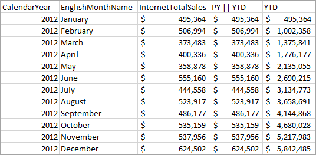
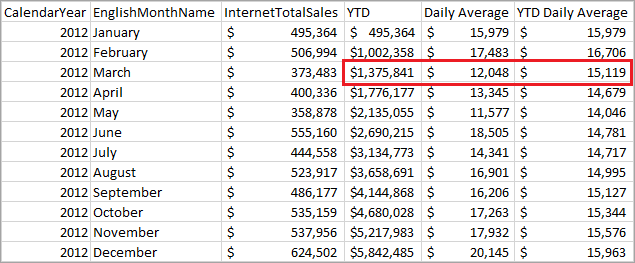

# Calculation groups (Preview)
 
[!INCLUDE[ssas-appliesto-sqlas-aas](../../includes/ssas-appliesto-sqlas-aas.md)]

Calculation groups are supported in Azure Analysis Services and SQL Server Analysis Services 2019 tabular models at the 1470 and higher [compatibility level](compatibility-level-for-tabular-models-in-analysis-services.md). Keep in mind, models at the 1470 compatibility level are in **Preview**.  


## Tools

Calculation groups  are not yet supported in SQL Server Data Tools, Visual Studio with Analysis Services extensions. However, calculation groups can be created by using Tabular Model Scripting Language (TMSL) or the open source [Tabular Editor](https://github.com/otykier/TabularEditor).

## Benefits

Calculation groups address a common issue in complex models where there can be a proliferation of redundant measures using the same calculations. This is most common with time-intelligence calculations. For example, a sales analyst wants to view sales totals or orders by month-to-date, quarter-to-date, year-to-date, orders year-to-date for the previous year, and so on. This can mean the data modeler has to create separate measures for each calculation, which can lead to dozens of measures. For the user, this can mean having to sort through just as many measures, and apply them individually to their report. Calculation groups can significantly reduce the number of redundant measures by grouping common measure expressions as *calculation items* within a calculation group.

Let's first take a look at how calculation groups appear to users in a reporting tool like Power BI. We'll then take a look at what makes up a calculation group, and how they're created in a model.

Calculation groups are shown in reporting clients as a table with a single column. The column isn't like a typical column or dimension, instead it represents one or more reusable calculations, or *calculation items* that can be applied to any measure already added to the Values filter for a visualization.

In the following animation, a user is analyzing sales data for years 2012 and 2013. Before applying a calculation group, the common base measure **Sales**  calculates a sum of total sales for each month. The user then wants to apply time-intelligence calculations to get sales totals for month to date, quarter to date, year to date, and so on. Without calculation groups, the user would have to select individual time-intelligence measures.

With a calculation group, the user applies **Time Calculation**, which appears as a column in the **Time Intelligence** table, as a column filter. When the user drags the **Time Calculation** item to the **Columns** filter area, each calculation item in the calculation group appears as a separate column, with values calculated for each row.


## How they work

Now that you've seen how calculation groups benefit users, let's take a look at how the Time Intelligence calculation group example shown is created.

Before we go into specifics, let's introduce some new DAX functions specifically for calculation groups: 

[SELECTEDMEASURE](https://docs.microsoft.com/dax/selectedmeasure-function-dax) - Used by expressions for calculation items to reference the measure that is in context. In the example shown above, the Sales measure.

[SELECTEDMEASURENAME](https://docs.microsoft.com/dax/selectedmeasurename-function-dax) - Used by expressions for calculation items to determine the measure that is in context by name.

[ISSELECTEDMEASURE](https://docs.microsoft.com/dax/isselectedmeasure-function-dax) - Used by expressions for calculation items to determine the measure that is in context is one of those specified in a list of measures.

[SELECTEDMEASUREFORMATSTRING](https://docs.microsoft.com/dax/selectedmeasurefromatstring-function-dax) - Used by expressions for calculation items to retrieve the format string of the measure that is in context.

### Calculation group example

Table name - **Time Intelligence**   
Column name - **Time Calculation**   
Precedence - **20**   

### Calculation items

#### Current

```dax
SELECTEDMEASURE()
```

#### MTD

```dax
CALCULATE(SELECTEDMEASURE(), DATESMTD(DimDate[Date]))
```

#### QTD

```dax
CALCULATE(SELECTEDMEASURE(), DATESQTD(DimDate[Date]))
```

#### YTD

```dax
CALCULATE(SELECTEDMEASURE(), DATESYTD(DimDate[Date]))
```

#### PY

```dax
CALCULATE(SELECTEDMEASURE(), SAMEPERIODLASTYEAR(DimDate[Date]))
```

#### PY MTD

```dax
CALCULATE(
    SELECTEDMEASURE(),
    SAMEPERIODLASTYEAR(DimDate[Date]),
    'Time Intelligence'[Time Calculation] = "MTD"
)
```

#### PY QTD

```dax
CALCULATE(
    SELECTEDMEASURE(),
    SAMEPERIODLASTYEAR(DimDate[Date]),
    'Time Intelligence'[Time Calculation] = "QTD"
)
```

#### PY YTD

```dax
CALCULATE(
    SELECTEDMEASURE(),
    SAMEPERIODLASTYEAR(DimDate[Date]),
    'Time Intelligence'[Time Calculation] = "YTD"
)
```

#### YOY

```dax
SELECTEDMEASURE() –
CALCULATE(
    SELECTEDMEASURE(),
    'Time Intelligence'[Time Calculation] = "PY"
)
```

#### YOY%

```dax
DIVIDE(
    CALCULATE(
        SELECTEDMEASURE(),
        'Time Intelligence'[Time Calculation]="YOY"
    ),
    CALCULATE(
        SELECTEDMEASURE(),
        'Time Intelligence'[Time Calculation]="PY"
    ),
)
```

To test this calculation group, you can create and execute a DAX query in SSMS or the open-source [DAX Editor](http://daxstudio.org/). Note: YOY and YOY% are omitted from this query example.

### Query

```dax
EVALUATE
CALCULATETABLE (
    SUMMARIZECOLUMNS (
        DimDate[CalendarYear],
        DimDate[EnglishMonthName],
        "Current", CALCULATE ( [Sales], 'Time Intelligence'[Time Calculation] = "Current" ),
        "QTD",     CALCULATE ( [Sales], 'Time Intelligence'[Time Calculation] = "QTD" ),
        "YTD",     CALCULATE ( [Sales], 'Time Intelligence'[Time Calculation] = "YTD" ),
        "PY",      CALCULATE ( [Sales], 'Time Intelligence'[Time Calculation] = "PY" ),
        "PY QTD",  CALCULATE ( [Sales], 'Time Intelligence'[Time Calculation] = "PY QTD" ),
        "PY YTD",  CALCULATE ( [Sales], 'Time Intelligence'[Time Calculation] = "PY YTD" )
    ),
    DimDate[CalendarYear] IN { 2012, 2013 }
)
```

### Return table

The return shows the calculations applied. For example, you can see QTD for March 2012 is the sum of January, February and March 2012.


## Dynamic format strings

*Dynamic format strings* with calculation groups allow conditional application of format strings to measures without forcing them to return strings.

Tabular models support dynamic formatting of measures by using DAX's [FORMAT](https://docs.microsoft.com/dax/format-function-dax) function. However, the FORMAT function has the disadvantage of returning a string, forcing measures that would otherwise be numeric to also be returned as a string. This can have some limitations, such as not working with most Power BI visuals depending on numeric values, like charts.

### Dynamic format strings for time-intelligence

If we look at the time-intelligence example shown above, all the calculation items except **YOY%** should use the format of the current measure in context. For example, **YTD** calculated on the Sales base measure should be currency. If this were a calculation group for something like an Orders base measure, the format would be numeric. **YOY%**, however, should be a percentage regardless of the format of the base measure.

For **YOY%**, we can override the format string by setting the format string expression property to **0.00%;-0.00%;0.00%**. To learn more about format string expression properties, see [MDX Cell Properties - FORMAT STRING  Contents](../multidimensional-models/mdx/mdx-cell-properties-format-string-contents.md#numeric-values).

In this matrix visual in Power BI, you see **Sales Current/YOY** and **Orders Current/YOY** retain their respective base measure format strings. **Sales YOY%** and **Orders YOY%**, however, overrides the format string to use *percentage* format.


### Dynamic format string for currency conversion

Dynamic format strings provide easy currency conversion. Consider the following Adventure Works data model. It's modeled for *one-to-many* currency conversion as defined by  [Conversion types](../currency-conversions-analysis-services.md#conversion-types).


A **FormatString** column is added to the DimCurrency table and populated with format strings for the respective currencies.


For this example, the following calculation group is then defined as:

Table name - **Currency Conversion**   
Column name - **Conversion Calculation**   
Precedence - **5**   

### Calculation items

#### No Conversion

```dax
SELECTEDMEASURE()
```

#### Converted Currency

```dax
IF(
    //Check one currency in context & not US Dollar, which is the pivot currency:
    SELECTEDVALUE( DimCurrency[CurrencyName], "US Dollar" ) = "US Dollar",
    SELECTEDMEASURE(),
    SUMX(
        VALUES(DimDate[Date]),
        CALCULATE( DIVIDE( SELECTEDMEASURE(), MAX(FactCurrencyRate[EndOfDayRate]) ) )
    )
)
```

Format string expression

```dax
SELECTEDVALUE(
    DimCurrency[FormatString],
    SELECTEDMEASUREFORMATSTRING()
)
```
The format string expression must return a scalar string. It uses the new [SELECTEDMEASUREFORMATSTRING](https://docs.microsoft.com/dax/selectedmeasurefromatstring-function-dax) function to revert to the base measure format string if there are multiple currencies in filter context.

The following animation shows the dynamic format currency conversion of the Sales measure in a report.




## Sideways recursion

In the time-intelligence example above, some of the calculation items refer to others in the same calculation group. This is called *sideways recursion*. For example, **YOY%** references both **YOY** and **PY**.

```dax
DIVIDE(
    CALCULATE(
        SELECTEDMEASURE(),
        'Time Intelligence'[Time Calculation]="YOY"
    ),
    CALCULATE(
        SELECTEDMEASURE(),
        'Time Intelligence'[Time Calculation]="PY"
    ),
)
```

In this case, both expressions are evaluated separately because they are using different calculate statements. Other types of recursion are not supported.

## Single calculation item in filter context

In our time-intelligence example, the **PY YTD** calculation item has a single calculate expression:

```dax
CALCULATE(
    SELECTEDMEASURE(),
    SAMEPERIODLASTYEAR(DimDate[Date]),
    'Time Intelligence'[Time Calculation] = "YTD"
)
```

The YTD argument to the CALCULATE() function overrides the filter context to reuse the logic already defined in the YTD calculation item. It's not possible to apply both PY and YTD in a single evaluation. Calculation groups are *only applied* if a single calculation item from the calculation group is in filter context, as shown in the following query and return table.

### Query

```dax
EVALUATE
CALCULATETABLE (
    SUMMARIZECOLUMNS (
        DimDate[CalendarYear],
        DimDate[EnglishMonthName],

        //No time intelligence applied: all calc items in filter context:
        "Sales", [Sales],

        //No time intelligence applied: 2 calc items in filter context:
        "PY || YTD", CALCULATE ( [Sales],
            'Time Intelligence'[Time Calculation] = "PY" || 'Time Intelligence'[Time Calculation] = "YTD"
        ),

        //YTD applied: exactly 1 calc item in filter context:
        "YTD", CALCULATE ( [Sales], 'Time Intelligence'[Time Calculation] = "YTD" )
    ),
    DimDate[CalendarYear] = 2012
)
```

### Return table



A calculation group should be designed so that each calculation item within it is shown to the end user only makes sense when applied *one-at-a-time*. If there is a business requirement to allow the user to apply more than one calculation item at a time, multiple calculation groups should be used with different precedence.

## Precedence

Precedence is a property defined for a calculation group. It specifies the order of evaluation when there are more than one calculation group. A higher number indicates greater precedence, meaning it will be evaluated before calculation groups with lower precedence.

For this example, we'll use same model as the time-intelligence example above, but also add an Averages calculation group. The Averages calculation group contains average calculations that are independent of traditional time intelligence in that they don’t change the date filter context - they just apply average calculations within it.

In this example, a daily average calculation is defined. This is common in oil-and-gas applications to use calculations such as barrels of oil per day. Other common business examples include store sales average in retail.

While such calculations are calculated independently of time-intelligence calculations, there may well be a requirement to combine them. For example, a user might want to see YTD barrels of oil per day to view the daily-oil rate from the beginning of the year to the current date. In this scenario, precedence should be set for calculation items.

### Calculation group

Table name is **Averages**.   
Column name is **Average Calculation**.   
Precedence is **10**.   

### Calculation items for Averages

#### No Average

```dax
SELECTEDMEASURE()
```

#### Daily Average

```dax
DIVIDE(SELECTEDMEASURE(), COUNTROWS(DimDate))
```

Here's a DAX query and return table:

### Query

```dax
EVALUATE
    CALCULATETABLE (
        SUMMARIZECOLUMNS (
        DimDate[CalendarYear],
        DimDate[EnglishMonthName],
        "Sales", CALCULATE (
            [Sales],
            'Time Intelligence'[Time Calculation] = "Current",
            'Averages'[Average Calculation] = "No Average"
        ),
        "YTD", CALCULATE (
            [Sales],
            'Time Intelligence'[Time Calculation] = "YTD",
            'Averages'[Average Calculation] = "No Average"
        ),
        "Daily Average", CALCULATE (
            [Sales],
            'Time Intelligence'[Time Calculation] = "Current",
            'Averages'[Average Calculation] = "Daily Average"
        ),
        "YTD Daily Average", CALCULATE (
            [Sales],
            'Time Intelligence'[Time Calculation] = "YTD",
            'Averages'[Average Calculation] = "Daily Average"
        )
    ),
    DimDate[CalendarYear] = 2012
)
```

### Return



The following table shows how the March 2012 values are calculated.


|Column name  |Calculation |
|---------|---------|
|YTD     |    Sum of Sales for Jan, Feb, Mar 2012<br />= 495,364 + 506,994 + 373,483     |
|Daily Average    |  	Sales for Mar 2012 divided by # of days in March<br />= 373,483 / 31       |
|YTD Daily Average     | YTD for Mar 2012 divided by # of days in Jan, Feb and Mar<br />=  1,375,841 / (31 + 29 + 31)       |

Here's the definition of the YTD calculation item, applied with precedence of **20**.

```dax
CALCULATE(SELECTEDMEASURE(), DATESYTD(DimDate[Date]))
```

Here's Daily Average, applied with a precedence of **10**.

```dax
DIVIDE(SELECTEDMEASURE(), COUNTROWS(DimDate))
```

Since the precedence of the Time Intelligence calculation group is higher than the Averages one, it is applied as broadly as possible. The YTD Daily Average calculation applies YTD to both the numerator *and the denominator* (count of days) of the daily average calculation.

This is equivalent to the following expression:

```dax
CALCULATE(DIVIDE(SELECTEDMEASURE(), COUNTROWS(DimDate)), DATESYTD(DimDate[Date]))
```

Not:

```dax
DIVIDE(CALCULATE(SELECTEDMEASURE(), DATESYTD(DimDate[Date])), COUNTROWS(DimDate)))
```

## Implicit measures

Calculation groups work with explicit, query scope measures. But, they do not work with implicit DAX measures. For example, in Power BI implicit measures are created when a user drags columns onto visuals to view aggregated values without creating using an explicit measure. At this time, Power BI generates DAX for implicit measures written as inline DAX calculations. This means implicit measures cannot work with calculation groups. To possibly solve this at a later date, a new model property visible in the Tabular Object Model (TOM) has been introduced, **DiscourageImplicitMeasures**. In the current version, it must be set to **true** in order to create calculation groups. When set to true, Power BI Desktop in Live Connect mode disables creation of implicit measures.


### Support for MDX

Calculation groups support Multidimensional Data Expressions (MDX) queries. This means, Microsoft Excel users, which query tabular data models by using MDX, can take full advantage of calculation groups in worksheet PivotTables and charts.

## Data Management View (DMV) queries

By using [Data Management Views](../instances/use-dynamic-management-views-dmvs-to-monitor-analysis-services.md), you can query schema rowsets that return information about calculation groups in your model. The following schema rowsets have been introduced for calculation groups: 

- TMSCHEMA_CALCULATION_GROUPS   
- TMSCHEMA_CALCULATION_ITEMS   

## Limitations

[Object level security](object-level-security.md) (OLS) defined on calculation group tables is not yet supported. However, OLS can be defined on other tables in the same model. If a calculation item refers to an OLS secured object, a generic error is returned. This is the planned behavior for SSAS 2019.

[Row level security](roles-ssas-tabular.md#bkmk_rowfliters) (RLS) is not yet supported. The planned behavior for SSAS 2019 is that you will be able to define RLS on tables in the same model, but not on calculation groups themselves (directly or indirectly).

[Detail Rows Expressions](../tutorial-tabular-1400/as-supplemental-lesson-detail-rows.md) are not yet supported with calculation groups.

## See also  

  
  
