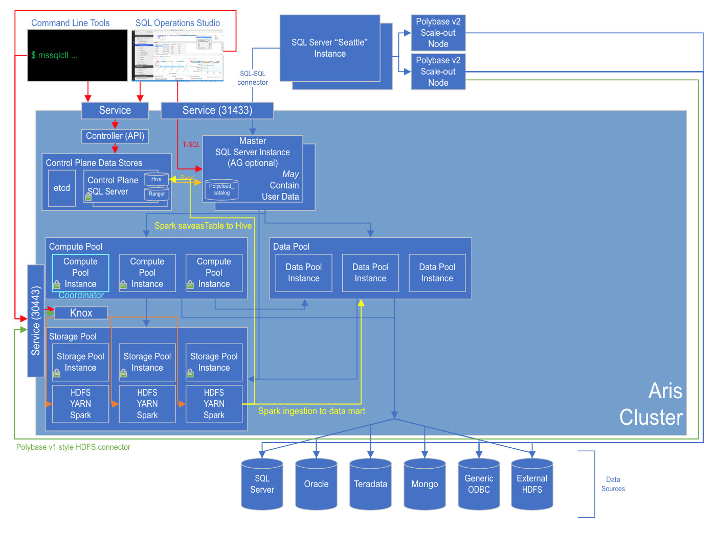

# What is SQL Server Aris?

[!INCLUDE[SQL Server vNext](../includes/sssqlv15-md.md)] CTP 2.0 enables you to integrate your "high-value" relational data in SQL Server with your "high-volume" data in big data environments, such as Hadoop.

## Architecture

CTP 2.0 allows you to create and deploy a *data pool* that consists of many SQL Server *data pool instances* in your cluster. You can then ingest your high-volume data from HDFS via Spark streaming jobs into the SQL Server data pool instances by partitioning the data and spreading the partitions across the SQL Server data pool instances in the data pool.

Once the high-volume data is stored in partitions in the SQL Server data pool instances on the cluster, you can create an *external table* in the SQL Server *master instance* that represents the high-volume data that resides in the partitions stored in the SQL Server data pool instances in your cluster.  This external table can be queried in the master instance just like any other table, but in this case a fan-out query will be simultaneously executed against each of the SQL Server data pool instances to query the partitioned data. This fan-out query runs the filter part of the query and local aggregations in parallel across all of the data pool instances. The results of these queries will be brought back to the master instance and you can optionally choose to join the results of the high-volume data fan-out query with the results of a high-value data query in the SQL Server master instance.

The following diagram shows the eventual state of the Project Aris architecture:

Compared to this architecture diagram, the CTP 2.0 release has a few differences:

- There are no compute pools in CTP 2.0.
- The Hive metastore is in the master SQL Server instance for now but it will be moved to the controller SQL Server instance.
- There are no connectors to data sources such as Oracle, Teradata, SQL Server, MongoDB yet.

## Next steps

To get started, see the following quickstarts:

- [Get started with big data on SQL Server vNext](quickstart-sql-server-aris-get-started.md)
- [Run Jupypter Notebooks on SQL Server vNext](quickstart-sql-server-aris-jupyter-notebook.md)
