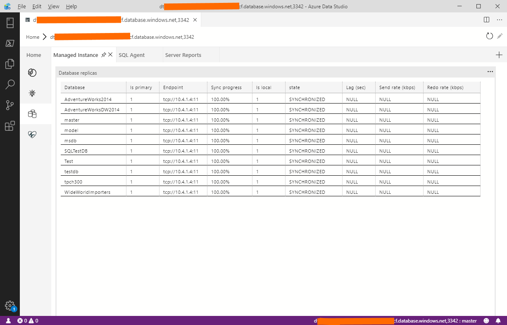

# Managed Instance support for Azure Data Studio (Preview)

This extension enables you to work with [Azure SQL Managed Instance](https://docs.microsoft.com/azure/sql-database/sql-database-managed-instance-index) in [Azure Data Studio](https://github.com/Microsoft/azuredatastudio). This extension provides the following features:
- Showing properties of Managed instance (vCores, used storage).
- Monitoring CPU and storage usage in past two hours.
- Showing configuration warning and tuning recommendations.
- Showing state of database replicas.
- Showing filtered error logs.

## Installations

You can install the official release of the Managed Instance extension by following the steps
in the [Azure Data Studio documentation](https://docs.microsoft.com/sql/azure-data-studio/extensions).
In the Extensions pane, search for "Managed Instance" extension and install it there.  You will
get notified automatically about any future extension updates!

Once you install the Managed Instance extension, you will see a `Managed Instance` tab in Azure Data Studio. On this tab you can find information specific for Managed Instance.

## Properties

This extension enables you to see technical characteristics of your Managed Instance and some resource usage.

On the first blade, you are able to see the following details:
- **Basic properties** such as available number of vCores, memory, storage, current service-tier and hardware generation, and IO
characteristics like instance log write throughput or file IO/throughput characteristics. 
- **Usage of the local SSD storage**. On General purpose service-tier only TEMPDB files are placed locally, while on Business-Critical tier all files are placed on local SSD. In this section, you can see how much space on the local storage is used by Managed Instance.
- **Usage of Azure Premium Disk Storage** - user and system database in General Purpose service-tier are placed on Azure Premium storage. Here you can find how much data you used, and what is remaining storage and number of files. On Business-Critical service tier this section is empty.
- **Resource usage** that will show you how much storage and CPU your instance used in past two hours. Increase the instance size if you are reaching the limit.

## Recommendations

This extension provides some recommendations and alerts that can help you optimize your Managed Instance.

Some of the recommendations that are shown in this table are: 
- Reaching storage space limit - you should either delete unnesecaary data or increase instance storage size because databases that reach storage limit might fail to process even read queries.
- Reaching instance throughout limit - if you are loading ~22MB/s on GP or ~48 MB/s on BC, Managed instance will limit your load to ensure that backups can be taken.
- Memory pressure - Low Page Life Expectancy or a lot of `PAGEIOLATCH` wait statistics might indicate that your instance is evicting pages from the memory and constantly trying to load more pages from disk.
- Log file limits - if your logs are reaching [file IO limits on General-purpose service tier](https://docs.microsoft.com/azure/sql-database/sql-database-managed-instance-resource-limits#file-io-characteristics-in-general-purpose-tier) you might need to increase file size to get better performance.
- Data file limits - if your data files are reaching [file IO limits on General-purpose service tier](https://docs.microsoft.com/azure/sql-database/sql-database-managed-instance-resource-limits#file-io-characteristics-in-general-purpose-tier) you might need to increase file size to get better performance. This issue might cause memory pressure and slow down backups.
- Availability issues - high number of virtual log files might cause performance impact and potential longer database recovery on General-purpose service-tier in a case of process failure.

You should periodically review these recommendations and take some actions. Managed instance extension provides the scripts that you can execute to mitigate some issues.

## Replicas

Managed instance extension enables you to see the state of database replicas in your Managed instance.

On General-purpose service-tier, every database has a single (primary) replica, while on Business Critical instance every database has one primary and three secondary replicas (one is used for read-only workloads). Here you can monitor synchronization process and verify  that all secondary replicas are synchronized with the primary replica. 

## Logs

Managed Instance extension shows the most relevant latest SQL Error log entries.

Managed Instance emits a large number of log entries and most of them are internal/system information. Some log entries are showing physical database names (GUID values) instead of actual logical database names.

Managed Instance extension filters-out unnecessary  log entries based on [Dimitri Furman method](https://blogs.msdn.microsoft.com/sqlcat/2018/05/04/azure-sql-db-managed-instance-sp_readmierrorlog/) and displays actual logical file names instead of physical names.

## Reporting Problems

If you experience any problems with the Managed instance Extension, report the issue on [Extension GitHub project](https://github.com/JocaPC/AzureDataStudio-Managed-Instance/issues).

## Maintainers

- [Jovan Popovic(MSFT)](https://github.com/jovanpop_msft) - [@jovanpop_msft](https://twitter.com/JovanPop_MSFT)

## [Code of Conduct][conduct-md]

This project has adopted the [Microsoft Open Source Code of Conduct][conduct-code].
For more information, see the [Code of Conduct FAQ][conduct-FAQ] or contact [opencode@microsoft.com][conduct-email] with any additional questions or comments.

[conduct-code]: http://opensource.microsoft.com/codeofconduct/
[conduct-FAQ]: http://opensource.microsoft.com/codeofconduct/faq/
[conduct-email]: mailto:opencode@microsoft.com
[conduct-md]: https://github.com/PowerShell/vscode-powershell/blob/master/CODE_OF_CONDUCT.md
