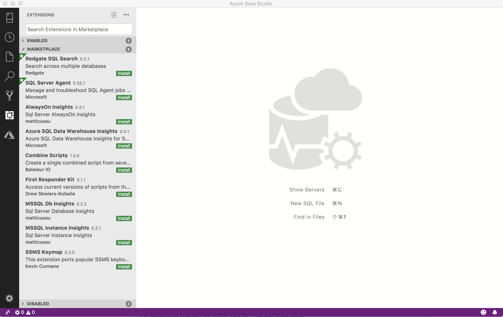

# SQL Server Database Projects extension (preview)

The SQL Server Database Projects extension (preview) is an extension for managing and troubleshooting SQL Agent jobs and configuration. This extension is currently in preview and is only available in the [Azure Data Studio Insiders Build](https://github.com/microsoft/azuredatastudio#try-out-the-latest-insiders-build-from-main).

Key actions include:
- create a new project from an existing database or from scratch
- open existing projects created in Azure Data Studio or Visual Studio data tools
- edit a project's contents
- build and publish a project

## Install the SQL Server Database Projects extension

1. To open the extensions manager and access the available extensions, select the extensions icon, or select **Extensions** in the **View** menu.
2. Select an available extension to view it's details.

   

3. Select the extension you want and **Install** it.
4. Select **Reload** to enable the extension (only required the first time you install an extension).
5. Select the files icon from the activity bar or select **Explorer** from the **View** menu. A new viewlet for **Projects** is now available.

**add image here**

## Create an Empty Database Project

 In the **Projects** viewlet under **Explorer**, select the **New Project** option and enter a project name in the text input that appears.  In the "Select a Folder" dialog that appears, select a directory for the project's folder, .sqlproj file, and other contents to reside in.
 The empty project is opened and visible in the **Projects** viewlet for editing.

## Create a Database Project from an Existing Database

## Next steps

To learn more about offline development for SQL Server projects in SQL Server Data Tools, [check our SSDT documentation.](https://docs.microsoft.com/en-us/sql/ssdt/project-oriented-offline-database-development?view=sql-server-ver15)

