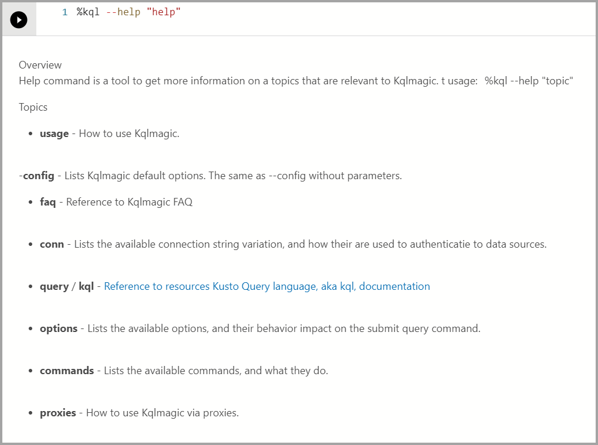
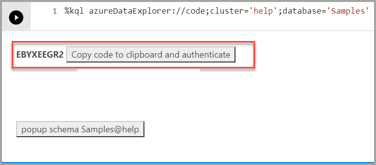
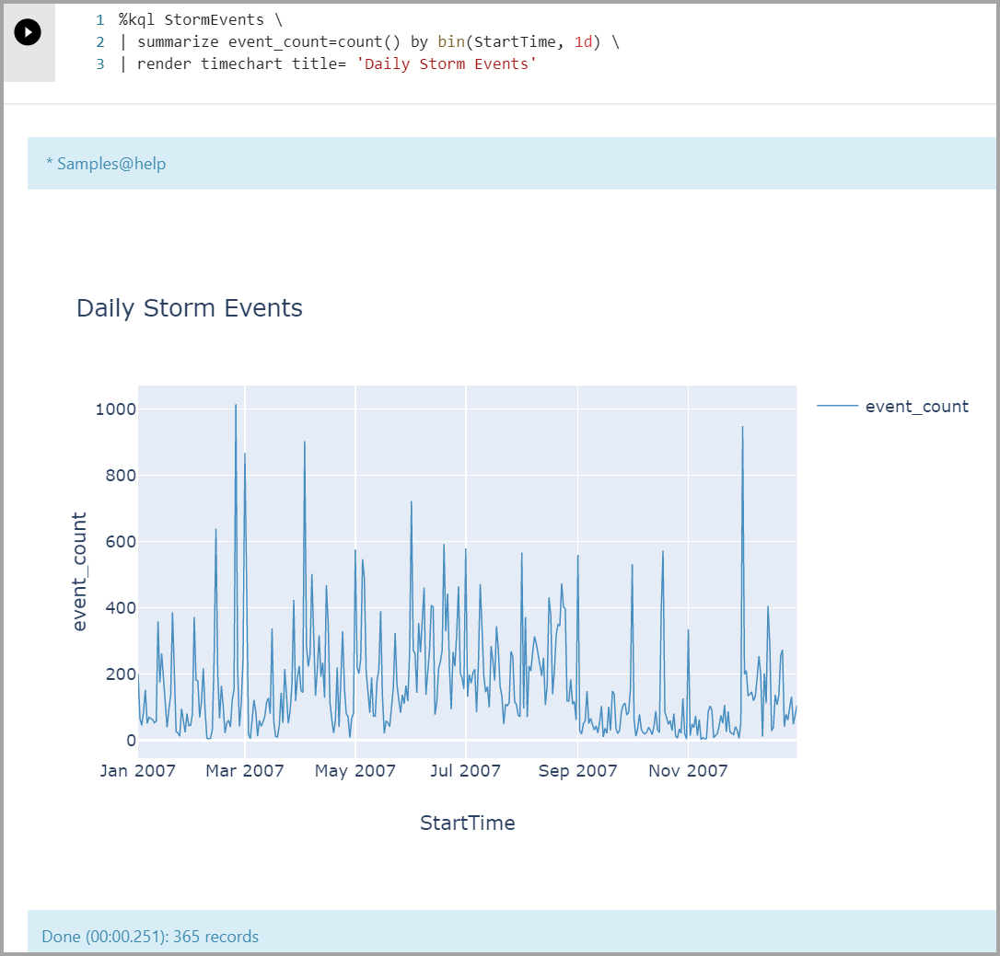
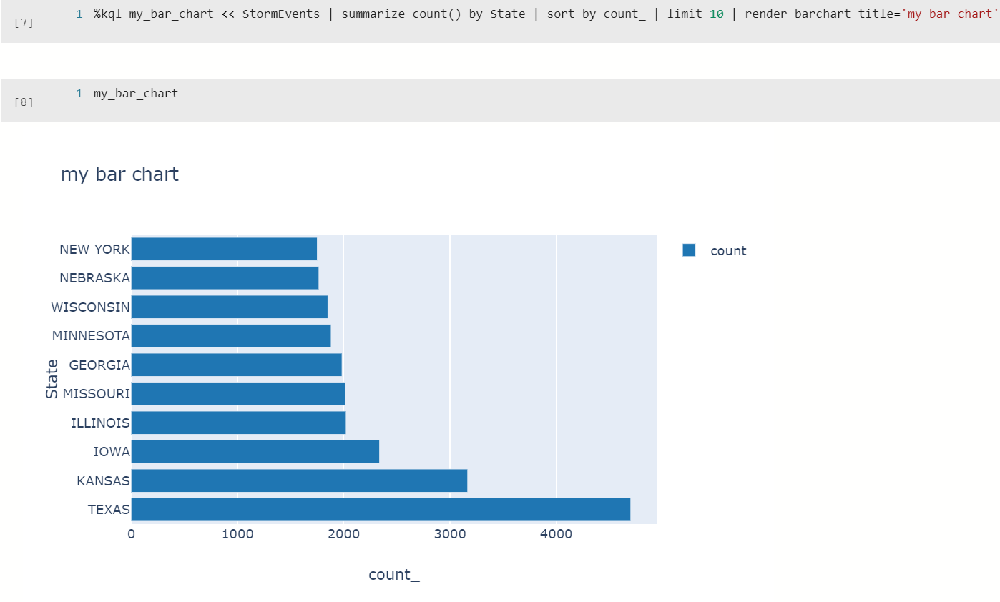
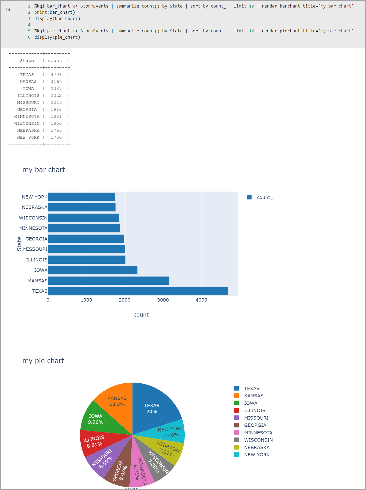
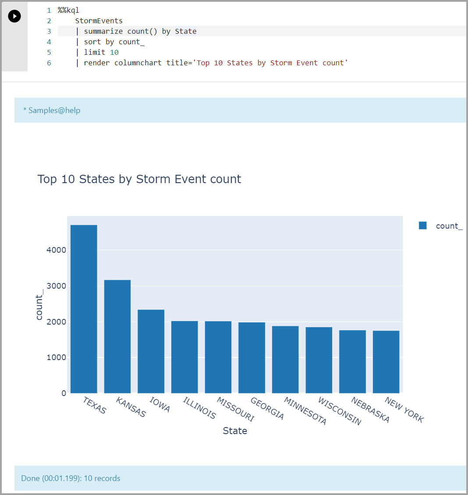
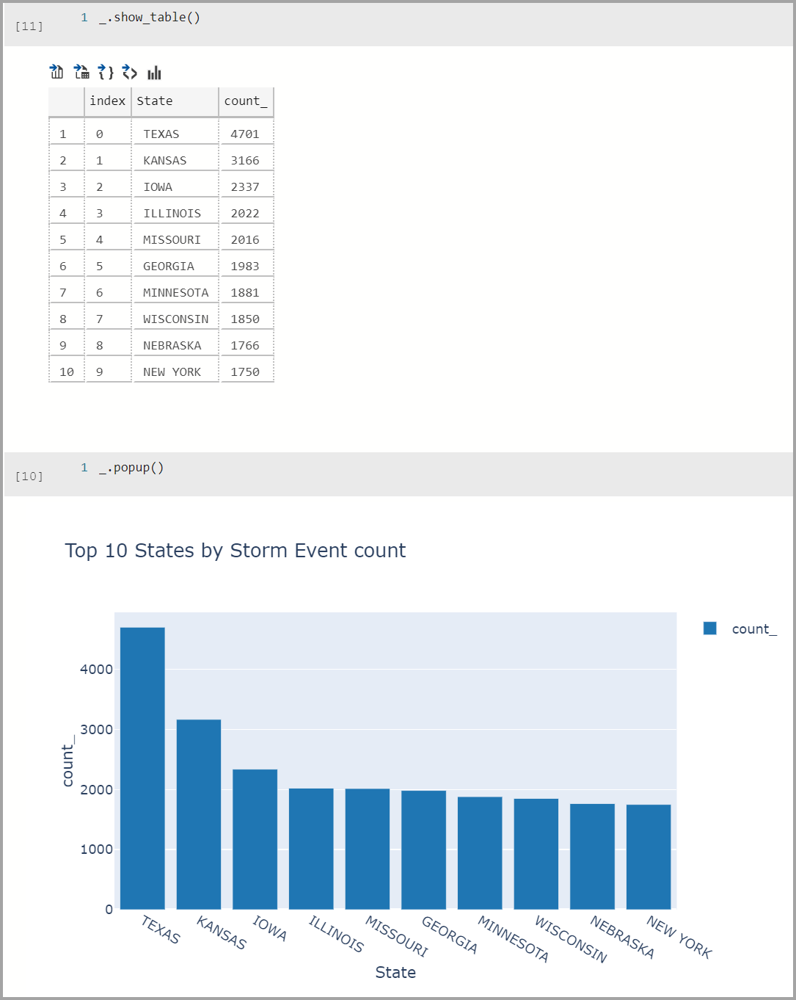
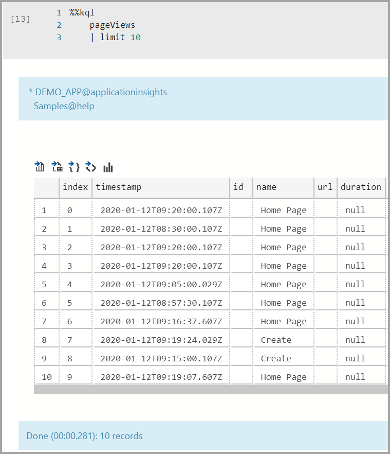
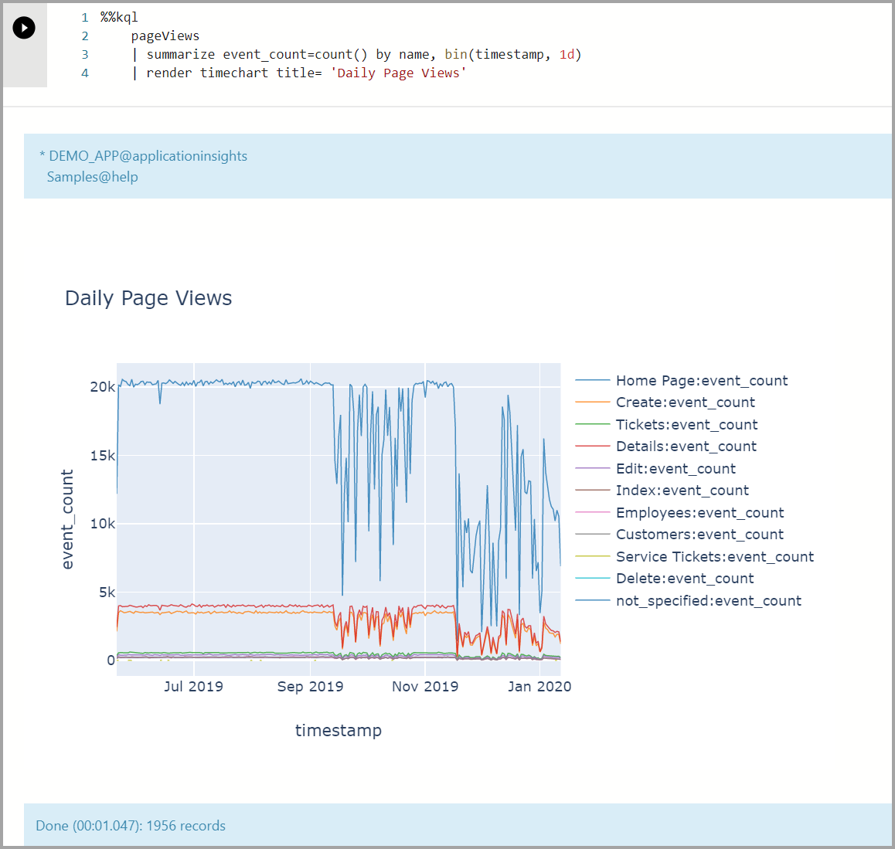
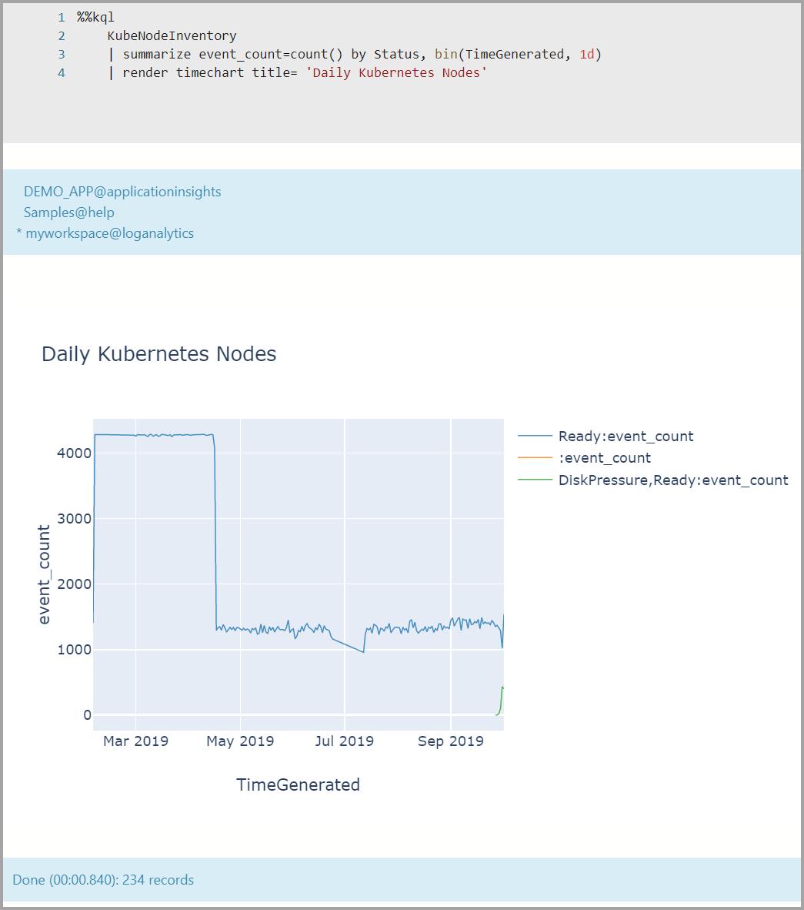

# Use a Jupyter Notebook and the Kqlmagic extension to analyze data in Azure Data Studio

[!INCLUDE[tsql-appliesto-ssver15-xxxx-xxxx-xxx](../includes/tsql-appliesto-ssver15-xxxx-xxxx-xxx.md)]

Jupyter Notebook supports magic functions that extend the capabilities of the kernel by supporting additional commands. **KQL (Kusto query language) magic** is a command that extends the capabilities of the Python kernel in [Jupyter Notebook](https://jupyter.org/) so you can run Kusto language queries natively. You can combine Python and Kusto query language to query and visualize data using rich Plot.ly library integrated with `render` commands. KQL magic brings you the benefit of notebooks, data analysis, and rich Python capabilities all in the same location.Data sources for running queries are supported. These data sources include **[Azure Data Explorer](https://docs.microsoft.com/azure/data-explorer/data-explorer-overview)**, **[Application Insights](https://docs.microsoft.com/azure/azure-monitor/app/app-insights-overview)** and **[Azure Monitor logs](https://docs.microsoft.com/azure/azure-monitor/platform/data-platform-logs)**.

The KQL magic extension is supported in **[Azure Data Studio notebooks](notebooks-guidance.md)**. It allows you to connect, query, and explore Azure Data Explorer, Application Insights and Azure Monitor logs data using KQL.

This tutorial demonstrates how to create and run a notebook in Azure Data Studio using the KQL magic extension for a Azure Data Explorer cluster, an Application Insights log, and Azure Monitor logs.

## Prerequisites

- [Azure Data Studio](download-azure-data-studio.md)
- [Python installed](https://www.python.org/downloads/)
- [Azure Data Explorer cluster and database](https://docs.microsoft.com/azure/data-explorer/create-cluster-database-portal)

## Install and set up KQL magic in a notebook

The steps in this section all run within an Azure Data Studio notebook.

1. Create a new notebook and change the **Kernel** to *Python 3*.

   

2. When asked, select **Yes** to upgrade the Python packages.

   

3. Install KQL magic:

   ```python
   !pip install Kqlmagic --no-cache-dir --upgrade
   ```

   Verify it's installed:

   ```python
   !pip list
   ```

   

4. Load KQL magic:

   ```python
   %reload_ext Kqlmagic
   ```

   > [!Note]
   > If this step fails, then close the file and reopen it.

   

5. You can test if KQL magic is loaded properly by browsing the help documentation or by checking for the version.

   ```python
   %kql --help "help"
   ```

   > [!Note]
   >  .If `Samples@help` is asking for a password, then you can leave it blank and press **Enter**.

   

   To see which version of kqlmagic is installed, run the command below.

   ```python
   %kql --version
   ```

   

## KQL magic with a Azure Data Explorer cluster

This section explains how to run data analysis using KQL magic with a Azure Data Explorer cluster.

### <a name="ade-load-auth"></a> Load and authenticate KQL magic for Azure Data Explorer

1. Load KQL magic:

   ```python
   %reload_ext Kqlmagic
   ```

   > [!Note]
   > Every time you create a new notebook in Azure Data Studio you must load the KQL magic extension.

   

2. Connect to the cluster and authenticate:

   ```python
   %kql azureDataExplorer://code;cluster='help';database='Samples'
   ```

   This uses Device Login to authenticate. Copy the code from the output and select **authenticate** which opens a browser where you need to paste the code. Once you authenticate successfully, you can come back to Azure Data Studio to continue with the rest of the script.

   

### Query and visualize for Azure Data Explorer

Query data using the [render operator](https://docs.microsoft.com/azure/data-explorer/kusto/query/renderoperator) and visualize data using the ploy.ly library. This query and visualization supplies an integrated experience that uses native KQL. Render is supported with all attributes except kind, ysplit, and accumulate.

1. Analyze top 10 storm events by state and frequency:

   ```python
   %kql StormEvents | summarize count() by State | sort by count_ | limit 10
   ```

   If you're familiar with the Kusto Query Language (KQL), you can simply type the query after `%kql`.

   

2. Visualize a timeline chart:

   ```python
   %kql StormEvents \
   | summarize event_count=count() by bin(StartTime, 1d) \
   | render timechart title= 'Daily Storm Events'
   ```

   

3. Assign a kql query bar chart to a Python variable:

   ```python
   %kql my_bar_chart << StormEvents | summarize count() by State | sort by count_ | limit 10 | render barchart title='my bar chart'

   my_bar_chart
   ```

   

   > [!Note]
   > Ability to assign KQL result to Python is super useful when there is additional data manipulation / analysis / visualization to be done in Python.

4. Print vs Display function

   ```python
   %kql bar_chart << StormEvents | summarize count() by State | sort by count_ | limit 10 | render barchart title='my bar chart'
   print(bar_chart)
   display(bar_chart)

   %kql pie_chart << StormEvents | summarize count() by State | sort by count_ | limit 10 | render piechart title='my pie chart'
   display(pie_chart)
   ```

   

5. Multiline Query sample using `<code>%%kql</code>`.

   ```python
   %%kql
    StormEvents
    | summarize count() by State
    | sort by count_
    | limit 10
    | render columnchart title='Top 10 States by Storm Event count'
   ```

   

6. Show last "x" output

   ```python
   _.show_table()
   ```

   ```python
   _.popup()
   ```

   

## KQL magic with Application Insights

### <a name="appin-load-auth"></a> Load and authenticate KQL magic for Application Insights

1. Load KQL magic:

   ```python
   %reload_ext Kqlmagic
   ```

   > [!Note]
   > Every time you create a new notebook in Azure Data Studio you must load the KQL magic extension.

   

2. Connect and authenticate

   ```python
   %kql appinsights://appid='DEMO_APP';appkey='DEMO_KEY'
   ```

### Query and visualize for Application Insights

Query data using the [render operator](https://docs.microsoft.com/azure/data-explorer/kusto/query/renderoperator) and visualize data using the ploy.ly library. This query and visualization supplies an integrated experience that uses native KQL. Render is supported with all attributes except kind, ysplit, and accumulate.

1. Show Page Views:

   ```python
   %%kql
   pageViews
   | limit 10
   ```

   

   > [!Note]
   > Use your mouse to drag on an area of the chart to zoom in to the specific date(s).

2. Show Page views in a timeline chart:

   ```python
   %%kql
   pageViews
   | summarize event_count=count() by name, bin(timestamp, 1d)
   | render timechart title= 'Daily Page Views'
   ```

   

## KQL magic with Azure Monitor logs

### <a name="aml-load-auth"></a> Load and authenticate KQL magic for Azure Monitor logs

1. Load KQL magic:

   ```python
   %reload_ext Kqlmagic
   ```

   

2. Connect and authenticate:

   ```python
   %kql loganalytics://workspace='DEMO_WORKSPACE';appkey='DEMO_KEY';alias='myworkspace'
   ```

   

### Query and visualize for Azure Monitor Logs

Query data using the [render operator](https://docs.microsoft.com/azure/data-explorer/kusto/query/renderoperator) and visualize data using the ploy.ly library. This query and visualization supplies an integrated experience that uses native KQL. Render is supported with all attributes except kind, ysplit, and accumulate.

1. View a timeline chart:

   ```python
   %%kql
   KubeNodeInventory
   | summarize event_count=count() by Status, bin(TimeGenerated, 1d)
   | render timechart title= 'Daily Kubernetes Nodes'
   ```

   

## Next steps

Learn more about notebooks and KQL magic:

- [Use a Jupyter Notebook and Kqlmagic extension to analyze data in Azure Data Explorer](https://docs.microsoft.com/azure/data-explorer/kqlmagic)
- [Extension (Magic) to Jupyter notebook and Jupyter lab, that enable notebook experience working with Kusto, Application Insights, and LogAnalytics data](https://github.com/Microsoft/jupyter-Kqlmagic)
- [Kqlmagic](https://pypi.org/project/Kqlmagic/)
- [KustoMagicSamples](https://notebooks.azure.com/RknDzgn/projects/KustoMagicSamples/html/Getting%20Started%20with%20kqlmagic%20on%20Azure%20Data%20Explorer-Copy.ipynb)
- [How to use notebooks with SQL Server](notebooks-guidance.md)
- [How to manage notebooks in Azure Data Studio](notebooks-manage-sql-server.md)
- [Run a sample notebook using Spark](../big-data-cluster/notebooks-tutorial-spark.md)