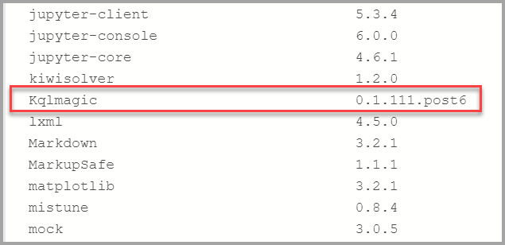

# Create and run a notebook with KQL magic

[!INCLUDE[tsql-appliesto-ssver15-xxxx-xxxx-xxx](../includes/tsql-appliesto-ssver15-xxxx-xxxx-xxx.md)]

This tutorial demonstrates how to create and run a notebook in Azure Data Studio using the KQL magic extension.

## Prerequisites

- [Azure Data Studio](download-azure-data-studio.md)
- [Python installed](https://www.python.org/downloads/)
- [Azure Data Explorer cluster and database](https://docs.microsoft.com/azure/data-explorer/create-cluster-database-portal)

## Set up and install KQL magicenvironment

1. Create a new notebook and change the **Kernel** to *Python 3*.

   

2. When asked, select **Yes** to upgrade Python packages.

   

3. Install Kqlmagic by running the command below.

   ```python
   !pip install Kqlmagic --no-cache-dir --upgrade
   ```

   To check if you have it installed, run te command below.

   ```python
   !pip list
   ```

   

4. Setup Azure Data Explorer connection.

   ```python
   %env KQLMAGIC_CONNECTION_STR=AzureDataExplorer://username='anyone@domain.com';cluster='help';database='Samples'
   ```

5. Load Kqlmagic.

   ```python
   %reload_ext Kqlmagic
   ```

   

   If this step fails, then close the file and reopen it.

   If Samples@help is asking for a password, then you can leave it blank and press [Enter].

   You can test if kqlmagic is loaded properly by browsing the help documentation.

   ```python
   %kql --help "help"
   ```

   

   To see which version of kqlmagic you installed, run the command below.

   ```python
   %kql --version
   ```

## Next steps

Learn more about KQL magic and notebooks:

- [Use a Jupyter Notebook and Kqlmagic extension to analyze data in Azure Data Explorer](https://docs.microsoft.com/azure/data-explorer/kqlmagic)

- [Extension (Magic) to Jupyter notebook and Jupyter lab, that enable notebook experience working with Kusto, ApplicationInsights, and LogAnalytics data](https://github.com/Microsoft/jupyter-Kqlmagic)

- [Kqlmagic](https://pypi.org/project/Kqlmagic/)

- [How to use notebooks with SQL Server](notebooks-guidance.md)

- [How to manage notebooks in Azure Data Studio](notebooks-manage-sql-server.md)

- [Run a sample notebook using Spark](../big-data-cluster/notebooks-tutorial-spark.md)