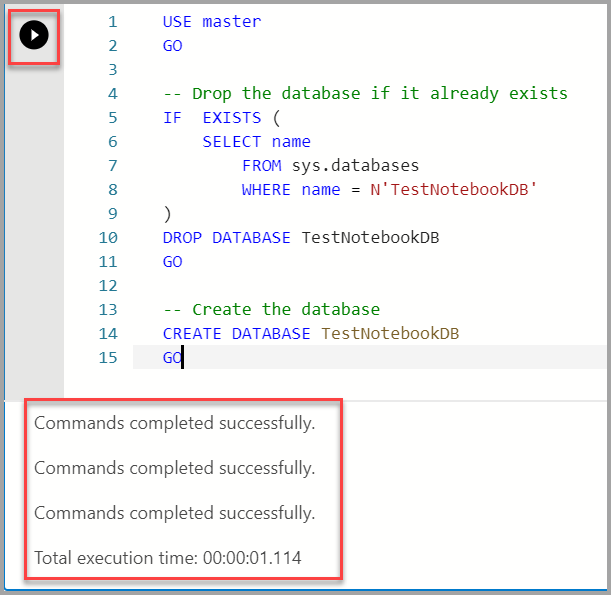
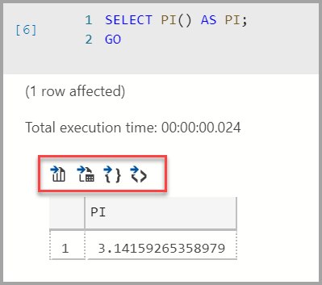

# Create and run a SQL Server notebook

[!INCLUDE[tsql-appliesto-ssver15-xxxx-xxxx-xxx](../includes/applies-to-version/_ss2019.md)]

This tutorial demonstrates how to create and run a notebook in Azure Data Studio using SQL Server.

## Prerequisites

- [Azure Data Studio installed](download-azure-data-studio.md)
- SQL Server installed
  - [Windows](../database-engine/install-windows/install-sql-server.md)
  - [Linux](../linux/sql-server-linux-setup.md)

## New notebook

The following steps show how to create a notebook file in Azure Data Studio:

1. In Azure Data Studio, connect to your SQL Server.

2. Select under the **Connections** in the **Servers** window. Then select **New Notebook**.

   

3. Wait for the **Kernel** and the target context (**Attach to**) to be populated. Confirm that the **Kernel** is set to **SQL**, and set **Attach to** for your SQL Server (in this case its *localhost*).

   

## Run a notebook cell

You can run each notebook cell by pressing the play button to the left of the cell. The results are shown in the notebook after the cell finishes running.

### Code

Add a new code cell by selecting the **+Code** command in the toolbar.


This example creates a new database.

```sql
USE master
GO

   -- Drop the database if it already exists
IF  EXISTS (
        SELECT name
        FROM sys.databases
        WHERE name = N'TestNotebookDB'
   )
DROP DATABASE TestNotebookDB
GO

-- Create the database
CREATE DATABASE TestNotebookDB
GO
```

   

If you run a script that returns a result, you can save that result in different formats.

- Save As CSV
- Save As Excel
- Save As JSON
- Save As XML

In this case, we return the result of [PI](../t-sql/functions/pi-transact-sql.md).

```sql
SELECT PI() AS PI;
GO
```



### Text

Add a new text cell by selecting the **+Text** command in the toolbar.


The cell changes to edit mode and now type markdown and you can see the preview at the same time


Selecting outside the text cell shows the markdown text.


## Next steps

Learn more about notebooks:

- [How to use notebooks with SQL Server](notebooks-guidance.md)

- [How to manage notebooks in Azure Data Studio](notebooks-manage-sql-server.md)

- [Run a sample notebook using Spark](../big-data-cluster/notebooks-tutorial-spark.md)