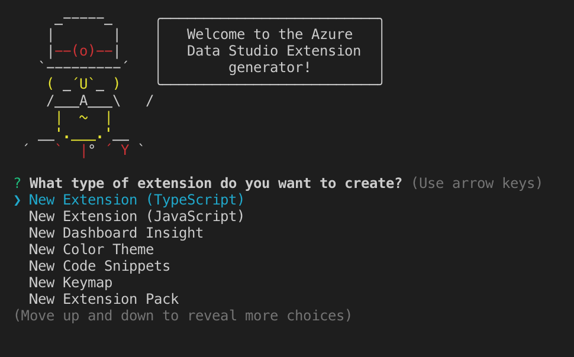

# Tutorial: Create an Azure Data Studio extension

This tutorial demonstrates how to create a new !INCLUDE[name-sos-short](../includes/name-sos-short.md) extension.

During this tutorial you learn how to:
> [!div class="checklist"]
> * Create an extension project
> * Install the extension generator
> * Create your extension
> * Test your extension
> * Package your extension
> * Publish your extension to the marketplace

## Prerequisites

Azure Data Studio is built on the same framework as Visual Studio Code, so we'll build our extension in Visual Studio Code. To get started, you need the following components:

- [Node.js](https://nodejs.org) installed and available in your `$PATH`. Node.js includes [npm](https://www.npmjs.com/), the Node.js Package Manager, which is used to install the extension generator.
- [Visual Studio Code](https://code.visualstudio.com) to debug the extension.
- The !INCLUDE[name-sos-short](../includes/name-sos-short.md) [Debug extension](https://marketplace.visualstudio.com/items?itemName=ms-mssql.sqlops-debug).
- Ensure sqlops is on your path. For Windows, make sure you choose the "Add to Path" option in the setup.exe. For Mac/Linux, you can run the Install 'sqlops' command in PATH option.

## Create a new extension project

Visual Studio Code
Node.js installed and added to your path
SQL Operations Studio Debug extension (optional). This lets you test your extension without packaging it and installing into Ops Studio
It’ll take about 10 minutes to install all of the above, so we only have 5 minutes left to get our extension going. Luckily it’s pretty easy!

## Install the extension generator

We’ve built an [extension generator](https://code.visualstudio.com/docs/extensions/yocode) using Yeoman. To install it, run the following from the command prompt:

`npm install -g yo generator-sqlops`

## Create your extension

To create an extension:

1. Launch the extension generator with the following command:

   `yo sqlops`

2. Choose **New Keymap** from the list of extension types.

   

3. Follow the steps to fill in the extension name (in our case, *ssmskeymap*) and a description, and the generator creates a new folder.

Open the folder in Visual Studio Code and you’re ready to create your own keybindings!

In this step, ...

## Test your extension

In this step, ...

## Package your extension

In this step, ...

## Publish your extension to the marketplace

In this step, ...

## Next steps

In this tutorial, you learned how to:
> [!div class="checklist"]
> * Create an extension project
> * Install the extension generator
> * Create your extension
> * Test your extension
> * Package your extension
> * Publish your extension to the marketplace

To learn how to backup and restore databases, complete the next tutorial:

> [!div class="nextstepaction"]
> [Backup and restore databases](tutorial-backup-restore-sql-server.md).