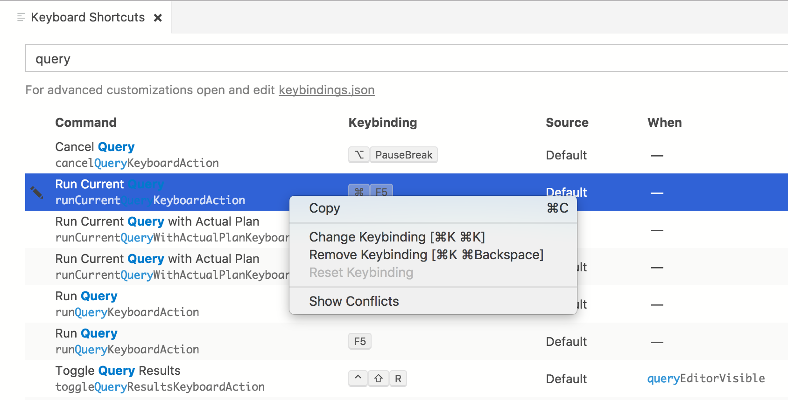
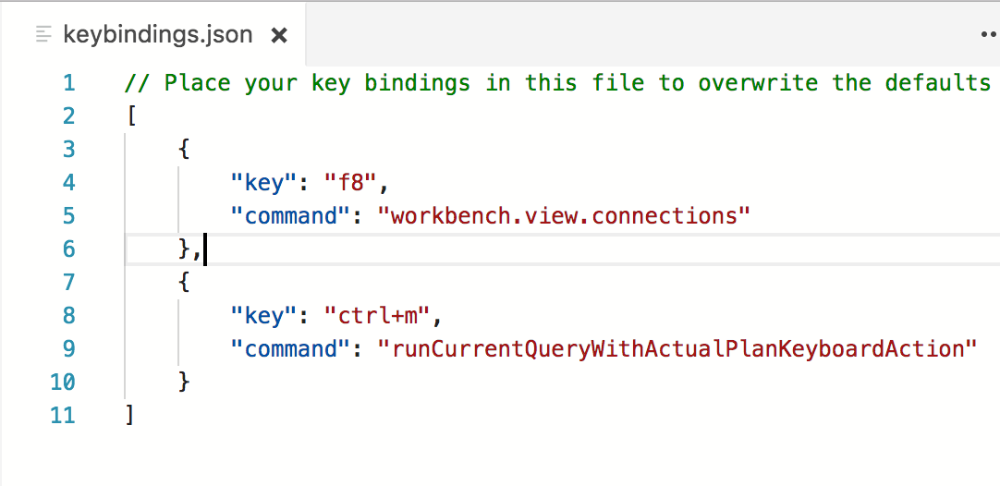
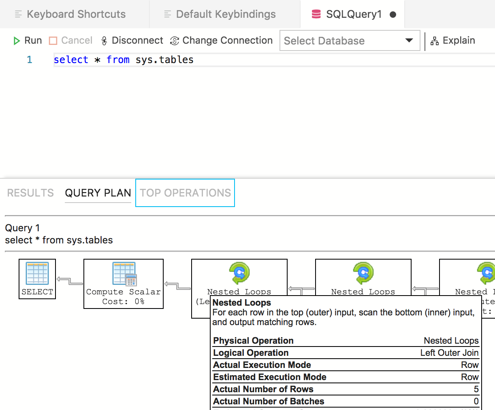

# Tutorial: Create an Azure Data Studio extension

This tutorial demonstrates how to create a new Azure Data Studio (preview) extension.

During this tutorial you learn how to:
> [!div class="checklist"]
> * Create an extension project
> * Install the extension generator
> * Create your extension
> * Test your extension
> * Package your extension
> * Publish your extension to the marketplace

## Prerequisites

Azure Data Studio is built on the same framework as Visual Studio Code, so we'll build our extension in Visual Studio Code. To get started, you need the following components:

- [Node.js](https://nodejs.org) installed and available in your `$PATH`. Node.js includes [npm](https://www.npmjs.com/), the Node.js Package Manager, which is used to install the extension generator.
- [Visual Studio Code](https://code.visualstudio.com) to debug the extension.
- The Azure Data Studio [Debug extension](https://marketplace.visualstudio.com/items?itemName=ms-mssql.sqlops-debug).
- Ensure sqlops is on your path. For Windows, make sure you choose the "Add to Path" option in the setup.exe. For Mac/Linux, you can run the Install 'sqlops' command in PATH option.


## Create a new extension project

Visual Studio Code
Node.js installed and added to your path
SQL Operations Studio Debug extension (optional). This lets you test your extension without packaging it and installing into Ops Studio
It’ll take about 10 minutes to install all of the above, so we only have 5 minutes left to get our extension going. Luckily it’s pretty easy!

## Install the extension generator

We’ve built an [extension generator](https://code.visualstudio.com/docs/extensions/yocode) using Yeoman. To install it, run the following from the command prompt:

`npm install -g yo generator-sqlops`

## Create your extension

To create an extension:

1. Launch the extension generator with the following command:

   `yo sqlops`

2. Choose **New Keymap** from the list of extension types.

   

3. Follow the steps to fill in the extension name (in our case, *ssmskeymap*) and a description, and the generator creates a new folder.

Open the folder in Visual Studio Code and you’re ready to create your own keybindings!

### Adding a keyboard shortcut

**Step 1: Find the shortcuts to replace**

Now that we have our extension ready to go, I want to add some keyboard shortcuts (or keybindings) used in SSMS into Ops Studio. 
I used Andy Mallon’s Cheatsheet and RedGate’s keyboard shortcuts list for inspiration. 

The top things I saw were missing were:

- Run a query with the actual execution plan enabled. This is Ctrl+M in SSMS and doesn’t have a binding in Ops Studio.
- Having Ctrl+Shift+E as a 2nd way of running a query. Some people complained this was missing
- Having Alt+F1 run sp_help. We added this in Ops Studio but since that binding was in use we put it as Alt+F2 instead
- Toggle full screen (shift+alt+enter)
- F8 to show your Object Explorer / Servers view

It’s easy to find and replace these — run Open Keyboard Shortcuts to show the Keyboard Shortcuts tab in Ops Studio, search for query and then choose to Change Keybinding. Once you’ve done so you can see it in the keybindings.json file (run Open Keyboard Shortcuts File to see it).






**Step 2: Add shortcuts to the extension**

This one’s easy — I opened up the package.json file in the extension and replaced the contributes section with the following:


```json
"contributes": {
  "keybindings": [
    {
      "key": "shift+cmd+e",
      "command": "runQueryKeyboardAction"
    },
    {
      "key": "ctrl+cmd+e",
      "command": "workbench.view.explorer"
    },
    {
      "key": "alt+f1",
      "command": "workbench.action.query.shortcut1"
    },
    {
      "key": "shift+alt+enter",
      "command": "workbench.action.toggleFullScreen"
    },
    {
      "key": "f8",
      "command": "workbench.view.connections"
    },
    {
      "key": "ctrl+m",
      "command": "runCurrentQueryWithActualPlanKeyboardAction"
    }
  ]
}
```


## Test your extension

To test, I made sure sqlops was in my PATH by running the Install 'sqlops'command in PATH command in Ops Studio, and had the SQL Operations Studio Debug extension installed in VSCode. Then I hit F5 to launch Ops Studio in debug mode with my extension running:




Success! It’s all working and ready to share. Keymaps are one of the quickest extensions so feel free to make your own!

## Package your extension

To share with others I needed to package the extension into a single file. This can be published in an extension marketplace or just shared among your team / community. To do this, I first needed to install another npm package from the command line:

`npm install -g vsce`

Then I ran vsce package from the base directory of my extension. I did have to add in a couple of extra lines to stop the vsce tool complaining:

```json
"repository": {
    "type": "git",
    "url": "https://github.com/kevcunnane/ssmskeymap.git"
},
"bugs": {
    "url": "https://github.com/kevcunnane/ssmskeymap/issues"
},
```


Once this was done, my ssmskeymap-0.1.0.vsix file was created and ready to install / share with the world!


## Publish your extension to the marketplace

As this is early days, SQL Operations Studio is just rolling out the process for publishing to the Extensions list inside Ops Studio. We’ll be documenting the exact steps in our [wiki](https://github.com/Microsoft/sqlopsstudio/wiki/Getting-started-with-Extensibility), and the basic process will be to host the extension VSIX somewhere (a Github Release page is a good idea) then submit a PR changing [this JSON file](https://github.com/Microsoft/sqlopsstudio/blob/release/extensions/extensionsGallery.json) to add you extension info.
I’ll be following this process myself to get the SSMS Keymaps extension published and update this page once I’ve completed it!


## Next steps

In this tutorial, you learned how to:
> [!div class="checklist"]
> * Create an extension project
> * Install the extension generator
> * Create your extension
> * Test your extension
> * Package your extension
> * Publish your extension to the marketplace


I hope after reading this you’ll be inspired to build your own extension for Azure Data Studio. We have support for Dashboard Insights (pretty graphs that run against your SQL Server), a number of SQL-specific APIs, and a huge existing set of extension points inherited from Visual Studio Code.
If you have an idea but are not sure how to get started please open an issue or tweet at the team ([sqlopsstudio](https://twitter.com/sqlopsstudio), [me](https://twitter.com/kevcunnane), [Alan](https://twitter.com/alanyusql), [Abbie](https://twitter.com/ppookpetch)).

Help and documentation are getting written on our [wiki](https://github.com/Microsoft/sqlopsstudio/wiki/Getting-started-with-Extensibility), and you can always refer to the [VSCode extension guide](https://code.visualstudio.com/docs/extensions/overview) because it covers all the existing APIs and patterns.


To learn how to backup and restore databases, complete the next tutorial:

> [!div class="nextstepaction"]
> [Backup and restore databases](tutorial-backup-restore-sql-server.md).