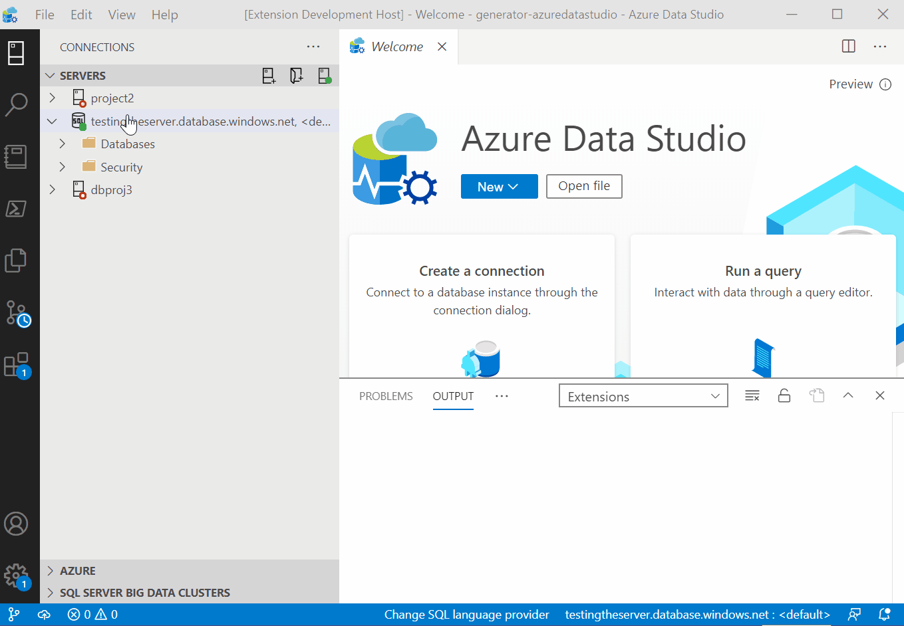
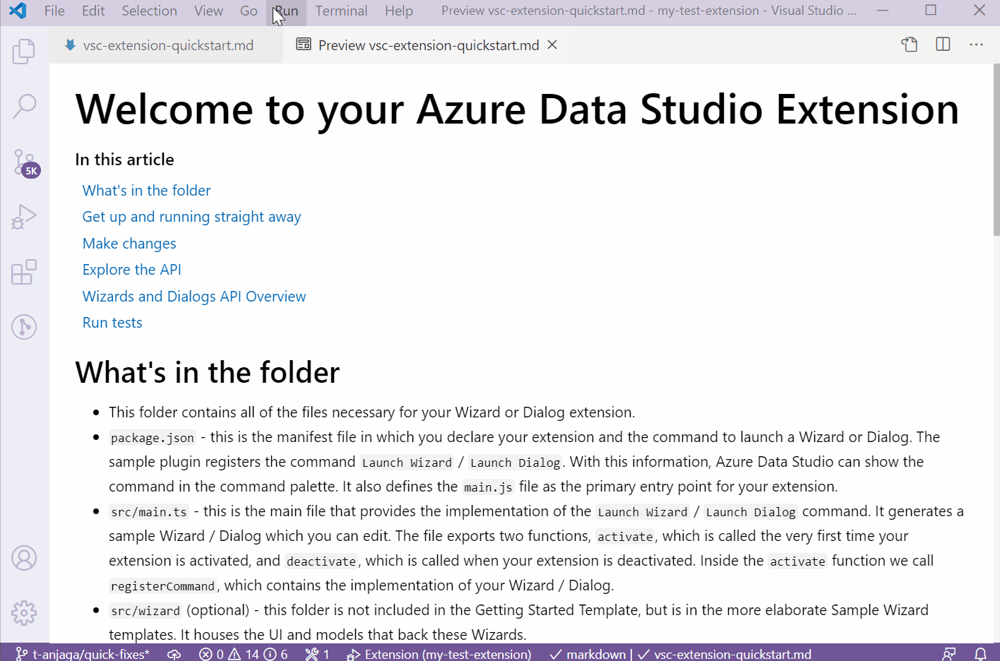
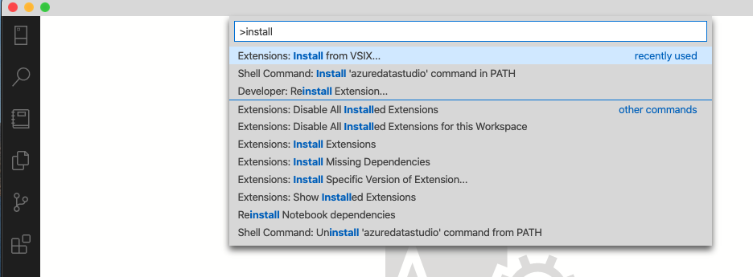

# Tutorial: Create an Azure Data Studio Wizard extension

This tutorial demonstrates how to create a new **Azure Data Studio Wizard extension**. The extension contributes a wizard to interact with users in Azure Data Studio.

During this tutorial you learn how to:
> [!div class="checklist"]
> * Install the extension generator
> * Create your extension
> * Add a custom wizard to your extension
> * Test your extension
> * Package your extension
> * Publish your extension to the marketplace

## Prerequisites

Azure Data Studio is built on the same framework as Visual Studio Code, so extensions for Azure Data Studio are built using Visual Studio Code. To get started, you need the following components:

- [Node.js](https://nodejs.org) installed and available in your `$PATH`. Node.js includes [npm](https://www.npmjs.com/), the Node.js Package Manager, which is used to install the extension generator.
- [Visual Studio Code](https://code.visualstudio.com) to debug the extension.
- The Azure Data Studio [Debug extension](https://marketplace.visualstudio.com/items?itemName=ms-mssql.sqlops-debug) (optional). This lets you test your extension without needing to package and install it into Azure Data Studio.
- Ensure `azuredatastudio` is in your path. For Windows, make sure you choose the `Add to Path` option in setup.exe. For Mac or Linux, run the *Install 'azuredatastudio' command in PATH* option.

## Install the extension generator

To simplify the process of creating extensions, we've built an [extension generator](https://code.visualstudio.com/docs/extensions/yocode) using Yeoman. To install it, run the following from the command prompt:

`npm install -g yo generator-azuredatastudio`

## Create your wizard extension

### Introduction to wizards

Wizards are a user interface type that present step-by-step pages for users to fill in, in order to accomplish a task. Common examples include software setup wizards and troubleshooting wizards. For example:



Because wizards are often helpful when working with data and extending the functionality of Azure Data Studio, Azure Data Studio offers APIs to create your own custom wizards. We will be walking through how to generate a Wizard template and modify it to create your own custom wizard.

### Run the extension generator

To create an extension:

1. Launch the extension generator with the following command:

   `yo azuredatastudio`

2. Choose **New Wizard or Dialog** from the list of extension types. Then select **Wizard**, followed by the **Getting Started Template**

3. Follow the steps to fill in the extension name (for this tutorial, use **My Test Extension**), and add a description.


Completing the previous steps creates a new folder. Open the folder in Visual Studio Code and you're ready to create your own wizard extension!

### Run the extension

Let's see what the wizard template gives us by running the extension. Before running, ensure that the **Azure Data Studio Debug extension** is installed in Visual Studio Code.

Select **F5** in VS Code to launch Azure Data Studio in debug mode with the extension running. Then, in Azure Data Studio, run the **Launch Wizard** command from the Command Palette (Ctr+Shift+P) in the new window. This will launch the default wizard that this extension contributes:



Next, we will look at how to modify this default wizard.

### Develop the wizard

The most important files to get started with extension development are `package.json`, `src/main.ts`, and `vsc-extension-quickstart.md`:

- `package.json`: This is the manifest file, where the **Launch Wizard** command is registered. This is also where `main.ts` is declared the main program entry point.
- `main.ts`: Contains the code to add UI elements to the Wizard, like pages, text, and buttons
- `vsc-extension-quickstart.md`: Contains technical documentation that may be a helpful reference when developing

Let's make a change to the wizard: we'll add a 4th, blank page. Modify `src/main.ts` as shown below, and you should see an additional page show up when you launch the wizard.


Once you are familiar with the template, here are some additional ideas to try:

- Add a button with a width of 300 to your new page
- Add a flex component to put your button in
- Add an action to your button. For example, when the button is clicked, launch a file-opening dialog or open a query editor.

## Package your extension

To share with others you need to package the extension into a single file. This can be published to the Azure Data Studio extension marketplace, or shared among your team or community. To do this, you need to install another npm package from the command line:

`npm install -g vsce`

Edit the `README.md` to your liking, then navigate to the base directory of the extension, and run `vsce package`. You can optionally link a repository with your extension or continue without one. To add one, add a similar line to your `package.json` file.

```json
"repository": {
    "type": "git",
    "url": "https://github.com/anjalia/my-test-extension.git"
}
```

After these lines were added, a my-test-extension-0.0.1.vsix file was created and ready to install in Azure Data Studio.



## Publish your extension to the marketplace

The Azure Data Studio extension marketplace is not totally implemented yet, but the current process is to host the extension VSIX somewhere (for example, a GitHub Release page) then submit a PR updating [this JSON file](https://github.com/Microsoft/azuredatastudio/blob/release/extensions/extensionsGallery.json) with your extension info.

## Next steps

In this tutorial, you learned how to:
> [!div class="checklist"]
> * Install the extension generator
> * Create your extension
> * Add a custom wizard to your extension
> * Test your extension
> * Package your extension
> * Publish your extension to the marketplace

We hope after reading this you'll be inspired to build your own extension for Azure Data Studio. We have support for Dashboard Insights (pretty graphs that run against your SQL Server), a number of SQL-specific APIs, and a huge existing set of extension points inherited from Visual Studio Code.

If you have an idea but are not sure how to get started, please open an issue or tweet at the team: [azuredatastudio](https://twitter.com/azuredatastudio).

You can always refer to the [Visual Studio Code extension guide](https://code.visualstudio.com/docs/extensions/overview) because it covers all the existing APIs and patterns.

To learn how to work with T-SQL in Azure Data Studio, complete the T-SQL Editor tutorial:

> [!div class="nextstepaction"]
> [Use the Transact-SQL editor to create database objects](tutorial-sql-editor.md).
