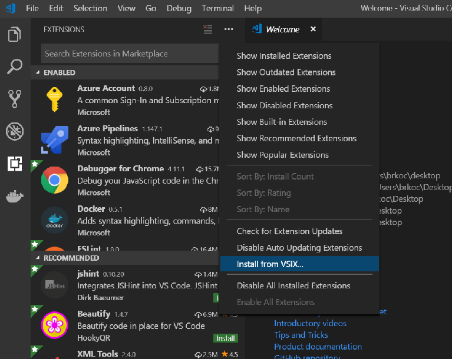
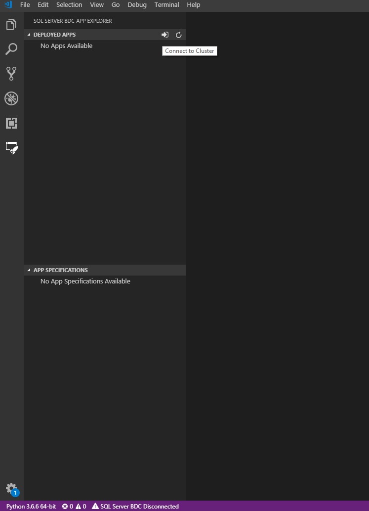
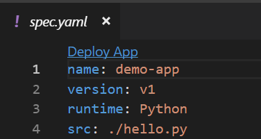
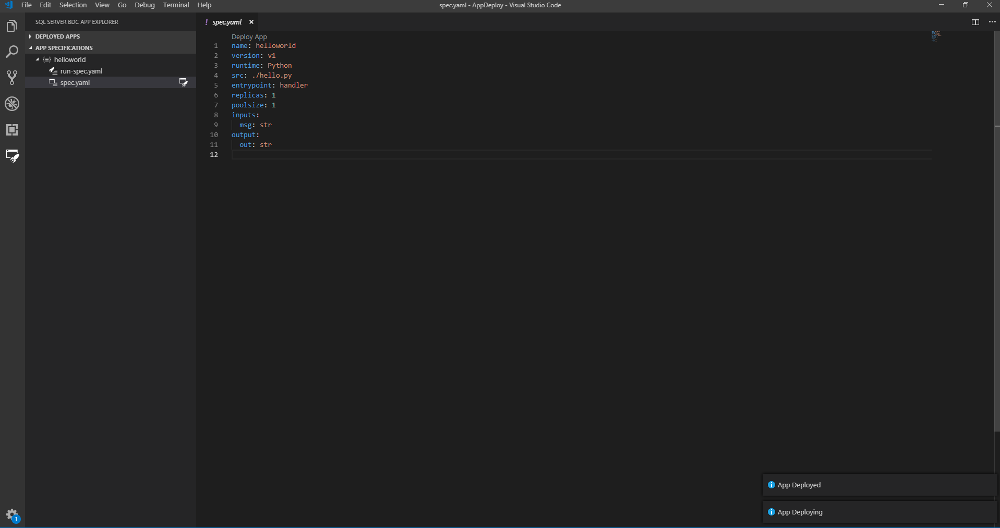
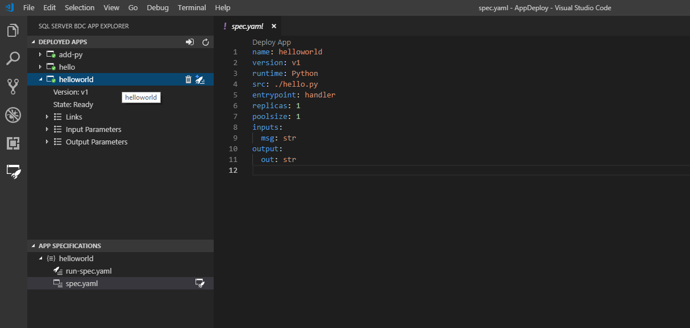
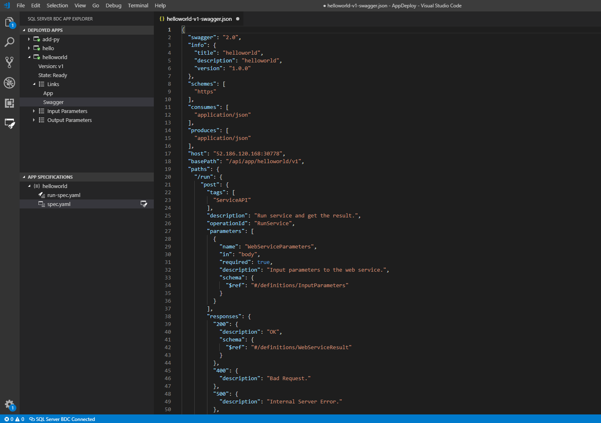
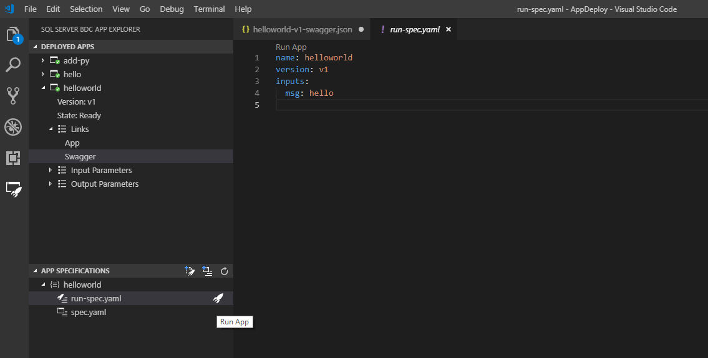
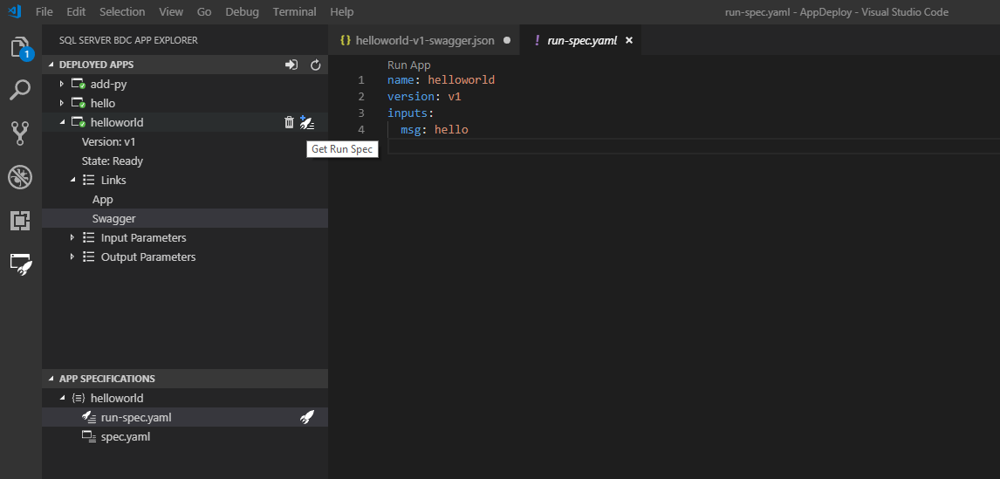
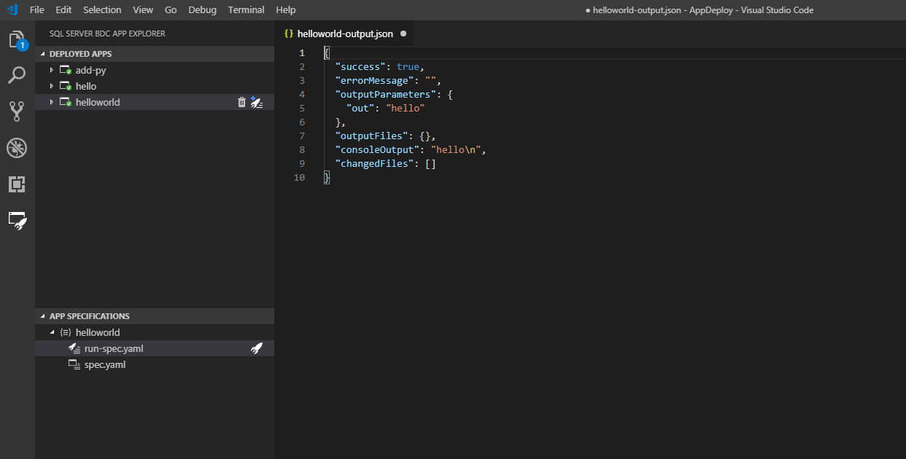

# How to use VS Code to deploy applications to SQL Server big data clusters

This article describes how to deploy applications to a SQL Server big data cluster using Visual Studio Code with the App Deployment extension. This capability was introduced in CTP 2.3. 

## Prerequisites

- [Visual Studio Code](https://code.visualstudio.com/).
- [SQL Server big data cluster](big-data-cluster-overview.md) CTP 2.3 or later.

## Capabilities

This extension supports the following tasks in Visual Studio Code:

- Authenticate with SQL Server Big Data Cluster.
- Retrieve an application template from GitHub repository for deployment of supported runtimes.
- Manage currently open application templates in the user's workspace.
- Deploy an application through a specification in YAML format.
- Manage deployed apps within SQL Server Big Data Cluster.
- View all apps that you have deployed in the side bar with additional information.
- Generate a run spec to consume the app or delete the app from the cluster.
- Consume deployed apps through a run specification YAML.

The following sections walk though the installation process and provides an overview how the extension works. 

### Install

First install the App Deployment extension in VS Code:

1. Download [sqlservbdc-app-deploy.vsix](https://aka.ms/sql-app-deploy) to install the extension as part of VS Code.

1. Launch VS Code and navigate to the Extensions sidebar.

1. Click the `…` context menu on the top of the side bar and select `Install from vsix`.

   

1. Find the `sqlservbdc-app-deploy.vsix` file you downloaded and choose that to install.

After the SQL Server big data cluster app deploy extension has been installed, it prompts you to reload VS Code. You should now see the SQL Server BDC App Explorer in the VS Code sidebar.

### App Explorer

Click on the extension in the sidebar to load a side panel showing the App Explorer. The following sample screenshot of the App Explorer shows no apps or app specifications available:

</img>
<!---->

#### New Connection

To connect to the cluster endpoint, use one of the following methods:

- Click on the status bar at the bottom that says `SQL Server BDC Disconnected`.
- Or click on the `New Connection` button at the top with the arrow pointing into a doorway.

   

VS Code prompts for the appropriate endpoint, username, and password. If given the correct credentials and app endpoint, VS Code notifies that you've been connected to the cluster and you will see any deployed apps populated in the sidebar. If you successfully connect, your endpoint and username will be saved to `./sqldbc` as part of your user profile. No password or tokens will ever be saved. When logging in again, the prompt will pre-fill with your saved host and username but always require you to input a password. If you wish to connect to a different cluster endpoint, just click the `New Connection` again. The connection will automatically close if you close VS Code or if you open a different workspace and you will need to reconnect.

### App Template

To deploy a new app from one of our templates, click on the `New App Template` button on the `App Specifications` pane, where you will be prompted for the name, the runtime, and what location you would like to place the new app in on your local machine. It is advised that you place it in your current VS Code workspace so that you can use the full functionality of the extension, but you can place it anywhere in your local file system.

Once completed, a new app template is scaffolded for you at the location you specified, and the deployment `spec.yaml` opens in your workspace. If the directory you selected is in your workspace, you should also see it listed under the `App Specifications` pane:

The template is a simple `Hello World` app that is laid out as follows:

- **spec.yaml**
   - Tells the cluster how to deploy your app
- **run-spec.yaml**
   - Tells the cluster how you'd like to call your app
- **handler.py**
   - This is your source code file as specified by `src` in `spec.yaml`
   - It has one function called `handler` that is considered the `entrypoint` of the app as shown in `spec.yaml`. It takes in a string input called `msg` and returns a string output called `out`. These are specified in `inputs` and `outputs` of the `spec.yaml`.

If you do not want a scaffolded template and would just prefer a `spec.yaml` for deployment of an app you have already built, click the `New Deploy Spec` button next to the `New App Template` button and go through the same process, but you will just receive the `spec.yaml`, which you can modify how you choose.

### Deploy App

You may instantly deploy this App through the code lens `Deploy App` in the `spec.yaml` or press the lightning folder button next to the `spec.yaml` file in the App Specifications menu. The extension will zip up all files in the directory where your `spec.yaml` is located and deploy your app to the cluster. 

>[!NOTE]
>Please ensure that all of your app files are in the same directory as your `spec.yaml`. The `spec.yaml` must be at the root level of your app source code directory. 

You will be notified when the app is ready for consumption based on the state of the app in the sidebar:

From the side pane, you will be able to see the following available to you:

You may view all apps you have deployed in the side bar with the following information:

- state
- version
- input parameters
- output parameters
- links
  - swagger
  - details

If you click `Links`, you will see that you can access the `swagger.json` of your deployed app, so that write your own clients which call your app:

### App Run

Once the app is ready, call the app with the `run-spec.yaml` that was given as part of the app-template:

Specify any string you'd like in place of `hello` and then again run it through the code lens link or the lightning button in the side bar next to the `run-spec.yaml`. If you do not have a run-spec for whatever reason, generate one from the deployed app in the cluster:

Once you have one and have edited it to your satisfaction, run it. VS Code returns the appropriate feedback when the app has finished running:

As you can see from above, the output is given in a temporary `.json` file in your workspace. If you would like to keep this output, feel free to save it, otherwise, it will be deleted on closing. If your app has no output to print to a file, you will only get the `Successful App Run` notification at the bottom. If you did not have a successful run, you will receive an appropriate error message that will help you determine what is wrong.

When running an app, there are a variety of ways to pass parameters:

You may specify all inputs required through a `.json`, that is:

- `inputs: ./example.json`

When calling a deployed app, if any input parameters are innate to the app or user specified and that given input parameter is anything other than a primitive, such as an array, vector, dataframe, complex JSON, etc. specify the parameter type directly in line when calling the app, that is:

- Vector
    - `inputs:`
        - `x: [1, 2, 3]`
- Matrix
    - `inputs:`
        - `x: [[A,B,C],[1,2,3]]`
- Object
    - `inputs:`
        - `x: {A: 1, B: 2, C: 3}`

Or give a string as a relative or absolute file path to a `.txt`, `.json`, or `.csv` that gives the required input in the format that your app requires. The file parsing is based on `Node.js Path library`, where a file path is defined as a `string that contains a / or \ character`.

If the input parameter is not provided as needed, an appropriate error message will be shown with either the incorrect file path if a string file path was given or that parameter was invalid. The responsibility is given to the creator of the app to ensure they understand the parameters they are defining.

To delete an app, just click the Trash can button next to the app in the `Deployed Apps` side pane.

## Next steps

You can also refer to the additional samples at [App Deploy Samples](https://aka.ms/sql-app-deploy) to try with the extension.

For more information about SQL Server big data clusters, see [What are SQL Server 2019 big data clusters?](big-data-cluster-overview.md).

Our goal is to make this extension useful for you and we appreciate you feedback. Please send them to [[!INCLUDE[ssNoVersion](../includes/ssnoversion-md.md)] team](https://aka.ms/sqlfeedback).
