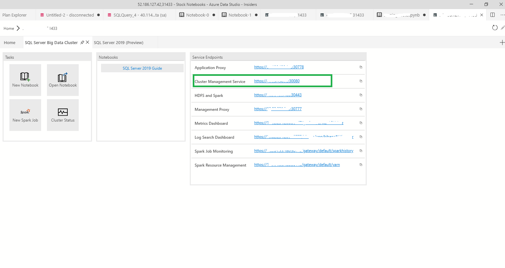

# Consume an app deployed on SQL Server big data cluster using a RESTful web service

[!INCLUDE[tsql-appliesto-ssver15-xxxx-xxxx-xxx](../includes/tsql-appliesto-ssver15-xxxx-xxxx-xxx.md)]

This article describes how to consume an app deployed on a SQL Server 2019 big data cluster using a RESTful web service (preview).

## Prerequisites

- [SQL Server 2019 big data cluster](deployment-guidance.md)
- [azdata command-line utility](deploy-install-azdata.md)
- An app deployed using either [azdata](big-data-cluster-create-apps.md) or the [App Deploy extension](app-deployment-extension.md)

## Capabilities

After you have deployed an application to your SQL Server 2019 big data cluster (preview), you can access and consume that application using a RESTful web service. This enables integration of that app from other applications or services (for example, a mobile app or website). The following table describes the application deployment commands that you can use with **azdata** to get information about the RESTful web service for your app.

|Command |Description |
|:---|:---|
|`azdata app describe` | Describe application. |

You can get help with the `--help` parameter as in the following example:

```bash
azdata app describe --help
```

The following sections describe how to retrieve an endpoint for an application and how to work with the RESTful web service for application integration.

## Retrieve the endpoint

The **azdata app describe** command provides detailed information about the app including the end point in your cluster. This is typically used by an app developer to build an app using the swagger client and using the webservice to interact with the app in a RESTful manner.

Describe your app by running a command similar to the following:

```bash
azdata app describe --name addpy --version v1
```

```json
{
  "input_param_defs": [
    {
      "name": "x",
      "type": "int"
    },
    {
      "name": "y",
      "type": "int"
    }
  ],
  "links": {
    "app": "https://10.1.1.3:30080/app/addpy/v1",
    "swagger": "https://10.1.1.3:30080/app/addpy/v1/swagger.json"
  },
  "name": "add-app",
  "output_param_defs": [
    {
      "name": "result",
      "type": "int"
    }
  ],
  "state": "Ready",
  "version": "v1"
}
```

Note the IP address (`10.1.1.3` in this example) and the port number (`30080`) in the output.

One of the other ways to get this information is doing right-click Manage on the server in Azure Data Studio where you will find the endpoints of the services listed.



## Generate a JWT access token

In order to access the RESTful web service for the app you have deployed you first have to generate a JWT Access token. Open the following URL in your browser: `https://[IP]:[PORT]/docs/swagger.json` using the IP address and port you retrieved running the `describe` command above. You will have to log in with the same credentials you used for `azdata login`.

Paste the contents of the `swagger.json` into the [Swagger Editor](https://editor.swagger.io) to understand what methods are available:


Notice the `app` GET method as well as the `token` POST method. Since the authentication for apps uses JWT tokens you will need to get a token my using your favorite tool to make a POST call to the `token` method. Here is an example of how to do just that in [Postman](https://www.getpostman.com/):


The result of this request will give you an JWT `access_token`, which you will need to call the URL to run the app.

## Execute the app using the RESTful web service

> [!NOTE]
> If you want, you can open the URL for the `swagger` that was returned when you ran `azdata app describe --name [appname] --version [version]` in your browser, which should be similar to `https://[IP]:[PORT]/app/[appname]/[version]/swagger.json`. You will have to log in with the same credentials you used for `azdata login`. The contents of the `swagger.json` you can paste into [Swagger Editor](https://editor.swagger.io). You will see that the web service exposes the `run` method. Also note the Base URL displayed at the top.

You can use your favorite tool to call the `run` method (`https://[IP]:30778/api/app/[appname]/[version]/run`), passing in the parameters in the body of your POST request as json. In this example we will use [Postman](https://www.getpostman.com/). Before making the call, you will need to set the `Authorization` to `Bearer Token` and paste in the token you retrieved earlier. This will set a header on your request. See the screenshot below.


Next, in the requests body, pass in the parameters to the app you are calling and set the `content-type` to `application/json`:


When you send the request, you will get the same output as you did when you ran the app through `azdata app run`:


You have now successfully called the app through the web service. You can follow similar steps to integrate this web service in your application.

## Next steps

You can also check out additional samples at [App Deploy Samples](https://aka.ms/sql-app-deploy).

For more information about SQL Server big data clusters, see [What are SQL Server 2019 big data clusters?](big-data-cluster-overview.md).
