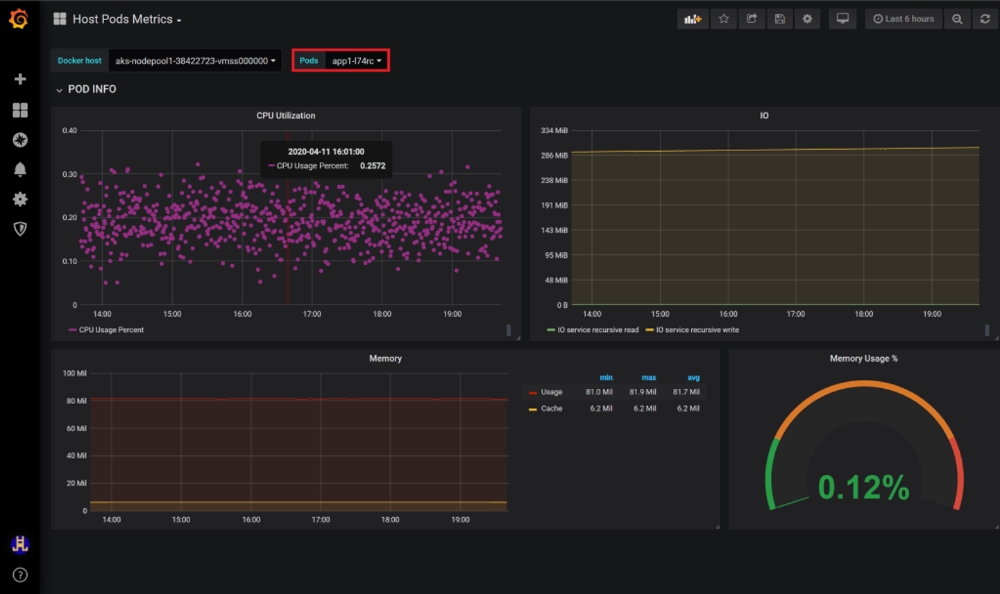

Grafana is one of the best cloud-native virtualization tools which can be used to provide various monitoring metrics of your application running in Kubernetes.  You can use the following command which will give you the endpoint of **Grafana** Dashboard.  

```bash
azdata bdc endpoint list --endpoint-name metricsui 
```

The output will give you the endpoint which you can use your cluster username and password to login. 


When you open the dashboard, go to the **Host Apps Metrics**, where you’ll get more insights about your application and keep in track.  


If you want to get more insight about a single pod of the application ( in case you have multiple copies of your application), you can also go to the **Host Pods Metrics** and choose the pod respect, you’ll get a view of metrics as the following:  

 