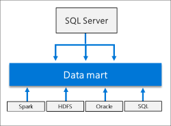

# What is SQL Server 2019 Big Data Clusters?

Starting with [!INCLUDE[SQL Server 2019](../includes/sssqlv15-md.md)], SQL Big Data Clusters allows you to deploy scalable clusters of SQL Server containers on Kubernetes. These containers are then used to read, write, and process big data from Transact-SQL, allowing you to easily combine and analyze your high-value relational data with high-volume big data.

[!INCLUDE [Limited public preview note](../includes/big-data-cluster-preview-note.md)]

## Scenarios

SQL Big Data Clusters provides flexibility in how you interact with your big data. You can query external data sources, store big data in HDFS managed by SQL Server, or pull data from multiple data sources into the cluster. You can then use the data for AI, Machine Learning, and other analysis tasks. The following sections provide more information about these scenarios.

### Data virtualization

By leveraging [SQL Server PolyBase](../relational-databases/polybase/polybase-guide.md), SQL Big Data Clusters can query external data sources without importing the data. [!INCLUDE[SQL Server 2019](../includes/sssqlv15-md.md)] introduces new connectors to data sources.

### Data lake

A SQL Big Data Cluster includes a scalable HDFS [storage pool](concept-storage-pool.md). This can be used to directly store big data, potentially ingested from multiple external sources. Once in the Big Data Cluster, you can analyze and query the data and combine it with your high-value relational data.

### Scale-out data mart

SQL Big Data Clusters provides scale-out compute and storage to improve the performance of analyzing big data. Data from a variety of sources can be ingested and distributed across [data pool](concept-data-pool.md) nodes for further analysis.

### Integrated AI and Machine Learning

SQL Big Data Clusters enable AI and machine learning tasks on the data stored in data HDFS storage pools and the data pools. You can use Spark as well as built-in AI tools in SQL Server, using R, Python, or Java.

### Management and Monitoring

Management and monitoring are provided through a combination of open-source components, SQL Server tools, and Dynamic Management Views.

The cluster Admin portal is a web interface that displays the status and health of the pods in the cluster. It also provides links to other dashboards provided by Grafana and Kibana.

You can use Azure Data Studio to perform a variety of tasks on the Big Data Cluster. This is enabled by a new Scale-out Data Management extension. This extension provides:

- Built-in snippets for common management tasks.
- Reports on the number of compute pools and the status of running jobs.
- Reports on the status of HDFS and Spark jobs.
- Ability to browse HDFS, upload files, preview files, and create directories.
- Ability to create, open, and run Jupyter-compatible notebooks.
- Data virtualization wizard to simplify the creation of external data sources.

## Architecture

A SQL Big Data Cluster is a cluster of Linux nodes orchestrated by Kubernetes. Nodes in the cluster are arranged into three logical planes: the control plane, the compute pane, and the data plane. Each plane has different responsibilities in the cluster. Every Kubernetes node in a SQL Big Data Cluster is member of at least one plane.

### Control plane

The control plane provides management and [security](concept-security.md) for the cluster. It contains the Kubernetes master, the [SQL Server master instance](concept-master-instance.md), and other cluster-level services such as the Hive Metastore and Spark Driver.

### Compute plane

The compute plane provides computational resources to the cluster. It contains nodes running SQL Server on Linux pods. The pods in the compute plane are divided into [compute pools](concept-compute-pool.md) for specific processing tasks. A compute pool can act as a [PolyBase](../relational-databases/polybase/polybase-guide.md) scale-out group for distributed queries over different data sources—such as Oracle, MongoDB, or Teradata.

### Data plane

The data plane is used for data persistence and caching. It contains the SQL data pool, and storage nodes.  The SQL [data pool](concept-data-pool.md) consists of one or more nodes running SQL Server on Linux. It is used to cache data returned by Spark jobs. SQL Big Data Cluster data marts are persisted in the data pool. The [storage pool](concept-storage-pool.md) consists of storage nodes comprised of SQL Server on Linux, Spark, and HDFS. All the storage nodes in a SQL Big Data cluster are members of an HDFS cluster.

## Next steps

To get started, see the following quickstarts:

- [Deploy SQL Server Big Data Cluster on Kubernetes](quickstart-big-data-cluster-deploy.md)
- [Get started with SQL Server Big Data Cluster on SQL Server 2019 CTP 2.0](quickstart-big-data-cluster-get-started.md)
- [Run Jupypter Notebooks on SQL Server 2019 CTP 2.0](quickstart-big-data-cluster-notebooks.md)
