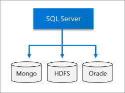
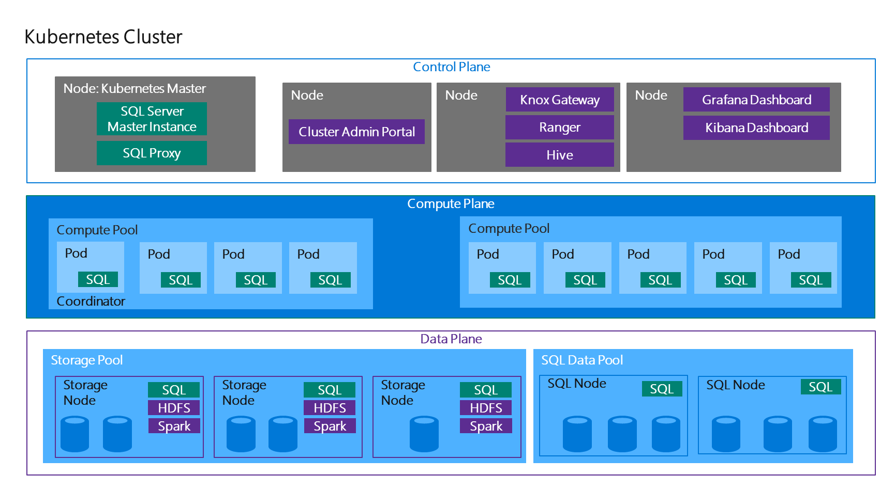

# What is SQL Server Big Data Clusters?

Staring with [!INCLUDE[SQL Server 2019](../includes/sssqlv15-md.md)], Big Data Clusters allows you to deploy scalable clusters of SQL Server containers on Kubernetes. These containers are then used to read, write, and process big data from Transact-SQL, allowing you to easily combine your high-value relational data with high-volume big data within the same query.

## Capabilities

SQL Server Big Data Clusters enable the following scenarios:

### Data virtualization

By leveraging [SQL Server PolyBase](../relational-databases/polybase/polybase-guide.md), Big Data Clusters can query external data sources without importing the data. [!INCLUDE[SQL Server 2019](../includes/sssqlv15-md.md)] introduces new connectors to data sources.

### Data lake

A Big Data Cluster includes a scalable HDFS storage pool. This can be used to directly store big data, potentially ingested from multiple external sources. Once in the Big Data Cluster, you can analyze and query the data and combine it with your high-value relational data.

### Scale-out data mart

### Integrated AI and Machine Learning

### Analysis and monitoring

## Architecture

A SQL Big Data Cluster is a cluster of Linux nodes orchestrated by Kubernetes. Nodes in the cluster are arranged into three logical planes: the control plane, the compute pane, and the data plane. Each plane has different responsibilities in the cluster. Every Kubernetes node in a SQL Big Data Cluster is member of at least one plane.

### Control plane

The control plane provides management and security for the cluster. It contains the Kubernetes master, the SQL Server master instance, and other cluster-level services such as the Hive Metastore and Spark Driver.

### Compute plane

The compute plane provides computational resources to the cluster. It contains nodes running SQL Server on Linux pods. The pods in the compute plane are divided into compute pools for specific processing tasks. A compute pool can act as a [PolyBase](../relational-databases/polybase) scale-out group for distributed queries over different data sources—such as Oracle, MongoDB, or Teradata. It can also be configured to cache data returned from external queries.

### Data plane

The data plane is used for data persistence and caching. It contains the SQL data pool, and storage nodes.  The SQL data pool consists of one or more nodes running SQL Server on Linux. It is used to cache data returned by Spark jobs. SQL Big Data Cluster data marts are persisted in the data pool. Storage nodes run SQL Server on Linux, Spark, and HDFS. All the storage nodes in a SQL Big Data clusters are members of an HDFS cluster.

## Next steps

To get started, see the following quickstarts:

- [Deploy SQL Server Big Data Cluster on Kubernetes](quickstart-big-data-cluster-deploy.md)
- [Get started with SQL Server Big Data Cluster on SQL Server 2019 CTP 2.0](quickstart-big-data-cluster-get-started.md)
- [Run Jupypter Notebooks on SQL Server 2019 CTP 2.0](quickstart-big-data-cluster-notebooks.md)
