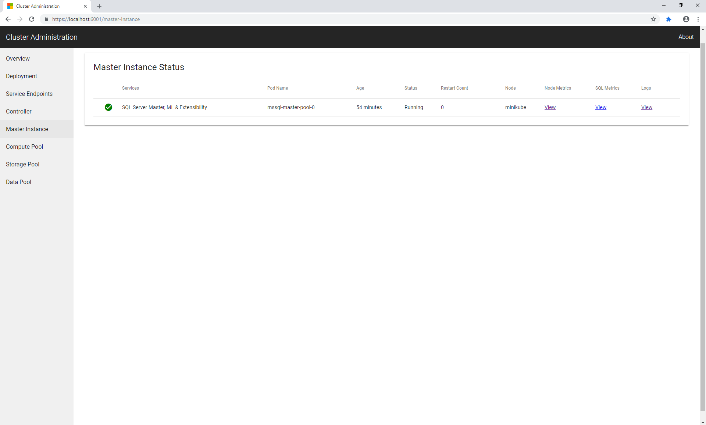
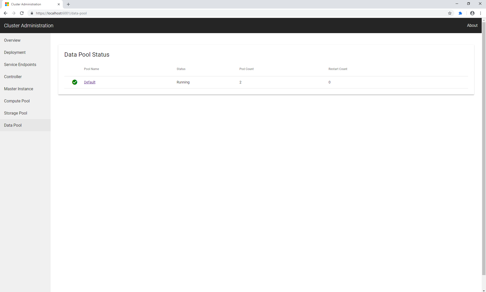

# Introduction to the cluster administration portal

If you want to monitor or troubleshoot your SQL Server 2019 big data cluster (preview), use the cluster administration portal.

The cluster administration portal allows you to:
- Quickly view number of pods running and any issues
- Monitor deployment status
- View available service endpoints
- View controller and SQL Server master instance
- Drill down information on pods, including accessing Grafana dashboards and Kibana logs

## Access the cluster administration portal

Follow the [quickstart to deploy your big data cluster](quickstart-big-data-cluster-deploy.md) until you get to the **cluster administration portal** section. Once you have the big data cluster running with mssqlctl, follow these instructions:

Once the controller pod is running, you can use the cluster administration portal to monitor the deployment. You can access the portal using the external IP address and port number for the `service-proxy-lb` (for example: **https://\<ip-address\>:30777**). Credentials for accessing the admin portal are the values of `CONTROLLER_USERNAME` and `CONTROLLER_PASSWORD` environment variables provided above.

> [!NOTE]
> For CTP 2.1, There is a security warning when accessing the web page since it is using auto-generated SSL certificates.

## Overview

When you first enter the portal, you can quickly view the number of pods running in:
- Controller
- Master Instance
- Compute Pool
- Storage Pool
- Data Pool

If there are any issues, you can open a link to known issues. You can use the left nav pane to go to the specific pool if there is an issue.

## Deployment

To monitor your deployment, click on the deployment tab on the left. You can see a tree view of your deployment, and if there are any issues in the deployment.

## Service Endpoints

You can view available service endpoints by clicking on the endpoints tab on the left nav pane.

This includes links to Spark endpoint, Grafana dashboard, and Kibana logs.

## Controller

The controller shows all pods related to the controller. You can learn more about the controller [here.](concept-controller.md)

To learn more additional information on each pod, you can click on **Metrics** column to view Grafana dashboards.

To learn about logs for pods with issues, you can click on the **Logs** column.

## Master Instance

The Master Instance shows all pods related to the SQL Server master instance. You can learn more about the SQL Server master instance [here.](concept-master-instance.md)

To learn more additional information on each pod, you can click on **Metrics** column to view Grafana dashboards.

To learn about logs for pods with issues, you can click on the **Logs** column.

## Pool and Pod Pages

On every pool page (Compute, Storage, and Data), you can drill down to each of the pod pages by clicking on **Default**

This shows a breadcrumb on the top of the drill down path.

To learn more additional information on each pod, you can click on **Metrics** column to view Grafana dashboards.

To learn about logs for pods with issues, you can click on the **Logs** column.

To learn more about each pool:
- [compute pool](concept-compute-pool.md)
- [storage pool](concept-storage-pool.md)
- [data pool](concept-data-pool.md)

## About Page

Here you can view information about your cluster such as the different version numbers, containers, and a link to the documentation.

## Next steps

In addition to the cluster administration portal, you can also run several useful Kubernetes commands to explore the status and health of your cluster. For more information, see [Kubectl commands for monitoring and troubleshooting SQL Server big data clusters](cluster-troubleshooting-commands.md).

To learn more about SQL Server 2019 big data clusters, see [What are SQL Server 2019 big data clusters?](big-data-cluster-overview.md).
