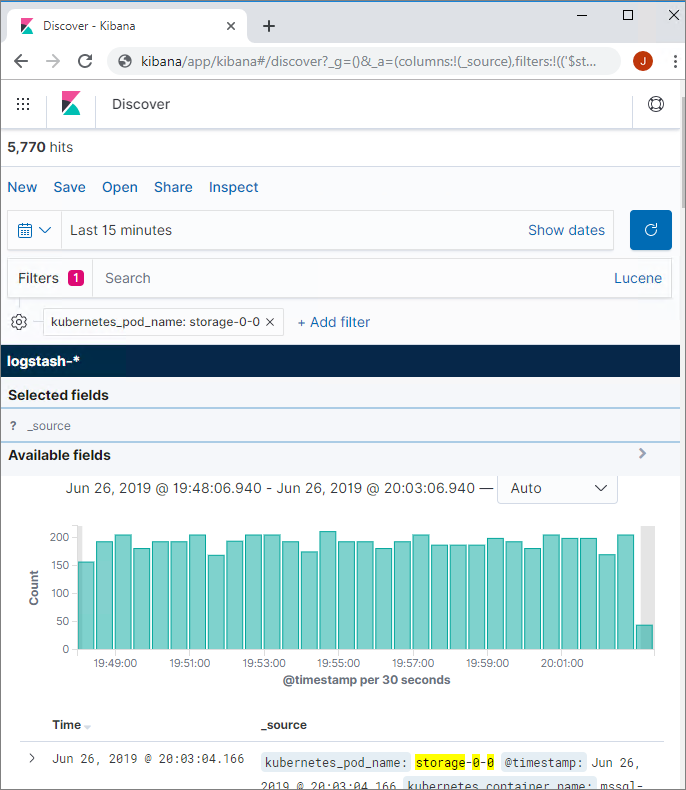

# Review cluster logs with Kibana Dashboard

This article describes how to visualize the logs an application inside [!INCLUDE[ssbigdataclusters-ss-nover](../includes/ssbigdataclusters-ss-nover.md)]. [!INCLUDE[ssbigdataclusters-ss-nover](../includes/ssbigdataclusters-ss-nover.md)] use Fluent Bit, an open-source log processor and forwarder. Fluent Bit fetches the logs from big data cluster components in the cluster and stores them in [Elastic Stack Elasticsearch](https://azure.microsoft.com/overview/linux-on-azure/elastic/). From Kibana Dashboard, you can visualize and search the log of your interest.

## Logs stored in Elasticsearch

Big Data Cluster-related logs stored in Elasticsearch includes the standard output and error logs of all services, including SQL Server, Spark, HDFS, and platform services. 

Those logs can be searched by components From Kibana Dashboard. You can use filters such as 'kubernetes_container_name', 'kubernetes_pod_name', 'log_filename' and 'service_name' to help you quickly visualize all the logs such as logs from Big Data Clusters controller, from SQL Server, or any logs from different pods, services, and more. 

Specifically, the controller log records the status and process of the cluster deployments and cluster events by filtering 'service_name: controller'. For those who look into [!INCLUDE[ssbigdataclusters-ss-nover](../includes/ssbigdataclusters-ss-nover.md)] in AD mode, you may find the security-support log to be quite useful,  it records the events during the process Big Data Cluster obtains AD tokens from the on-premises Active Directory(AD) domain controller, you can access it by filtering 'service_name: secsupp' under the controller log.


## Prerequisites

- [[!INCLUDE[ssbigdataclusters-ss-nover](../includes/ssbigdataclusters-ss-nover.md)]](deployment-guidance.md)
- [azdata command-line utility](../azdata/install/deploy-install-azdata.md)

## Capabilities

In [!INCLUDE[sssql19-md](../includes/sssql19-md.md)] you can create, delete, describe, initialize, list run and update your application. The following table describes the application deployment commands that you can use with `azdata`.

|Command |Description |
|:---|:---|
|`azdata bdc endpoint list` | Lists the endpoints for the [!INCLUDE[ssbigdataclusters-ss-nover](../includes/ssbigdataclusters-ss-nover.md)]. |


You can use the following example to list the endpoint of **Kibana Dashboard**:

```bash
azdata bdc endpoint list --endpoint-name logsui 
```

The output will give you the endpoint, which you can use your cluster username and password to sign in. 


The link to a Kibana dashboard:



> [!IMPORTANT]
> The Internet Explorer browser and older Microsoft Edge browsers are not compatible with Kibana. You will see a blank page when loading the dashboards using an unsupported browser. Consider the [Chromium-based Microsoft Edge](https://microsoftedgewelcome.microsoft.com/), or review [supported browsers for Kibana](https://www.elastic.co/support/matrix#matrix_browsers).

## Next steps

For more information about [!INCLUDE[big-data-clusters-2019](../includes/ssbigdataclusters-ss-nover.md)], see [Introducing [!INCLUDE[big-data-clusters-2019](../includes/ssbigdataclusters-ver15.md)]](big-data-cluster-overview.md).
